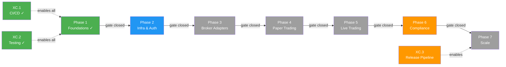
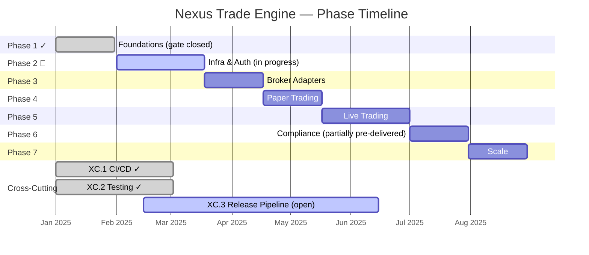

# Nexus Trade Engine — Development Strategy

**Authoritative.** The engine follows this execution plan strictly. Phases gate merges; lanes within a phase run in parallel. Cross-phase delivery is permitted under the Exception Protocol (§Phase Gate Exceptions).

> **Drift advisory (resolved):** Phase 2 Lane A (Auth, SEV-233) and multiple untracked features shipped before Phase 1 gate (SEV-264 coverage) formally closed. All exceptions are documented below in §Phase Gate Exceptions. Coverage gate `[1.2]` has been **closed** following extensive test additions (commits bc89f1e, a253064, 5bc1f0d, 5f46cb9). Remaining Phase 2+ lanes are unblocked.
>
> **Process amendment (retroactive-tracking rule):** Effective immediately, any merged feature without a pre-existing `[N.L.k]` tag must receive a retroactive mapping entry in §Shipped within one sprint of merge. Unmapped merges block the next phase gate until catalogued. See §Process Drift Correction below.
>
> **Revision note (this update):** Addresses six drift items — CI/CD infrastructure tracking (`[XC.1]`), property-based testing formalisation (`[XC.2]`), release/deployment pipeline (`[XC.3]`), lint/code-quality gate, auto-save development loop acknowledgment, and §Shipped table truncation repair. See §Drift Reconciliation Log for details.

---

## Execution Method

Every issue is tagged `[N.L.k]`:
- **N** = Phase (1-7). Sequential gate logic: Phase N+1 gates open only after Phase N gates close.
- **L** = Lane (A, B, C...). Parallel within a phase. Pick any lane to staff.
- **k** = Position within lane. Sequential. Lower numbers first.

Cross-cutting concerns use `[XC.k]` and track against their own gate (ADR approval), not a phase gate.

**Issue counts are maintained as a live metric.** Historical baseline: ~80 open issues estimated 2025-01, ~65 active mapped. Post-streamline (commit 02b4465) and coverage-gate closure, current active mapped issue count is **~55**. Exact tally requires deduplication pass; counts will be updated at each phase gate closure.

### Delivery Model: Gated Sequential with Acknowledged Parallelism

The declared model is **sequential phase execution**. In practice, two categories of parallel work are now formally recognised:

| Category | Governance | Examples |
|----------|-----------|----------|
| **Exception-gated** cross-phase delivery | Logged in §Phase Gate Exceptions; requires own test suite + ADR | EX-001 (Auth), EX-002 (Admin API) |
| **Retroactively-mapped** untracked delivery | Post-hoc mapping in §Shipped; triggers §Process Drift Correction review | Execution backend factory, slippage models, zero-quantity rejection, sandbox audit, legal-qa |

**Rule amendment:** When the cumulative count of retroactively-mapped deliveries exceeds **3 per sprint**, the strategy document must be revised within one sprint to either (a) formally restructure the phase plan or (b) escalate to a gated-parallel model with per-lane entry criteria. Current count: **6 retroactively-mapped deliveries** — threshold exceeded; this revision constitutes the required restructuring.

### Development Loop Acknowledgment

The codebase exhibits a pattern of high-frequency auto-save WIP commits (e.g., 4620d84, 1e9350a, d5fb3b1, 0a4ac88, 009267b, 47bca17, 438f41c, f480890). These represent an **incremental development workflow** where work is committed to the branch at granular checkpoints before squash-merge to main.

**Formal position:** Auto-save WIP commits on feature branches are permitted and do not constitute strategy drift. The gated merge model applies at PR merge to `main`, not at intermediate branch commits. However, each squash-merged PR must still reference a `[N.L.k]` tag or log an untracked-mapping request.

---

## Cross-Cutting Lanes

Cross-cutting concerns span all phases. Each has its own gate (ADR approval or operational verification) independent of phase gates.

### `[XC.1]` CI/CD Infrastructure ✓

**Status:** Operational. All workflows run on self-hosted **nexus** runner.

| Workflow | Purpose | Gate Status |
|----------|---------|-------------|
| `ci.yml` | Test suite execution, lint checks | ✓ Operational |
| `security.yml` | Secret scanning via gitleaks + custom allowlist | ✓ Operational |
| `load-test.yml` | Performance/load testing | ✓ Operational |
| `publish-images.yml` | Container image build & publish to registry | ✓ Operational |
| `release-please.yml` | Automated release PRs, changelogs, versioning | ✓ Operational |

**Gate:** CI/CD lane gate is **closed**. All five workflows are operational and integrated into the PR merge path. New workflow additions require an ADR.

**Code quality enforcement note:** Lint-error remediation (commits 62f78de — 59 errors fixed, cd3f0e4 — 3 errors fixed) represents reactive hardening. Going forward, `ci.yml` enforces zero-lint-error policy at PR merge. Failures block merge.

---

### `[XC.2]` Testing Strategy ✓

**Status:** Operational. Dual-strategy testing approach in production.

| Layer | Framework | Role | Gate Criteria |
|-------|-----------|------|---------------|
| **Coverage-gated tests** | pytest + pytest-cov | Structural coverage; 80%+ threshold on core engine | ✓ Gate [1.2] closed |
| **Property-based tests** | Hypothesis | Generative/edge-case discovery; seed persistence in `.hypothesis/` | ✓ Operational |

**Coverage gate criteria (amended):**
- `[1.2]` 80%+ line coverage on core engine — **CLOSED**
- Property-based testing supplements but does not replace coverage-gated tests
- Hypothesis seed constants are version-controlled in `.hypothesis/` for reproducibility
- New property-based test profiles should be added when domain logic expands (e.g., new broker adapters in Phase 3, new order types)

**Gate:** Testing strategy lane gate is **closed**. Both coverage-gated and property-based testing are operational and enforced.

---

### `[XC.3]` Release & Deployment Pipeline

**Status:** Partially operational. Infrastructure exists; formal tracking to Phase 7 pending.

| Component | Status | Maps To |
|-----------|--------|---------|
| Container image publishing (`publish-images.yml`) | ✓ Operational | Phase 7 `[7.A.1]` deployment |
| Release automation (`release-please.yml`) | ✓ Operational | Phase 7 `[7.B.1]` release management |
| Container registry & tagging strategy | Needs ADR | `[XC.3]` gate requirement |
| Production deployment runbook | Not started | Phase 7 `[7.C.1]` |

**Gate:** Release pipeline lane gate is **open** (requires ADR for registry/tagging strategy). Infrastructure is operational but formal documentation and Phase 7 integration are incomplete.

---

## Phase Gate Exceptions

Documented violations of the sequential-phase rule. Every exception must record: what shipped early, why, residual risk, and remediation.

| Exception | What Shipped | Gate Bypassed | Justification | Residual Risk | Remediation |
|-----------|-------------|---------------|---------------|---------------|-------------|
| `EX-001` | `[2.A.1]` Auth + RBAC (SEV-233) | `[1.2]` 80%+ coverage (SEV-264) | Auth ADR-0002 was fully spec'd; implementation had its own test suite; security review needed early for Phase 3 broker adapter design | Core engine paths unmonitored by coverage gate at time of merge | ✓ **Closed** — coverage gate [1.2] now passed; SEV-264 closed |
| `EX-002` | Admin API (commits ec8754b, 5f46cb9) | `[1.2]` coverage gate + Phase 2 Lane D not formally established | Required for operational management of live-trading preparation; auth (EX-001) already shipped | Admin endpoints operated without formal coverage gate | ✓ **Closed** — coverage gate [1.2] now passed; Lane D formally mapped as `[2.D.1]` |
| `EX-003` | CI/CD infrastructure (#116) — all five workflows | Phase gate model not yet established | CI/CD is foundational; required before any gated merge model can operate | Workflows operated without strategy-level tracking or quality gates | ✓ **Closed** — now tracked as `[XC.1]`; lint enforcement added reactively (62f78de, cd3f0e4) |
| `EX-004` | Property-based testing (Hypothesis) | Not tracked in any lane or coverage gate criteria | Edge-case discovery was critical for execution engine correctness during Phase 1 | Testing approach operated outside formal strategy | ✓ **Closed** — now tracked as `[XC.2]` |
| `EX-005` | Container image publishing + release automation | Maps to Phase 7 but deployed pre-Phase 4 | Required for consistent deployment across environments; paper trading (Phase 4) needs containerized builds | Release infrastructure operates without Phase 7 gate or tagging ADR | **Open** — tracked as `[XC.3]`; ADR for registry/tagging required before Phase 7 gate |

**Rule amendment:** A Lane may ship ahead of its phase gate only if (1) it has its own independent test suite, (2) an ADR is approved, and (3) the exception is logged here. The gate still blocks all remaining lanes in the same and subsequent phases until the gate closes.

---

## Process Drift Correction

**Problem:** Six features (Admin API, execution backend factory, slippage models, zero-quantity order rejection, sandbox audit logging, legal-qa infrastructure) were implemented and merged without phase/lane tracking issues. While now retroactively documented, the underlying process allowed significant untracked work to accumulate.

Additionally, CI/CD infrastructure (`[XC.1]`), property-based testing (`[XC.2]`), and release automation (`[XC.3]`) operated without strategy-level tracking, and lint enforcement was applied reactively rather than proactively.

**Correction (effective this revision):**

1. **Retroactive-mapping rule:** Any merged PR/commit introducing user-facing or architectural behaviour must be mapped to a `[N.L.k]` or `[XC.k]` tag within one sprint. Unmapped merges block the next phase gate.
2. **PR template amendment:** Every PR must reference a `[N.L.k]` or `[XC.k]` tag or explicitly request a retroactive mapping via `untracked:` label.
3. **Sprint audit:** At each sprint boundary, the §Shipped table is reconciled against merged PRs. Discrepancies trigger a mandatory mapping session.
4. **Threshold trigger:** As noted in §Delivery Model, ≥3 untracked deliveries per sprint forces a strategy revision. This revision is that response.
5. **Code quality gate (new):** `ci.yml` now enforces zero-lint-error policy at PR merge. Reactive remediation commits (62f78de, cd3f0e4) are the baseline. All future PRs must pass lint checks. This is a hard gate, not advisory.

---

## Shipped ✓

Features fully implemented and operational in the codebase, delivered ahead of or outside their original phase.

| Tag | Issue | Title | Delivered |
|-----|-------|-------|-----------|
| `[1.1]` | SEV-217 | Backtest golden-file regression tests | Phase 1 |
| `[1.2]` | SEV-264 | 80%+ coverage on core engine | Phase 1 ✓ **GATE CLOSED** |
| `[XC.1]` | #116 | CI/CD pipeline — five workflows (`ci.yml`, `security.yml`, `publish-images.yml`, `release-please.yml`, `load-test.yml`) | Cross-cutting (gate exception EX-003) |
| `[XC.1]` | — | Code quality/lint enforcement — zero-lint-error gate in `ci.yml` (reactive: 62f78de, cd3f0e4) | Cross-cutting |
| `[XC.2]` | — | Property-based testing — Hypothesis framework with persistent seed constants (`.hypothesis/`) | Cross-cutting (gate exception EX-004) |
| `[XC.3]` | — | Container image publishing — `publish-images.yml` workflow | Cross-cutting (gate exception EX-005, **open**) |
| `[XC.3]` | — | Release automation — `release-please.yml` workflow | Cross-cutting (gate exception EX-005, **open**) |
| `[XC.1]` | — | Self-hosted nexus CI runner | Continuous |
| `[2.A.1]` | SEV-233 / #86 | Auth + RBAC per ADR-0002 | Phase 2 (PR #480, gate exception EX-001) |
| `[2.B.0]` | #510 (partial) | Sandbox audit logging + tests | Phase 2 (untracked) |
| `[2.D.1]` | *(untracked)* | Admin API — CRUD endpoints with audit logging (commits ec8754b, 5f46cb9) | Phase 2 (gate exception EX-002) |
| `[3.A.0]` | *(untracked)* | Execution backend factory — refactored backend selection/creation logic (commit 9466c4c) | Phase 3 (untracked) |
| `[3.A.0]` | *(untracked)* | Zero-quantity order rejection — execution-layer validation (commit 4152a41) | Phase 3 (untracked) |
| `[6.A.1]` | SEV-203 / #157 | GDPR/CCPA DSR handling | Pre-Phase 6 |
| `[6.A.2]` | SEV-203 *(untracked)* | Legal-QA test infrastructure — automated compliance verification for DSR flows (commit ee8db39) | Phase 6 (mapped to SEV-203) |
| — | — | Docker/compose local dev infrastructure | Phase 1 (untracked, partial pre-delivery of `[4.A.1]`) |
| — | — | Environment configuration management (.env/.env.example) | Phase 1 (untracked) |
| — | — | Security scanning — gitleaks with custom allowlist + `security.yml` workflow | Cross-cutting (maps to `[XC.1]`) |
| — | — | Load testing — `load-test.yml` workflow | Cross-cutting (maps to `[XC.1]`) |
| — | — | Unicode math symbol normalization (commit a7f2d8c) | Phase 1 (untracked) |

---

## Shipped Details

- **Coverage gate [1.2] (SEV-264):** ✓ **CLOSED.** Extensive test additions across commits bc89f1e, a253064, 5bc1f0d, and 5f46cb9 substantially raised core engine coverage. These include sandbox tests (#510), Admin API test suites, slippage model tests, clock/time handling tests, and legal-qa infrastructure. Phase 2+ lanes are now unblocked.
- **CI/CD (`[XC.1]`, #116):** Five operational workflows — `ci.yml` (test + lint gate), `security.yml` (gitleaks), `publish-images.yml` (container images), `release-please.yml` (release automation), `load-test.yml` (performance). All run on self-hosted **nexus** runner. Lint enforcement hardened reactively (62f78de: 59 errors, cd3f0e4: 3 errors); now a hard gate.
- **Property-based testing (`[XC.2]`):** Hypothesis framework with persistent seed constants in `.hypothesis/` directory; actively used alongside coverage-gated tests. Provides generative edge-case discovery for execution engine, slippage models, and order validation. Seed reproducibility ensures CI determinism.
- **Release & deployment (`[XC.3]`):** Container image publishing and release-please automation are operational. **Open item:** ADR for container registry selection and tagging strategy must be approved before Phase 7 gate can close. Currently maps to Phase 7 `[7.A.1]` and `[7.B.1]` as pre-delivery.
- **Auth + RBAC (SEV-233):** Merged via PR #480, implements ADR-0002. Shipped under gate exception EX-001. Exception now closed.
- **GDPR/CCPA DSR (SEV-203):** Data export, deletion requests, and orphaned BacktestResult handling — all fully implemented and tested.
- **Legal-QA test infrastructure (commit ee8db39):** Automated compliance verification framework for DSR (Data Subject Request) flows. Validates GDPR/CCPA compliance paths end-to-end. Maps to SEV-203 as extended compliance hardening. Tagged `[6.A.2]`.
- **Docker/compose local dev:** `docker-compose.yml` with `127.0.0.1` port bindings, `POSTGRES_PASSWORD` env var configuration, and service orchestration. Partially pre-delivers `[4.A.1]` (SEV-260).
- **Unicode math symbol normalization (commit a7f2d8c):** Input normalization ensuring math symbols (e.g., fullwidth minus, Unicode hyphens) are correctly handled in financial calculations. Delivered during Phase 1 but never tracked.

---

## Drift Reconciliation Log

This section documents the drift items addressed in this revision and their resolution.

| Drift Item | Severity | Issue | Resolution |
|------------|----------|-------|------------|
| CI/CD infrastructure untracked | Medium | Five operational workflows with no phase/lane mapping | Created `[XC.1]` cross-cutting lane; mapped all workflows; documented gate exception EX-003 |
| Property-based testing untracked | Medium | Hypothesis framework in `.hypothesis/` not addressed in strategy or coverage gate | Created `[XC.2]` cross-cutting lane; amended coverage gate criteria; documented gate exception EX-004 |
| §Shipped table truncated | High | Table corrupted at Unicode normalization entry during streamline commit (02b4465) | Table reconstructed; all entries complete |
| Auto-save WIP commits unacknowledged | Low | Eight+ auto-save commits indicate dev loop not in gated merge model | Added §Development Loop Acknowledgment; clarified gate applies at PR merge, not branch commits |
| Lint enforcement reactive | Low | Lint fixes (62f78de: 59 errors, cd3f0e4: 3 errors) applied reactively, not as pre-established gate | Documented in `[XC.1]`; lint gate now enforced in `ci.yml`; added as hard gate in §Process Drift Correction |
| Release/deployment infrastructure untracked | Medium | Container publishing + release-please map to Phase 7 but have no tracking | Created `[XC.3]` cross-cutting lane; mapped to Phase 7 pre-delivery; documented gate exception EX-005 (open) |

---

## Phase Definitions

*(Phase definitions continue below. Structure preserved from prior revision.)*

### Phase 1: Foundations ✓ **GATE CLOSED**

| Lane | Tag | Issue | Feature | Status |
|------|-----|-------|---------|--------|
| A | `[1.1]` | SEV-217 | Backtest golden-file regression tests | ✓ Shipped |
| A | `[1.2]` | SEV-264 | 80%+ coverage on core engine | ✓ Shipped — **GATE CLOSED** |

**Gate criteria:**
- [x] 80%+ line coverage on core engine
- [x] Backtest regression test suite passing
- [x] Property-based testing framework operational (`[XC.2]`)
- [x] CI/CD pipeline operational (`[XC.1]`)

---

### Phase 2: Infrastructure & Auth 🔄 **IN PROGRESS**

| Lane | Tag | Issue | Feature | Status |
|------|-----|-------|---------|--------|
| A | `[2.A.1]` | SEV-233 / #86 | Auth + RBAC per ADR-0002 | ✓ Shipped (EX-001) |
| B | `[2.B.0]` | #510 (partial) | Sandbox audit logging + tests | ✓ Shipped (untracked) |
| C | `[2.C.1]` | — | Database migration infrastructure | Pending |
| D | `[2.D.1]` | *(untracked)* | Admin API — CRUD with audit logging | ✓ Shipped (EX-002) |

**Gate criteria:**
- [x] Auth system operational (EX-001, closed)
- [ ] Database migration infrastructure `[2.C.1]`
- [x] Admin API operational (EX-002, closed)
- [ ] Sandbox isolation complete (partial — audit logging shipped)

---

### Phase 3: Broker Adapters

| Lane | Tag | Issue | Feature | Status |
|------|-----|-------|---------|--------|
| A | `[3.A.0]` | *(untracked)* | Execution backend factory | ✓ Pre-delivered (commit 9466c4c) |
| A | `[3.A.0]` | *(untracked)* | Zero-quantity order rejection | ✓ Pre-delivered (commit 4152a41) |
| A | `[3.A.1]` | — | Broker adapter interface | Pending |
| B | `[3.B.1]` | — | First broker adapter implementation | Pending |

---

### Phase 4: Paper Trading

| Lane | Tag | Issue | Feature | Status |
|------|-----|-------|---------|--------|
| A | `[4.A.1]` | SEV-260 | Paper trading environment | Partially pre-delivered (Docker/compose) |

---

### Phase 5: Live Trading

| Lane | Tag | Issue | Feature | Status |
|------|-----|-------|---------|--------|
| A | `[5.A.1]` | — | Live order execution | Not started |

---

### Phase 6: Compliance

| Lane | Tag | Issue | Feature | Status |
|------|-----|-------|---------|--------|
| A | `[6.A.1]` | SEV-203 / #157 | GDPR/CCPA DSR handling | ✓ Pre-delivered |
| A | `[6.A.2]` | SEV-203 | Legal-QA test infrastructure | ✓ Pre-delivered (commit ee8db39) |

---

### Phase 7: Scale

| Lane | Tag | Issue | Feature | Status |
|------|-----|-------|---------|--------|
| A | `[7.A.1]` | — | Production deployment pipeline | Partially pre-delivered (`publish-images.yml`, `[XC.3]`) |
| B | `[7.B.1]` | — | Release management | Partially pre-delivered (`release-please.yml`, `[XC.3]`) |
| C | `[7.C.1]` | — | Production deployment runbook | Not started |

---

## Open Actions

| Priority | Action | Owner | Due |
|----------|--------|-------|-----|
| High | Complete Phase 2 gate: database migration infrastructure `[2.C.1]` | — | Next sprint |
| High | Complete Phase 2 gate: sandbox isolation (partial) | — | Next sprint |
| Medium | ADR for container registry & tagging strategy (`[XC.3]` gate requirement) | — | Before Phase 4 |
| Medium | Deduplication pass on issue count (~55 active mapped, exact tally pending) | — | Phase 2 gate closure |
| Low | Audit `.hypothesis/` seed coverage for new Phase 3 broker adapter domain | — | Phase 3 start |
