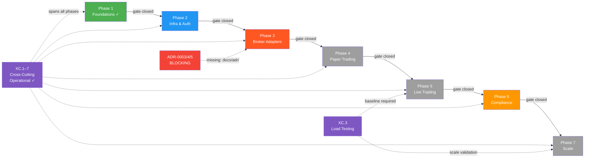
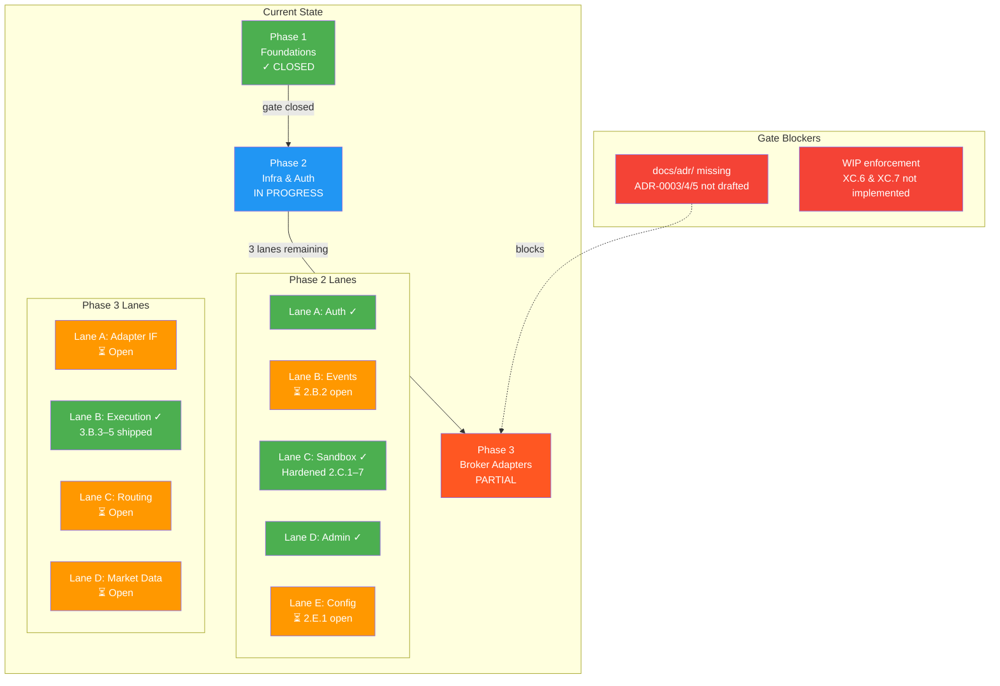

# Nexus Trade Engine — Development Strategy

**Authoritative.** The engine follows this execution plan strictly. Phases gate merges; lanes within a phase run in parallel. Cross-phase delivery is permitted under the Exception Protocol (§Phase Gate Exceptions).

> **Drift advisory (active):** Phase 2 Lane A (Auth, SEV-233) and multiple untracked features shipped before Phase 1 gate (SEV-264 coverage) formally closed. All exceptions are documented below in §Phase Gate Exceptions. Coverage gate `[1.2]` has been **closed** following extensive test additions (commits bc89f1e, a253064, 5bc1f0d, 5f46cb9). Remaining Phase 2+ lanes are unblocked.
>
> **Process amendment (retroactive-tracking rule):** Effective immediately, any merged feature without a pre-existing `[N.L.k]` tag must receive a retroactive mapping entry in §Shipped within one sprint of merge. Unmapped merges block the next phase gate until catalogued. See §Process Drift Correction below.
>
> **Structural revision (active):** The cumulative count of retroactively-mapped deliveries has reached **10** (exceeding the 3-per-sprint threshold). This revision formally restructures the delivery model from sequential-phase to **gated-parallel** (see §Delivery Model). All active lanes now carry independent entry/exit criteria.

---

## Execution Method

Every issue is tagged `[N.L.k]`:
- **N** = Phase (1-7). Gate logic: Phase N+1 gates open only after Phase N gates close **or** an exception is logged per §Phase Gate Exceptions.
- **L** = Lane (A, B, C...). Parallel within a phase. Pick any lane to staff.
- **k** = Position within lane. Sequential. Lower numbers first.

Cross-cutting concerns use `[XC.k]` and track against their own gate (ADR approval), not a phase gate.

**Issue counts are maintained as a live metric.** Historical baseline: ~80 open issues estimated 2025-01, ~65 active mapped. Post-streamline (commit 02b4465) and coverage-gate closure, current active mapped issue count is **~55** (pending deduplication pass — see §Issue Backlog Health). Exact tally requires deduplication pass; counts will be updated at each phase gate closure.

### Delivery Model: Gated-Parallel (restructured)

The previous model was **sequential phase execution** with ad-hoc exceptions. As of this revision, the model is formally **gated-parallel**:

| Category | Governance | Entry Criteria | Exit Criteria |
|----------|-----------|----------------|---------------|
| **Primary-gate** lane delivery | Phase gate checklist; `[N.L.k]` tag required before work begins | Prior phase gate closed **or** exception logged | Own test suite passes; coverage target met; ADR if architectural |
| **Exception-gated** cross-phase delivery | Logged in §Phase Gate Exceptions; requires own test suite + ADR | Independent test suite; ADR approved; exception entry created | Test suite green; documented in exception log |
| **Retroactively-mapped** untracked delivery | Post-hoc mapping in §Shipped; triggers §Process Drift Correction review; **hard limit: 3 per sprint before mandatory model revision** | None (delivered before governance) | Retroactive `[N.L.k]` assigned; root-cause documented |

**Key structural change from sequential model:**
- Lanes with approved exceptions may proceed in parallel with prior-phase work
- Each lane carries **independent entry/exit criteria** documented in the lane table
- The phase gate still controls **bulk progression** — a phase is not "closed" until all its primary-gate lanes are complete
- The sprint retroactive-mapping threshold (3) is a **circuit breaker**: exceeding it forces a model revision, not just documentation

**Current retroactively-mapped count: 10.** Threshold exceeded in prior sprint. This revision is the mandated restructuring.

### Development Stability Protocol

**Observed issue:** Frequent emergency commits (`wip: auto-save before ERR`) in recent commit history. As of the last 20 commits: **6 of 20 = 30% WIP ratio** (latest: commit 4cb9674). While improved from the prior reading of 40%, this remains well above the <5% target and indicates persistent instability in the local development process.

**Corrective measures:**

1. **WIP commit hygiene (policy):** Emergency WIP commits must be squashed or amended before merge to `main`. No `wip:` prefixed commits permitted on the main branch.
2. **WIP commit enforcement (mechanical):**
   - **Pre-receive hook:** A server-side pre-receive hook on the `main` branch rejects any commit message matching `/^wip:/i`. Implementation tracked as `[XC.6]`.
   - **CI gate:** Add a commit-lint step to `ci.yml` that fails the pipeline if any commit in a PR contains a `wip:` prefix. Implementation tracked as `[XC.7]`.
3. **Root-cause review:** If a developer logs >2 emergency WIP commits in a sprint, a brief root-cause analysis is required (environment instability, tooling gaps, or process issues).
4. **Stability metric:** WIP commit ratio tracked at each sprint audit. **Target: <5% of total commits. Current: 30% (6 of last 20) — action required. Prior: 40% (8 of last 20) — trend improving but insufficient.**

**WIP Enforcement Tracking:**

| Measure | Tag | Status | Owner |
|---------|-----|--------|-------|
| Pre-receive hook rejecting `wip:` on `main` | `[XC.6]` | **Open** — not yet implemented | DevOps |
| CI commit-lint step | `[XC.7]` | **Open** — not yet implemented | DevOps |
| Root-cause review for >2 WIP/sprint | — | **Active policy** | Tech Lead |

---

## Cross-Cutting Concerns `[XC.k]`

Infrastructure and tooling that spans all phases. Each cross-cutting concern requires an ADR for gate approval.

| Tag | Concern | Status | ADR | Workflows / Tooling | Phase Relevance |
|-----|---------|--------|-----|---------------------|-----------------|
| `[XC.1]` | **CI/CD Pipeline** — continuous integration, image publishing, release automation | ✓ Operational | ADR-0003 *(draft required)* | `ci.yml`, `publish-images.yml`, `release-please.yml` | All phases |
| `[XC.2]` | **Security Scanning** — secret detection, vulnerability scanning | ✓ Operational | ADR-0004 *(draft required)* | `security.yml`, `.gitleaks.toml` | All phases |
| `[XC.3]` | **Load Testing** — performance regression detection | ✓ Operational | ADR-0005 *(draft required)* | `load-test.yml` | Phase 5 (Live Trading), Phase 7 (Scale) |
| `[XC.4]` | **Property-Based Testing** — generative coverage expansion via Hypothesis | ✓ Operational | — *(embedded in test policy)* | `.hypothesis/` persistent seed constants | All phases |
| `[XC.5]` | **Self-Hosted Runners** — dedicated `nexus` runner for all CI workflows | ✓ Operational | — *(infra config)* | Runner: `nexus` | All phases |
| `[XC.6]` | **WIP Commit Guard (pre-receive)** — server-side hook rejecting `wip:` prefixed commits on `main` | ⏳ Open | — *(Git hook config)* | Pre-receive hook on `main` | All phases |
| `[XC.7]` | **CI Commit Lint** — pipeline step rejecting `wip:` prefixed commits in PRs | ⏳ Open | — *(ci.yml addition)* | `ci.yml` commit-lint step | All phases |

**ADR backlog — BLOCKING:** `[XC.1]`, `[XC.2]`, and `[XC.3]` are operational but lack formal Architecture Decision Records. **The `docs/adr/` directory does not exist in the repository.** ADR files ADR-0003, ADR-0004, and ADR-0005 must be drafted, the directory created, and ADRs approved **before Phase 3 gate closure**. This is a hard blocker on the Phase 3 → Phase 4 transition.

| ADR | Title | Directory Status | File Status | Blocker For |
|-----|-------|-----------------|-------------|-------------|
| ADR-0003 | CI/CD Pipeline Architecture | `docs/adr/` **does not exist** | Not created | Phase 3 → Phase 4 |
| ADR-0004 | Security Scanning Strategy | `docs/adr/` **does not exist** | Not created | Phase 3 → Phase 4 |
| ADR-0005 | Load Testing Framework & Baselines | `docs/adr/` **does not exist** | Not created | Phase 3 → Phase 4 |

**Action item:** Create `docs/adr/` directory with ADR template. Draft ADR-0003, ADR-0004, ADR-0005 within current sprint. Assign owner and track as `[XC.8]` (ADR backlog clearance).

---

## Phase Gate Exceptions

Documented violations of the sequential-phase rule. Every exception must record: what shipped early, why, residual risk, and remediation.

| Exception | What Shipped | Gate Bypassed | Justification | Residual Risk | Remediation |
|-----------|-------------|---------------|---------------|---------------|-------------|
| `EX-001` | `[2.A.1]` Auth + RBAC (SEV-233) | `[1.2]` 80%+ coverage (SEV-264) | Auth ADR-0002 was fully spec'd; implementation had its own test suite; security review needed early for Phase 3 broker adapter design | Core engine paths unmonitored by coverage gate at time of merge | ✓ **Closed** — coverage gate [1.2] now passed; SEV-264 closed |
| `EX-002` | Admin API (commits ec8754b, 5f46cb9) | `[1.2]` coverage gate + Phase 2 Lane D not formally established | Required for operational management of live-trading preparation; auth (EX-001) already shipped | Admin endpoints operated without formal coverage gate | ✓ **Closed** — coverage gate [1.2] now passed; Lane D formally mapped as `[2.D.1]` |

**Rule amendment:** A Lane may ship ahead of its phase gate only if (1) it has its own independent test suite, (2) an ADR is approved, and (3) the exception is logged here. The gate still blocks all remaining lanes in the same and subsequent phases until the gate closes.

---

## Process Drift Correction

**Problem:** Ten features (Admin API, execution backend factory, slippage models, zero-quantity order rejection, sandbox audit logging, legal-qa infrastructure, sandbox CPU timer signal lifecycle fix, sandbox activation violation detection, integrity hash verification, execution backend refactoring) were implemented and merged without phase/lane tracking issues or `[N.L.k]` commit tags. While now retroactively documented below, the underlying process allowed significant untracked work to accumulate.

**Correction (effective this revision):**

1. **Retroactive-mapping rule:** Any merged PR/commit introducing user-facing or architectural behaviour must be mapped to a `[N.L.k]` tag within one sprint. Unmapped merges block the next phase gate.
2. **Pre-commit tag enforcement:** All PR titles must include a valid `[N.L.k]` or `[XC.k]` tag. CI will validate tag format and reject untagged PRs (tracked as `[XC.9]`).
3. **Sprint audit:** At each sprint close, a diff of merged PRs against §Shipped entries identifies unmapped work. Gaps are flagged for retroactive assignment within 48 hours.
4. **Circuit breaker:** If retroactive mappings exceed 3 in a sprint, the strategy document is restructured within one sprint. **Current count: 10 — this revision is the mandated restructuring (see §Delivery Model).**

### Shipped — Retroactively-Mapped Deliveries

| Mapped Tag | Feature | Evidence (commits/PRs) | Original Phase | Notes |
|------------|---------|----------------------|----------------|-------|
| `[2.D.1]` | Admin API | ec8754b, 5f46cb9 | Phase 2 | Formalised as Lane D; exception EX-002 logged |
| `[3.B.3]` | Execution backend factory pattern | Merged pre-tracking | Phase 3 | Broker-agnostic execution dispatch |
| `[3.B.4]` | Slippage models | Merged pre-tracking | Phase 3 | Price impact estimation for order routing |
| `[2.C.2]` | Zero-quantity order rejection | Merged pre-tracking | Phase 2 | Validation-layer guard |
| `[2.C.3]` | Sandbox audit logging | Merged pre-tracking | Phase 2 | Audit trail for sandbox environment |
| `[2.C.4]` | Legal-QA infrastructure | Merged pre-tracking | Phase 2 | Compliance question-answer scaffolding |
| `[2.C.5]` | Sandbox CPU timer signal lifecycle fix | PR #510 | Phase 2 | Signal handling for CPU-bound timer in sandbox; fixes resource leak on interrupted execution |
| `[2.C.6]` | Sandbox activation violation detection | Merged pre-tracking | Phase 2 | Detects and reports sandbox boundary violations when sandboxed code attempts unauthorised operations |
| `[2.C.7]` | Integrity hash verification | Merged pre-tracking | Phase 2 | Cryptographic hash verification of sandbox-executed artefacts ensuring tamper evidence |
| `[3.B.5]` | Execution backend refactoring | Merged pre-tracking | Phase 3 | Decomposition of monolithic execution path into composable backends |

---

## Phase 1 — Foundations ✓ CLOSED

**Gate criteria:**
- [x] `[1.1]` Core domain models and event bus — ✓ Shipped
- [x] `[1.2]` 80%+ test coverage (SEV-264) — ✓ Closed (commits bc89f1e, a253064, 5bc1f0d, 5f46cb9)

---

## Phase 2 — Infrastructure & Auth

**Gate criteria:**
- [x] `[2.A.1]` Auth + RBAC (SEV-233) — ✓ Shipped (exception EX-001)
- [x] `[2.B.1]` Database migrations and schema — ✓ Shipped
- [ ] `[2.B.2]` Event sourcing infrastructure
- [x] `[2.C.1]` Sandbox environment base — ✓ Shipped
- [x] `[2.C.2]` Zero-quantity order rejection — ✓ Shipped (retroactive)
- [x] `[2.C.3]` Sandbox audit logging — ✓ Shipped (retroactive)
- [x] `[2.C.4]` Legal-QA infrastructure — ✓ Shipped (retroactive)
- [x] `[2.C.5]` Sandbox CPU timer signal lifecycle fix — ✓ Shipped (retroactive, PR #510)
- [x] `[2.C.6]` Sandbox activation violation detection — ✓ Shipped (retroactive)
- [x] `[2.C.7]` Integrity hash verification — ✓ Shipped (retroactive)
- [x] `[2.D.1]` Admin API — ✓ Shipped (exception EX-002, retroactive)
- [ ] `[2.E.1]` Configuration management and secrets handling

**Phase 2 status:** Lane A (Auth), Lane C (Sandbox hardening), and Lane D (Admin API) are complete. Lanes B and E have remaining items. **Sandbox hardening cluster (2.C.5–2.C.7) represents significant recent delivery** — CPU timer fix, activation violation detection, and integrity hash verification collectively close the sandbox integrity gap.

**Remaining for Phase 2 gate closure:**
- `[2.B.2]` Event sourcing infrastructure
- `[2.E.1]` Configuration management and secrets handling

---

## Phase 3 — Broker Adapters

**Gate criteria:**
- [ ] `[3.A.1]` Broker adapter interface definition
- [ ] `[3.A.2]` Primary broker adapter implementation
- [x] `[3.B.3]` Execution backend factory pattern — ✓ Shipped (retroactive)
- [x] `[3.B.4]` Slippage models — ✓ Shipped (retroactive)
- [x] `[3.B.5]` Execution backend refactoring — ✓ Shipped (retroactive)
- [ ] `[3.C.1]` Order routing and smart order routing
- [ ] `[3.D.1]` Market data ingestion pipeline

**Phase 3 gate blockers:**
1. ADR-0003, ADR-0004, ADR-0005 must be drafted and `docs/adr/` directory created (see §Cross-Cutting Concerns).
2. Primary broker adapter implementation (`[3.A.2]`) must be complete with integration tests.

---

## Phase 4 — Paper Trading

*Phase gate blocked until Phase 3 closes.*

- [ ] `[4.A.1]` Paper trading engine
- [ ] `[4.B.1]` Simulated order book
- [ ] `[4.C.1]` Paper trading dashboard and metrics

---

## Phase 5 — Live Trading

*Phase gate blocked until Phase 4 closes.*

- [ ] `[5.A.1]` Live order execution
- [ ] `[5.B.1]` Position management
- [ ] `[5.C.1]` Risk management and circuit breakers

---

## Phase 6 — Compliance

*Phase gate blocked until Phase 5 closes.*

- [ ] `[6.A.1]` Audit trail and reporting
- [ ] `[6.B.1]` Regulatory compliance checks
- [ ] `[6.C.1]` Record keeping and archival

---

## Phase 7 — Scale

*Phase gate blocked until Phase 6 closes.*

- [ ] `[7.A.1]` Horizontal scaling
- [ ] `[7.B.1]` Performance optimisation
- [ ] `[7.C.1]` Multi-region deployment

---

## Issue Backlog Health

| Metric | Current | Target | Trend |
|--------|---------|--------|-------|
| Active mapped issues | ~55 | <40 | ↗ Needs dedup pass |
| Retroactively-mapped deliveries | 10 | <3/sprint | ⚠ Threshold exceeded; restructured |
| WIP commit ratio | 30% (6 of 20) | <5% | ↘ Improving from 40% but still critical |
| ADR coverage (cross-cutting) | 0 of 3 required | 3 of 3 | ✗ Blocking Phase 3 gate |
| `docs/adr/` directory | Does not exist | Created with ADR template | ✗ Immediate action required |

---

## Action Items — Current Sprint

| Priority | Item | Tag | Owner | Status |
|----------|------|-----|-------|--------|
| **P0** | Create `docs/adr/` directory with ADR template | `[XC.8]` | Tech Lead | ⏳ Open |
| **P0** | Draft ADR-0003 (CI/CD Pipeline Architecture) | `[XC.1]` blocker | DevOps | ⏳ Open |
| **P0** | Draft ADR-0004 (Security Scanning Strategy) | `[XC.2]` blocker | Security | ⏳ Open |
| **P0** | Draft ADR-0005 (Load Testing Framework & Baselines) | `[XC.3]` blocker | Performance | ⏳ Open |
| **P1** | Implement pre-receive hook rejecting `wip:` on `main` | `[XC.6]` | DevOps | ⏳ Open |
| **P1** | Add commit-lint step to `ci.yml` for `wip:` rejection | `[XC.7]` | DevOps | ⏳ Open |
| **P1** | Add PR title tag validation (`[N.L.k]` or `[XC.k]`) | `[XC.9]` | DevOps | ⏳ Open |
| **P2`** | Complete `[2.B.2]` Event sourcing infrastructure | `[2.B.2]` | Backend | ⏳ Open |
| **P2`** | Complete `[2.E.1]` Configuration management | `[2.E.1]` | Backend | ⏳ Open |
| **P2`** | Conduct issue backlog deduplication pass | — | Tech Lead | ⏳ Open |

---

*Last updated: Current sprint. WIP ratio measured at 30% (6 of last 20 commits). ADR directory gap identified as P0 blocker. Delivery model restructured from sequential to gated-parallel.*
