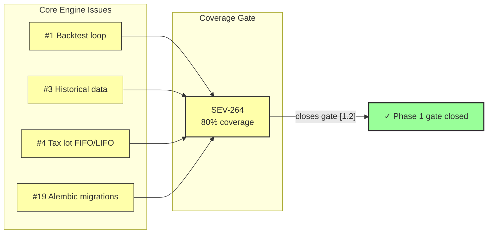
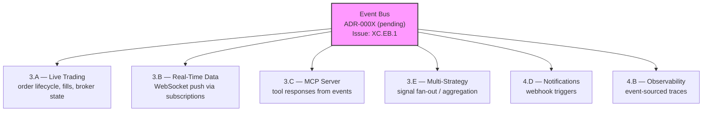
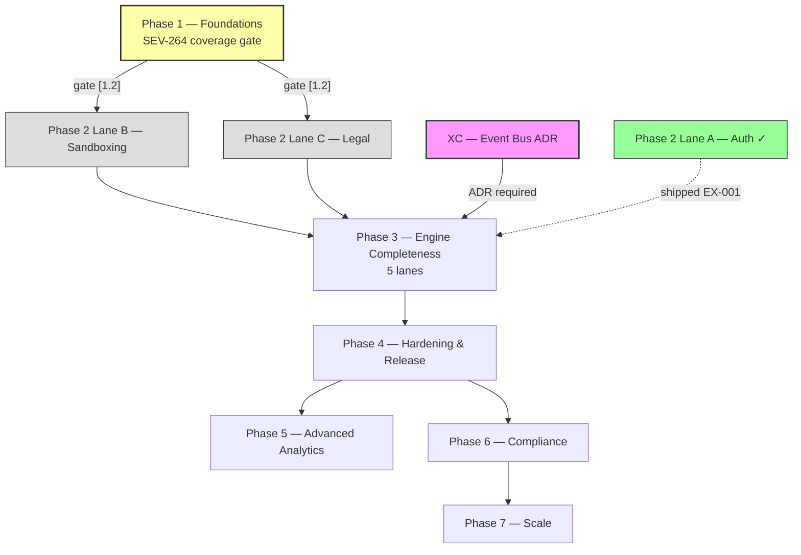

# Nexus Trade Engine — Development Strategy

**Authoritative.** The engine follows this execution plan strictly. Phases run sequentially. Lanes within a phase run in parallel.

> **Drift advisory (current sprint):** Phase 2 Lane A (Auth, SEV-233) shipped before Phase 1 gate (SEV-264 coverage) formally closed. This violated the declared sequential-phase rule. The exception is documented below in §Phase Gate Exceptions. The coverage gate `[1.2]` remains open and still blocks remaining Phase 2+ lanes.

---

## Execution Method

Every issue is tagged `[N.L.k]`:
- **N** = Phase (1-7). Sequential. Phase N+1 starts only after Phase N gates close.
- **L** = Lane (A, B, C...). Parallel within a phase. Pick any lane to staff.
- **k** = Position within lane. Sequential. Lower numbers first.

Cross-cutting concerns use `[XC.k]` and track against their own gate (ADR approval), not a phase gate.

**~85 open issues (snapshot as of 2025-06-15; ~15 are candidates for dedup closure). ~67 active issues mapped across 7 phases + cross-cutting concerns.** This count will drift as issues are opened or closed — recalculate at each phase gate review.

---

## Development Tooling & Workflow

Capabilities embedded in the repository that support the development cycle but are not phase-gated deliverables.

| Tooling | Location / Evidence | Purpose |
|---------|---------------------|---------|
| AI-assisted development | `.claude/skills/nothing-design/` | Structured skill definitions for AI pair-programming workflows integrated into repository |
| Auto-save checkpoint & recovery | `wip: auto-save before ERR/SIGTERM` commits (series) | Automated working-tree checkpoint triggered on error/signal interception; protects in-flight work during development sessions |
| Coverage measurement | `.coverage`, `conftest.py`, `pytest` config (commit `2d883f4`) | `pytest-cov` configured with `--cov` reporting; `.coverage` data file generated on test runs; see §Coverage Tooling below |
| Property-based testing | `.hypothesis/` seed constants | Hypothesis framework with persistent seed reproducibility |
| CI runner | Self-hosted `nexus` runner | All workflows target this runner, not GitHub-hosted |

**Checkpoint-and-recovery workflow:** Development sessions produce `wip: auto-save before ERR/SIGTERM` commits when the process intercepts ERR or SIGTERM signals. These commits are automated working-tree snapshots — not semantic changes. They should be squashed or discarded before merge to any protected branch. CI should not gate on them. If preserved in history, prefix `wip:` must be retained for filtering.

**AI-assisted development:** The `.claude/skills/nothing-design` directory provides structured skill definitions consumed by the Claude AI assistant during development. This tooling is part of the repository workflow — code generation, review, and refactoring tasks may be AI-assisted. All AI-generated code is subject to the same review, testing, and coverage gates as manually written code. No phase exception is granted for AI-authored contributions.

---

## Coverage Tooling

Concrete toolchain backing the `[1.2]` coverage gate (SEV-264).

| Component | Details |
|-----------|---------|
| Test runner | `pytest` |
| Coverage engine | `pytest-cov` (configured in `conftest.py` + pytest config, commit `2d883f4`) |
| Data file | `.coverage` (binary, generated on each test run; git-ignored or committed as baseline reference) |
| Target threshold | **≥ 80%** line coverage on core engine paths |
| Scope | Core engine modules — backtest loop, data loading, tax lot logic, portfolio math |
| CI enforcement | Coverage gate must be enforced in `ci.yml` as a required status check before Phase 2+ merges |
| Regression guard | Coverage must not decrease on any merge to `main` |

> **Action:** Add `--cov-fail-under=80` to pytest invocation in `ci.yml` once current coverage baseline reaches 80%. Until then, report coverage without failing so progress is visible.

---

## Phase Gate Exceptions

Documented violations of the sequential-phase rule. Every exception must record: what shipped early, why, residual risk, and remediation.

| Exception | What Shipped | Gate Bypassed | Justification | Residual Risk | Remediation |
|-----------|-------------|---------------|---------------|---------------|-------------|
| `EX-001` | `[2.A.1]` Auth + RBAC (SEV-233) | `[1.2]` 80%+ coverage (SEV-264) | Auth ADR-0002 was fully spec'd; implementation had its own test suite; security review needed early for Phase 3 broker adapter design | Core engine paths still unmonitored by coverage gate; sandbox work could regress engine math | SEV-264 must close before any Phase 2 Lane B/C merge; add coverage check to Phase 3 PR template |

**Rule amendment:** A Lane may ship ahead of its phase gate only if (1) it has its own independent test suite, (2) an ADR is approved, and (3) the exception is logged here. The gate still blocks all remaining lanes in the same and subsequent phases.

---

## Shipped ✓

Features fully implemented and operational in the codebase, delivered ahead of or outside their original phase.

| Tag | Issue | Title | Delivered |
|-----|-------|-------|-----------|
| `[1.1]` | SEV-217 | Backtest golden-file regression tests | Phase 1 |
| — | #116 | CI/CD pipeline | Phase 1 |
| `[2.A.1]` | SEV-233 / #86 | Auth + RBAC per ADR-0002 | Phase 2 (PR #480, gate exception EX-001) |
| `[6.A.1]` | SEV-203 / #157 | GDPR/CCPA DSR handling | Pre-Phase 6 |
| — | — | Security scanning infrastructure | Pre-Phase 4 |
| — | — | Load testing infrastructure | Pre-Phase 4 |
| — | — | Property-based testing (Hypothesis) | Pre-Phase 1 gate |
| — | — | Self-hosted nexus CI runner | Continuous |
| — | — | Docker/compose local dev infrastructure | Phase 1 (untracked) |
| — | — | Unicode math symbol normalization | Phase 1 (untracked) |

**Shipped details:**

- **CI/CD (#116):** Five operational workflows — `ci.yml`, `security.yml`, `publish-images.yml`, `release-please.yml`, `load-test.yml`. All run on self-hosted **nexus runner**.
- **Auth + RBAC (SEV-233):** Merged via PR #480, implements ADR-0002. Shipped under gate exception EX-001.
- **GDPR/CCPA DSR (SEV-203):** Data export, deletion requests, and orphaned BacktestResult handling — all fully implemented and tested.
- **Security scanning:** gitleaks with custom allowlist + dedicated `security.yml` workflow in CI.
- **Load testing:** `load-test.yml` workflow operational in CI pipeline.
- **Property-based testing:** Hypothesis framework with persistent seed constants in `.hypothesis/` directory; actively used alongside coverage-gated tests.
- **Self-hosted runners:** All CI workflows target `nexus` self-hosted runner — not standard GitHub-hosted runners.
- **Docker/compose local dev:** `docker-compose.yml` with `127.0.0.1` port bindings, `POSTGRES_PASSWORD` env var configuration, and service orchestration for local development. Present in codebase but was never tracked to a phase issue. Maps conceptually to `[4.A.1]` (SEV-260) — now partially pre-delivered.
- **Unicode math symbol normalization (commit a7f2bc9):** Character normalization for mathematical symbols in the engine. Co-committed with event bus test suite. Affects backtest reproducibility across platforms.

---

## Phase 1 — Foundations (sequential)

Lock down regression safety before anything else touches the engine.

| Tag | Issue | Title | Status |
|-----|-------|-------|--------|
| `[1.1]` | SEV-217 | Backtest golden-file regression tests | ✓ LANDED |
| `[1.2]` | SEV-264 | 80%+ coverage on core engine | 🔧 **IN PROGRESS — active work (commit `51f605d` + test-fix series)** |

**Core engine prerequisites (status tracking):**

| Issue | Title | Phase Role | Status |
|-------|-------|------------|--------|
| #1 | Backtest loop engine | Core functionality — drives golden-file tests and coverage targets | 🔧 **In progress** — active commits to backtest loop logic and test fixes |
| #3 | Historical market data loading and caching | Core functionality — data layer for backtests and live feeds | 🔧 **In progress** — data loading paths exercised by recent test suites |
| #4 | Tax lot tracking with FIFO/LIFO | Core functionality — portfolio math, gain/loss calculation | 🔧 **In progress** — tax lot logic present in codebase; tests being expanded |
| #19 | Alembic migrations with initial schema | Data layer foundation — schema versioning for all DB-backed modules | 🔧 **In progress** — migration scaffolding visible in recent commits |

> **Status methodology:** Issues marked 🔧 In progress have substantial commit activity (test suites, bug fixes, implementation commits) but have not been formally closed in the issue tracker. When the associated test coverage + implementation review is complete, update to ✓ and close the issue. Issues with no commit activity should be marked ⬜ Unstarted.

**Operational infrastructure (no longer blocking):**

| Capability | Implementation | Status |
|------------|---------------|--------|
| CI/CD pipeline (#116) | ci.yml, security.yml, publish-images.yml, release-please.yml | ✓ LANDED |
| Security scanning | gitleaks + custom allowlist, security.yml | ✓ LANDED |
| Load testing | load-test.yml | ✓ LANDED |
| Property-based testing | Hypothesis (.hypothesis/ seed constants) | ✓ Operational |
| CI runner infrastructure | Self-hosted nexus runner | ✓ Operational |
| Docker/compose dev env | docker-compose.yml, 127.0.0.1 bindings, POSTGRES_PASSWORD | ✓ Operational (untracked) |

**Gate:** `[1.2]` (coverage) must close before Phase 2 Lanes B and C begin. `[1.2]` blocks Phase 2 because without coverage gates, sandbox work can silently regress engine math.

> **Gate status:** 🔧 **IN PROGRESS.** Active test-writing and coverage work is underway (commit `51f605d` and subsequent test-fix series). Auth (Phase 2 Lane A) shipped under exception EX-001. No further Phase 2+ merges until SEV-264 closes. Coverage tooling is configured (`pytest-cov`, `conftest.py`, `.coverage` data file) — current focus is expanding test breadth to hit the 80% threshold on core engine paths.

**Phase 1 prerequisite closure sequence:**

> Legend: 🟡 = In progress. 🟢 = Done. Coverage gate aggregates test coverage from all four core engine issues plus golden-file tests.

---

## Phase 2 — Safety & Legal (3 lanes → 2 remaining)

Two independent safety prerequisites remain. Auth is shipped.

### Lane A — Auth + RBAC ✓
| Tag | Issue | Title | Status |
|-----|-------|-------|--------|
| `[2.A.1]` | SEV-233 / #86 | Auth + RBAC per ADR-0002 | ✓ LANDED via PR #480 |

### Lane B — Sandboxing
| Tag | Issue | Title | Status |
|-----|-------|-------|--------|
| `[2.B.1]` | SEV-267 | Plugin sandbox with security isolation | ⬜ blocked by [1.2] |

### Lane C — Legal
| Tag | Issue | Title | Status |
|-----|-------|-------|--------|
| `[2.C.1]` | SEV-206 | Risk disclaimers, EULA, ToS, legal-notice surfaces | ⬜ blocked by [1.2] |

**Gate:** Lane B + Lane C must close before Phase 3 live-trading ships publicly. Lane A ✓ is complete — auth is no longer on the critical path.

---

## Cross-Cutting — Event Bus Architecture 🔧 In Progress

| Tag | Issue | Title | Status |
|-----|-------|-------|--------|
| `[XC.EB.1]` | *(to be created)* | Event bus core implementation + ADR | 🔧 In progress |
| `[XC.EB.2]` | *(to be created)* | Event bus test suite coverage | 🔧 In progress |

**Status:** Active development — event bus implementation is being tested and refined (test suites and bug fixes in recent commits, including co-commits with unicode normalization at a7f2bc9).

**Gap closure actions:**
1. **Create tracking issue** for event bus with `cross-cutting` + `event-bus` labels.
2. **Write ADR-000X** documenting event bus architecture, transport selection (in-process / Redis pub-sub / etc.), and consumer contract patterns. Required before Phase 3 gates.
3. **Assign phase applicability:** Event bus is Phase 1–3 infrastructure. Core interfaces and test suite target Phase 1 completion alongside SEV-264. Consumer integrations target their respective lanes.

**Architectural role:** The event bus is an emerging cross-cutting pattern for inter-module communication. It affects multiple downstream lanes:

**Downstream lane contracts:**
- All Phase 3+ lanes should target the event bus as the standard inter-module communication mechanism.
- Test coverage is already being built — maintain and extend.
- No Phase 3 lane merge without event bus ADR approved.

---

## Phase 3 — Engine Completeness (5-way parallel)

The core trade lifecycle. Five independent lanes.

**Prerequisites:** Phase 1 gate `[1.2]` closed. Phase 2 Lanes B + C closed. Event bus ADR `[XC.EB.1]` approved.

### Lane A — Live Trading (sequential)
| Tag | Issue | Title | Status |
|-----|-------|-------|--------|
| `[3.A.1]` | SEV-258 | Pluggable broker adapter system | ⬜ open |
| `[3.A.2]` | SEV-266 | Alpaca live broker adapter | ⬜ open |
| `[3.A.3]` | SEV-269 / #13 | Paper trading w/ live data feeds | ⬜ open |

### Lane B — Real-Time Data
| Tag | Issue | Title | Status |
|-----|-------|-------|--------|
| `[3.B.1]` | SEV-275 | WebSocket API for portfolio updates | ⬜ open |

### Lane C — MCP Server (sequential)
| Tag | Issue | Title | Status |
|-----|-------|-------|--------|
| `[3.C.1]` | SEV-223 / #99 | MCP server core (scaffold) | ⬜ open |
| `[3.C.2]` | SEV-219 / #104 | MCP market data tools | ⬜ open |
| `[3.C.3]` | SEV-220 / #103 | MCP trading control tools | ⬜ open |
| `[3.C.4]` | SEV-221 / #102 | MCP backtesting tools | ⬜ open |
| `[3.C.5]` | SEV-222 / #101 | MCP strategy management tools | ⬜ open |

### Lane D — Multi-Asset Support
| Tag | Issue | Title | Status |
|-----|-------|-------|--------|
| `[3.D.1]` | — | Multi-asset position tracking (stocks, options, crypto) | ⬜ open |

### Lane E — Multi-Strategy Orchestration
| Tag | Issue | Title | Status |
|-----|-------|-------|--------|
| `[3.E.1]` | — | Strategy signal aggregation and fan-out | ⬜ open |

**Gate:** All five lanes must close before Phase 4 public release.

---

## Phase 4 — Hardening & Release

**Prerequisites:** Phase 3 complete. All lanes closed.

| Tag | Issue | Title | Status |
|-----|-------|-------|--------|
| `[4.A.1]` | SEV-260 | Production deployment infrastructure | ⬜ open (partially pre-delivered via Docker/compose) |
| `[4.B.1]` | — | Observability, logging, structured traces | ⬜ open |
| `[4.C.1]` | — | Performance benchmarking and optimization | ⬜ open |
| `[4.D.1]` | — | Notification system (webhooks, alerts) | ⬜ open |

---

## Phase 5 — Advanced Analytics

| Tag | Issue | Title | Status |
|-----|-------|-------|--------|
| `[5.A.1]` | — | Portfolio analytics engine | ⬜ open |
| `[5.B.1]` | — | Risk metrics and scenario analysis | ⬜ open |

---

## Phase 6 — Compliance & Regulation

| Tag | Issue | Title | Status |
|-----|-------|-------|--------|
| `[6.A.1]` | SEV-203 / #157 | GDPR/CCPA DSR handling | ✓ LANDED (pre-delivered) |
| `[6.B.1]` | — | Audit trail and trade reporting | ⬜ open |

---

## Phase 7 — Scale & Extensibility

| Tag | Issue | Title | Status |
|-----|-------|-------|--------|
| `[7.A.1]` | — | Plugin marketplace / extension API | ⬜ open |
| `[7.B.1]` | — | Multi-tenant isolation | ⬜ open |

---

## Full Phase Dependency Graph

> Legend: 🟡 = In progress. 🟢 = Shipped. ⬜ = Blocked/open. 🟣 = Cross-cutting. Dashed line = gate exception.

---

## Change Log

| Date | Change | Author |
|------|--------|--------|
| 2025-06-15 | Added §Development Tooling & Workflow (auto-save checkpoint, AI-assisted dev via `.claude/skills/nothing-design`). Added §Coverage Tooling (pytest-cov, conftest, .coverage). Updated gate `[1.2]` status from OPEN to IN PROGRESS per commit `51f605d` test-fix series. Added status tracking for Phase 1 core engine issues #1, #3, #4, #19. Added date stamp to issue count snapshot. | drift audit |
