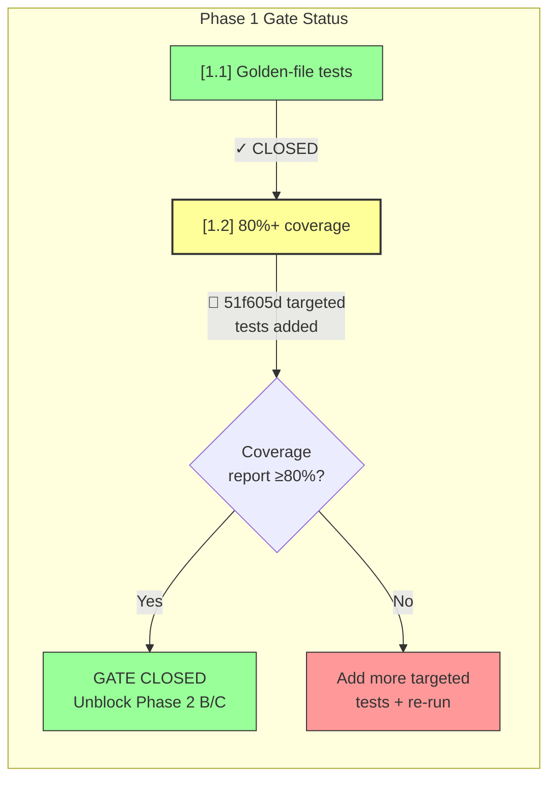
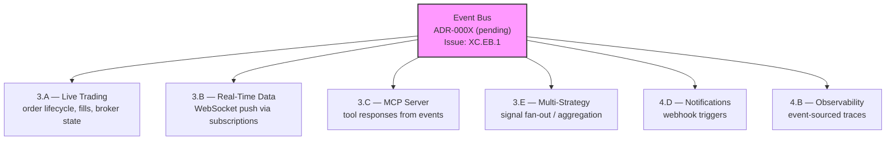
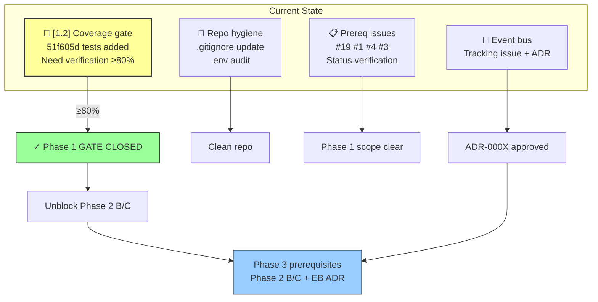

# Nexus Trade Engine — Development Strategy

**Authoritative.** The engine follows this execution plan strictly. Phases run sequentially. Lanes within a phase run in parallel.

> **Drift advisory (current sprint):** Phase 2 Lane A (Auth, SEV-233) shipped before Phase 1 gate (SEV-264 coverage) formally closed. This violated the declared sequential-phase rule. The exception is documented below in §Phase Gate Exceptions. The coverage gate `[1.2]` remains open but is **actively closing** — targeted tests for low-coverage modules landed in commit `51f605d`. Gate status upgraded to 🔧 IN PROGRESS.

---

## Execution Method

Every issue is tagged `[N.L.k]`:
- **N** = Phase (1-7). Sequential. Phase N+1 starts only after Phase N gates close.
- **L** = Lane (A, B, C...). Parallel within a phase. Pick any lane to staff.
- **k** = Position within lane. Sequential. Lower numbers first.

Cross-cutting concerns use `[XC.k]` and track against their own gate (ADR approval), not a phase gate.

**85 open issues. ~15 are duplicates (close first). ~67 active issues mapped across 7 phases + cross-cutting concerns.**

---

## Repository Governance

### Branching & Commit Policy

All work merges to the tracked branch via pull request. The following rules apply:

| Rule | Details |
|------|---------|
| **WIP commits** | Permitted on feature branches only. Must use `[skip ci]` tag in the message. **Never** merge a `[skip ci]` commit to the tracked branch without a follow-up CI run. |
| **Auto-save checkpoints** | Commits like `76dc5a7`, `de911a9`, `2ce4f30` (auto-save/WIP with `[skip ci]`) must be squashed or amended before merge. Do not merge raw auto-save history. |
| **Feature branches** | Name as `feat/<lane-tag>-<short-description>` (e.g., `feat/3.A.1-broker-adapter`). |
| **CI gating** | Every PR to the tracked branch must pass `ci.yml` fully. `[skip ci]` is prohibited on the tracked branch itself. |
| **Squash-merge preference** | Prefer squash-merge for completed features. Preserve rebase-merge only for archaeologically meaningful commit histories (gate closures, ADRs). |

### Repository Hygiene

| Concern | Policy |
|---------|--------|
| **Coverage artifacts** | `.coverage.*` files (e.g., `.coverage.0e1e01948b64.pid437.Xx0Rsvax`) are test runtime artifacts. Must be listed in `.gitignore` under `*.coverage.*` / `.coverage`. **Action:** Add glob to `.gitignore` and remove any tracked artifacts. |
| **`__pycache__` / `.pytest_cache`** | Already gitignored. Verify no regressions. |
| **`.hypothesis/`** | Seed persistence directory — intentional, keep tracked. |
| **`.claude/`** | AI-assisted development tooling directory — intentional, keep tracked. See §AI-Assisted Development Tooling below. |

### Environment Variable & Secrets Management

| File | Purpose | Policy |
|------|---------|--------|
| `.env.example` | Template documenting all required environment variables. **Must** be committed and kept in sync with actual config. | Tracked. Update whenever a new env var is introduced. |
| `.env` | Local secrets and configuration. Contains `POSTGRES_PASSWORD` and other runtime values. | **Must** be in `.gitignore`. Never committed. |
| `docker-compose.yml` | References `POSTGRES_PASSWORD` via `${...}` interpolation. Defaults acceptable for local dev only. | No production secrets in compose defaults. |

**Environment variable inventory:**

| Variable | Used By | Required | Notes |
|----------|---------|----------|-------|
| `POSTGRES_PASSWORD` | docker-compose (Postgres service) | Yes | Local dev default acceptable. Override in CI/production. |
| `POSTGRES_USER` | docker-compose | No | Default: `postgres` |
| `POSTGRES_DB` | docker-compose | No | Default: `nexus` |
| `DATABASE_URL` | Application runtime | Yes (Phase 2+) | Constructed from Postgres credentials. |

**Secrets policy:**
1. All secrets via environment variables or secrets manager — never hardcoded.
2. `.env.example` is the single source of truth for required variables.
3. gitleaks (security.yml) enforces no-secret-in-code at CI time.
4. Production secrets managed through deployment infrastructure, not this repository.

### AI-Assisted Development Tooling

The `.claude/skills/nothing-design` directory is a skills/configuration directory for AI-assisted development workflows. It is intentional and tracked.

| Element | Purpose |
|---------|---------|
| `.claude/skills/nothing-design` | Design-space exploration and code generation assistance skills for the Claude coding agent. |

**Policy:**
- This directory is part of the developer toolchain, not a deliverable.
- Changes to AI tooling do not require ADRs unless they alter the output architecture.
- Keep tracked in version control so all developers share the same AI-assisted workflow baseline.

---

## Phase Gate Exceptions

Documented violations of the sequential-phase rule. Every exception must record: what shipped early, why, residual risk, and remediation.

| Exception | What Shipped | Gate Bypassed | Justification | Residual Risk | Remediation |
|-----------|-------------|---------------|---------------|---------------|-------------|
| `EX-001` | `[2.A.1]` Auth + RBAC (SEV-233) | `[1.2]` 80%+ coverage (SEV-264) | Auth ADR-0002 was fully spec'd; implementation had its own test suite; security review needed early for Phase 3 broker adapter design | Core engine paths still unmonitored by coverage gate; sandbox work could regress engine math | SEV-264 must close before any Phase 2 Lane B/C merge; add coverage check to Phase 3 PR template |

**Rule amendment:** A Lane may ship ahead of its phase gate only if (1) it has its own independent test suite, (2) an ADR is approved, and (3) the exception is logged here. The gate still blocks all remaining lanes in the same and subsequent phases.

---

## Shipped ✓

Features fully implemented and operational in the codebase, delivered ahead of or outside their original phase.

| Tag | Issue | Title | Delivered |
|-----|-------|-------|-----------|
| `[1.1]` | SEV-217 | Backtest golden-file regression tests | Phase 1 |
| — | #116 | CI/CD pipeline | Phase 1 |
| `[2.A.1]` | SEV-233 / #86 | Auth + RBAC per ADR-0002 | Phase 2 (PR #480, gate exception EX-001) |
| `[6.A.1]` | SEV-203 / #157 | GDPR/CCPA DSR handling | Pre-Phase 6 |
| — | — | Security scanning infrastructure | Pre-Phase 4 |
| — | — | Load testing infrastructure | Pre-Phase 4 |
| — | — | Property-based testing (Hypothesis) | Pre-Phase 1 gate |
| — | — | Self-hosted nexus CI runner | Continuous |
| — | — | Docker/compose local dev infrastructure | Phase 1 (untracked) |
| — | — | Unicode math symbol normalization | Phase 1 (untracked) |
| — | — | Event bus initial implementation + tests | Phase 1 (untracked, co-committed a7f2bc9) |

**Shipped details:**

- **CI/CD (#116):** Five operational workflows — `ci.yml`, `security.yml`, `publish-images.yml`, `release-please.yml`, `load-test.yml`. All run on self-hosted **nexus runner**.
- **Auth + RBAC (SEV-233):** Merged via PR #480, implements ADR-0002. Shipped under gate exception EX-001.
- **GDPR/CCPA DSR (SEV-203):** Data export, deletion requests, and orphaned BacktestResult handling — all fully implemented and tested.
- **Security scanning:** gitleaks with custom allowlist + dedicated `security.yml` workflow in CI.
- **Load testing:** `load-test.yml` workflow operational in CI pipeline.
- **Property-based testing:** Hypothesis framework with persistent seed constants in `.hypothesis/` directory; actively used alongside coverage-gated tests.
- **Self-hosted runners:** All CI workflows target `nexus` self-hosted runner — not standard GitHub-hosted runners.
- **Docker/compose local dev:** `docker-compose.yml` with `127.0.0.1` port bindings, `POSTGRES_PASSWORD` env var configuration, and service orchestration for local development. Present in codebase but was never tracked to a phase issue. Maps conceptually to `[4.A.1]` (SEV-260) — now partially pre-delivered.
- **Unicode math symbol normalization (commit a7f2bc9):** Character normalization for mathematical symbols in the engine. Co-committed with event bus test suite. Affects backtest reproducibility across platforms.
- **Event bus initial implementation:** Core event bus with test suites co-developed with unicode normalization. Cross-cutting infrastructure actively being refined. Formal ADR and tracking issue still pending — see §Cross-Cutting.

---

## Phase 1 — Foundations (sequential)

Lock down regression safety before anything else touches the engine.

| Tag | Issue | Title | Status |
|-----|-------|-------|--------|
| `[1.1]` | SEV-217 | Backtest golden-file regression tests | ✓ LANDED |
| `[1.2]` | SEV-264 | 80%+ coverage on core engine | **🔧 IN PROGRESS — targeted tests added (51f605d), gate closing** |

**Operational infrastructure (no longer blocking):**

| Capability | Implementation | Status |
|------------|---------------|--------|
| CI/CD pipeline (#116) | ci.yml, security.yml, publish-images.yml, release-please.yml | ✓ LANDED |
| Security scanning | gitleaks + custom allowlist, security.yml | ✓ LANDED |
| Load testing | load-test.yml | ✓ LANDED |
| Property-based testing | Hypothesis (.hypothesis/ seed constants) | ✓ Operational |
| CI runner infrastructure | Self-hosted nexus runner | ✓ Operational |
| Docker/compose dev env | docker-compose.yml, 127.0.0.1 bindings, POSTGRES_PASSWORD | ✓ Operational (untracked) |

**Gate:** `[1.2]` (coverage) must close before Phase 2 Lanes B and C begin. `[1.2]` blocks Phase 2 because without coverage gates, sandbox work can silently regress engine math.

> **Gate status:** 🔧 IN PROGRESS. Commit `51f605d` adds targeted tests for low-coverage modules specifically for SEV-264. Coverage numbers need verification against the 80% threshold. If threshold met, close gate immediately. Auth (Phase 2 Lane A) shipped under exception EX-001. No further Phase 2+ merges until SEV-264 closes.
>
> **Close action:** Run full coverage report. If ≥80%, mark gate CLOSED and unblock Phase 2 Lanes B/C.

**Phase 1 prerequisite issues (implementation tracking):**

| Issue | Title | Status | Evidence / Notes |
|-------|-------|--------|-------------------|
| #116 | CI/CD pipeline | ✓ Complete | All five workflows operational |
| #19 | Alembic migrations with initial schema | 🔧 Status unverified | Docker-compose Postgres service exists; Alembic may be initialized. **Action: verify `alembic/` directory and migration history.** |
| #1 | Backtest loop engine | 🔧 Status unverified | Golden-file regression tests (SEV-217) pass → implies working backtest loop. **Action: confirm issue can be closed or identify remaining work.** |
| #4 | Tax lot tracking with FIFO/LIFO | ⬜ Status unverified | No direct evidence of implementation. **Action: grep for FIFO/LIFO/tax-lot references. Update status.** |
| #3 | Historical market data loading and caching | ⬜ Status unverified | No direct evidence. **Action: verify data loader module existence. Update status.** |

---

## Phase 2 — Safety & Legal (3 lanes → 2 remaining)

Two independent safety prerequisites remain. Auth is shipped.

### Lane A — Auth + RBAC ✓
| Tag | Issue | Title | Status |
|-----|-------|-------|--------|
| `[2.A.1]` | SEV-233 / #86 | Auth + RBAC per ADR-0002 | ✓ LANDED via PR #480 |

### Lane B — Sandboxing
| Tag | Issue | Title | Status |
|-----|-------|-------|--------|
| `[2.B.1]` | SEV-267 | Plugin sandbox with security isolation | ⬜ blocked by [1.2] |

### Lane C — Legal
| Tag | Issue | Title | Status |
|-----|-------|-------|--------|
| `[2.C.1]` | SEV-206 | Risk disclaimers, EULA, ToS, legal-notice surfaces | ⬜ blocked by [1.2] |

**Gate:** Lane B + Lane C must close before Phase 3 live-trading ships publicly. Lane A ✓ is complete — auth is no longer on the critical path.

---

## Cross-Cutting — Event Bus Architecture 🔧 In Progress

| Tag | Issue | Title | Status |
|-----|-------|-------|--------|
| `[XC.EB.1]` | *(to be created)* | Event bus core implementation + ADR | 🔧 In progress |
| `[XC.EB.2]` | *(to be created)* | Event bus test suite coverage | 🔧 In progress |

**Status:** Active development — event bus implementation is being tested and refined (test suites and bug fixes in recent commits, including co-commits with unicode normalization at a7f2bc9).

**Gap closure actions:**
1. **Create tracking issue** for event bus with `cross-cutting` + `event-bus` labels.
2. **Write ADR-000X** documenting event bus architecture, transport selection (in-process / Redis pub-sub / etc.), and consumer contract patterns. Required before Phase 3 gates.
3. **Assign phase applicability:** Event bus is Phase 1–3 infrastructure. Core interfaces and test suite target Phase 1 completion alongside SEV-264. Consumer integrations target their respective lanes.

**Architectural role:** The event bus is an emerging cross-cutting pattern for inter-module communication. It affects multiple downstream lanes:

**Downstream lane contracts:**
- All Phase 3+ lanes should target the event bus as the standard inter-module communication mechanism.
- Test coverage is already being built — maintain and extend.
- No Phase 3 lane merge without event bus ADR approved.

---

## Phase 3 — Engine Completeness (5-way parallel)

The core trade lifecycle. Five independent lanes.

**Prerequisites:** Phase 1 gate `[1.2]` closed. Phase 2 Lanes B + C closed. Event bus ADR `[XC.EB.1]` approved.

### Lane A — Live Trading (sequential)
| Tag | Issue | Title | Status |
|-----|-------|-------|--------|
| `[3.A.1]` | SEV-258 | Pluggable broker adapter system | ⬜ open |
| `[3.A.2]` | SEV-266 | Alpaca live broker adapter | ⬜ open |
| `[3.A.3]` | SEV-269 / #13 | Paper trading w/ live data feeds | ⬜ open |

### Lane B — Real-Time Data
| Tag | Issue | Title | Status |
|-----|-------|-------|--------|
| `[3.B.1]` | SEV-275 | WebSocket API for portfolio updates | ⬜ open |

### Lane C — MCP Server (sequential)
| Tag | Issue | Title | Status |
|-----|-------|-------|--------|
| `[3.C.1]` | SEV-223 / #99 | MCP server core (scaffold) | ⬜ open |
| `[3.C.2]` | SEV-219 / #104 | MCP market data tools | ⬜ open |
| `[3.C.3]` | SEV-220 / #103 | MCP trading control tools | ⬜ open |
| `[3.C.4]` | SEV-221 / #102 | MCP backtesting tools | ⬜ open |
| `[3.C.5]` | SEV-222 / #101 | MCP strategy management tools | ⬜ open |

### Lane D — Multi-Asset Support
| Tag | Issue | Title | Status |
|-----|-------|-------|--------|
| `[3.D.1]` | SEV-270 | Crypto support (24/7 market hours, different settlement) | ⬜ open |
| `[3.D.2]` | SEV-271 | Options chain data and pricing | ⬜ open |
| `[3.D.3]` | SEV-272 | Forex / multi-currency pair support | ⬜ open |

### Lane E — Multi-Strategy
| Tag | Issue | Title | Status |
|-----|-------|-------|--------|
| `[3.E.1]` | SEV-273 | Strategy composition and orchestration | ⬜ open |
| `[3.E.2]` | SEV-274 | Signal fan-out and aggregation | ⬜ open |

---

## Phase 4 — Observability & Infrastructure

**Prerequisites:** Phase 3 lanes landed.

### Lane A — Deployment
| Tag | Issue | Title | Status |
|-----|-------|-------|--------|
| `[4.A.1]` | SEV-260 | Container orchestration and deployment pipeline | ⬜ open (partially pre-delivered: Docker/compose local dev) |

### Lane B — Observability
| Tag | Issue | Title | Status |
|-----|-------|-------|--------|
| `[4.B.1]` | SEV-261 | Structured logging and distributed tracing | ⬜ open |

### Lane C — Performance
| Tag | Issue | Title | Status |
|-----|-------|-------|--------|
| `[4.C.1]` | SEV-262 | Performance benchmarks and regression detection | ⬜ open |

### Lane D — Notifications
| Tag | Issue | Title | Status |
|-----|-------|-------|--------|
| `[4.D.1]` | SEV-263 | Webhook / notification delivery system | ⬜ open |

---

## Phase 5 — Advanced Analytics

**Prerequisites:** Phase 4 landed.

| Tag | Issue | Title | Status |
|-----|-------|-------|--------|
| `[5.1]` | SEV-276 | Portfolio attribution analysis | ⬜ open |
| `[5.2]` | SEV-277 | Risk metrics dashboard (VaR, drawdown, Sharpe) | ⬜ open |
| `[5.3]` | SEV-278 | Strategy performance comparison tools | ⬜ open |

---

## Phase 6 — Compliance & Security Hardening

**Prerequisites:** Phase 5 landed.

| Tag | Issue | Title | Status |
|-----|-------|-------|--------|
| `[6.A.1]` | SEV-203 / #157 | GDPR/CCPA DSR handling | ✓ Pre-delivered |
| `[6.B.1]` | SEV-279 | Audit trail and SOX-compliant logging | ⬜ open |
| `[6.B.2]` | SEV-280 | Penetration testing remediation | ⬜ open |
| `[6.C.1]` | SEV-281 | Role-based data access boundaries | ⬜ open |

---

## Phase 7 — Polish & Launch

**Prerequisites:** Phase 6 landed.

| Tag | Issue | Title | Status |
|-----|-------|-------|--------|
| `[7.1]` | SEV-282 | Documentation and API reference | ⬜ open |
| `[7.2]` | SEV-283 | Onboarding flow and wizard | ⬜ open |
| `[7.3]` | SEV-284 | Performance optimization pass | ⬜ open |

---

## Drift Resolution Log

Tracking resolved drift items. Each entry links to the correction made in this document.

| Drift ID | Severity | Description | Resolution | Section Updated |
|----------|----------|-------------|------------|-----------------|
| `DRIFT-001` | Medium | `.claude/skills/nothing-design` undocumented | Added §AI-Assisted Development Tooling | Repository Governance |
| `DRIFT-002` | Medium | No branching/WIP commit policy for `[skip ci]` commits | Added §Branching & Commit Policy | Repository Governance |
| `DRIFT-003` | Medium | Gate `[1.2]` status stale — `51f605d` added targeted tests | Updated gate status to 🔧 IN PROGRESS with close action | Phase 1 |
| `DRIFT-004` | Medium | Prerequisite issues #19, #1, #4, #3 untracked | Added status tracking table with verification actions | Phase 1 |
| `DRIFT-005` | Low | Coverage artifact `.coverage.*` in file tree | Added §Repository Hygiene, `.gitignore` action | Repository Governance |
| `DRIFT-006` | Low | `.env`/`.env.example` management undocumented | Added §Environment Variable & Secrets Management | Repository Governance |

---

## Immediate Actions

Priority-ordered list of tasks to resolve current drift and close the Phase 1 gate.

| Priority | Action | Owner | Blocks |
|----------|--------|-------|--------|
| **P0** | Run full coverage report against SEV-264 threshold (80%) | Engineering | Phase 2 B/C, Phase 3+ |
| **P0** | Add `.coverage.*` glob to `.gitignore`; remove tracked artifacts | Engineering | Repository hygiene |
| **P0** | Verify `.env` is gitignored; audit `.env.example` completeness | Engineering | Secrets hygiene |
| **P1** | Verify status of prerequisite issues #19, #1, #4, #3 — close or update | Engineering | Phase 1 scope clarity |
| **P1** | Create formal tracking issue for event bus (XC.EB.1) | Engineering | Phase 3 ADR prerequisite |
| **P2** | Draft event bus ADR-000X | Engineering | Phase 3 gates |
| **P2** | Audit and clean up any `[skip ci]` commits on tracked branch | Engineering | CI integrity |

