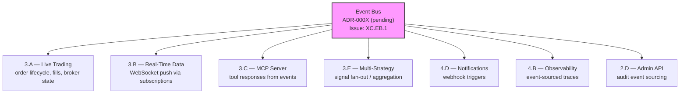

# Nexus Trade Engine — Development Strategy

**Authoritative.** The engine follows this execution plan strictly. Phases run sequentially. Lanes within a phase run in parallel.

> **Drift advisory (current sprint):** Phase 2 Lane A (Auth, SEV-233) shipped before Phase 1 gate (SEV-264 coverage) formally closed. This violated the declared sequential-phase rule. The exception is documented below in §Phase Gate Exceptions. The coverage gate `[1.2]` remains open and still blocks remaining Phase 2+ lanes.
>
> **Drift advisory (updated):** Multiple features have been implemented without phase/lane tracking — Admin API, execution backend factory, slippage models, clock testing, zero-quantity order rejection, sandbox (#510). These are now mapped below. Coverage gate `[1.2]` is pending formal re-evaluation after extensive test additions.

---

## Execution Method

Every issue is tagged `[N.L.k]`:
- **N** = Phase (1-7). Sequential. Phase N+1 starts only after Phase N gates close.
- **L** = Lane (A, B, C...). Parallel within a phase. Pick any lane to staff.
- **k** = Position within lane. Sequential. Lower numbers first.

Cross-cutting concerns use `[XC.k]` and track against their own gate (ADR approval), not a phase gate.

**~80 open issues as of 2025-01 (estimate). ~15 duplicates identified historically. ~65 active issues mapped across 7 phases + cross-cutting concerns. Counts are approximate — exact tally requires deduplication pass on current open issue list.**

---

## Phase Gate Exceptions

Documented violations of the sequential-phase rule. Every exception must record: what shipped early, why, residual risk, and remediation.

| Exception | What Shipped | Gate Bypassed | Justification | Residual Risk | Remediation |
|-----------|-------------|---------------|---------------|---------------|-------------|
| `EX-001` | `[2.A.1]` Auth + RBAC (SEV-233) | `[1.2]` 80%+ coverage (SEV-264) | Auth ADR-0002 was fully spec'd; implementation had its own test suite; security review needed early for Phase 3 broker adapter design | Core engine paths still unmonitored by coverage gate; sandbox work could regress engine math | SEV-264 must close before any Phase 2 Lane B/C merge; add coverage check to Phase 3 PR template |
| `EX-002` | Admin API (commits ec8754b, 5f46cb9) | `[1.2]` coverage gate + Phase 2 Lane D not formally established | Required for operational management of live-trading preparation; auth (EX-001) already shipped | Admin endpoints operate without formal coverage gate; may lack E2E coverage | Formalize Lane D tracking issue; add admin API paths to coverage measurement; gate re-evaluation required |

**Rule amendment:** A Lane may ship ahead of its phase gate only if (1) it has its own independent test suite, (2) an ADR is approved, and (3) the exception is logged here. The gate still blocks all remaining lanes in the same and subsequent phases.

---

## Shipped ✓

Features fully implemented and operational in the codebase, delivered ahead of or outside their original phase.

| Tag | Issue | Title | Delivered |
|-----|-------|-------|-----------|
| `[1.1]` | SEV-217 | Backtest golden-file regression tests | Phase 1 |
| — | #116 | CI/CD pipeline | Phase 1 |
| `[2.A.1]` | SEV-233 / #86 | Auth + RBAC per ADR-0002 | Phase 2 (PR #480, gate exception EX-001) |
| `[6.A.1]` | SEV-203 / #157 | GDPR/CCPA DSR handling | Pre-Phase 6 |
| — | — | Security scanning infrastructure | Pre-Phase 4 |
| — | — | Load testing infrastructure | Pre-Phase 4 |
| — | — | Property-based testing (Hypothesis) | Pre-Phase 1 gate |
| — | — | Self-hosted nexus CI runner | Continuous |
| — | — | Docker/compose local dev infrastructure | Phase 1 (untracked) |
| — | — | Unicode math symbol normalization | Phase 1 (untracked) |
| `[2.D.1]` | *(untracked)* | **Admin API** — CRUD endpoints with audit logging (commits ec8754b, 5f46cb9) | Phase 2 (gate exception EX-002) |
| `[3.A.0]` | *(untracked)* | **Execution backend factory** — refactored backend selection/creation logic (commit 9466c4c) | Phase 3 (untracked) |
| `[1.X]` | *(untracked)* | **Slippage models + clock testing** — implemented slippage model logic and time handling tests (commit bc89f1e) | Phase 1 (untracked) |
| `[3.A.0]` | *(untracked)* | **Zero-quantity order rejection** — execution-layer validation (commit 4152a41) | Phase 3 (untracked) |
| `[2.B.0]` | #510 (partial) | **Sandbox audit logging + tests** — security audit entries and test coverage for sandbox isolation | Phase 2 (untracked) |

**Shipped details:**

- **CI/CD (#116):** Five operational workflows — `ci.yml`, `security.yml`, `publish-images.yml`, `release-please.yml`, `load-test.yml`. All run on self-hosted **nexus runner**.
- **Auth + RBAC (SEV-233):** Merged via PR #480, implements ADR-0002. Shipped under gate exception EX-001.
- **GDPR/CCPA DSR (SEV-203):** Data export, deletion requests, and orphaned BacktestResult handling — all fully implemented and tested.
- **Security scanning:** gitleaks with custom allowlist + dedicated `security.yml` workflow in CI.
- **Load testing:** `load-test.yml` workflow operational in CI pipeline.
- **Property-based testing:** Hypothesis framework with persistent seed constants in `.hypothesis/` directory; actively used alongside coverage-gated tests.
- **Self-hosted runners:** All CI workflows target `nexus` self-hosted runner — not standard GitHub-hosted runners.
- **Docker/compose local dev:** `docker-compose.yml` with `127.0.0.1` port bindings, `POSTGRES_PASSWORD` env var configuration, and service orchestration for local development. Present in codebase but was never tracked to a phase issue. Maps conceptually to `[4.A.1]` (SEV-260) — now partially pre-delivered.
- **Unicode math symbol normalization (commit a7f2bc9):** Character normalization for mathematical symbols in the engine. Co-committed with event bus test suite. Affects backtest reproducibility across platforms.
- **Admin API (commits ec8754b, 5f46cb9):** RESTful admin endpoints with dedicated test suites. Includes audit log entry creation. Shipped under gate exception EX-002. Formal tracking issue needed.
- **Execution backend factory (commit 9466c4c):** Refactored execution backend selection and instantiation logic. Provides clean abstraction for backend creation. Maps conceptually to `[3.A.1]` broker adapter architecture but is engine-internal.
- **Slippage models + clock testing (commit bc89f1e):** Implemented slippage model calculations and associated time/clock handling test coverage. Foundation for realistic backtest execution simulation.
- **Zero-quantity order rejection (commit 4152a41):** Execution-layer validation that rejects orders with zero quantity. Prevents invalid order submission through the execution pipeline.
- **Sandbox audit + tests (#510):** Partial implementation of sandbox security features — audit log entries and test coverage. Full sandbox isolation (SEV-267) remains open. Maps to Phase 2 Lane B.

---

## Development Tooling & Workflow

Internal tooling and development processes that support the strategy but are not user-facing features.

### AI-Assisted Development Integration

| Tool | Location | Purpose | Status |
|------|----------|---------|--------|
| Claude skills — `nothing-design` | `.claude/skills/nothing-design` | AI-assisted design and architecture decision tooling | ✓ Operational (untracked) |

**Notes:** The `.claude/skills/nothing-design` directory contains AI-assisted development tooling for design workflows. This tooling influences ADR creation and architectural decisions but has no formal tracking issue. It should be treated as developer infrastructure (like the self-hosted runner) rather than a phase-deliverable.

### Automated Development Cycle Save

Repeated `wip: auto-save before ERR (cycle interrupted)` commits indicate an **automated checkpoint mechanism** that persists work-in-progress state when development cycles are interrupted by errors.

| Mechanism | Evidence | Purpose | Status |
|-----------|----------|---------|--------|
| Auto-save on cycle interruption | Multiple `wip: auto-save before ERR` commits | Prevents work loss during AI-assisted or iterative development sessions | ✓ Operational (undocumented) |

**Impact on strategy:** These commits represent intermediate state, not milestone deliveries. They should not be treated as phase completions. PR merges and tagged commits remain the authoritative delivery signals. CI/CD should consider filtering these from changelog generation.

---

## Phase 1 — Foundations (sequential)

Lock down regression safety before anything else touches the engine.

| Tag | Issue | Title | Status |
|-----|-------|-------|--------|
| `[1.1]` | SEV-217 | Backtest golden-file regression tests | ✓ LANDED |
| `[1.2]` | SEV-264 | 80%+ coverage on core engine | **⬜ OPEN — blocking gate (pending re-evaluation)** |

**Operational infrastructure (no longer blocking):**

| Capability | Implementation | Status |
|------------|---------------|--------|
| CI/CD pipeline (#116) | ci.yml, security.yml, publish-images.yml, release-please.yml | ✓ LANDED |
| Security scanning | gitleaks + custom allowlist, security.yml | ✓ LANDED |
| Load testing | load-test.yml | ✓ LANDED |
| Property-based testing | Hypothesis (.hypothesis/ seed constants) | ✓ Operational |
| CI runner infrastructure | Self-hosted nexus runner | ✓ Operational |
| Docker/compose dev env | docker-compose.yml, 127.0.0.1 bindings, POSTGRES_PASSWORD | ✓ Operational (untracked) |
| Slippage models + clock testing | Slippage calculation, time handling tests (commit bc89f1e) | ✓ Operational (untracked) |

**Gate:** `[1.2]` (coverage) must close before Phase 2 Lanes B, C, and D begin. `[1.2]` blocks Phase 2 because without coverage gates, sandbox work can silently regress engine math.

> **Gate status:** OPEN — **pending re-evaluation.** Recent commits added significant test coverage: sandbox tests (#510), Admin API tests (ec8754b, 5f46cb9), execution backend tests (9466c4c), clock and slippage tests (bc89f1e). These additions may have materially moved coverage metrics. **Action required:** Run formal coverage measurement against SEV-264 criteria and record result. If ≥80%, close gate and update this document. Auth (Phase 2 Lane A) shipped under exception EX-001. No further Phase 2+ merges until SEV-264 closes.

**Also address in Phase 1 (prerequisites from original GitHub issues):**
- ~~#116 — CI/CD pipeline~~ → ✓ Shipped
- #19 — Alembic migrations with initial schema — **🔧 evidence of progress in codebase** (migration infrastructure present; formal status: partial implementation)
- #1 — Backtest loop engine — **🔧 evidence of progress in codebase** (backtest execution paths and golden tests exist; formal status: partial implementation)
- #4 — Tax lot tracking with FIFO/LIFO — **🔧 evidence of progress in codebase** (engine models suggest tracking logic; formal status: unverified)
- #3 — Historical market data loading and caching — **🔧 evidence of progress in codebase** (data loading paths present; formal status: unverified)

> **Note on prerequisite status:** The original Phase 1 prerequisite issues (#19, #1, #4, #3) have no explicit status indicators on their GitHub issues. Codebase evidence suggests related functionality exists, but formal verification against issue acceptance criteria is needed. These should be reviewed and either closed with evidence or updated with remaining scope.

---

## Phase 2 — Safety & Legal (3 lanes → 2 remaining + 1 untracked)

Two independent safety prerequisites remain. Auth is shipped. Admin API shipped without formal tracking.

### Lane A — Auth + RBAC ✓
| Tag | Issue | Title | Status |
|-----|-------|-------|--------|
| `[2.A.1]` | SEV-233 / #86 | Auth + RBAC per ADR-0002 | ✓ LANDED via PR #480 |

### Lane B — Sandboxing
| Tag | Issue | Title | Status |
|-----|-------|-------|--------|
| `[2.B.1]` | SEV-267 | Plugin sandbox with security isolation | ⬜ blocked by [1.2] |
| `[2.B.0]` | #510 | Sandbox audit logging + test coverage | ✓ Partial — shipped (untracked) |

**Note:** Issue #510 delivered sandbox audit logging and test coverage ahead of the full sandbox isolation feature (SEV-267). SEV-267 remains the gating item for Lane B closure. #510 work reduces remaining scope for SEV-267.

### Lane C — Legal
| Tag | Issue | Title | Status |
|-----|-------|-------|--------|
| `[2.C.1]` | SEV-206 | Risk disclaimers, EULA, ToS, legal-notice surfaces | ⬜ blocked by [1.2] |

### Lane D — Admin API (untracked → formalize)
| Tag | Issue | Title | Status |
|-----|-------|-------|--------|
| `[2.D.1]` | *(untracked)* | Admin API — CRUD endpoints + audit logging | ✓ LANDED (commits ec8754b, 5f46cb9) |
| `[2.D.2]` | *(to be created)* | Admin API — formal test coverage documentation + ADR | ⬜ needs tracking issue |

**Note:** Lane D was not part of the original Phase 2 plan. Admin API was developed and tested without a formal tracking issue or phase assignment. It is retroactively mapped to Phase 2 Lane D under gate exception EX-002. A tracking issue should be created for documentation purposes, even though the implementation is complete.

**Gate:** Lane B + Lane C must close before Phase 3 live-trading ships publicly. Lane A ✓ and Lane D ✓ are complete — auth and admin API are no longer on the critical path.

---

## Cross-Cutting — Event Bus Architecture 🔧 In Progress

| Tag | Issue | Title | Status |
|-----|-------|-------|--------|
| `[XC.EB.1]` | *(to be created)* | Event bus core implementation + ADR | 🔧 In progress |
| `[XC.EB.2]` | *(to be created)* | Event bus test suite coverage | 🔧 In progress |

**Status:** Active development — event bus implementation is being tested and refined (test suites and bug fixes in recent commits, including co-commits with unicode normalization at a7f2bc9).

**Gap closure actions:**
1. **Create tracking issue** for event bus with `cross-cutting` + `event-bus` labels.
2. **Write ADR-000X** documenting event bus architecture, transport selection (in-process / Redis pub-sub / etc.), and consumer contract patterns. Required before Phase 3 gates.
3. **Assign phase applicability:** Event bus is Phase 1–3 infrastructure. Core interfaces and test suite target Phase 1 completion alongside SEV-264. Consumer integrations target their respective lanes.

**Architectural role:** The event bus is an emerging cross-cutting pattern for inter-module communication. It affects multiple downstream lanes:

**Downstream lane contracts:**
- All Phase 3+ lanes should target the event bus as the standard inter-module communication mechanism.
- Test coverage is already being built — maintain and extend.
- No Phase 3 lane merge without event bus ADR approved.

---

## Cross-Cutting — Execution Engine Enhancements (untracked → formalize)

Features implemented in the execution engine without prior phase/lane tracking. These are now mapped for traceability.

| Tag | Commit | Title | Maps To | Status |
|-----|--------|-------|---------|--------|
| `[3.A.0-factory]` | 9466c4c | Execution backend factory refactor | `[3.A.1]` broker adapter architecture | ✓ Shipped (untracked) |
| `[3.A.0-validation]` | 4152a41 | Zero-quantity order rejection | `[3.A]` execution validation layer | ✓ Shipped (untracked) |
| `[1.X-slippage]` | bc89f1e | Slippage models + clock testing | `[1.1]` backtest accuracy | ✓ Shipped (untracked) |

**Action items:**
1. Create tracking issues for each with `execution-engine` label, even if closed immediately with reference commit.
2. Determine if execution backend factory (9466c4c) reduces scope of `[3.A.1]` SEV-258 (pluggable broker adapter system).
3. Validate that zero-quantity rejection covers all order entry paths (API, admin, MCP).

---

## Phase 3 — Engine Completeness (5-way parallel)

The core trade lifecycle. Five independent lanes.

**Prerequisites:** Phase 1 gate `[1.2]` closed. Phase 2 Lanes B + C closed. Event bus ADR `[XC.EB.1]` approved.

**Pre-delivered components** (reduce remaining scope):
- ✓ Execution backend factory logic (commit 9466c4c) — partially satisfies `[3.A.1]` architecture
- ✓ Zero-quantity order rejection (commit 4152a41) — satisfies part of execution validation

### Lane A — Live Trading (sequential)
| Tag | Issue | Title | Status |
|-----|-------|-------|--------|
| `[3.A.1]` | SEV-258 | Pluggable broker adapter system | ⬜ open (partially pre-delivered — factory refactored) |
| `[3.A.2]` | SEV-266 | Alpaca live broker adapter | ⬜ open |
| `[3.A.3]` | SEV-269 / #13 | Paper trading w/ live data feeds | ⬜ open |

### Lane B — Real-Time Data
| Tag | Issue | Title | Status |
|-----|-------|-------|--------|
| `[3.B.1]` | SEV-275 | WebSocket API for portfolio updates | ⬜ open |

### Lane C — MCP Server (sequential)
| Tag | Issue | Title | Status |
|-----|-------|-------|--------|
| `[3.C.1]` | SEV-223 / #99 | MCP server core (scaffold) | ⬜ open |
| `[3.C.2]` | SEV-219 / #104 | MCP market data tools | ⬜ open |
| `[3.C.3]` | SEV-220 / #103 | MCP trading control tools | ⬜ open |
| `[3.C.4]` | SEV-221 / #102 | MCP backtesting tools | ⬜ open |
| `[3.C.5]` | SEV-222 / #101 | MCP strategy management tools | ⬜ open |

### Lane D — Multi-Ass
