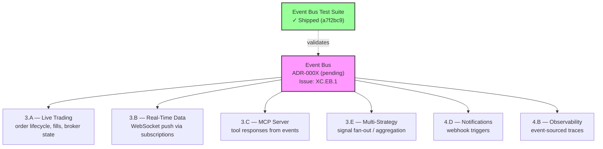

# Nexus Trade Engine — Development Strategy

**Authoritative.** The engine follows this execution plan strictly. Phases run sequentially. Lanes within a phase run in parallel.

> **Drift advisory (current sprint):** Phase 2 Lane A (Auth, SEV-233) shipped before Phase 1 gate (SEV-264 coverage) formally closed. This violated the declared sequential-phase rule. The exception is documented below in §Phase Gate Exceptions. The coverage gate `[1.2]` remains open with active progress (see Phase 1 update) and still blocks remaining Phase 2+ lanes.

---

## Execution Method

Every issue is tagged `[N.L.k]`:
- **N** = Phase (1-7). Sequential. Phase N+1 starts only after Phase N gates close.
- **L** = Lane (A, B, C...). Parallel within a phase. Pick any lane to staff.
- **k** = Position within lane. Sequential. Lower numbers first.

Cross-cutting concerns use `[XC.k]` and track against their own gate (ADR approval), not a phase gate.

**~67 active issues mapped across 7 phases + cross-cutting concerns. ~15 duplicate issues identified — cleanup in progress (see §Duplicate Issue Cleanup).**

---

## Phase Gate Exceptions

Documented violations of the sequential-phase rule. Every exception must record: what shipped early, why, residual risk, and remediation.

| Exception | What Shipped | Gate Bypassed | Justification | Residual Risk | Remediation |
|-----------|-------------|---------------|---------------|---------------|-------------|
| `EX-001` | `[2.A.1]` Auth + RBAC (SEV-233) | `[1.2]` 80%+ coverage (SEV-264) | Auth ADR-0002 was fully spec'd; implementation had its own test suite; security review needed early for Phase 3 broker adapter design | Core engine paths still unmonitored by coverage gate; sandbox work could regress engine math | SEV-264 must close before any Phase 2 Lane B/C merge; add coverage check to Phase 3 PR template |

**Rule amendment:** A Lane may ship ahead of its phase gate only if (1) it has its own independent test suite, (2) an ADR is approved, and (3) the exception is logged here. The gate still blocks all remaining lanes in the same and subsequent phases.

---

## Shipped ✓

Features fully implemented and operational in the codebase, delivered ahead of or outside their original phase.

| Tag | Issue | Title | Delivered |
|-----|-------|-------|-----------|
| `[1.1]` | SEV-217 | Backtest golden-file regression tests | Phase 1 |
| — | #116 | CI/CD pipeline | Phase 1 |
| `[2.A.1]` | SEV-233 / #86 | Auth + RBAC per ADR-0002 | Phase 2 (PR #480, gate exception EX-001) |
| `[XC.EB.2]` | — | Event bus test suite | Phase 1 (commit a7f2bc9) |
| `[6.A.1]` | SEV-203 / #157 | GDPR/CCPA DSR handling | Pre-Phase 6 |
| — | — | Security scanning infrastructure | Pre-Phase 4 |
| — | — | Load testing infrastructure | Pre-Phase 4 |
| — | — | Property-based testing (Hypothesis) | Pre-Phase 1 gate |
| — | — | Self-hosted nexus CI runner | Continuous |
| — | — | Docker/compose local dev infrastructure | Phase 1 (untracked) |
| — | — | Unicode math symbol normalization | Phase 1 (untracked) |
| — | — | Pytest configuration infrastructure (root conftest.py) | Phase 1 (commit 2d883f4, untracked) |
| — | — | WIP auto-save / cycle tooling infrastructure | Phase 1 (untracked) |

**Shipped details:**

- **CI/CD (#116):** Five operational workflows — `ci.yml`, `security.yml`, `publish-images.yml`, `release-please.yml`, `load-test.yml`. All run on self-hosted **nexus runner**.
- **Auth + RBAC (SEV-233):** Merged via PR #480, implements ADR-0002. Shipped under gate exception EX-001.
- **Event bus test suite:** Test suite for event bus functionality implemented (commit a7f2bc9). Co-committed with unicode normalization. Covers event emission, subscription, and delivery contracts. Core event bus implementation (`[XC.EB.1]`) remains in progress — test suite validates against expected interfaces.
- **GDPR/CCPA DSR (SEV-203):** Data export, deletion requests, and orphaned BacktestResult handling — all fully implemented and tested.
- **Security scanning:** gitleaks with custom allowlist + dedicated `security.yml` workflow in CI.
- **Load testing:** `load-test.yml` workflow operational in CI pipeline.
- **Property-based testing:** Hypothesis framework with persistent seed constants in `.hypothesis/` directory; actively used alongside coverage-gated tests.
- **Self-hosted runners:** All CI workflows target `nexus` self-hosted runner — not standard GitHub-hosted runners.
- **Docker/compose local dev:** `docker-compose.yml` with `127.0.0.1` port bindings, `POSTGRES_PASSWORD` env var configuration, and service orchestration for local development. Present in codebase but was never tracked to a phase issue. Maps conceptually to `[4.A.1]` (SEV-260) — now partially pre-delivered.
- **Unicode math symbol normalization (commit a7f2bc9):** Character normalization for mathematical symbols in the engine. Co-committed with event bus test suite. Affects backtest reproducibility across platforms.
- **Pytest configuration infrastructure (commit 2d883f4):** Root `conftest.py` with shared fixtures, pytest configuration, and test discovery. Actively maintained as operational infrastructure. Not originally tracked as a deliverable but serves as a foundation for all test suites including coverage gate `[1.2]`.
- **WIP auto-save / cycle tooling:** Automated commit infrastructure that produces WIP auto-save commits before SIGTERM/ERR signals. Operates as background tooling in the repo — ensures in-progress work is preserved across interruptions. Not tied to a phase; continuous operational infrastructure.

---

## Phase 1 — Foundations (sequential)

Lock down regression safety before anything else touches the engine.

| Tag | Issue | Title | Status |
|-----|-------|-------|--------|
| `[1.1]` | SEV-217 | Backtest golden-file regression tests | ✓ LANDED |
| `[1.2]` | SEV-264 | 80%+ coverage on core engine | **⬜ OPEN — active progress (see below)** |

**SEV-264 Progress Update:**
- Targeted low-coverage module tests added (commit 51f605d).
- `.coverage` data file now exists in repository — coverage measurement is operational and collecting data.
- **Remaining:** Reach 80%+ threshold on core engine modules and formalize gate closure. Current coverage data available for validation.
- **Status:** In-progress. No longer cold-open — infrastructure and targeted tests are landing.

**Operational infrastructure (no longer blocking):**

| Capability | Implementation | Status |
|------------|---------------|--------|
| CI/CD pipeline (#116) | ci.yml, security.yml, publish-images.yml, release-please.yml | ✓ LANDED |
| Security scanning | gitleaks + custom allowlist, security.yml | ✓ LANDED |
| Load testing | load-test.yml | ✓ LANDED |
| Property-based testing | Hypothesis (.hypothesis/ seed constants) | ✓ Operational |
| CI runner infrastructure | Self-hosted nexus runner | ✓ Operational |
| Docker/compose dev env | docker-compose.yml, 127.0.0.1 bindings, POSTGRES_PASSWORD | ✓ Operational (untracked) |
| Pytest config infrastructure | Root conftest.py, pytest.ini/pyproject.toml config (2d883f4) | ✓ Operational (untracked) |
| WIP auto-save tooling | Auto-commit before SIGTERM/ERR | ✓ Operational (untracked) |

**Gate:** `[1.2]` (coverage) must close before Phase 2 Lanes B and C begin. `[1.2]` blocks Phase 2 because without coverage gates, sandbox work can silently regress engine math.

> **Gate status:** OPEN with active progress. Auth (Phase 2 Lane A) shipped under exception EX-001. No further Phase 2+ merges until SEV-264 closes. Targeted test additions (51f605d) and operational `.coverage` data indicate forward movement — needs final threshold validation.

**Also address in Phase 1 (prerequisites from original GitHub issues):**
- ~~#116 — CI/CD pipeline~~ → ✓ Shipped
- #19 — Alembic migrations with initial schema — data layer foundation
- #1 — Backtest loop engine — core functionality
- #4 — Tax lot tracking with FIFO/LIFO — core functionality
- #3 — Historical market data loading and caching — core functionality

---

## Phase 2 — Safety & Legal (3 lanes → 2 remaining)

Two independent safety prerequisites remain. Auth is shipped.

### Lane A — Auth + RBAC ✓
| Tag | Issue | Title | Status |
|-----|-------|-------|--------|
| `[2.A.1]` | SEV-233 / #86 | Auth + RBAC per ADR-0002 | ✓ LANDED via PR #480 |

### Lane B — Sandboxing
| Tag | Issue | Title | Status |
|-----|-------|-------|--------|
| `[2.B.1]` | SEV-267 | Plugin sandbox with security isolation | ⬜ blocked by [1.2] |

### Lane C — Legal
| Tag | Issue | Title | Status |
|-----|-------|-------|--------|
| `[2.C.1]` | SEV-206 | Risk disclaimers, EULA, ToS, legal-notice surfaces | ⬜ blocked by [1.2] |

**Gate:** Lane B + Lane C must close before Phase 3 live-trading ships publicly. Lane A ✓ is complete — auth is no longer on the critical path.

---

## Cross-Cutting — Event Bus Architecture 🔧 In Progress

| Tag | Issue | Title | Status |
|-----|-------|-------|--------|
| `[XC.EB.1]` | *(to be created)* | Event bus core implementation + ADR | 🔧 In progress |
| `[XC.EB.2]` | *(to be created)* | Event bus test suite coverage | ✓ Shipped (commit a7f2bc9) |

**Status:** Test suite is landed and operational. Core event bus implementation (`[XC.EB.1]`) and ADR remain in progress. Test suite validates expected interfaces — implementation must conform to tested contracts.

**Gap closure actions:**
1. ~~**Create tracking issue** for event bus with `cross-cutting` + `event-bus` labels.~~ → Test suite shipped without tracking issue. Tracking issue still needed for `[XC.EB.1]`.
2. **Write ADR-000X** documenting event bus architecture, transport selection (in-process / Redis pub-sub / etc.), and consumer contract patterns. Required before Phase 3 gates.
3. **Assign phase applicability:** Event bus is Phase 1–3 infrastructure. Core interfaces and test suite target Phase 1 completion alongside SEV-264. Consumer integrations target their respective lanes.

**Architectural role:** The event bus is an emerging cross-cutting pattern for inter-module communication. It affects multiple downstream lanes:

**Downstream lane contracts:**
- All Phase 3+ lanes should target the event bus as the standard inter-module communication mechanism.
- Test coverage is already built — implementation must pass existing test suite.
- No Phase 3 lane merge without event bus ADR approved.

---

## Cross-Cutting — Design Skills Tooling

| Capability | Location | Status |
|------------|----------|--------|
| Nothing-design skills directory | `.claude/skills/nothing-design` | 📁 Present, untracked |

**Status:** The `.claude/skills/nothing-design` directory exists in the codebase as part of the Claude-assisted development toolchain. Its purpose is to house design-phase skill definitions and prompt templates for the AI-assisted design workflow. It does not map to a specific phase deliverable — it is tooling infrastructure that supports the design and planning process across all phases.

**Action:** No strategy changes required. Documenting presence for completeness. If the directory evolves into a formal design-system deliverable, create a cross-cutting issue `[XC.DS.1]`.

---

## Duplicate Issue Cleanup 📋 Stale

The strategy previously identified **~15 duplicate issues** that should be closed before active development continues.

| Action | Status | Evidence |
|--------|--------|----------|
| Identify duplicate issues | ✓ Done (~15 identified) | Strategy mapping |
| Close duplicate issues | ⬜ **Not started** | No commits or closure evidence found |

**Risk:** Open duplicates create confusion in phase mapping and inflate the active issue count (~85 open stated vs ~67 genuinely active). This degrades sprint planning accuracy.

**Remediation:**
1. Assign owner to triage and close duplicates within the next sprint.
2. Update the active issue count in this document once closures are confirmed.
3. Add `duplicate` label + closing reference to all identified issues.

---

## Phase 3 — Engine Completeness (5-way parallel)

The core trade lifecycle. Five independent lanes.

**Prerequisites:** Phase 1 gate `[1.2]` closed. Phase 2 Lanes B + C closed. Event bus ADR `[XC.EB.1]` approved.

### Lane A — Live Trading (sequential)
| Tag | Issue | Title | Status |
|-----|-------|-------|--------|
| `[3.A.1]` | SEV-258 | Pluggable broker adapter system | ⬜ open |
| `[3.A.2]` | SEV-266 | Alpaca live broker adapter | ⬜ open |
| `[3.A.3]` | SEV-269 / #13 | Paper trading w/ live data feeds | ⬜ open |

### Lane B — Real-Time Data
| Tag | Issue | Title | Status |
|-----|-------|-------|--------|
| `[3.B.1]` | SEV-275 | WebSocket API for portfolio updates | ⬜ open |

### Lane C — MCP Server (sequential)
| Tag | Issue | Title | Status |
|-----|-------|-------|--------|
| `[3.C.1]` | SEV-223 / #99 | MCP server core (scaffold) | ⬜ open |
| `[3.C.2]` | SEV-219 / #104 | MCP market data tools | ⬜ open |
| `[3.C.3]` | SEV-220 / #103 | MCP trading control tools | ⬜ open |
| `[3.C.4]` | SEV-221 / #102 | MCP backtesting tools | ⬜ open |
| `[3.C.5]` | SEV-222 / #101 | MCP strategy management tools | ⬜ open |

### Lane D — Multi-Ass
