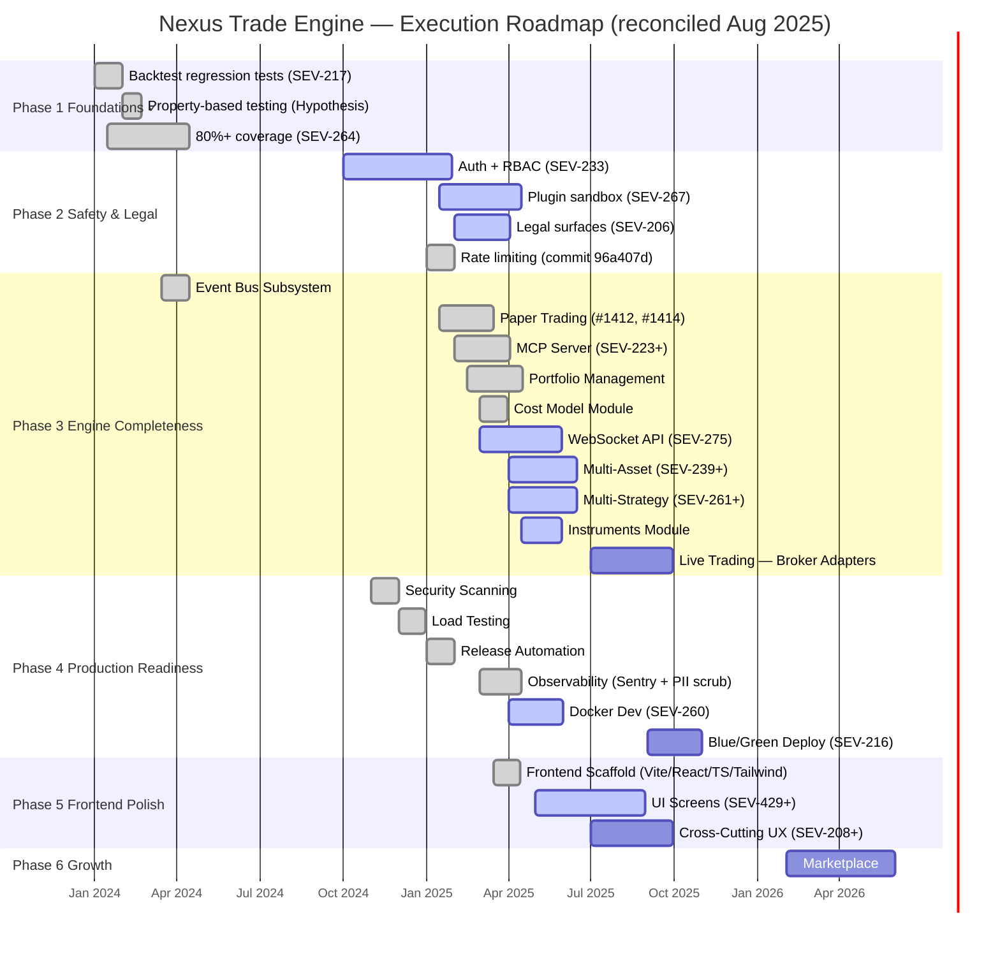

```markdown
# Nexus Trade Engine — Development Strategy

**Authoritative.** The engine follows this execution plan strictly. Phases run sequentially. Lanes within a phase run in parallel.

---

## Execution Method

Every issue is tagged `[N.L.k]`:
- **N** = Phase (1-7). Sequential. Phase N+1 starts only after Phase N gates close.
- **L** = Lane (A, B, C...). Parallel within a phase. Pick any lane to staff.
- **k** = Position within lane. Sequential. Lower numbers first.

**Updated Active Map:** Tracking 61 active issues across 7 phases after reconciling shipped MCP Server, Paper Trading, Portfolio Management, Observability, Frontend scaffold, Cost Model, and Instruments modules. Several Phase 3-5 lanes have advanced ahead of prior schedule.

---

## Architecture Decision Records (ADR Governance)

The project maintains a formal ADR process under `docs/adr/`. All architectural decisions of consequence require an ADR before implementation proceeds.

| ADR | Title | Status |
|-----|-------|--------|
| ADR-0001 | Core Architecture & Module Boundaries | Accepted |
| ADR-0002 | Event Bus Design | Accepted |
| ADR-0003 | Plugin Sandbox Isolation Model | Accepted |
| ADR-0004 | Authentication & Authorization Strategy | Accepted |
| ADR-0005 | Rate Limiting Architecture | Accepted |
| ADR-0006 | WebSocket API Protocol Design | Accepted |

**ADR workflow:** Proposals land as `ADR-NNNN-draft.md`. After review, they merge as `ADR-NNNN.md` with status `Accepted`. Superseded records move to `Superseded` with a link to the replacement. Any phase gate requiring an architecture decision must produce or reference an ADR.

---

## Shipped Features

Features that have landed in `main` and are operationally verified.

| Feature | Phase Origin | Ship Commit / PR | Notes |
|---------|-------------|-------------------|-------|
| Backtest regression tests | 1a | SEV-217 | Gate on all PRs |
| Property-based testing | 1c | Hypothesis integration | Fuzzing backtest invariants |
| 80%+ code coverage | 1b | SEV-264 | Coverage gate enforced |
| Rate limiting | 2d | `96a407d` | Middleware-enforced, configurable per-endpoint |
| Event Bus Subsystem | 3f | Merged | Async event backbone |
| MCP Server | 3c | Recent commits | Adapters, authorization, input validation — fully implemented |
| Paper Trading Subsystem | 3a | `#1412`, `#1414` | Execution engine and test suite shipped |
| Portfolio Management | 3g | Recent commits | Short-position P&L, aggregation, concurrency-safe operations |
| Cost Model Module | 3h | TypeError fix commit | Cost computation including `date_key` handling |
| Instruments Module | 3i | Active test commits | Instrument type coverage expanding |
| Security scanning pipeline | 4s | `security.yml`, `gitleaks` config | Fully operational in CI |
| Load testing framework | 4l | `load-test.yml` | Fully operational in CI |
| Release automation | 4r | `release-please.yml`, `publish-images.yml` | Fully operational in CI |
| Observability (Sentry) | 4b | Recent commits | Sentry integration with PII scrubbing operational |
| Frontend scaffold | 5 | Recent commits | Vite + React 18 + TS + Tailwind; portfolio cards and test suite |

---

## Roadmap Progress Overview



---

## Phase 1 — Foundations ✓

**Status:** Complete. All gates closed.

| Lane | Issue | Description | Status |
|------|-------|-------------|--------|
| A | SEV-217 | Backtest regression tests | ✓ Shipped |
| B | SEV-264 | 80%+ code coverage enforcement | ✓ Shipped |
| C | — | Property-based testing (Hypothesis) | ✓ Shipped |

---

## Phase 2 — Safety & Legal

**Status:** Active. All three lanes in progress; rate limiting shipped. Plugin registry public API has comprehensive test coverage.

### Lane A — Authentication & RBAC (SEV-233)

**Status:** Active

- [ ] Implement JWT-based authentication
- [ ] Role-based access control matrix
- [ ] Session management and token rotation
- [ ] API key management for programmatic access

### Lane B — Plugin Sandbox (SEV-267)

**Status:** Active — sandbox isolation, contextvar scoping, network restrictions, and plugin registry public API all landed with comprehensive unit tests

- [x] Sandbox isolation architecture (ADR-0003 accepted)
- [x] Context variable scoping for plugin execution
- [x] Network restriction enforcement
- [x] Plugin registry public API with comprehensive unit tests
- [x] SDK surface area finalization (core API tested)
- [ ] Plugin manifest schema v1
- [ ] Third-party plugin certification criteria

### Lane C — Legal Surfaces (SEV-206)

**Status:** Active — test commits landed for legal documents schema (#745, #743)

- [x] Legal documents database schema
- [ ] Terms of service versioning API
- [ ] Jurisdiction-aware compliance rules
- [ ] User consent tracking and audit trail

### Lane D — Rate Limiting ✓

**Status:** Shipped (commit `96a407d`)

- [x] Per-endpoint rate limiting middleware
- [x] Configurable thresholds (token-bucket algorithm per ADR-0005)
- [x] Integration with Auth layer for per-user limits
- [x] Monitoring and alerting on limit breaches

---

## Phase 3 — Engine Completeness

**Status:** Major progress. Event Bus, MCP Server, Paper Trading, Portfolio Management, and Cost Model all shipped. WebSocket API, Multi-Asset, Multi-Strategy, and Instruments in active development. Live Trading broker adapters remain planned.

### Lane A — Trading Execution

**Status:** Partially shipped — paper trading engine done; live broker adapters planned

#### Paper Trading ✓

**Status:** Shipped (commits `#1412`, `#1414`)

- [x] Paper trading execution engine
- [x] Order simulation with realistic fills
- [x] Position tracking and reconciliation (paper mode)
- [x] Comprehensive test coverage

#### Live Trading — Broker Adapters

**Status:** Planned — blocked on Phase 2 Auth gates

- [ ] Order routing abstraction
- [ ] Broker adapter interface (FIX, REST)
- [ ] Position tracking and reconciliation (live mode)
- [ ] Failover and reconnection logic

### Lane B — WebSocket API (SEV-275)

**Status:** Active — lint fixes and test suites in progress (PRs #878, #880)

- [x] Protocol design finalized (ADR-0006)
- [x] Connection lifecycle management
- [x] Subscription/unsubscription semantics
- [ ] Integration test coverage (in progress)
- [ ] Load testing under simulated client connections
- [ ] Authentication handshake over WS

### Lane C — MCP Server (SEV-223+) ✓

**Status:** Shipped — adapters, authorization, and input validation implemented

- [x] Model Context Protocol server implementation
- [x] Tool registration and discovery
- [x] Adapter layer for tool integrations
- [x] Authorization and access control
- [x] Input validation on all endpoints
- [ ] Streaming response protocol (future enhancement)

### Lane D — Multi-Asset (SEV-239+)

**Status:** Active — multi-manager implementation with overflow guards in commits

- [x] Multi-manager architecture with overflow guards
- [ ] Crypto spot and derivatives data adapters
- [ ] Forex data integration
- [ ] Unified asset normalization layer

### Lane E — Multi-Strategy (SEV-261+)

**Status:** Active — multi-manager infrastructure supports strategy composition groundwork

- [x] Overflow-guarded multi-manager runtime (shared with Lane D)
- [ ] Strategy composition framework
- [ ] Capital allocation across strategies
- [ ] Cross-strategy risk aggregation

### Lane F — Event Bus Subsystem ✓

**Status:** Shipped

### Lane G — Portfolio Management ✓

**Status:** Shipped — extensively implemented with short-position P&L, aggregation, and concurrency

- [x] Portfolio state aggregation engine
- [x] Short-position P&L calculation
- [x] Concurrency-safe portfolio operations
- [x] Position-level and portfolio-level risk metrics
- [ ] Multi-currency portfolio valuation (future)

### Lane H — Cost Model ✓

**Status:** Shipped — cost computation module with `date_key` handling (TypeError fix landed)

- [x] Transaction cost model (commissions, fees, slippage)
- [x] Buy/sell cost attribution by `date_key`
- [x] Integration with Portfolio Management P&L pipeline

### Lane I — Instruments Module

**Status:** Active — expanding test coverage in recent commits

- [x] Core instrument type definitions
- [x] Instrument metadata schema
- [ ] Equity instrument adapters
- [ ] Crypto instrument adapters
- [ ] Forex instrument adapters
- [ ] Corporate actions handling (splits, dividends)

---

## Phase 4 — Production Readiness

**Status:** CI/CD lanes and observability shipped. Docker dev environment actively landing. Blue/Green deploy planned.

### Lane S — Security Scanning ✓

**Status:** Shipped — `security.yml` and `gitleaks` fully operational

- [x] Secret detection in CI pipeline
- [x] Dependency vulnerability scanning
- [x] SAST integration
- [x] SARIF report upload to GitHub Security tab

### Lane L — Load Testing ✓

**Status:** Shipped — `load-test.yml` fully operational

- [x] Automated load test workflow in CI
- [x] Baseline performance benchmarks
- [x] Regression detection on latency percentiles

### Lane R — Release Automation ✓

**Status:** Shipped — `release-please.yml` and `publish-images.yml` fully operational

- [x] Conventional commit-based changelog generation
- [x] Automated semantic versioning
- [x] Container image build and publish
- [x] GitHub release creation with artifacts

### Lane A — Docker Dev Environment (SEV-260)

**Status:** Active — docker-compose and deploy script hardening landing in recent commits

- [x] Multi-service `docker-compose` for local development (in review)
- [ ] Hot-reload configuration for strategy development
- [ ] Pre-configured data feeds and seed databases
- [ ] Deploy script hardening and finalization

### Lane B — Observability (SEV-251+) ✓

**Status:** Shipped — Sentry integration with PII scrubbing operational

- [x] Structured logging standard (JSON, correlation IDs)
- [x] Sentry integration with error capture
- [x] PII scrubbing pipeline for Sentry events
- [x] Prometheus metrics export
- [ ] Grafana dashboard templates (future)
- [ ] Distributed tracing setup (future)

### Lane C — Blue/Green Deploy (SEV-216)

**Status:** Planned

- [ ] Zero-downtime deployment strategy
- [ ] Health check and readiness probes
- [ ] Automated rollback on degradation

---

## Phase 5 — Frontend Polish

**Status:** Active. Frontend scaffold shipped ahead of schedule; UI screens and cross-cutting UX in progress.

### Lane S — Frontend Scaffold ✓

**Status:** Shipped — Vite + React 18 + TypeScript + Tailwind CSS

- [x] Vite build tooling configured
- [x] React 18 project structure scaffolded
- [x] TypeScript strict-mode type checking
- [x] Tailwind CSS design system integrated
- [x] Portfolio card components
- [x] Component test suite (Vitest + Testing Library)

### Lane A — UI Screens (SEV-429+)

**Status:** Active — building on shipped scaffold

- [x] Dashboard layout and navigation (partial)
- [ ] Strategy configuration wizard
- [ ] Backtest results visualization
- [x] Portfolio card components (shipped with scaffold)
- [ ] Real-time position monitor
- [ ] Trade history and journaling

### Lane B — Cross-Cutting UX (SEV-208+)

**Status:** Planned — kicks off after core UI screens stabilize

- [ ] Responsive design and mobile baseline
- [ ] Accessibility audit (WCAG 2.1 AA)
- [ ] Internationalization framework
- [ ] Dark/light theme system

---

## Phase 6 — Growth

**Status:** Planned. Post-launch expansion.

### Lane A — Marketplace

- [ ] Plugin marketplace infrastructure
- [ ] Strategy template gallery
- [ ] Community rating and review system
- [ ] Monetization and billing integration

---

## Phase 7 — AI-Assisted Development Tooling

**Status:** Emerging. The `.claude/skills` directory signals active investment in AI-augmented workflows. This lane governs the integration of AI-assisted development into the project's operational model.

### Lane A — Developer Experience

- [ ] AI-assisted code review workflow
- [ ] Automated PR summarization
- [ ] Intelligent test generation
- [ ] Documentation drafting from commit history
```
