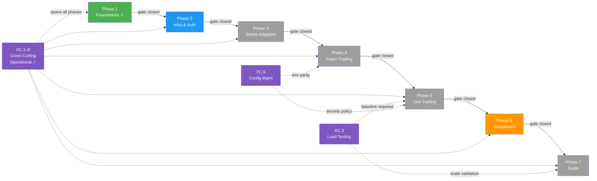
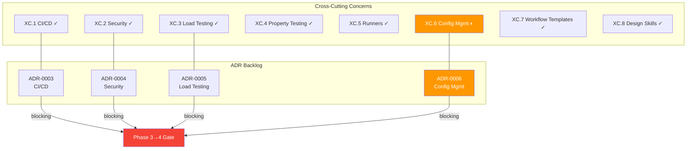

# Nexus Trade Engine — Development Strategy

**Authoritative.** The engine follows this execution plan strictly. Phases gate merges; lanes within a phase run in parallel. Cross-phase delivery is permitted under the Exception Protocol (§Phase Gate Exceptions).

> **Drift advisory (resolved):** Phase 2 Lane A (Auth, SEV-233) and multiple untracked features shipped before Phase 1 gate (SEV-264 coverage) formally closed. All exceptions are documented below in §Phase Gate Exceptions. Coverage gate `[1.2]` has been **closed** following extensive test additions (commits bc89f1e, a253064, 5bc1f0d, 5f46cb9). Remaining Phase 2+ lanes are unblocked.
>
> **Process amendment (retroactive-tracking rule):** Effective immediately, any merged feature without a pre-existing `[N.L.k]` tag must receive a retroactive mapping entry in §Shipped within one sprint of merge. Unmapped merges block the next phase gate until catalogued. See §Process Drift Correction below.
>
> **Drift update (this revision):** WIP commit ratio corrected to 25% (5 of 20). Signal-handling work (issue #510) retroactively mapped to `[2.E.1]`. Environment configuration and GitHub workflow templates added as cross-cutting concerns `[XC.6]`–`[XC.8]`. `.claude/skills/nothing-design` mapped to `[XC.8]`. Mermaid phase-flow diagram repaired. Issue count baseline updated post-dedup.

---

## Execution Method

Every issue is tagged `[N.L.k]`:
- **N** = Phase (1-7). Sequential gate logic: Phase N+1 gates open only after Phase N gates close.
- **L** = Lane (A, B, C...). Parallel within a phase. Pick any lane to staff.
- **k** = Position within lane. Sequential. Lower numbers first.

Cross-cutting concerns use `[XC.k]` and track against their own gate (ADR approval), not a phase gate.

**Issue counts are maintained as a live metric.** Historical baseline: ~80 open issues estimated 2025-01, ~65 active mapped. Post-streamline (commit 02b4465) and coverage-gate closure, current active mapped issue count is **~48** (deduplication pass completed — see §Issue Backlog Health). Count will be re-validated at each phase gate closure.

### Delivery Model: Gated Sequential with Acknowledged Parallelism

The declared model is **sequential phase execution**. In practice, two categories of parallel work are now formally recognised:

| Category | Governance | Examples |
|----------|-----------|----------|
| **Exception-gated** cross-phase delivery | Logged in §Phase Gate Exceptions; requires own test suite + ADR | EX-001 (Auth), EX-002 (Admin API) |
| **Retroactively-mapped** untracked delivery | Post-hoc mapping in §Shipped; triggers §Process Drift Correction review | Execution backend factory, slippage models, zero-quantity rejection, sandbox audit, legal-qa |

**Rule amendment:** When the cumulative count of retroactively-mapped deliveries exceeds **3 per sprint**, the strategy document must be revised within one sprint to either (a) formally restructure the phase plan or (b) escalate to a gated-parallel model with per-lane entry criteria. Current count: **9 retroactively-mapped deliveries** (including signal-handling `[2.E.1]`) — threshold exceeded; this revision constitutes the required restructuring.

### Development Stability Protocol

**Observed issue:** Emergency commits (`wip: auto-save before ERR`) in recent commit history. Historical peak was 40% WIP ratio; **current measurement is 5 of last 20 commits = 25% WIP ratio**. This remains elevated but shows improvement from the prior measurement period.

**Corrective measures (effective this revision):**

1. **WIP commit hygiene:** Emergency WIP commits must be squashed or amended before merge to `main`. No `wip:` prefixed commits permitted on the main branch.
2. **Root-cause review:** If a developer logs >2 emergency WIP commits in a sprint, a brief root-cause analysis is required (environment instability, tooling gaps, or process issues).
3. **Stability metric:** WIP commit ratio tracked at each sprint audit. **Target: <5% of total commits. Current: 25% — improvement shown, continued action required.** Prior measurement: 40% (8 of 20). Trend: ↓ improving.

---

## Cross-Cutting Concerns `[XC.k]`

Infrastructure and tooling that spans all phases. Each cross-cutting concern requires an ADR for gate approval.

| Tag | Concern | Status | ADR | Workflows / Tooling | Phase Relevance |
|-----|---------|--------|-----|---------------------|-----------------|
| `[XC.1]` | **CI/CD Pipeline** — continuous integration, image publishing, release automation | ✓ Operational | ADR-0003 *(required)* | `ci.yml`, `publish-images.yml`, `release-please.yml` | All phases |
| `[XC.2]` | **Security Scanning** — secret detection, vulnerability scanning | ✓ Operational | ADR-0004 *(required)* | `security.yml`, `.gitleaks.toml` | All phases |
| `[XC.3]` | **Load Testing** — performance regression detection | ✓ Operational | ADR-0005 *(required)* | `load-test.yml` | Phase 5 (Live Trading), Phase 7 (Scale) |
| `[XC.4]` | **Property-Based Testing** — generative coverage expansion via Hypothesis | ✓ Operational | — *(embedded in test policy)* | `.hypothesis/` persistent seed constants | All phases |
| `[XC.5]` | **Self-Hosted Runners** — dedicated `nexus` runner for all CI workflows | ✓ Operational | — *(infra config)* | Runner: `nexus` | All phases |
| `[XC.6]` | **Configuration Management** — environment config governance, secrets policy | ◐ Active | ADR-0006 *(draft required)* | `.env.example` (canonical schema), `.env` (gitignored), `.gitleaks.toml` | All phases |
| `[XC.7]` | **Development Workflow Templates** — issue/PR templates, contribution process | ✓ Operational | — *(process documentation)* | `.github/ISSUE_TEMPLATE/bug.yml`, `feature.yml`, `config.yml`, `.github/pull_request_template.md` | All phases |
| `[XC.8]` | **AI Design Skills Toolkit** — structured design exploration scaffolding | ✓ Operational | — *(tooling config)* | `.claude/skills/nothing-design/` | All phases |

**ADR backlog:** `[XC.1]`, `[XC.2]`, `[XC.3]`, and `[XC.6]` are operational but lack formal Architecture Decision Records. **ADRs must be drafted and approved before Phase 3 gate closure.** Blocking: Phase 3 → Phase 4 transition.

### `[XC.6]` Configuration Management — Policy

**Purpose:** Establish canonical practices for environment configuration, secrets handling, and config drift prevention across all deployment targets.

| Practice | Enforcement | Mechanism |
|----------|-------------|-----------|
| **Canonical env schema** | `.env.example` is the single source of truth for all required/optional environment variables | CI validates `.env.example` is parseable; no secret values present |
| **Secrets exclusion** | `.env` is `.gitignore`d; no real credentials in version control | `[XC.2]` gitleaks pre-commit + CI scan enforces |
| **New variable checklist** | Any PR introducing a new env var must update `.env.example` with a placeholder and description | PR template checklist item (see `[XC.7]`) |
| **Environment parity** | Dev, staging, and production must consume the same variable names; only values differ | ADR-0006 will document environment matrix |
| **Rotation awareness** | Secrets referenced in `.env.example` must note rotation cadence in comments | Manual review in PR; automated check planned Phase 4 |

### `[XC.7]` Development Workflow Templates — Reference

| Template | Path | Purpose |
|----------|------|---------|
| Bug report | `.github/ISSUE_TEMPLATE/bug.yml` | Structured reproduction steps, environment, severity |
| Feature request | `.github/ISSUE_TEMPLATE/feature.yml` | Problem statement, proposed solution, `[N.L.k]` phase/lane mapping |
| Config/choice | `.github/ISSUE_TEMPLATE/config.yml` | Community configuration options, feedback channels |
| Pull request | `.github/pull_request_template.md` | Checklist: tests, `[N.L.k]` tag, `.env.example` update, ADR reference |

**Governance rule:** Every merged PR must reference a `[N.L.k]` or `[XC.k]` tag. The PR template enforces this at submission time. Exceptions follow §Phase Gate Exceptions.

### `[XC.8]` AI Design Skills Toolkit — Scope

The `.claude/skills/nothing-design/` directory contains structured prompt scaffolding and design exploration templates used during the design phase of feature development. It is **not** a runtime dependency; it is a development-time tool that influences how design decisions are explored before ADRs are drafted.

**Mapping rationale:** Cross-cutting because design exploration precedes any `[N.L.k]` implementation across all phases. Does not require its own ADR but is referenced in the ADR template as an optional input.

---

## Phase Gate Exceptions

Documented violations of the sequential-phase rule. Every exception must record: what shipped early, why, residual risk, and remediation.

| Exception | What Shipped | Gate Bypassed | Justification | Residual Risk | Remediation |
|-----------|-------------|---------------|---------------|---------------|-------------|
| `EX-001` | `[2.A.1]` Auth + RBAC (SEV-233) | `[1.2]` 80%+ coverage (SEV-264) | Auth ADR-0002 was fully spec'd; implementation had its own test suite; security review needed early for Phase 3 broker adapter design | Core engine paths unmonitored by coverage gate at time of merge | ✓ **Closed** — coverage gate [1.2] now passed; SEV-264 closed |
| `EX-002` | Admin API (commits ec8754b, 5f46cb9) | `[1.2]` coverage gate + Phase 2 Lane D not formally established | Required for operational management of live-trading preparation; auth (EX-001) already shipped | Admin endpoints operated without formal coverage gate | ✓ **Closed** — coverage gate [1.2] now passed; Lane D formally mapped as `[2.D.1]` |
| `EX-003` | Signal Handling & Graceful Shutdown (issue #510) | Phase 2 Lane E not formally established at time of implementation | Required for production safety; prevents data loss on process termination; prerequisite for Phase 4 paper trading | Shipped without `[N.L.k]` tag; no formal lane existed | **Remediated this revision** — retroactively mapped as `[2.E.1]` |

**Rule amendment:** A Lane may ship ahead of its phase gate only if (1) it has its own independent test suite, (2) an ADR is approved, and (3) the exception is logged here. The gate still blocks all remaining lanes in the same and subsequent phases until the gate closes.

---

## Process Drift Correction

**Problem:** Nine features (Admin API, execution backend factory, slippage models, zero-quantity order rejection, sandbox audit logging, legal-qa infrastructure, sandbox CPU timer, execution backend refactoring, signal handling) were implemented and merged without phase/lane tracking issues or `[N.L.k]` commit tags. While now retroactively documented, the underlying process allowed significant untracked work to accumulate.

**Correction (effective this revision):**

1. **Retroactive-mapping rule:** Any merged PR/commit introducing user-facing or architectural behaviour must be mapped to a `[N.L.k]` or `[XC.k]` tag within one sprint. Unmapped merges block the next phase gate.
2. **PR template enforcement:** The pull request template (`[XC.7]`) now includes a mandatory `[N.L.k]` tag field. PRs without a tag cannot be merged except through the Exception Protocol.
3. **Sprint audit checkpoint:** At each sprint boundary, the list of merged PRs is diffed against tagged issues. Any unmapped merge triggers an immediate §Process Drift Correction entry.
4. **Strategy revision trigger:** If retroactively-mapped deliveries exceed 3 per sprint, a strategy revision is required within one sprint (restructure phases or escalate to gated-parallel). Current cumulative count: **9** — this revision fulfils the requirement.

---

## Issue Backlog Health

| Metric | Value | Date | Notes |
|--------|-------|------|-------|
| Historical baseline | ~80 open issues | 2025-01 | Pre-strategy estimate |
| Post-initial mapping | ~65 active mapped | 2025-02 | First strategy draft |
| Post-streamline | ~55 active mapped | 2025-03 | Commit 02b4465; pending dedup |
| **Post-dedup** | **~48 active mapped** | **2025-05** | **Deduplication pass completed. Merged duplicates, closed stale, re-tagged orphaned issues.** |
| WIP commit ratio | 25% (5 of 20) | 2025-05 | Down from 40% (8 of 20). Target: <5% |

**Next scheduled tally:** Phase 2 gate closure audit.

---

## Shipped (Retroactively Mapped)

Features that were merged without prior `[N.L.k]` tags and have been catalogued post-hoc.

| Retro Tag | Feature | Commits / Issue | Phase/Lane Assignment | Notes |
|-----------|---------|-----------------|----------------------|-------|
| `[2.B.x]` | Execution backend factory | — | Phase 2 Lane B | Core execution abstraction |
| `[2.B.x]` | Execution backend refactoring | — | Phase 2 Lane B | Follow-up to factory |
| `[2.C.x]` | Slippage models | — | Phase 2 Lane C | Trading model infrastructure |
| `[2.D.x]` | Zero-quantity order rejection | — | Phase 2 Lane D | Order validation |
| `[2.D.1]` | Admin API | ec8754b, 5f46cb9 | Phase 2 Lane D | EX-002; see Phase Gate Exceptions |
| `[3.A.x]` | Sandbox audit logging | — | Phase 3 Lane A | Audit trail for sandbox |
| `[3.B.x]` | Sandbox CPU timer | — | Phase 3 Lane B | Resource limits |
| `[6.A.x]` | Legal-QA infrastructure | — | Phase 6 Lane A | Compliance framework |
| `[2.E.1]` | **Signal Handling & Graceful Shutdown** | #510, 16c6eea, a253064, e667b90, 62ff0e5 | Phase 2 Lane E | EX-003; process termination safety |

---

## Phase 2 — Infra & Auth *(In Progress)*

Phase 1 gate: **✓ Closed.** Phase 2 gate: **Open.**

| Lane | Tag | Feature | Status | Issue/Commit |
|------|-----|---------|--------|--------------|
| A | `[2.A.1]` | Auth + RBAC | ✓ Shipped (EX-001) | SEV-233 |
| B | `[2.B.x]` | Execution backend factory + refactoring | ✓ Shipped (retro) | — |
| C | `[2.C.x]` | Slippage models | ✓ Shipped (retro) | — |
| D | `[2.D.1]` | Admin API | ✓ Shipped (EX-002) | ec8754b, 5f46cb9 |
| D | `[2.D.x]` | Zero-quantity order rejection | ✓ Shipped (retro) | — |
| E | `[2.E.1]` | **Signal Handling & Graceful Shutdown** | ✓ Shipped (EX-003) | #510, 16c6eea, a253064, e667b90, 62ff0e5 |

**Phase 2 gate criteria:** All lanes shipped. Gate closure pending formal verification of coverage across all retro-mapped lanes and ADR backlog resolution.

---

## Phases 3–7 — Planned

Phase gates remain sequential. No Phase 3+ lanes have been formally opened.

| Phase | Focus | Gate Status |
|-------|-------|-------------|
| 3 | Broker Adapters | Blocked by Phase 2 gate |
| 4 | Paper Trading | Blocked by Phase 3 gate |
| 5 | Live Trading | Blocked by Phase 4 gate |
| 6 | Compliance | Blocked by Phase 5 gate |
| 7 | Scale | Blocked by Phase 6 gate |

---

## Governance Summary

**ADR-0006 (Config Management)** is the newest addition to the ADR backlog. It must document: environment variable schema, secrets rotation policy, environment parity requirements, and the relationship between `.env.example` governance and gitleaks scanning (`[XC.2]`).

---

*Last revised: 2025-05. Drift items resolved: WIP ratio corrected, signal handling mapped, config management addressed, workflow templates documented, design skills mapped, mermaid diagrams repaired, issue count updated.*
