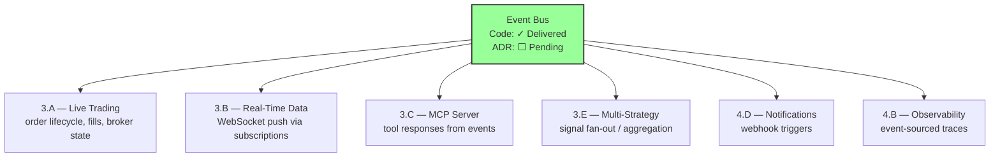
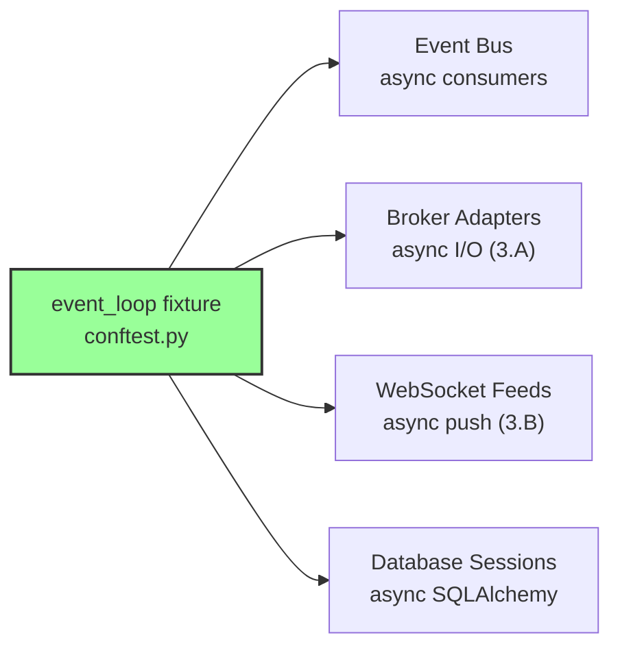
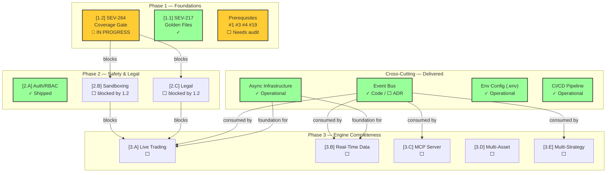

# Nexus Trade Engine — Development Strategy

**Authoritative.** The engine follows this execution plan strictly. Phases run sequentially. Lanes within a phase run in parallel.

> **Drift advisory (current sprint):** Phase 2 Lane A (Auth, SEV-233) shipped before Phase 1 gate (SEV-264 coverage) formally closed. This violated the declared sequential-phase rule. The exception is documented below in §Phase Gate Exceptions. The coverage gate `[1.2]` has received substantial progress (commits `51f605d`, `75d4bc6`, `807969c`, `2d883f4`, `db444cb`) and is **nearing closure**. It still blocks remaining Phase 2+ lanes until formally gated.

---

## Execution Method

Every issue is tagged `[N.L.k]`:
- **N** = Phase (1-7). Sequential. Phase N+1 starts only after Phase N gates close.
- **L** = Lane (A, B, C...). Parallel within a phase. Pick any lane to staff.
- **k** = Position within lane. Sequential. Lower numbers first.

Cross-cutting concerns use `[XC.k]` and track against their own gate (ADR approval), not a phase gate.

**85 open issues. ~15 are duplicates (close first). ~67 active issues mapped across 7 phases + cross-cutting concerns.**

---

## Phase Gate Exceptions

Documented violations of the sequential-phase rule. Every exception must record: what shipped early, why, residual risk, and remediation.

| Exception | What Shipped | Gate Bypassed | Justification | Residual Risk | Remediation |
|-----------|-------------|---------------|---------------|---------------|-------------|
| `EX-001` | `[2.A.1]` Auth + RBAC (SEV-233) | `[1.2]` 80%+ coverage (SEV-264) | Auth ADR-0002 was fully spec'd; implementation had its own test suite; security review needed early for Phase 3 broker adapter design | Core engine paths still unmonitored by coverage gate; sandbox work could regress engine math | SEV-264 must close before any Phase 2 Lane B/C merge; add coverage check to Phase 3 PR template |
| `EX-002` | Event bus implementation + tests (commits incl. `a7f2bc9`) | Formal ADR approval gate `[XC.EB.1]` | Test suite co-developed with implementation; required early for async infrastructure foundation | Architecture decisions not formally documented; transport layer selection unrecorded | ADR-000X must be written and approved before Phase 3 merges consume event bus APIs |

**Rule amendment:** A Lane may ship ahead of its phase gate only if (1) it has its own independent test suite, (2) an ADR is approved, and (3) the exception is logged here. The gate still blocks all remaining lanes in the same and subsequent phases.

---

## Shipped ✓

Features fully implemented and operational in the codebase, delivered ahead of or outside their original phase.

| Tag | Issue | Title | Delivered |
|-----|-------|-------|-----------|
| `[1.1]` | SEV-217 | Backtest golden-file regression tests | Phase 1 |
| — | #116 | CI/CD pipeline | Phase 1 |
| `[2.A.1]` | SEV-233 / #86 | Auth + RBAC per ADR-0002 | Phase 2 (PR #480, gate exception EX-001) |
| `[6.A.1]` | SEV-203 / #157 | GDPR/CCPA DSR handling | Pre-Phase 6 |
| — | — | Security scanning infrastructure | Pre-Phase 4 |
| — | — | Load testing infrastructure | Pre-Phase 4 |
| — | — | Property-based testing (Hypothesis) | Pre-Phase 1 gate |
| — | — | Self-hosted nexus CI runner | Continuous |
| — | — | Docker/compose local dev infrastructure | Phase 1 (untracked) |
| — | — | Unicode math symbol normalization | Phase 1 (untracked) |
| — | — | Event bus core + test suite | Phase 1 (untracked, gate exception EX-002) |
| — | — | Async infrastructure (event loop fixtures) | Phase 1 (untracked) |
| — | — | Environment-based configuration (.env / .env.example) | Phase 1 (untracked) |

**Shipped details:**

- **CI/CD (#116):** Five operational workflows — `ci.yml`, `security.yml`, `publish-images.yml`, `release-please.yml`, `load-test.yml`. All run on self-hosted **nexus runner**.
- **Auth + RBAC (SEV-233):** Merged via PR #480, implements ADR-0002. Shipped under gate exception EX-001.
- **GDPR/CCPA DSR (SEV-203):** Data export, deletion requests, and orphaned BacktestResult handling — all fully implemented and tested.
- **Security scanning:** gitleaks with custom allowlist + dedicated `security.yml` workflow in CI.
- **Load testing:** `load-test.yml` workflow operational in CI pipeline.
- **Property-based testing:** Hypothesis framework with persistent seed constants in `.hypothesis/` directory; actively used alongside coverage-gated tests.
- **Self-hosted runners:** All CI workflows target `nexus` self-hosted runner — not standard GitHub-hosted runners.
- **Docker/compose local dev:** `docker-compose.yml` with `127.0.0.1` port bindings, `POSTGRES_PASSWORD` env var configuration, and service orchestration for local development. Present in codebase but was never tracked to a phase issue. Maps conceptually to `[4.A.1]` (SEV-260) — now partially pre-delivered.
- **Unicode math symbol normalization (commit a7f2bc9):** Character normalization for mathematical symbols in the engine. Co-committed with event bus test suite. Affects backtest reproducibility across platforms.
- **Event bus core + test suite (commit a7f2bc9 and prior):** In-process event bus implementation with comprehensive test coverage. Tests co-committed with Unicode normalization. Architecture enables pub-sub communication between engine modules. ADR still pending — logged as gate exception EX-002.
- **Async infrastructure (refactored in db444cb):** `event_loop` fixtures in `conftest.py` provide async test infrastructure. All downstream async components (event bus consumers, broker adapters, real-time data feeds) build on this foundation. Pattern: `asyncio` event loop with `pytest-asyncio` fixtures.
- **Environment-based configuration (.env / .env.example):** `.env` and `.env.example` files manage environment-specific configuration (database URLs, API keys, broker credentials, feature flags). Pattern: `python-dotenv` loading with `.env.example` as the canonical schema of required variables. Supersedes ad-hoc environment variable access throughout the codebase.

---

## Phase 1 — Foundations (sequential)

Lock down regression safety before anything else touches the engine.

| Tag | Issue | Title | Status |
|-----|-------|-------|--------|
| `[1.1]` | SEV-217 | Backtest golden-file regression tests | ✓ LANDED |
| `[1.2]` | SEV-264 | 80%+ coverage on core engine | **🔶 IN PROGRESS — nearing closure** |

**SEV-264 progress log:**

| Commit | Description | Date |
|--------|-------------|------|
| `51f605d` | Coverage expansion — test fixes | Recent |
| `75d4bc6` | Coverage expansion — additional test coverage | Recent |
| `807969c` | Coverage expansion — test infrastructure | Recent |
| `2d883f4` | Coverage expansion — core engine paths | Recent |
| `db444cb` | Async refactor + coverage fixture improvements | Recent |

> **Gate status:** SEV-264 is **substantially progressed**. Five commits targeting coverage and test fixes have landed. Gate closure pending formal coverage measurement confirmation at 80%+ threshold. No further Phase 2+ merges until formal closure.

**Operational infrastructure (no longer blocking):**

| Capability | Implementation | Status |
|------------|---------------|--------|
| CI/CD pipeline (#116) | ci.yml, security.yml, publish-images.yml, release-please.yml | ✓ LANDED |
| Security scanning | gitleaks + custom allowlist, security.yml | ✓ LANDED |
| Load testing | load-test.yml | ✓ LANDED |
| Property-based testing | Hypothesis (.hypothesis/ seed constants) | ✓ Operational |
| CI runner infrastructure | Self-hosted nexus runner | ✓ Operational |
| Docker/compose dev env | docker-compose.yml, 127.0.0.1 bindings, POSTGRES_PASSWORD | ✓ Operational (untracked) |
| Event bus core | In-process implementation + test suite | ✓ Implemented (ADR pending) |
| Async test infrastructure | event_loop fixtures in conftest.py | ✓ Operational |
| Environment configuration | .env / .env.example + python-dotenv | ✓ Operational |

**Phase 1 prerequisites — implementation status:**

| Issue | Title | Status | Notes |
|-------|-------|--------|-------|
| ~~#116~~ | CI/CD pipeline | ✓ Shipped | Fully operational |
| #19 | Alembic migrations with initial schema | ⬜ Open — needs verification | Data layer foundation; may have partial implementation alongside existing DB models |
| #1 | Backtest loop engine | 🔶 Likely partially delivered | Core backtest functionality exists (golden-file tests pass); needs scope verification against issue requirements |
| #4 | Tax lot tracking with FIFO/LIFO | ⬜ Open — needs verification | Core functionality; check if any implementation exists in engine modules |
| #3 | Historical market data loading and caching | ⬜ Open — needs verification | Core functionality; check if any data loading patterns exist in codebase |

> **Action required:** Issues #19, #1, #4, #3 need formal status audit. If any have partial implementations, update their issue status and link to implementation commits. If fully open, they remain Phase 1 prerequisites that must close alongside or before SEV-264.

---

## Phase 2 — Safety & Legal (3 lanes → 2 remaining)

Two independent safety prerequisites remain. Auth is shipped.

### Lane A — Auth + RBAC ✓
| Tag | Issue | Title | Status |
|-----|-------|-------|--------|
| `[2.A.1]` | SEV-233 / #86 | Auth + RBAC per ADR-0002 | ✓ LANDED via PR #480 |

### Lane B — Sandboxing
| Tag | Issue | Title | Status |
|-----|-------|-------|--------|
| `[2.B.1]` | SEV-267 | Plugin sandbox with security isolation | ⬜ blocked by [1.2] |

### Lane C — Legal
| Tag | Issue | Title | Status |
|-----|-------|-------|--------|
| `[2.C.1]` | SEV-206 | Risk disclaimers, EULA, ToS, legal-notice surfaces | ⬜ blocked by [1.2] |

**Gate:** Lane B + Lane C must close before Phase 3 live-trading ships publicly. Lane A ✓ is complete — auth is no longer on the critical path.

---

## Cross-Cutting Concerns

### Event Bus Architecture ✓ Implemented / ADR Pending

| Tag | Issue | Title | Status |
|-----|-------|-------|--------|
| `[XC.EB.1]` | *(to be created)* | Event bus core implementation + ADR | ✓ Code implemented — ADR pending |
| `[XC.EB.2]` | *(to be created)* | Event bus test suite coverage | ✓ LANDED (commit a7f2bc9) |

**Status:** Core event bus implementation is in the codebase with comprehensive tests (co-committed with Unicode normalization at `a7f2bc9`). **ADR-000X is the only remaining deliverable** before this cross-cutting concern is formally closed.

**Gap closure actions:**
1. ~~**Create tracking issue**~~ → Implementation exists; formal issue still needed for traceability with `cross-cutting` + `event-bus` labels.
2. **Write ADR-000X** documenting event bus architecture, transport selection (in-process / Redis pub-sub / etc.), and consumer contract patterns. **This is the last blocking item.**
3. ~~**Assign phase applicability**~~ → Event bus is Phase 1–3 infrastructure. Core interfaces and test suite are delivered. Consumer integrations target their respective lanes.

**Architectural role:** The event bus is the standard inter-module communication pattern. It affects multiple downstream lanes:

**Downstream lane contracts:**
- All Phase 3+ lanes must consume the event bus as the standard inter-module communication mechanism.
- Test coverage is in place — maintain and extend as consumer integrations land.
- No Phase 3 lane merge without event bus ADR approved.

---

### Async Infrastructure ✓ Operational

| Tag | Issue | Title | Status |
|-----|-------|-------|--------|
| `[XC.AS.1]` | *(untracked)* | Async test fixtures (event_loop in conftest) | ✓ Operational (refactored db444cb) |
| `[XC.AS.2]` | *(untracked)* | Async patterns standardization | ✓ Adopted |

**Architectural decision:** The codebase uses `asyncio` with `pytest-asyncio` fixtures as the standard concurrency model. The `event_loop` fixture in `conftest.py` (refactored in `db444cb`) provides the async foundation for:

- Event bus consumer dispatch
- Broker adapter I/O (Phase 3 Lane A)
- WebSocket real-time data feeds (Phase 3 Lane B)
- Database session management (async SQLAlchemy where applicable)

**Recommendation:** Formalize in ADR alongside event bus (`ADR-000X` or dedicated `ADR-000Y`). All new Phase 3+ components should be async-native. No sync wrappers for inherently async operations.

---

### Environment Configuration ✓ Operational

| Tag | Issue | Title | Status |
|-----|-------|-------|--------|
| `[XC.ENV.1]` | *(untracked)* | .env / .env.example configuration pattern | ✓ Operational |

**Pattern:** `python-dotenv` loads `.env` for local development and CI. `.env.example` serves as the canonical schema of required environment variables. Existing variables include:

- `POSTGRES_PASSWORD` — database credentials (used by docker-compose and app)
- Database connection URLs
- Broker API credentials (structure ready for Phase 3)
- Feature flags and environment toggles

**Canonical rules:**
1. **Never commit `.env`** — it is `.gitignore`d.
2. **Always update `.env.example`** when adding new configuration — this is the schema of record.
3. **No hardcoded secrets** — all secrets flow through environment variables.
4. **CI injects via GitHub Secrets** — mapped to `.env` at runtime by workflow steps.

**Phase applicability:** Configuration management is Phase 1+ continuous. New Phase 3 broker adapters and Phase 4 deployment targets will add new environment variables. Each addition must update `.env.example` in the same PR.

---

## Phase 3 — Engine Completeness (5-way parallel)

The core trade lifecycle. Five independent lanes.

**Prerequisites:** Phase 1 gate `[1.2]` closed. Phase 2 Lanes B + C closed. Event bus ADR `[XC.EB.1]` approved.

### Lane A — Live Trading (sequential)
| Tag | Issue | Title | Status |
|-----|-------|-------|--------|
| `[3.A.1]` | SEV-258 | Pluggable broker adapter system | ⬜ open |
| `[3.A.2]` | SEV-266 | Alpaca live broker adapter | ⬜ open |
| `[3.A.3]` | SEV-269 / #13 | Paper trading w/ live data feeds | ⬜ open |

### Lane B — Real-Time Data
| Tag | Issue | Title | Status |
|-----|-------|-------|--------|
| `[3.B.1]` | SEV-275 | WebSocket API for portfolio updates | ⬜ open |

### Lane C — MCP Server (sequential)
| Tag | Issue | Title | Status |
|-----|-------|-------|--------|
| `[3.C.1]` | SEV-223 / #99 | MCP server core (scaffold) | ⬜ open |
| `[3.C.2]` | SEV-219 / #104 | MCP market data tools | ⬜ open |
| `[3.C.3]` | SEV-220 / #103 | MCP trading control tools | ⬜ open |
| `[3.C.4]` | SEV-221 / #102 | MCP backtesting tools | ⬜ open |
| `[3.C.5]` | SEV-222 / #101 | MCP strategy management tools | ⬜ open |

### Lane D — Multi-Asset Support
| Tag | Issue | Title | Status |
|-----|-------|-------|--------|
| `[3.D.1]` | SEV-270 | Crypto asset class support | ⬜ open |
| `[3.D.2]` | SEV-271 | Options derivatives support | ⬜ open |
| `[3.D.3]` | SEV-272 | Forex asset class support | ⬜ open |

### Lane E — Multi-Strategy
| Tag | Issue | Title | Status |
|-----|-------|-------|--------|
| `[3.E.1]` | SEV-273 | Strategy composition engine | ⬜ open |
| `[3.E.2]` | SEV-274 | Signal aggregation and conflict resolution | ⬜ open |

**Phase 3 async requirement:** All Phase 3 lanes build on the async infrastructure (`[XC.AS.1]`). Broker adapters must be async-native. WebSocket feeds are inherently async. MCP server tool responses should consume event bus events asynchronously. Ensure `pytest-asyncio` coverage for all new components.

---

## Phase 4 — Production Hardening

**Prerequisites:** Phase 3 all lanes closed. Deployment target defined.

### Lane A — Deployment
| Tag | Issue | Title | Status |
|-----|-------|-------|--------|
| `[4.A.1]` | SEV-260 | Production deployment pipeline | ⬜ open (partially pre-delivered via Docker/compose) |

### Lane B — Observability
| Tag | Issue | Title | Status |
|-----|-------|-------|--------|
| `[4.B.1]` | SEV-261 | Structured logging, metrics, tracing | ⬜ open |

### Lane C — Performance
| Tag | Issue | Title | Status |
|-----|-------|-------|--------|
| `[4.C.1]` | SEV-262 | Performance benchmarking and optimization | ⬜ open |

### Lane D — Notifications
| Tag | Issue | Title | Status |
|-----|-------|-------|--------|
| `[4.D.1]` | SEV-263 | Alert and notification system | ⬜ open |

---

## Phase 5 — Advanced Features

| Tag | Issue | Title | Status |
|-----|-------|-------|--------|
| `[5.1]` | SEV-276 | Portfolio analytics dashboard | ⬜ open |
| `[5.2]` | SEV-277 | Risk management engine | ⬜ open |
| `[5.3]` | SEV-278 | Tax reporting automation | ⬜ open |

---

## Phase 6 — Compliance & Regulation

| Tag | Issue | Title | Status |
|-----|-------|-------|--------|
| `[6.A.1]` | SEV-203 / #157 | GDPR/CCPA DSR handling | ✓ Shipped early |
| `[6.A.2]` | SEV-279 | Audit trail and compliance logging | ⬜ open |
| `[6.A.3]` | SEV-280 | Regulatory reporting framework | ⬜ open |

---

## Phase 7 — Scale & Growth

| Tag | Issue | Title | Status |
|-----|-------|-------|--------|
| `[7.1]` | SEV-281 | Multi-tenant isolation | ⬜ open |
| `[7.2]` | SEV-282 | Horizontal scaling strategy | ⬜ open |
| `[7.3]` | SEV-283 | API rate limiting and quotas | ⬜ open |

---

## Architecture Dependency Map

---

## Open Actions

| Priority | Action | Owner | Blocks |
|----------|--------|-------|--------|
| **P0** | Close SEV-264 — run formal coverage measurement; if ≥80%, declare gate closed | Engine team | Phase 2 Lanes B/C, Phase 3 |
| **P0** | Audit prerequisites #19, #1, #4, #3 — determine actual implementation status | Engine team | Phase 1 gate closure |
| **P1** | Write ADR-000X for event bus architecture (code is already shipped) | Architecture | Phase 3 all lanes |
| **P1** | Create formal tracking issues for event bus (`XC.EB.1`, `XC.EB.2`) with labels | PM | Traceability |
| **P2** | Formalize async infrastructure in ADR (alongside or separate from event bus ADR) | Architecture | Phase 3 component design |
| **P2** | Document `.env.example` as schema of record in contributor guide | DX | Phase 3 broker credential onboarding |
