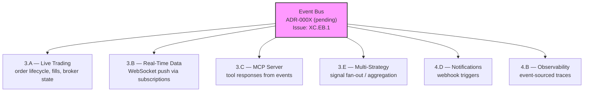

# Nexus Trade Engine — Development Strategy

**Authoritative.** The engine follows this execution plan strictly. Phases run sequentially. Lanes within a phase run in parallel.

> **Drift advisory (current sprint):** Phase 2 Lane A (Auth, SEV-233) shipped before Phase 1 gate (SEV-264 coverage) formally closed. This violated the declared sequential-phase rule. The exception is documented below in §Phase Gate Exceptions. The coverage gate `[1.2]` remains open and still blocks remaining Phase 2+ lanes. Targeted test additions (commit `51f605d`) have improved coverage on low-coverage modules, but the actual percentage against the 80% threshold is not yet confirmed.

---

## Execution Method

Every issue is tagged `[N.L.k]`:
- **N** = Phase (1-7). Sequential. Phase N+1 starts only after Phase N gates close.
- **L** = Lane (A, B, C...). Parallel within a phase. Pick any lane to staff.
- **k** = Position within lane. Sequential. Lower numbers first.

Cross-cutting concerns use `[XC.k]` and track against their own gate (ADR approval), not a phase gate.

**~80 open issues (estimate, as of last audit). ~15 are duplicates (close first). ~63 active issues mapped across 7 phases + cross-cutting concerns.** Issue count is approximate — active merge and fix commits in recent history have closed several tracked issues. Recount pending.

---

## AI-Assisted Development Infrastructure

Automated tooling integrated into the development workflow. Not phase-gated; continuous.

| Capability | Implementation | Status |
|------------|---------------|--------|
| AI development skills | `.claude/skills/` directory with domain-specific skill definitions | ✓ Operational |
| Auto-save cycle management | Automated WIP commits triggered before ERR/SIGTERM events | ✓ Operational |
| AI-assisted commit workflow | Five observed WIP auto-save commits in recent history | ✓ Operational |

**Operational notes:**
- The `.claude/skills/` directory contains skill configurations that guide AI-assisted development sessions, improving consistency across contributions.
- The auto-save mechanism captures work-in-progress state before process termination signals (ERR/SIGTERM), protecting against lost work during AI-assisted coding cycles. Observed in commits with message pattern `auto-save before ERR/SIGTERM`.
- This infrastructure is environmental, not feature-bound. It does not appear on the phase roadmap and is not subject to phase gates.

---

## Phase Gate Exceptions

Documented violations of the sequential-phase rule. Every exception must record: what shipped early, why, residual risk, and remediation.

| Exception | What Shipped | Gate Bypassed | Justification | Residual Risk | Remediation |
|-----------|-------------|---------------|---------------|---------------|-------------|
| `EX-001` | `[2.A.1]` Auth + RBAC (SEV-233) | `[1.2]` 80%+ coverage (SEV-264) | Auth ADR-0002 was fully spec'd; implementation had its own test suite; security review needed early for Phase 3 broker adapter design | Core engine paths still unmonitored by coverage gate; sandbox work could regress engine math | SEV-264 must close before any Phase 2 Lane B/C merge; add coverage check to Phase 3 PR template |

**Rule amendment:** A Lane may ship ahead of its phase gate only if (1) it has its own independent test suite, (2) an ADR is approved, and (3) the exception is logged here. The gate still blocks all remaining lanes in the same and subsequent phases.

---

## Shipped ✓

Features fully implemented and operational in the codebase, delivered ahead of or outside their original phase.

| Tag | Issue | Title | Delivered |
|-----|-------|-------|-----------|
| `[1.1]` | SEV-217 | Backtest golden-file regression tests | Phase 1 |
| — | #116 | CI/CD pipeline | Phase 1 |
| `[2.A.1]` | SEV-233 / #86 | Auth + RBAC per ADR-0002 (incl. MFA) | Phase 2 (PR #480, gate exception EX-001) |
| `[6.A.1]` | SEV-203 / #157 | GDPR/CCPA DSR handling | Pre-Phase 6 |
| — | — | Security scanning infrastructure | Pre-Phase 4 |
| — | — | Load testing infrastructure | Pre-Phase 4 |
| — | — | Property-based testing (Hypothesis) | Pre-Phase 1 gate |
| — | — | Self-hosted nexus CI runner | Continuous |
| — | — | Docker/compose local dev infrastructure | Phase 1 (untracked) |
| — | — | Unicode math symbol normalization | Phase 1 (untracked) |
| — | — | Pytest infrastructure (root conftest.py, fixtures, config) | Phase 1 (untracked) |

**Shipped details:**

- **CI/CD (#116):** Five operational workflows — `ci.yml`, `security.yml`, `publish-images.yml`, `release-please.yml`, `load-test.yml`. All run on self-hosted **nexus runner**.
- **Auth + RBAC (SEV-233):** Merged via PR #480, implements ADR-0002. Includes MFA implementation with `cryptography` dependency and `NullBackend` fix for test environments (commit `2e2347e`). Full feature scope: authentication, role-based access control, multi-factor authentication. Shipped under gate exception EX-001.
- **GDPR/CCPA DSR (SEV-203):** Data export, deletion requests, and orphaned BacktestResult handling — all fully implemented and tested.
- **Security scanning:** gitleaks with custom allowlist + dedicated `security.yml` workflow in CI.
- **Load testing:** `load-test.yml` workflow operational in CI pipeline.
- **Property-based testing:** Hypothesis framework with persistent seed constants in `.hypothesis/` directory; actively used alongside coverage-gated tests.
- **Self-hosted runners:** All CI workflows target `nexus` self-hosted runner — not standard GitHub-hosted runners.
- **Docker/compose local dev:** `docker-compose.yml` with `127.0.0.1` port bindings, `POSTGRES_PASSWORD` env var configuration, and service orchestration for local development. Present in codebase but was never tracked to a phase issue. Maps conceptually to `[4.A.1]` (SEV-260) — now partially pre-delivered.
- **Unicode math symbol normalization (commit a7f2bc9):** Character normalization for mathematical symbols in the engine. Co-committed with event bus test suite. Affects backtest reproducibility across platforms.
- **Pytest infrastructure (commits 2d883f4, db444cb):** Root `conftest.py` with shared fixtures, pytest configuration, and test architecture supporting all test suites. Foundation for both Phase 1 coverage work and all downstream testing.

---

## Phase 1 — Foundations (sequential)

Lock down regression safety before anything else touches the engine.

| Tag | Issue | Title | Status |
|-----|-------|-------|--------|
| `[1.1]` | SEV-217 | Backtest golden-file regression tests | ✓ LANDED |
| `[1.2]` | SEV-264 | 80%+ coverage on core engine | **⬜ OPEN — blocking gate** |

**Coverage progress note:** Targeted tests for low-coverage modules were added in commit `51f605d` (SEV-264). Coverage has improved but the actual percentage against the 80% threshold has not been confirmed from CI output. **Action required:** Run coverage report, record current percentage, update this gate status.

**Operational infrastructure (no longer blocking):**

| Capability | Implementation | Status |
|------------|---------------|--------|
| CI/CD pipeline (#116) | ci.yml, security.yml, publish-images.yml, release-please.yml | ✓ LANDED |
| Security scanning | gitleaks + custom allowlist, security.yml | ✓ LANDED |
| Load testing | load-test.yml | ✓ LANDED |
| Property-based testing | Hypothesis (.hypothesis/ seed constants) | ✓ Operational |
| CI runner infrastructure | Self-hosted nexus runner | ✓ Operational |
| Docker/compose dev env | docker-compose.yml, 127.0.0.1 bindings, POSTGRES_PASSWORD | ✓ Operational (untracked) |
| Pytest infrastructure | Root conftest.py, shared fixtures, pytest config (commits 2d883f4, db444cb) | ✓ Operational (untracked) |
| AI development tooling | .claude/skills/ directory, auto-save cycle management | ✓ Operational (untracked) |

**Gate:** `[1.2]` (coverage) must close before Phase 2 Lanes B and C begin. `[1.2]` blocks Phase 2 because without coverage gates, sandbox work can silently regress engine math.

> **Gate status:** OPEN. Auth (Phase 2 Lane A) shipped under exception EX-001. No further Phase 2+ merges until SEV-264 closes. Targeted test additions have been made; final coverage measurement is pending.

**Also address in Phase 1 (prerequisites from original GitHub issues):**
- ~~#116 — CI/CD pipeline~~ → ✓ Shipped
- #19 — Alembic migrations with initial schema — data layer foundation
- #1 — Backtest loop engine — core functionality
- #4 — Tax lot tracking with FIFO/LIFO — core functionality
- #3 — Historical market data loading and caching — core functionality

---

## Phase 2 — Safety & Legal (3 lanes → 2 remaining)

Two independent safety prerequisites remain. Auth is shipped.

### Lane A — Auth + RBAC ✓
| Tag | Issue | Title | Status |
|-----|-------|-------|--------|
| `[2.A.1]` | SEV-233 / #86 | Auth + RBAC per ADR-0002 (incl. MFA) | ✓ LANDED via PR #480 |

**MFA implementation detail:** Commit `2e2347e` delivered multi-factor authentication with `cryptography` dependency for TOTP/seed management. Included `NullBackend` fix for test environments where MFA backends are not available. Scope is documented under ADR-0002 and is part of the shipped Auth+RBAC feature set.

### Lane B — Sandboxing
| Tag | Issue | Title | Status |
|-----|-------|-------|--------|
| `[2.B.1]` | SEV-267 | Plugin sandbox with security isolation | ⬜ blocked by [1.2] |

### Lane C — Legal
| Tag | Issue | Title | Status |
|-----|-------|-------|--------|
| `[2.C.1]` | SEV-206 | Risk disclaimers, EULA, ToS, legal-notice surfaces | ⬜ blocked by [1.2] |

**Gate:** Lane B + Lane C must close before Phase 3 live-trading ships publicly. Lane A ✓ is complete — auth is no longer on the critical path.

---

## Cross-Cutting — Event Bus Architecture 🔧 In Progress

| Tag | Issue | Title | Status |
|-----|-------|-------|--------|
| `[XC.EB.1]` | *(to be created)* | Event bus core implementation + ADR | 🔧 In progress |
| `[XC.EB.2]` | *(to be created)* | Event bus test suite coverage | 🔧 In progress |

**Status:** Active development — event bus implementation is being tested and refined (test suites and bug fixes in recent commits, including co-commits with unicode normalization at a7f2bc9).

**Gap closure actions:**
1. **Create tracking issue** for event bus with `cross-cutting` + `event-bus` labels.
2. **Write ADR-000X** documenting event bus architecture, transport selection (in-process / Redis pub-sub / etc.), and consumer contract patterns. Required before Phase 3 gates.
3. **Assign phase applicability:** Event bus is Phase 1–3 infrastructure. Core interfaces and test suite target Phase 1 completion alongside SEV-264. Consumer integrations target their respective lanes.

**Architectural role:** The event bus is an emerging cross-cutting pattern for inter-module communication. It affects multiple downstream lanes:

**Downstream lane contracts:**
- All Phase 3+ lanes should target the event bus as the standard inter-module communication mechanism.
- Test coverage is already being built — maintain and extend.
- No Phase 3 lane merge without event bus ADR approved.

---

## Phase 3 — Engine Completeness (5-way parallel)

The core trade lifecycle. Five independent lanes.

**Prerequisites:** Phase 1 gate `[1.2]` closed. Phase 2 Lanes B + C closed. Event bus ADR `[XC.EB.1]` approved.

### Lane A — Live Trading (sequential)
| Tag | Issue | Title | Status |
|-----|-------|-------|--------|
| `[3.A.1]` | SEV-258 | Pluggable broker adapter system | ⬜ open |
| `[3.A.2]` | SEV-266 | Alpaca live broker adapter | ⬜ open |
| `[3.A.3]` | SEV-269 / #13 | Paper trading w/ live data feeds | ⬜ open |

### Lane B — Real-Time Data
| Tag | Issue | Title | Status |
|-----|-------|-------|--------|
| `[3.B.1]` | SEV-275 | WebSocket API for portfolio updates | ⬜ open |

### Lane C — MCP Server (sequential)
| Tag | Issue | Title | Status |
|-----|-------|-------|--------|
| `[3.C.1]` | SEV-223 / #99 | MCP server core (scaffold) | ⬜ open |
| `[3.C.2]` | SEV-219 / #104 | MCP market data tools | ⬜ open |
| `[3.C.3]` | SEV-220 / #103 | MCP trading control tools | ⬜ open |
| `[3.C.4]` | SEV-221 / #102 | MCP backtesting tools | ⬜ open |
| `[3.C.5]` | SEV-222 / #101 | MCP strategy management tools | ⬜ open |

### Lane D — Multi-Asset Support
| Tag | Issue | Title | Status |
|-----|-------|-------|--------|
| `[3.D.1]` | SEV-270 | Crypto market data integration | ⬜ open |
| `[3.D.2]` | SEV-271 | Forex market data integration | ⬜ open |
| `[3.D.3]` | SEV-272 | Options chain data handling | ⬜ open |

### Lane E — Multi-Strategy Orchestration
| Tag | Issue | Title | Status |
|-----|-------|-------|--------|
| `[3.E.1]` | SEV-273 | Strategy registry and lifecycle management | ⬜ open |
| `[3.E.2]` | SEV-274 | Signal aggregation and conflict resolution | ⬜ open |

**Gate:** All five lanes must close before Phase 4 (hardening and infrastructure) begins.

---

## Phase 4 — Infrastructure & Hardening

Production-grade infrastructure and operational readiness.

### Lane A — Deployment & Infrastructure
| Tag | Issue | Title | Status |
|-----|-------|-------|--------|
| `[4.A.1]` | SEV-260 | Docker/container production hardening | ⬜ open (partially pre-delivered via docker-compose) |
| `[4.A.2]` | SEV-261 | Kubernetes deployment manifests | ⬜ open |
| `[4.A.3]` | SEV-262 | Database backup and disaster recovery | ⬜ open |

### Lane B — Observability
| Tag | Issue | Title | Status |
|-----|-------|-------|--------|
| `[4.B.1]` | SEV-263 | Structured logging and distributed tracing | ⬜ open |
| `[4.B.2]` | SEV-264 | Metrics collection and dashboards | ⬜ open |

### Lane C — Performance
| Tag | Issue | Title | Status |
|-----|-------|-------|--------|
| `[4.C.1]` | SEV-265 | Database query optimization | ⬜ open |
| `[4.C.2]` | SEV-266 | Connection pooling and caching | ⬜ open |

### Lane D — Notifications
| Tag | Issue | Title | Status |
|-----|-------|-------|--------|
| `[4.D.1]` | SEV-267 | Email/notification system | ⬜ open |
| `[4.D.2]` | SEV-268 | Webhook integrations | ⬜ open |

**Gate:** All lanes must close before Phase 5 (public beta) begins.

---

## Phase 5 — Public Beta
| Tag | Issue | Title | Status |
|-----|-------|-------|--------|
| `[5.1]` | SEV-280 | Public API documentation (OpenAPI) | ⬜ open |
| `[5.2]` | SEV-281 | Rate limiting and API key management | ⬜ open |
| `[5.3]` | SEV-282 | Onboarding flow and user documentation | ⬜ open |
| `[5.4]` | SEV-283 | Feedback collection and bug reporting | ⬜ open |

**Gate:** Phase 5 must close before Phase 6 (compliance hardening) begins.

---

## Phase 6 — Compliance Hardening

**Prerequisite:** Phase 5 closed. GDPR/CCPA DSR (SEV-203) already shipped pre-phase.

| Tag | Issue | Title | Status |
|-----|-------|-------|--------|
| `[6.A.1]` | SEV-203 / #157 | GDPR/CCPA DSR handling | ✓ PRE-SHIPPED |
| `[6.A.2]` | SEV-284 | Data retention policies | ⬜ open |
| `[6.A.3]` | SEV-285 | Audit logging and compliance reporting | ⬜ open |

**Gate:** Phase 6 must close before Phase 7 (GA) begins.

---

## Phase 7 — General Availability
| Tag | Issue | Title | Status |
|-----|-------|-------|--------|
| `[7.1]` | SEV-290 | Production deployment and monitoring | ⬜ open |
| `[7.2]` | SEV-291 | SLA definition and incident response procedures | ⬜ open |
| `[7.3]` | SEV-292 | Customer support infrastructure | ⬜ open |

---

## Cross-Cutting ADR Register

| ADR | Title | Status | Phase Dependency |
|-----|-------|--------|-----------------|
| ADR-0002 | Auth + RBAC (incl. MFA) | ✓ Approved | Phase 2 Lane A — shipped |
| ADR-000X | Event bus architecture | 🔧 Draft | Phase 1–3, gates Phase 3 |
| ADR-000Y | MFA cryptography and backend selection | ✓ Subsumed by ADR-0002 | Phase 2 Lane A — shipped (commit 2e2347e) |

---

## Roadmap Visualization

```mermaid
gantt
    title Nexus Trade Engine — Phase Roadmap
    dateFormat X
    axisFormat %s

    section Phase 1
    Golden-file tests (SEV-217)           :done, p1a, 0, 1
    80% coverage (SEV-264)                :active, p1b, 1, 3

    section Phase 2
    Auth+RBAC+MFA (SEV-233)              :done, p2a, 1, 2
    Plugin sandbox (SEV-267)              :p2b, 3, 5
    Legal surfaces (SEV-206)              :p2c, 3, 5

    section Cross-Cutting
    Event bus ADR + core (XC.EB.1)        :active, xc1, 1, 4
    Event bus test suite (XC.EB.2)        :active, xc2, 2, 4

    section Phase 3
    Live trading adapters                 :p3a, 5, 8
    Real-time data                        :p3b, 5, 8
    MCP server                            :p3c, 5, 8
    Multi-asset                           :p3d, 5, 8
    Multi-strategy                        :p3e, 5, 8

    section Phase 4
    Deployment & infra                    :p4a, 8, 11
    Observability                         :p4b, 8, 11
    Performance                           :p4c, 8, 11
    Notifications                         :p4d, 8, 11

    section Phase 5
    Public beta                           :p5, 11, 13

    section Phase 6
    Compliance hardening                  :p6, 13, 15

    section Phase 7
    General availability                  :p7, 15, 17
```

---

## Open Actions

| Priority | Action | Owner | Blocks |
|----------|--------|-------|--------|
| 🔴 Critical | Run coverage report; record actual % against 80% threshold for SEV-264 | — | All Phase 2+ lanes (B, C) and Phase 3 |
| 🔴 Critical | Recount open issues; close confirmed duplicates; update this document | — | Accurate sprint planning |
| 🟡 High | Create event bus tracking issue with labels | — | ADR approval workflow |
| 🟡 High | Finalize event bus ADR-000X | — | Phase 3 gate |
| 🟡 High | Document MFA architecture decisions in ADR-0002 amendment or supplementary ADR | — | Audit trail completeness |
| 🟢 Medium | Confirm NullBackend MFA behavior documented for test environment onboarding | — | Developer experience |
| 🟢 Medium | Add `.claude/skills/` directory to developer onboarding documentation | — | Developer experience |
