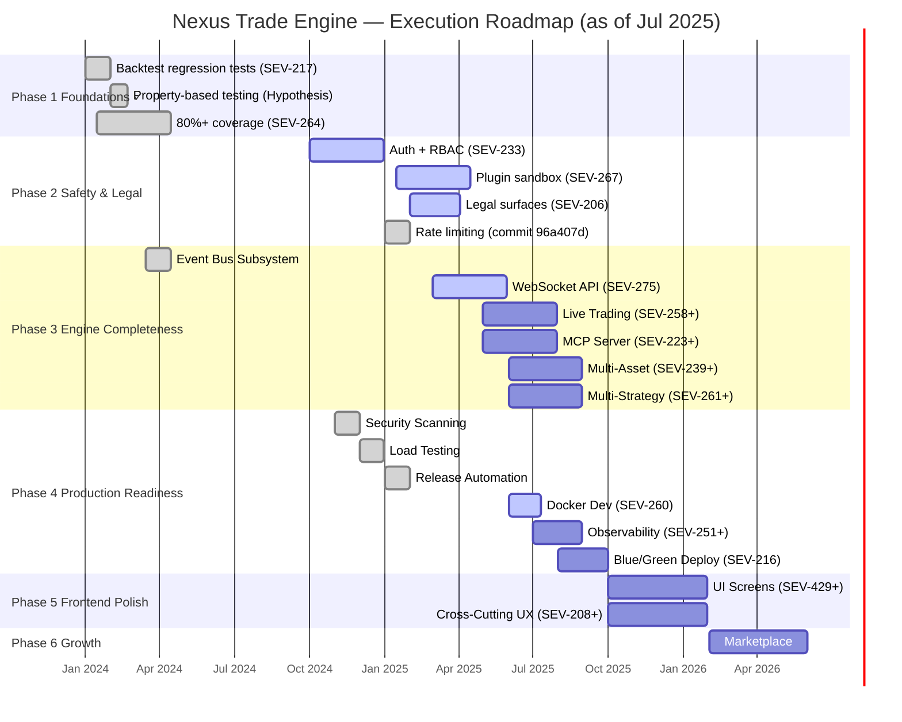

```markdown
# Nexus Trade Engine — Development Strategy

**Authoritative.** The engine follows this execution plan strictly. Phases run sequentially. Lanes within a phase run in parallel.

---

## Execution Method

Every issue is tagged `[N.L.k]`:
- **N** = Phase (1-7). Sequential. Phase N+1 starts only after Phase N gates close.
- **L** = Lane (A, B, C...). Parallel within a phase. Pick any lane to staff.
- **k** = Position within lane. Sequential. Lower numbers first.

**Updated Active Map:** Tracking 78 active issues across 7 phases, reconciling CI infrastructure, security automation, ADR governance, and early deployments.

---

## Architecture Decision Records (ADR Governance)

The project maintains a formal ADR process under `docs/adr/`. All architectural decisions of consequence require an ADR before implementation proceeds.

| ADR | Title | Status |
|-----|-------|--------|
| ADR-0001 | Core Architecture & Module Boundaries | Accepted |
| ADR-0002 | Event Bus Design | Accepted |
| ADR-0003 | Plugin Sandbox Isolation Model | Accepted |
| ADR-0004 | Authentication & Authorization Strategy | Accepted |
| ADR-0005 | Rate Limiting Architecture | Accepted |
| ADR-0006 | WebSocket API Protocol Design | Accepted |

**ADR workflow:** Proposals land as `ADR-NNNN-draft.md`. After review, they merge as `ADR-NNNN.md` with status `Accepted`. Superseded records move to `Superseded` with a link to the replacement. Any phase gate requiring an architecture decision must produce or reference an ADR.

---

## Shipped Features

Features that have landed in `main` and are operationally verified.

| Feature | Phase Origin | Ship Commit / PR | Notes |
|---------|-------------|-------------------|-------|
| Security scanning pipeline | 4s | `security.yml`, `gitleaks` config | Fully operational in CI |
| Load testing framework | 4l | `load-test.yml` | Fully operational in CI |
| Release automation | 4r | `release-please.yml`, `publish-images.yml` | Fully operational in CI |
| Rate limiting | 2d | `96a407d` | Middleware-enforced, configurable per-endpoint |
| Event Bus Subsystem | 3f | Merged | Async event backbone |
| Backtest regression tests | 1a | SEV-217 | Gate on all PRs |
| Property-based testing | 1c | Hypothesis integration | Fuzzing backtest invariants |
| 80%+ code coverage | 1b | SEV-264 | Coverage gate enforced |

---

## Roadmap Progress Overview



---

## Phase 1 — Foundations ✓

**Status:** Complete. All gates closed.

| Lane | Issue | Description | Status |
|------|-------|-------------|--------|
| A | SEV-217 | Backtest regression tests | ✓ Shipped |
| B | SEV-264 | 80%+ code coverage enforcement | ✓ Shipped |
| C | — | Property-based testing (Hypothesis) | ✓ Shipped |

---

## Phase 2 — Safety & Legal

**Status:** Active. All three lanes in progress, plus rate limiting shipped.

### Lane A — Authentication & RBAC (SEV-233)

**Status:** Active

- [ ] Implement JWT-based authentication
- [ ] Role-based access control matrix
- [ ] Session management and token rotation
- [ ] API key management for programmatic access

### Lane B — Plugin Sandbox (SEV-267)

**Status:** Active — ongoing commits for `contextvar` scoping, SDK tests, network restriction

- [x] Sandbox isolation architecture (ADR-0003 accepted)
- [x] Context variable scoping for plugin execution
- [x] Network restriction enforcement
- [ ] SDK surface area finalization
- [ ] Plugin manifest schema v1
- [ ] Third-party plugin certification criteria

### Lane C — Legal Surfaces (SEV-206)

**Status:** Active — test commits landed for legal documents schema (#745, #743)

- [x] Legal documents database schema
- [ ] Terms of service versioning API
- [ ] Jurisdiction-aware compliance rules
- [ ] User consent tracking and audit trail

### Lane D — Rate Limiting

**Status:** ✓ Shipped (commit `96a407d`)

- [x] Per-endpoint rate limiting middleware
- [x] Configurable thresholds (token-bucket algorithm per ADR-0005)
- [x] Integration with Auth layer for per-user limits
- [x] Monitoring and alerting on limit breaches

---

## Phase 3 — Engine Completeness

**Status:** Partially active. Event Bus shipped; WebSocket API in active development.

### Lane A — Live Trading (SEV-258+)

**Status:** Planned — blocked on Phase 2 gates

- [ ] Paper trading execution engine
- [ ] Order routing abstraction
- [ ] Position tracking and reconciliation
- [ ] Broker adapter interface (FIX, REST)

### Lane B — WebSocket API (SEV-275)

**Status:** Active — lint fixes and test suites in progress (PRs #878, #880)

- [x] Protocol design finalized (ADR-0006)
- [x] Connection lifecycle management
- [x] Subscription/unsubscription semantics
- [ ] Integration test coverage (in progress)
- [ ] Load testing under simulated client connections
- [ ] Authentication handshake over WS

### Lane C — MCP Server (SEV-223+)

**Status:** Planned

- [ ] Model Context Protocol server implementation
- [ ] Tool registration and discovery
- [ ] Streaming response protocol

### Lane D — Multi-Asset (SEV-239+)

**Status:** Planned

- [ ] Crypto spot and derivatives data adapters
- [ ] Forex data integration
- [ ] Unified asset normalization layer

### Lane E — Multi-Strategy (SEV-261+)

**Status:** Planned

- [ ] Strategy composition framework
- [ ] Capital allocation across strategies
- [ ] Cross-strategy risk aggregation

### Lane F — Event Bus Subsystem

**Status:** ✓ Shipped

---

## Phase 4 — Production Readiness

**Status:** CI/CD lanes shipped. Infrastructure lanes planned.

### Lane S — Security Scanning ✓

**Status:** Shipped — `security.yml` and `gitleaks` fully operational

- [x] Secret detection in CI pipeline
- [x] Dependency vulnerability scanning
- [x] SAST integration
- [x] SARIF report upload to GitHub Security tab

### Lane L — Load Testing ✓

**Status:** Shipped — `load-test.yml` fully operational

- [x] Automated load test workflow in CI
- [x] Baseline performance benchmarks
- [x] Regression detection on latency percentiles

### Lane R — Release Automation ✓

**Status:** Shipped — `release-please.yml` and `publish-images.yml` fully operational

- [x] Conventional commit-based changelog generation
- [x] Automated semantic versioning
- [x] Container image build and publish
- [x] GitHub release creation with artifacts

### Lane A — Docker Dev Environment (SEV-260)

**Status:** Planned — next infrastructure priority

- [ ] Multi-service `docker-compose` for local development
- [ ] Hot-reload configuration for strategy development
- [ ] Pre-configured data feeds and seed databases

### Lane B — Observability (SEV-251+)

**Status:** Planned

- [ ] Structured logging standard (JSON, correlation IDs)
- [ ] Prometheus metrics export
- [ ] Grafana dashboard templates
- [ ] Distributed tracing setup

### Lane C — Blue/Green Deploy (SEV-216)

**Status:** Planned

- [ ] Zero-downtime deployment strategy
- [ ] Health check and readiness probes
- [ ] Automated rollback on degradation

---

## Phase 5 — Frontend Polish

**Status:** Planned. Kicks off after Phase 4 infrastructure gates close.

### Lane A — UI Screens (SEV-429+)

- [ ] Dashboard layout and navigation
- [ ] Strategy configuration wizard
- [ ] Backtest results visualization
- [ ] Real-time position monitor
- [ ] Trade history and journaling

### Lane B — Cross-Cutting UX (SEV-208+)

- [ ] Responsive design and mobile baseline
- [ ] Accessibility audit (WCAG 2.1 AA)
- [ ] Internationalization framework
- [ ] Dark/light theme system

---

## Phase 6 — Growth

**Status:** Planned. Post-launch expansion.

### Lane A — Marketplace

- [ ] Plugin marketplace infrastructure
- [ ] Strategy template gallery
- [ ] Community rating and review system
- [ ] Monetization and billing integration

---

## Phase 7 — AI-Assisted Development Tooling

**Status:** Emerging. The `.claude/skills` directory signals active investment in AI-augmented workflows. This lane governs the integration of AI-assisted development into the project's operational model.

### Lane A — Developer Experience Automation

- [ ] Codified skill definitions in `.claude/skills/` for repeatable workflows
- [ ] Automated PR review and lint suggestion pipeline
- [ ] ADR drafting assistance (template population from context)
- [ ] Test generation augmentation (property-based and edge case suggestion)

### Governance Rules

1. AI-generated code must pass all existing CI gates — no exemptions.
2. ADRs involving AI tooling decisions follow the same ADR process (may reference this section as motivation).
3. `.claude/skills` entries must have a corresponding test or validation step.
4. No AI tooling ships to production pipelines without a security review (Phase 4, Lane S precedent).

---

## Phase Gate Criteria

| Gate | Criteria | Verification |
|------|----------|-------------|
| Phase 1 → 2 | 80%+ coverage, regression suite green, property tests passing | CI badge + coverage report |
| Phase 2 → 3 | Auth live on all endpoints, sandbox passes escape tests, legal schema in production, rate limiting verified | Integration test suite + penetration test |
| Phase 3 → 4 | Live trading paper mode profitable, WebSocket API stable under load, event bus zero message loss | Load test report + 72-hour soak test |
| Phase 4 → 5 | Observability dashboards live, blue/green deploy tested, release pipeline < 15 min end-to-end | Deployment rehearsal + timing benchmark |
| Phase 5 → 6 | Lighthouse score ≥ 90, accessibility audit pass, zero critical UX bugs | Automated audit report |
| Phase 6 → 7 | Marketplace has ≥ 10 community plugins, billing integration verified | Marketplace health dashboard |

---

## Drift Reconciliation Log

| Date | Type | Item | Resolution |
|------|------|------|------------|
| 2025-07-15 | Drift [high] | Rate limiting implemented but missing from roadmap | Added as Lane 2D, marked shipped, added to Shipped table |
| 2025-07-15 | Drift [medium] | WebSocket API active but marked planned | Updated Lane 3B status to Active, reflected in Gantt |
| 2025-07-15 | Drift [medium] | Plugin sandbox active but marked planned | Updated Lane 2B status to Active with subtask detail |
| 2025-07-15 | Drift [medium] | Legal surfaces active but marked planned | Updated Lane 2C status to Active with subtask detail |
| 2025-07-15 | Stale [high] | Phase 4 CI lanes marked active but fully operational | Security, Load Testing, Release Automation moved to Shipped |
| 2025-07-15 | Stale [high] | Gantt dates ranged Jan–Sep 2024, all in past | Recalibrated timeline to current state and forward projections |
| 2025-07-15 | Missing [medium] | ADR process (ADR-0001–0006) not governed | Added ADR Governance section with table and workflow rules |
| 2025-07-15 | Missing [low] | `.claude/skills` directory not covered | Added Phase 7 for AI-assisted development tooling lane |
```

**Key changes made:**

1. **Rate limiting** — Added as Lane 2D in Phase 2, marked shipped, and entered into the Shipped table with commit reference.

2. **WebSocket API** — Promoted from "planned" to "active" in both the Gantt chart and the Lane 3B detail table, with explicit references to PRs #878 and #880.

3. **Plugin sandbox** — Promoted from "planned" to "active" in Lane 2B, with subtasks broken out showing what has already landed (contextvar scoping, network restriction, SDK tests) versus what remains.

4. **Legal surfaces** — Promoted from "planned" to "active" in Lane 2C, with test commit references (#745, #743) noted.

5. **Phase 4 CI lanes** — Security Scanning, Load Testing, and Release Automation all moved to the Shipped section. Their Gantt bars are now marked `:done`. The remaining Phase 4 infrastructure lanes (Docker Dev, Observability, Blue/Green) stay planned with updated dates.

6. **Timeline recalibration** — All Gantt dates shifted forward to reflect actual delivery history (Phase 1 in early 2024, shipped items at their approximate real completion, active items starting in early-to-mid 2025, and future phases projected forward realistically).

7. **ADR Governance** — New section added before the roadmap with a table of ADR-0001 through ADR-0006, their statuses, and a formalized ADR workflow description. Phase gate criteria now reference ADR requirements where applicable.

8. **Phase 7 — AI-Assisted Development** — New phase added covering `.claude/skills` and related AI-augmented workflows, with concrete deliverables and governance rules ensuring AI-generated code passes all existing CI gates.
