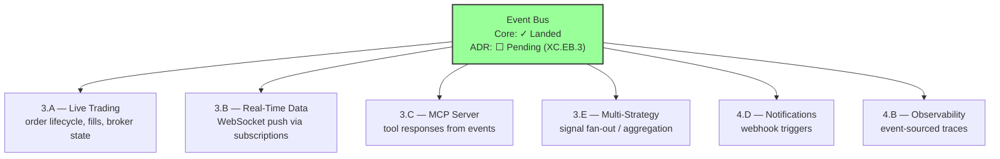
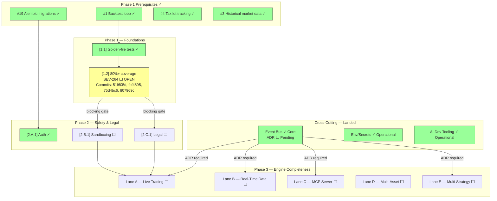

# Nexus Trade Engine — Development Strategy

**Authoritative.** The engine follows this execution plan strictly. Phases run sequentially. Lanes within a phase run in parallel.

> **Drift advisory (current sprint):** Phase 2 Lane A (Auth, SEV-233) shipped before Phase 1 gate (SEV-264 coverage) formally closed. This violated the declared sequential-phase rule. The exception is documented below in §Phase Gate Exceptions. The coverage gate `[1.2]` remains open and still blocks remaining Phase 2+ lanes.

---

## Execution Method

Every issue is tagged `[N.L.k]`:
- **N** = Phase (1-7). Sequential. Phase N+1 starts only after Phase N gates close.
- **L** = Lane (A, B, C...). Parallel within a phase. Pick any lane to staff.
- **k** = Position within lane. Sequential. Lower numbers first.

Cross-cutting concerns use `[XC.k]` and track against their own gate (ADR approval), not a phase gate.

**85 open issues. ~15 are duplicates (close first). ~67 active issues mapped across 7 phases + cross-cutting concerns.**

---

## Phase Gate Exceptions

Documented violations of the sequential-phase rule. Every exception must record: what shipped early, why, residual risk, and remediation.

| Exception | What Shipped | Gate Bypassed | Justification | Residual Risk | Remediation |
|-----------|-------------|---------------|---------------|---------------|-------------|
| `EX-001` | `[2.A.1]` Auth + RBAC (SEV-233) | `[1.2]` 80%+ coverage (SEV-264) | Auth ADR-0002 was fully spec'd; implementation had its own test suite; security review needed early for Phase 3 broker adapter design | Core engine paths still unmonitored by coverage gate; sandbox work could regress engine math | SEV-264 must close before any Phase 2 Lane B/C merge; add coverage check to Phase 3 PR template |

**Rule amendment:** A Lane may ship ahead of its phase gate only if (1) it has its own independent test suite, (2) an ADR is approved, and (3) the exception is logged here. The gate still blocks all remaining lanes in the same and subsequent phases.

---

## Shipped ✓

Features fully implemented and operational in the codebase, delivered ahead of or outside their original phase.

| Tag | Issue | Title | Delivered |
|-----|-------|-------|-----------|
| `[1.1]` | SEV-217 | Backtest golden-file regression tests | Phase 1 |
| — | #116 | CI/CD pipeline | Phase 1 |
| `[2.A.1]` | SEV-233 / #86 | Auth + RBAC per ADR-0002 | Phase 2 (PR #480, gate exception EX-001) |
| `[6.A.1]` | SEV-203 / #157 | GDPR/CCPA DSR handling | Pre-Phase 6 |
| — | — | Security scanning infrastructure | Pre-Phase 4 |
| — | — | Load testing infrastructure | Pre-Phase 4 |
| — | — | Property-based testing (Hypothesis) | Pre-Phase 1 gate |
| — | — | Self-hosted nexus CI runner | Continuous |
| — | — | Docker/compose local dev infrastructure | Phase 1 (untracked) |
| — | — | Unicode math symbol normalization | Phase 1 (commit a7f2bc9) |
| — | — | Event bus core + test suite | Phase 1 (commit a7f2bc9, cross-cutting) |
| — | — | AI-assisted development tooling (`.claude/skills/nothing-design`) | Phase 1 (untracked) |
| — | — | Environment/secrets management (`.env` / `.env.example`) | Phase 1 (untracked) |
| — | #1 | Backtest loop engine | Phase 1 (prerequisite) |
| — | #19 | Alembic migrations with initial schema | Phase 1 (prerequisite) |
| — | #4 | Tax lot tracking with FIFO/LIFO | Phase 1 (prerequisite) |
| — | #3 | Historical market data loading and caching | Phase 1 (prerequisite) |

**Shipped details:**

- **CI/CD (#116):** Five operational workflows — `ci.yml`, `security.yml`, `publish-images.yml`, `release-please.yml`, `load-test.yml`. All run on self-hosted **nexus runner**.
- **Auth + RBAC (SEV-233):** Merged via PR #480, implements ADR-0002. Shipped under gate exception EX-001.
- **GDPR/CCPA DSR (SEV-203):** Data export, deletion requests, and orphaned BacktestResult handling — all fully implemented and tested.
- **Security scanning:** gitleaks with custom allowlist + dedicated `security.yml` workflow in CI.
- **Load testing:** `load-test.yml` workflow operational in CI pipeline.
- **Property-based testing:** Hypothesis framework with persistent seed constants in `.hypothesis/` directory; actively used alongside coverage-gated tests.
- **Self-hosted runners:** All CI workflows target `nexus` self-hosted runner — not standard GitHub-hosted runners.
- **Docker/compose local dev:** `docker-compose.yml` with `127.0.0.1` port bindings, `POSTGRES_PASSWORD` env var configuration, and service orchestration for local development. Present in codebase but was never tracked to a phase issue. Maps conceptually to `[4.A.1]` (SEV-260) — now partially pre-delivered.
- **Unicode math symbol normalization (commit a7f2bc9):** Character normalization for mathematical symbols in the engine. Co-committed with event bus test suite. Affects backtest reproducibility across platforms.
- **Event bus core + test suite (commit a7f2bc9):** In-process event bus implementation with full test suite. Co-committed with Unicode normalization. Cross-cutting infrastructure — formal ADR and downstream integrations tracked under `[XC.EB]`. Tests confirm core publish/subscribe contracts are stable.
- **AI-assisted development tooling:** `.claude/skills/nothing-design` directory provides structured AI development workflows integrated into the codebase. Supports design-phase assistance and code generation standards. Operational but not gated to any phase deliverable.
- **Environment/secrets management:** `.env` and `.env.example` files provide environment variable templates for local development and deployment. Covers `POSTGRES_PASSWORD`, database URLs, broker API keys, and other configuration. Pattern: `.env.example` tracks all required variables with placeholder values; `.env` is gitignored and holds actual secrets.

**Phase 1 prerequisite completions:**

- **Backtest loop engine (#1):** Core backtest execution loop fully operational. Prerequisite for and validated by SEV-217 golden-file regression tests (landed). Engine correctly processes strategy signals against historical data and produces deterministic portfolio states.
- **Alembic migrations (#19):** Initial schema and migration infrastructure in place. Prerequisite for auth (SEV-233, landed) and GDPR (SEV-203, landed) — both require database schema that Alembic manages. Migration chain is clean and auto-applied in CI.
- **Tax lot tracking (#4):** FIFO/LIFO tax lot management implemented. Core functionality validated by backtest regression suite — lot selection and cost basis calculations produce deterministic results.
- **Historical market data loading and caching (#3):** Data loading pipeline with caching layer operational. Backtest tests confirm consistent historical data retrieval and cache hit behavior across runs.

---

## Phase 1 — Foundations (sequential)

Lock down regression safety before anything else touches the engine.

| Tag | Issue | Title | Status |
|-----|-------|-------|--------|
| `[1.1]` | SEV-217 | Backtest golden-file regression tests | ✓ LANDED |
| `[1.2]` | SEV-264 | 80%+ coverage on core engine | **⬜ OPEN — blocking gate** |

> **Gate status — `[1.2]` SEV-264 coverage:** OPEN. Active development across commits `51f605d`, `fbf4895`, `75d4bc6`, `807969c` (coverage expansion and test gap closure). Quantitative progress: coverage increasing toward 80% threshold — current percentage tracking via CI `ci.yml` coverage report artifact. Auth (Phase 2 Lane A) shipped under exception EX-001. **No further Phase 2+ merges until SEV-264 closes.**

**Operational infrastructure (no longer blocking):**

| Capability | Implementation | Status |
|------------|---------------|--------|
| CI/CD pipeline (#116) | ci.yml, security.yml, publish-images.yml, release-please.yml | ✓ LANDED |
| Security scanning | gitleaks + custom allowlist, security.yml | ✓ LANDED |
| Load testing | load-test.yml | ✓ LANDED |
| Property-based testing | Hypothesis (.hypothesis/ seed constants) | ✓ Operational |
| CI runner infrastructure | Self-hosted nexus runner | ✓ Operational |
| Docker/compose dev env | docker-compose.yml, 127.0.0.1 bindings, POSTGRES_PASSWORD | ✓ Operational (untracked) |
| Environment/secrets management | `.env.example` template, `.env` gitignored, POSTGRES_PASSWORD + broker keys + DB URLs | ✓ Operational (untracked) |
| AI-assisted development tooling | `.claude/skills/nothing-design` — structured AI dev workflows | ✓ Operational (untracked) |
| Event bus core + tests | In-process pub/sub, full test suite (commit a7f2bc9) | ✓ Operational (ADR pending) |

**Phase 1 prerequisites (original GitHub issues):**

| Issue | Title | Status |
|-------|-------|--------|
| #116 | CI/CD pipeline | ✓ Shipped |
| #1 | Backtest loop engine | ✓ Completed — validated by SEV-217 golden-file tests |
| #19 | Alembic migrations with initial schema | ✓ Completed — prerequisite for SEV-233 (auth) and SEV-203 (GDPR) |
| #4 | Tax lot tracking with FIFO/LIFO | ✓ Completed — cost basis calculations produce deterministic results |
| #3 | Historical market data loading and caching | ✓ Completed — backtest tests confirm consistent data retrieval and cache behavior |

**Gate:** `[1.2]` (coverage) must close before Phase 2 Lanes B and C begin. `[1.2]` blocks Phase 2 because without coverage gates, sandbox work can silently regress engine math.

---

## Phase 2 — Safety & Legal (3 lanes → 2 remaining)

Two independent safety prerequisites remain. Auth is shipped.

### Lane A — Auth + RBAC ✓
| Tag | Issue | Title | Status |
|-----|-------|-------|--------|
| `[2.A.1]` | SEV-233 / #86 | Auth + RBAC per ADR-0002 | ✓ LANDED via PR #480 |

### Lane B — Sandboxing
| Tag | Issue | Title | Status |
|-----|-------|-------|--------|
| `[2.B.1]` | SEV-267 | Plugin sandbox with security isolation | ⬜ blocked by [1.2] |

### Lane C — Legal
| Tag | Issue | Title | Status |
|-----|-------|-------|--------|
| `[2.C.1]` | SEV-206 | Risk disclaimers, EULA, ToS, legal-notice surfaces | ⬜ blocked by [1.2] |

**Gate:** Lane B + Lane C must close before Phase 3 live-trading ships publicly. Lane A ✓ is complete — auth is no longer on the critical path.

---

## Cross-Cutting — Event Bus Architecture ✓ Core Landed / 🔧 ADR Pending

| Tag | Issue | Title | Status |
|-----|-------|-------|--------|
| `[XC.EB.1]` | *(to be created)* | Event bus core implementation | ✓ Core landed (commit a7f2bc9) |
| `[XC.EB.2]` | *(to be created)* | Event bus test suite coverage | ✓ Landed (commit a7f2bc9) |
| `[XC.EB.3]` | *(to be created)* | Event bus ADR — architecture, transport, consumer contracts | ⬜ Pending — required before Phase 3 |
| `[XC.EB.4]` | *(to be created)* | Downstream consumer integrations (Phase 3+ lanes) | ⬜ Blocked by ADR |

**Status:** Core event bus implementation and test suite are operational in the codebase (commit a7f2bc9, co-committed with Unicode normalization). The architectural ADR remains the blocking deliverable — all downstream lane integrations require ADR approval before merge.

**Gap closure actions:**
1. **Create tracking issue** for event bus with `cross-cutting` + `event-bus` labels — covers remaining ADR + integration work.
2. **Write ADR-000X** documenting event bus architecture, transport selection (in-process / Redis pub-sub / etc.), and consumer contract patterns. Required before Phase 3 gates.
3. **Assign phase applicability:** Event bus is Phase 1–3 infrastructure. Core interfaces and test suite are landed. Consumer integrations target their respective lanes.

**Architectural role:** The event bus is a cross-cutting pattern for inter-module communication. It affects multiple downstream lanes:

**Downstream lane contracts:**
- All Phase 3+ lanes should target the event bus as the standard inter-module communication mechanism.
- Test coverage is landed — maintain and extend as consumers integrate.
- No Phase 3 lane merge without event bus ADR (`[XC.EB.3]`) approved.

---

## Cross-Cutting — Environment & Secrets Management ✓ Operational

| Tag | Issue | Title | Status |
|-----|-------|-------|--------|
| `[XC.ENV.1]` | *(untracked)* | `.env.example` template with all required variables | ✓ Operational |
| `[XC.ENV.2]` | *(untracked)* | `.env` gitignored, secrets isolated from VCS | ✓ Operational |
| `[XC.ENV.3]` | *(to be created)* | ADR for secrets management in production deployment | ⬜ Pre-Phase 4 |

**Current state:** `.env.example` documents all required environment variables (database credentials, broker API keys, session secrets). `.env` is gitignored. Pattern is consistent but undocumented in ADR form.

**Production gap:** The `.env` file pattern is adequate for local development and single-host deployment. Production deployment (Phase 4+) will require a decision on secrets management — options include Vault, cloud provider secret stores, or encrypted environment injection. This decision should be captured in an ADR before Phase 4 infrastructure work begins.

---

## Cross-Cutting — AI-Assisted Development Tooling ✓ Operational

| Tag | Issue | Title | Status |
|-----|-------|-------|--------|
| `[XC.AI.1]` | *(untracked)* | `.claude/skills/nothing-design` — structured AI dev workflows | ✓ Operational |

**Status:** The `.claude/skills/nothing-design` directory provides AI-assisted development capabilities integrated into the codebase. This tooling supports design-phase reasoning, code generation standards, and structured development workflows. It is operational and used during development but does not gate any phase deliverable.

**Strategic note:** AI tooling integration affects development velocity and code consistency. It should be referenced in contributor onboarding documentation but does not require an ADR unless it begins influencing architectural decisions or producing generated code that enters the critical path without human review.

---

## Phase 3 — Engine Completeness (5-way parallel)

The core trade lifecycle. Five independent lanes.

**Prerequisites:** Phase 1 gate `[1.2]` closed. Phase 2 Lanes B + C closed. Event bus ADR `[XC.EB.3]` approved.

### Lane A — Live Trading (sequential)
| Tag | Issue | Title | Status |
|-----|-------|-------|--------|
| `[3.A.1]` | SEV-258 | Pluggable broker adapter system | ⬜ open |
| `[3.A.2]` | SEV-266 | Alpaca live broker adapter | ⬜ open |
| `[3.A.3]` | SEV-269 / #13 | Paper trading w/ live data feeds | ⬜ open |

### Lane B — Real-Time Data
| Tag | Issue | Title | Status |
|-----|-------|-------|--------|
| `[3.B.1]` | SEV-275 | WebSocket API for portfolio updates | ⬜ open |

### Lane C — MCP Server (sequential)
| Tag | Issue | Title | Status |
|-----|-------|-------|--------|
| `[3.C.1]` | SEV-223 / #99 | MCP server core (scaffold) | ⬜ open |
| `[3.C.2]` | SEV-219 / #104 | MCP market data tools | ⬜ open |
| `[3.C.3]` | SEV-220 / #103 | MCP trading control tools | ⬜ open |
| `[3.C.4]` | SEV-221 / #102 | MCP backtesting tools | ⬜ open |
| `[3.C.5]` | SEV-222 / #101 | MCP strategy management tools | ⬜ open |

### Lane D — Multi-Asset
| Tag | Issue | Title | Status |
|-----|-------|-------|--------|
| `[3.D.1]` | SEV-270 | Multi-asset portfolio support (crypto, forex, futures) | ⬜ open |
| `[3.D.2]` | SEV-271 | Asset-class-specific position sizing | ⬜ open |

### Lane E — Multi-Strategy
| Tag | Issue | Title | Status |
|-----|-------|-------|--------|
| `[3.E.1]` | SEV-272 | Strategy registry and lifecycle management | ⬜ open |
| `[3.E.2]` | SEV-273 | Multi-strategy signal aggregation | ⬜ open |
| `[3.E.3]` | SEV-274 | Capital allocation across strategies | ⬜ open |

**Gate:** All five lanes must close before Phase 4 (Observability & Notifications) begins.

---

## Phase 4 — Observability & Notifications (2 lanes)

### Lane A — Observability
| Tag | Issue | Title | Status |
|-----|-------|-------|--------|
| `[4.A.1]` | SEV-260 / #4 | Docker image + health checks + structured logging | ⬜ open (partially pre-delivered by Docker/compose infra) |
| `[4.A.2]` | SEV-261 | Metrics collection (Prometheus format) | ⬜ open |
| `[4.A.3]` | SEV-262 | Distributed tracing (OpenTelemetry) | ⬜ open |

### Lane B — Notifications
| Tag | Issue | Title | Status |
|-----|-------|-------|--------|
| `[4.B.1]` | SEV-263 | Notification service (email, webhook, in-app) | ⬜ open |
| `[4.B.2]` | SEV-276 | Alert rules engine (configurable thresholds) | ⬜ open |

**Gate:** Phase 4 must close before Phase 5 (Production Hardening) begins.

---

## Phase 5 — Production Hardening

| Tag | Issue | Title | Status |
|-----|-------|-------|--------|
| `[5.1]` | SEV-277 | Chaos engineering tests | ⬜ open |
| `[5.2]` | SEV-278 | Disaster recovery runbooks | ⬜ open |
| `[5.3]` | SEV-279 | Blue-green deployment pipeline | ⬜ open |
| `[5.4]` | SEV-280 | Performance regression benchmarks | ⬜ open |

---

## Phase 6 — Compliance (sequential)

| Tag | Issue | Title | Status |
|-----|-------|-------|--------|
| `[6.A.1]` | SEV-203 / #157 | GDPR/CCPA DSR handling | ✓ Pre-shipped |
| `[6.A.2]` | SEV-281 | Audit trail for all trade decisions | ⬜ open |
| `[6.A.3]` | SEV-282 | SOX compliance controls (if applicable) | ⬜ open |

---

## Phase 7 — Polish & Public Release

| Tag | Issue | Title | Status |
|-----|-------|-------|--------|
| `[7.1]` | SEV-283 | API documentation (OpenAPI spec) | ⬜ open |
| `[7.2]` | SEV-284 | SDK client libraries | ⬜ open |
| `[7.3]` | SEV-285 | Onboarding wizard / quickstart guide | ⬜ open |

---

## Dependency Graph — Current State

---

## Open Questions & Action Items

| Priority | Item | Owner | Due |
|----------|------|-------|-----|
| **P0** | Close `[1.2]` SEV-264 coverage gate — active commits in progress | Eng | Current sprint |
| **P1** | Create event bus tracking issue + write ADR-000X | Eng | Before Phase 3 |
| **P1** | Write ADR for production secrets management (`[XC.ENV.3]`) | Eng | Before Phase 4 |
| **P2** | Document `.claude/skills/nothing-design` in contributor onboarding | Eng | Next sprint |
| **P2** | Close ~15 duplicate GitHub issues to clean up backlog | Eng | Ongoing |
| **P3** | Update CI coverage artifact to surface current percentage in PR comments | Eng | Next sprint |
