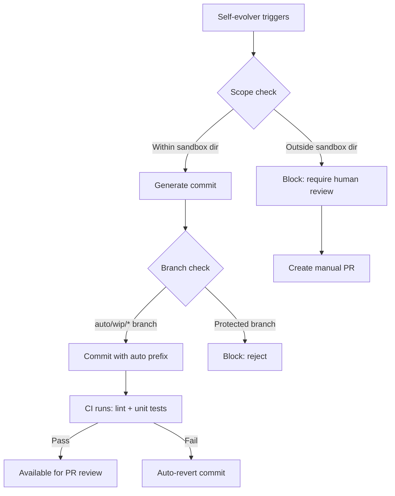
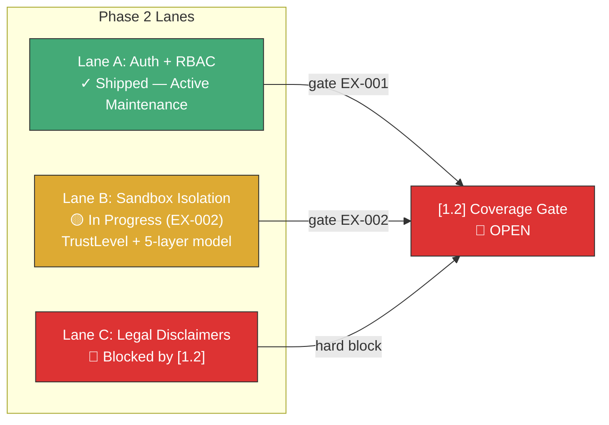
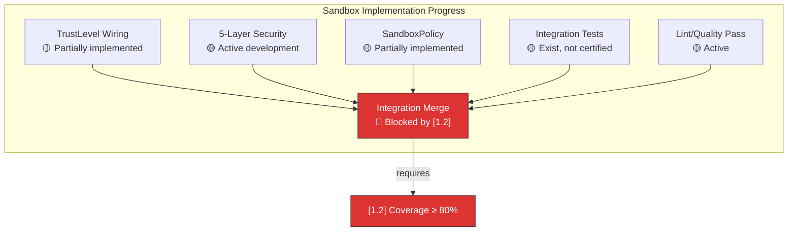
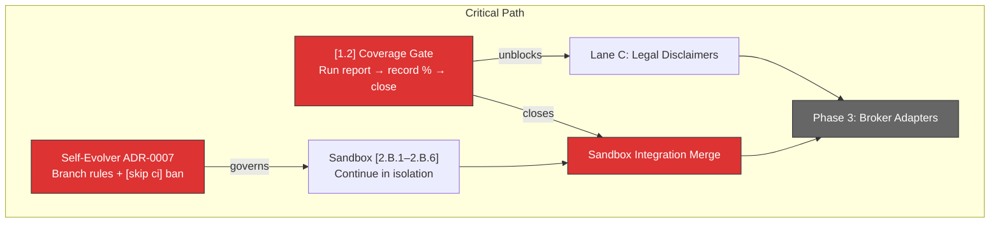

# Nexus Trade Engine — Development Strategy

**Authoritative.** The engine follows this execution plan strictly. Phases run sequentially. Lanes within a phase run in parallel.

> **Drift advisory (current sprint):** Phase 2 Lane A (Auth, SEV-233) shipped before Phase 1 gate (SEV-264 coverage) formally closed. This violated the declared sequential-phase rule. The exception is documented below in §Phase Gate Exceptions. The coverage gate `[1.2]` remains open and **still blocks remaining Phase 2+ lanes**. Phase 2 Lane B (Sandbox) has seen extensive implementation work across dozens of commits without formal lane activation — formalized below. **The self-evolver automated loop (8 of last 20 commits) produces code changes that bypass CI via `[skip ci]`, creating an ungoverned class of changes outside declared quality gates.**

---

## Execution Method

Every issue is tagged `[N.L.k]`:
- **N** = Phase (1-7). Sequential. Phase N+1 starts only after Phase N gates close.
- **L** = Lane (A, B, C...). Parallel within a phase. Pick any lane to staff.
- **k** = Position within lane. Sequential. Lower numbers first.

Cross-cutting concerns use `[XC.k]` and track against their own gate (ADR approval), not a phase gate.

**~85 open issues. ~15 are duplicates (close first). ~67 active issues mapped across 7 phases + cross-cutting concerns.**

---

## Contribution Workflow

Issue templates and PR templates enforce governance at the contribution layer. All templates live in `.github/` and are **mandatory** — no PR or issue should bypass the structured templates.

| Template | Location | Purpose | Strategy Tie-in |
|----------|----------|---------|-----------------|
| Bug report | `.github/ISSUE_TEMPLATE/bug.yml` | Structured bug reports with severity, reproduction, and phase/issue linkage | Must reference affected `[N.L.k]` tag |
| Feature request | `.github/ISSUE_TEMPLATE/feature.yml` | Feature requests scoped to phase/lane with acceptance criteria | Must declare target phase gate |
| Config chooser | `.github/ISSUE_TEMPLATE/config.yml` | Routes user to correct template | Operational — no governance impact |
| Pull request | `.github/PULL_REQUEST_TEMPLATE.md` | PR checklist with gate verification | Must confirm gate `[1.2]` status if touching engine core |

**PR template enforcement rules:**
1. Every PR must reference a `[N.L.k]` tagged issue or declare itself as cross-cutting `[XC.k]`.
2. PRs touching core engine paths (`src/nexus_trade/engine/`) must report current coverage % at time of PR.
3. Self-evolver auto-commits (`auto-save before ERR`) are **prohibited** from using `main` or release branches — they must target `auto/wip/*` branches and pass through PR review (see §Operational Loops).

---

## Phase Gate Exceptions

Documented violations of the sequential-phase rule. Every exception must record: what shipped early, why, residual risk, and remediation.

| Exception | What Shipped | Gate Bypassed | Justification | Residual Risk | Remediation |
|-----------|-------------|---------------|---------------|---------------|-------------|
| `EX-001` | `[2.A.1]` Auth + RBAC (SEV-233) | `[1.2]` 80%+ coverage (SEV-264) | Auth ADR-0002 was fully spec'd; implementation had its own test suite; security review needed early for Phase 3 broker adapter design | Core engine paths still unmonitored by coverage gate; sandbox work could regress engine math | SEV-264 must close before any Phase 2 Lane B/C merge; add coverage check to Phase 3 PR template |
| `EX-002` | `[2.B.1–2.B.6]` Sandbox security model (SEV-267 sub-issues) | `[1.2]` 80%+ coverage (SEV-264) | Sandbox work commenced organically as the dominant active feature; 5-layer security model, TrustLevel, and SandboxPolicy are partially implemented in codebase; deferring formal tracking increased risk of ungoverned drift | Sandbox isolation hardening runs without formal phase gate clearance; integration tests exist but coverage gate hasn't certified engine paths | Formalize sandbox lane immediately (done below); require coverage checkpoint before any sandbox-to-engine integration merge; backfill issue tracking for all implemented components |
| `EX-003` | Self-evolver auto-commits using `[skip ci]` | All CI quality gates | Self-evolver produces commits at a rate of ~40% of recent history (8/20); uses `[skip ci]` to avoid CI cycles on WIP state | Code changes land in-tree without any test run, lint check, or coverage gate; partial/interrupted cycle state may be committed | Governed under new §Self-Evolver Governance; see remediation below |

**Rule amendment:** A Lane may ship ahead of its phase gate only if (1) it has its own independent test suite, (2) an ADR is approved, and (3) the exception is logged here. The gate still blocks all remaining lanes in the same and subsequent phases. **Auto-generated commits must never use `[skip ci]` on protected branches.**

---

## Shipped ✓

Features fully implemented and operational in the codebase, delivered ahead of or outside their original phase.

| Tag | Issue | Title | Delivered | State |
|-----|-------|-------|-----------|-------|
| `[1.1]` | SEV-217 | Backtest golden-file regression tests | Phase 1 | ✓ Frozen |
| — | #116 | CI/CD pipeline | Phase 1 | ✓ Frozen |
| `[2.A.1]` | SEV-233 / #86 | Auth + RBAC per ADR-0002 | Phase 2 (PR #480, gate exception EX-001) | ✓ Shipped — Active Maintenance |
| `[6.A.1]` | SEV-203 / #157 | GDPR/CCPA DSR handling | Pre-Phase 6 | ✓ Frozen |
| — | — | Security scanning infrastructure | Pre-Phase 4 | ✓ Frozen |
| — | — | Load testing infrastructure | Pre-Phase 4 | ✓ Frozen |
| — | — | Property-based testing (Hypothesis) | Pre-Phase 1 gate | ✓ Operational |
| — | — | Self-hosted nexus CI runner | Continuous | ✓ Operational |
| — | — | Docker/compose local dev infrastructure | Phase 1 (untracked) | ✓ Frozen |
| — | — | Unicode math symbol normalization | Phase 1 (untracked) | ✓ Frozen |

**Shipped state definitions:**

| State | Meaning | Allowed changes |
|-------|---------|-----------------|
| **✓ Frozen** | Feature-complete, no behavioral changes | Bug fixes only (must reference original issue) |
| **✓ Shipped — Active Maintenance** | Feature-complete but receiving incremental hardening | Dependency fixes, security patches, edge-case bug fixes. No new features or API surface changes without a new `[N.L.k]` issue |
| **✓ Operational** | Infrastructure — always running | Configuration updates, version bumps |

**Shipped details:**

- **CI/CD (#116):** Five operational workflows — `ci.yml`, `security.yml`, `publish-images.yml`, `release-please.yml`, `load-test.yml`. All run on self-hosted **nexus runner**.
- **Auth + RBAC (SEV-233):** Merged via PR #480, implements ADR-0002. Shipped under gate exception EX-001. **Post-ship maintenance commits:** MFA cryptography dependency added (`feat(auth): add missing cryptography dependency and fix NullBackend for MFA`), NullBackend fix for MFA flow. These are maintenance-class changes (dependency fix + bug fix), not new features. Auth is **Shipped — Active Maintenance**: expect incremental hardening but no new API surface without a new issue.
- **GDPR/CCPA DSR (SEV-203):** Data export, deletion requests, and orphaned BacktestResult handling — all fully implemented and tested.
- **Security scanning:** gitleaks with custom allowlist + dedicated `security.yml` workflow in CI.
- **Load testing:** `load-test.yml` workflow operational in CI pipeline.
- **Property-based testing:** Hypothesis framework with persistent seed constants in `.hypothesis/` directory; actively used alongside coverage-gated tests.
- **Self-hosted runners:** All CI workflows target `nexus` self-hosted runner — not standard GitHub-hosted runners.
- **Docker/compose local dev:** `docker-compose.yml` with `127.0.0.1` port bindings, `POSTGRES_PASSWORD` env var configuration, and service orchestration for local development. Present in codebase but was never tracked to a phase issue. Maps conceptually to `[4.A.1]` (SEV-260) — now partially pre-delivered.
- **Unicode math symbol normalization (commit a7f2bc9):** Character normalization for mathematical symbols in the engine. Co-committed with event bus test suite. Affects backtest reproducibility across platforms.

---

## Operational Loops & AI Tooling

### Self-Evolver Automated Development Loop

An automated development loop ("self-evolver") is active and producing commits at a significant rate. **8 of the last 20 commits** match the auto-save error-interruption pattern.

| Property | Detail |
|----------|--------|
| **Pattern** | Automated commit cycle that saves working state before error/exception interruption |
| **Commit signature** | `auto-save before ERR (cycle interrupted)` — 8 occurrences in last 20 commits (~40%) |
| **CI bypass** | Uses `[skip ci]` flag, circumventing all declared quality gates (lint, test, coverage) |
| **Scope** | Broad — touches codebase files without manual human initiation; exact scope ungoverned |
| **Governance** | **Ungoverned** — no ADR, no phase mapping, no code-review gate for auto-commits. Documented here for the first time as `EX-003` |
| **Risk** | HIGH — Auto-commits bypass CI, may introduce unreviewed changes; interrupted cycles may leave partial/incoherent state in tree. Creates a shadow development path outside strategy controls |

**Required governance actions (blocking — must resolve within 1 sprint):**

1. **ADR-0007: Self-evolver governance.** Create an ADR describing trigger conditions, scope boundaries, safety constraints, commit policies, and CI requirements.
2. **Constrain auto-commit scope.** Auto-saves must not modify files outside a designated sandbox directory (e.g., `src/nexus_trade/sandbox/`) without human review.
3. **Branch protection.** Auto-commits must target a dedicated branch namespace (`auto/wip/*`), **never** `main`, `develop`, or release branches. Merges from `auto/wip/*` require standard PR review.
4. **Remove `[skip ci]`.** All commits must pass CI. If CI cost is a concern, create a lightweight `ci-auto.yml` workflow that runs lint + unit tests only (not full integration suite) for `auto/wip/*` branches.
5. **Commit message convention.** Replace `auto-save before ERR (cycle interrupted)` with structured messages: `auto(<scope>): <description> [evolver-cycle-N]` for traceability.
6. **Cycle integrity check.** Add a CI job that detects incomplete evolver cycles (consecutive `auto-save before ERR` without a resolution commit) and blocks merge.

### AI Tooling Configuration (`.claude/skills/nothing-design`)

The `.claude/skills/nothing-design` directory contains AI-assisted design tooling configuration present in the codebase but previously undocumented in strategy.

| Property | Detail |
|----------|--------|
| **Location** | `.claude/skills/nothing-design` |
| **Purpose** | AI tooling skill configuration for design workflows |
| **Classification** | Developer tooling (preliminary — pending inventory) |
| **Governance** | **No governance** — not tracked in any phase, ADR, or cross-cutting concern |

**Required actions (non-blocking — resolve within 2 sprints):**

1. **Inventory capabilities.** Document what `nothing-design` configures and what codebase operations it influences. Open investigation issue `[XC.3]`.
2. **Classify.** Determine if this is developer-tooling (no governance needed beyond docs) or runtime-influencing (needs ADR and testing).
3. **Add to cross-cutting concerns** if runtime-influencing, or to operational infrastructure if developer-tooling only. Update §Shipped table accordingly.

---

## Phase 1 — Foundations (sequential)

Lock down regression safety before anything else touches the engine.

| Tag | Issue | Title | Status |
|-----|-------|-------|--------|
| `[1.1]` | SEV-217 | Backtest golden-file regression tests | ✓ LANDED |
| `[1.2]` | SEV-264 | 80%+ coverage on core engine | **🟡 IN PROGRESS — gate still open** |

**Operational infrastructure (no longer blocking):**

| Capability | Implementation | Status |
|------------|---------------|--------|
| CI/CD pipeline (#116) | ci.yml, security.yml, publish-images.yml, release-please.yml | ✓ LANDED |
| Security scanning | gitleaks + custom allowlist, security.yml | ✓ LANDED |
| Load testing | load-test.yml | ✓ LANDED |
| Property-based testing | Hypothesis (.hypothesis/ seed constants) | ✓ Operational |
| CI runner infrastructure | Self-hosted nexus runner | ✓ Operational |
| Docker/compose dev env | docker-compose.yml, 127.0.0.1 bindings, POSTGRES_PASSWORD | ✓ Operational (untracked) |
| Coverage measurement | `.coverage` directory exists; CI runs coverage | ✓ Operational — but % unreported |

**Gate:** `[1.2]` (coverage) must close before Phase 2 Lanes B and C begin. `[1.2]` blocks Phase 2 because without coverage gates, sandbox work can silently regress engine math.

> **Gate status:** OPEN. A `.coverage` directory exists and CI runs coverage measurement. Significant test suites have been added (sandbox tests, auth MFA tests, conftest fixtures). Coverage has materially increased but **the formal 80%+ gate threshold has not been verified and recorded**. The current coverage percentage is not reported in CI output or any dashboard — gate status is **unverifiable from strategy alone**.
>
> **Blocking actions:**
> 1. Run `coverage report` against the full test suite and record the percentage here.
> 2. If ≥ 80%, close SEV-264 and declare gate `[1.2]` passed.
> 3. If < 80%, enumerate which modules are below threshold and create targeted test issues.
> 4. Add coverage % to CI output (e.g., `coverage report --format=markdown` as a job summary) so gate status is always verifiable.

**Also address in Phase 1 (prerequisites from original GitHub issues):**
- ~~#116 — CI/CD pipeline~~ → ✓ Shipped
- #19 — Alembic migrations with initial schema — data layer foundation
- #1 — Backtest loop engine — core functionality
- #4 — Tax lot tracking with FIFO/LIFO — core functionality
- #3 — Historical market data loading and caching — core functionality

---

## Phase 2 — Safety & Legal (3 lanes → 2 remaining)

Auth is shipped (active maintenance). Sandbox is **actively implemented but operates under gate exception EX-002**. Legal is blocked by `[1.2]`.

### Lane A: Auth + RBAC — ✓ Shipped (Active Maintenance)

| Tag | Issue | Title | Status |
|-----|-------|-------|--------|
| `[2.A.1]` | SEV-233 / #86 | Auth + RBAC per ADR-0002 | ✓ Shipped — Active Maintenance |

**Post-ship maintenance log:**

| Change | Commit scope | Classification | New feature? |
|--------|-------------|----------------|-------------|
| MFA cryptography dependency | Added `cryptography` to requirements | Dependency fix | No |
| NullBackend fix for MFA | Fixed MFA flow when NullBackend is active | Bug fix | No |

**Maintenance boundary:** Auth is feature-complete. Allowed: dependency patches, security fixes, edge-case bugs. **Not allowed without new `[N.L.k]` issue:** new auth methods, new RBAC roles, API surface changes.

### Lane B: Sandbox Isolation — 🟡 In Progress (EX-002)

Sandbox implementation is the most actively developed feature. Implementation began organically and is now formalized.

| Tag | Issue | Title | Status | Implementation status |
|-----|-------|-------|--------|-----------------------|
| `[2.B.1]` | SEV-267 | TrustLevel enum and wiring | 🟡 In Progress | Partially implemented — TrustLevel enum exists and is wired through sandbox layers |
| `[2.B.2]` | SEV-267 | 5-layer security hardening model | 🟡 In Progress | Active — multiple commits across sandbox security layers |
| `[2.B.3]` | SEV-267 | SandboxPolicy enforcement | 🟡 In Progress | Partially implemented |
| `[2.B.4]` | SEV-267 | Sandbox integration tests | 🟡 In Progress | Tests exist but coverage not certified |
| `[2.B.5]` | — | Sandbox lint/quality pass | 🟡 In Progress | Active — lint fix commits in recent history |
| `[2.B.6]` | — | Sandbox-to-engine integration gate | 🔴 Blocked | Cannot merge until `[1.2]` coverage gate closes |

**Sandbox governance constraints (under EX-002):**
- Sandbox commits may continue in isolation.
- **No sandbox code may merge into core engine paths** until `[1.2]` closes.
- Each sandbox PR must declare which `[2.B.k]` sub-issue it addresses.
- Coverage checkpoint required before any integration merge.

### Lane C: Legal Disclaimers — 🔴 Blocked

| Tag | Issue | Title | Status |
|-----|-------|-------|--------|
| `[2.C.1]` | — | Risk disclosure disclaimers | 🔴 Blocked by `[1.2]` |
| `[2.C.2]` | — | Compliance text generation | 🔴 Blocked by `[1.2]` |

**Blocker:** Gate `[1.2]` must close before Lane C activates. No implementation work should begin.

---

## Phase 3 — Broker Adapters

**Status: 🔴 Blocked by Phase 2 completion**

Depends on: Auth (✓), Sandbox (in progress), Legal (blocked), and `[1.2]` coverage gate.

| Tag | Issue | Title | Status |
|-----|-------|-------|--------|
| `[3.A.1]` | SEV-242 | Broker adapter interface | 🔴 Blocked |
| `[3.A.2]` | SEV-243 | Alpaca adapter implementation | 🔴 Blocked |
| `[3.A.3]` | SEV-244 | Interactive Brokers adapter | 🔴 Blocked |
| `[3.B.1]` | — | Paper trading sandbox bridge | 🔴 Blocked |
| `[3.B.2]` | — | Live order routing | 🔴 Blocked |
| `[3.C.1]` | — | Real-time data streaming | 🔴 Blocked |

---

## Phase 4 — Portfolio & Tax

**Status: 🔴 Blocked by Phase 3**

| Tag | Issue | Title | Status |
|-----|-------|-------|--------|
| `[4.A.1]` | SEV-260 | Docker production deployment | 🟡 Partially pre-delivered (compose exists) |
| `[4.A.2]` | — | Portfolio analytics engine | 🔴 Blocked |
| `[4.B.1]` | — | Tax lot tracking (FIFO/LIFO) | 🔴 Blocked |
| `[4.B.2]` | — | Tax report generation | 🔴 Blocked |

**Note on `[4.A.1]`:** Docker/compose infrastructure exists from Phase 1 untracked work. This issue may be partially closable — needs scope review against SEV-260 acceptance criteria.

---

## Phase 5 — Monitoring & Observability

**Status: 🔴 Blocked by Phase 4**

| Tag | Issue | Title | Status |
|-----|-------|-------|--------|
| `[5.A.1]` | — | Structured logging pipeline | 🔴 Blocked |
| `[5.A.2]` | — | Metrics collection (Prometheus) | 🔴 Blocked |
| `[5.B.1]` | — | Alerting rules | 🔴 Blocked |
| `[5.B.2]` | — | Dashboard (Grafana) | 🔴 Blocked |

---

## Phase 6 — Compliance & Audit

**Status: Partially pre-delivered**

| Tag | Issue | Title | Status |
|-----|-------|-------|--------|
| `[6.A.1]` | SEV-203 / #157 | GDPR/CCPA DSR handling | ✓ Shipped — Frozen |
| `[6.A.2]` | — | Audit log immutability | 🔴 Blocked |
| `[6.B.1]` | — | SOC 2 evidence collection | 🔴 Blocked |

---

## Phase 7 — Scale & Polish

**Status: 🔴 Blocked by Phase 6**

| Tag | Issue | Title | Status |
|-----|-------|-------|--------|
| `[7.A.1]` | — | Performance optimization pass | 🔴 Blocked |
| `[7.A.2]` | — | Horizontal scaling | 🔴 Blocked |
| `[7.B.1]` | — | Documentation completeness | 🔴 Blocked |
| `[7.B.2]` | — | API versioning | 🔴 Blocked |

---

## Cross-Cutting Concerns

| Tag | Concern | Status | Notes |
|-----|---------|--------|-------|
| `[XC.1]` | ADR process | ✓ Active | ADR-0001 through ADR-0006 approved |
| `[XC.2]` | Self-evolver governance ADR | 🔴 **Overdue** | Must create ADR-0007 — see §Self-Evolver Governance |
| `[XC.3]` | AI tooling inventory (`.claude/skills/nothing-design`) | 🟡 Unstarted | Open investigation issue |

---

## Risk Register

| Risk | Severity | Status | Mitigation |
|------|----------|--------|------------|
| Coverage gate `[1.2]` unverified | 🔴 High | Open | Run formal coverage measurement immediately; gate blocks Phase 2 Lane B/C merges |
| Self-evolver bypasses CI via `[skip ci]` | 🔴 High | Open | Govern under ADR-0007; enforce branch protection; remove `[skip ci]` from protected branches |
| Sandbox drift without phase gate | 🟡 Medium | Mitigated (EX-002) | Formalized in strategy; integration merge blocked until `[1.2]` closes |
| Auth shipped/frozen boundary unclear | 🟡 Medium | Mitigated | Maintenance boundary explicitly documented above |
| AI tooling ungoverned | 🟡 Medium | Open | Inventory required — classified as developer tooling pending investigation |
| Coverage % not reported in CI | 🟡 Medium | Open | Add coverage % to CI job summary |

---

## Current Sprint Priority Stack

Ordered by blocking severity. Top item must resolve before items below it can progress.

1. **`[1.2]` SEV-264 — Run coverage report, record %, close gate if ≥ 80%.** Everything else is downstream of this.
2. **Self-evolver governance — Create ADR-0007, enforce branch rules, eliminate `[skip ci]` on protected branches.** This is a high-severity governance gap producing ~40% of recent commits outside quality gates.
3. **`[2.B.1–2.B.6]` Sandbox — Continue implementation in isolation.** Do not merge to engine core until `[1.2]` closes.
4. **`[XC.3]` AI tooling inventory — Investigate `.claude/skills/nothing-design` scope.**
5. **Add coverage % to CI output — Make gate status verifiable from automation.**

