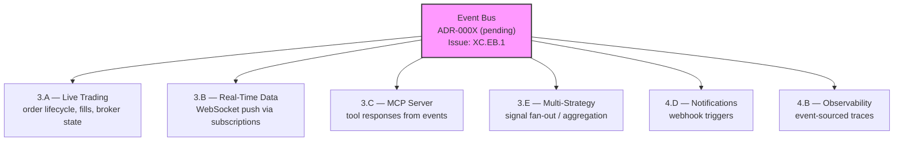

# Nexus Trade Engine — Development Strategy

**Authoritative.** The engine follows this execution plan strictly. Phases run sequentially. Lanes within a phase run in parallel.

> **Drift advisory (current sprint):** Phase 2 Lane A (Auth, SEV-233) shipped before Phase 1 gate (SEV-264 coverage) formally closed. This violated the declared sequential-phase rule. The exception is documented below in §Phase Gate Exceptions. The coverage gate `[1.2]` remains open and still blocks remaining Phase 2+ lanes.

---

## Execution Method

Every issue is tagged `[N.L.k]`:
- **N** = Phase (1-7). Sequential. Phase N+1 starts only after Phase N gates close.
- **L** = Lane (A, B, C...). Parallel within a phase. Pick any lane to staff.
- **k** = Position within lane. Sequential. Lower numbers first.

Cross-cutting concerns use `[XC.k]` and track against their own gate (ADR approval), not a phase gate.

**85 open issues. ~15 are duplicates (close first). ~67 active issues mapped across 7 phases + cross-cutting concerns.**

---

## Phase Gate Exceptions

Documented violations of the sequential-phase rule. Every exception must record: what shipped early, why, residual risk, and remediation.

| Exception | What Shipped | Gate Bypassed | Justification | Residual Risk | Remediation |
|-----------|-------------|---------------|---------------|---------------|-------------|
| `EX-001` | `[2.A.1]` Auth + RBAC (SEV-233) | `[1.2]` 80%+ coverage (SEV-264) | Auth ADR-0002 was fully spec'd; implementation had its own test suite; security review needed early for Phase 3 broker adapter design | Core engine paths still unmonitored by coverage gate; sandbox work could regress engine math | SEV-264 must close before any Phase 2 Lane B/C merge; add coverage check to Phase 3 PR template |

**Rule amendment:** A Lane may ship ahead of its phase gate only if (1) it has its own independent test suite, (2) an ADR is approved, and (3) the exception is logged here. The gate still blocks all remaining lanes in the same and subsequent phases.

---

## Shipped ✓

Features fully implemented and operational in the codebase, delivered ahead of or outside their original phase.

| Tag | Issue | Title | Delivered |
|-----|-------|-------|-----------|
| `[1.1]` | SEV-217 | Backtest golden-file regression tests | Phase 1 |
| — | #116 | CI/CD pipeline | Phase 1 |
| `[2.A.1]` | SEV-233 / #86 | Auth + RBAC per ADR-0002 | Phase 2 (PR #480, gate exception EX-001) |
| `[6.A.1]` | SEV-203 / #157 | GDPR/CCPA DSR handling | Pre-Phase 6 |
| — | — | Security scanning infrastructure | Pre-Phase 4 |
| — | — | Load testing infrastructure | Pre-Phase 4 |
| — | — | Property-based testing (Hypothesis) | Pre-Phase 1 gate |
| — | — | Self-hosted nexus CI runner | Continuous |
| — | — | Docker/compose local dev infrastructure | Phase 1 (untracked) |
| — | — | Unicode math symbol normalization | Phase 1 (untracked) |

**Shipped details:**

- **CI/CD (#116):** Five operational workflows — `ci.yml`, `security.yml`, `publish-images.yml`, `release-please.yml`, `load-test.yml`. All run on self-hosted **nexus runner**.
- **Auth + RBAC (SEV-233):** Merged via PR #480, implements ADR-0002. Shipped under gate exception EX-001.
- **GDPR/CCPA DSR (SEV-203):** Data export, deletion requests, and orphaned BacktestResult handling — all fully implemented and tested.
- **Security scanning:** gitleaks with custom allowlist + dedicated `security.yml` workflow in CI.
- **Load testing:** `load-test.yml` workflow operational in CI pipeline.
- **Property-based testing:** Hypothesis framework with persistent seed constants in `.hypothesis/` directory; actively used alongside coverage-gated tests.
- **Self-hosted runners:** All CI workflows target `nexus` self-hosted runner — not standard GitHub-hosted runners.
- **Docker/compose local dev:** `docker-compose.yml` with `127.0.0.1` port bindings, `POSTGRES_PASSWORD` env var configuration, and service orchestration for local development. Present in codebase but was never tracked to a phase issue. Maps conceptually to `[4.A.1]` (SEV-260) — now partially pre-delivered.
- **Unicode math symbol normalization (commit a7f2bc9):** Character normalization for mathematical symbols in the engine. Co-committed with event bus test suite. Affects backtest reproducibility across platforms.

---

## Phase 1 — Foundations (sequential)

Lock down regression safety before anything else touches the engine.

| Tag | Issue | Title | Status |
|-----|-------|-------|--------|
| `[1.1]` | SEV-217 | Backtest golden-file regression tests | ✓ LANDED |
| `[1.2]` | SEV-264 | 80%+ coverage on core engine | **⬜ OPEN — blocking gate** |

**Operational infrastructure (no longer blocking):**

| Capability | Implementation | Status |
|------------|---------------|--------|
| CI/CD pipeline (#116) | ci.yml, security.yml, publish-images.yml, release-please.yml | ✓ LANDED |
| Security scanning | gitleaks + custom allowlist, security.yml | ✓ LANDED |
| Load testing | load-test.yml | ✓ LANDED |
| Property-based testing | Hypothesis (.hypothesis/ seed constants) | ✓ Operational |
| CI runner infrastructure | Self-hosted nexus runner | ✓ Operational |
| Docker/compose dev env | docker-compose.yml, 127.0.0.1 bindings, POSTGRES_PASSWORD | ✓ Operational (untracked) |

**Gate:** `[1.2]` (coverage) must close before Phase 2 Lanes B and C begin. `[1.2]` blocks Phase 2 because without coverage gates, sandbox work can silently regress engine math.

> **Gate status:** OPEN. Auth (Phase 2 Lane A) shipped under exception EX-001. No further Phase 2+ merges until SEV-264 closes.

**Also address in Phase 1 (prerequisites from original GitHub issues):**
- ~~#116 — CI/CD pipeline~~ → ✓ Shipped
- #19 — Alembic migrations with initial schema — data layer foundation
- #1 — Backtest loop engine — core functionality
- #4 — Tax lot tracking with FIFO/LIFO — core functionality
- #3 — Historical market data loading and caching — core functionality

---

## Phase 2 — Safety & Legal (3 lanes → 2 remaining)

Two independent safety prerequisites remain. Auth is shipped.

### Lane A — Auth + RBAC ✓
| Tag | Issue | Title | Status |
|-----|-------|-------|--------|
| `[2.A.1]` | SEV-233 / #86 | Auth + RBAC per ADR-0002 | ✓ LANDED via PR #480 |

### Lane B — Sandboxing
| Tag | Issue | Title | Status |
|-----|-------|-------|--------|
| `[2.B.1]` | SEV-267 | Plugin sandbox with security isolation | ⬜ blocked by [1.2] |

### Lane C — Legal
| Tag | Issue | Title | Status |
|-----|-------|-------|--------|
| `[2.C.1]` | SEV-206 | Risk disclaimers, EULA, ToS, legal-notice surfaces | ⬜ blocked by [1.2] |

**Gate:** Lane B + Lane C must close before Phase 3 live-trading ships publicly. Lane A ✓ is complete — auth is no longer on the critical path.

---

## Cross-Cutting — Event Bus Architecture 🔧 In Progress

| Tag | Issue | Title | Status |
|-----|-------|-------|--------|
| `[XC.EB.1]` | *(to be created)* | Event bus core implementation + ADR | 🔧 In progress |
| `[XC.EB.2]` | *(to be created)* | Event bus test suite coverage | 🔧 In progress |

**Status:** Active development — event bus implementation is being tested and refined (test suites and bug fixes in recent commits, including co-commits with unicode normalization at a7f2bc9).

**Gap closure actions:**
1. **Create tracking issue** for event bus with `cross-cutting` + `event-bus` labels.
2. **Write ADR-000X** documenting event bus architecture, transport selection (in-process / Redis pub-sub / etc.), and consumer contract patterns. Required before Phase 3 gates.
3. **Assign phase applicability:** Event bus is Phase 1–3 infrastructure. Core interfaces and test suite target Phase 1 completion alongside SEV-264. Consumer integrations target their respective lanes.

**Architectural role:** The event bus is an emerging cross-cutting pattern for inter-module communication. It affects multiple downstream lanes:

**Downstream lane contracts:**
- All Phase 3+ lanes should target the event bus as the standard inter-module communication mechanism.
- Test coverage is already being built — maintain and extend.
- No Phase 3 lane merge without event bus ADR approved.

---

## Phase 3 — Engine Completeness (5-way parallel)

The core trade lifecycle. Five independent lanes.

**Prerequisites:** Phase 1 gate `[1.2]` closed. Phase 2 Lanes B + C closed. Event bus ADR `[XC.EB.1]` approved.

### Lane A — Live Trading (sequential)
| Tag | Issue | Title | Status |
|-----|-------|-------|--------|
| `[3.A.1]` | SEV-258 | Pluggable broker adapter system | ⬜ open |
| `[3.A.2]` | SEV-266 | Alpaca live broker adapter | ⬜ open |
| `[3.A.3]` | SEV-269 / #13 | Paper trading w/ live data feeds | ⬜ open |

### Lane B — Real-Time Data
| Tag | Issue | Title | Status |
|-----|-------|-------|--------|
| `[3.B.1]` | SEV-275 | WebSocket API for portfolio updates | ⬜ open |

### Lane C — MCP Server (sequential)
| Tag | Issue | Title | Status |
|-----|-------|-------|--------|
| `[3.C.1]` | SEV-223 / #99 | MCP server core (scaffold) | ⬜ open |
| `[3.C.2]` | SEV-219 / #104 | MCP market data tools | ⬜ open |
| `[3.C.3]` | SEV-220 / #103 | MCP trading control tools | ⬜ open |
| `[3.C.4]` | SEV-221 / #102 | MCP backtesting tools | ⬜ open |
| `[3.C.5]` | SEV-222 / #101 | MCP strategy management tools | ⬜ open |

### Lane D — Multi-Asset (sequential)
| Tag | Issue | Title | Status |
|-----|-------|-------|--------|
| `[3.D.1]` | SEV-239 | Provider adapter system + registry | ⬜ open |
| `[3.D.2]` | SEV-218 | Reference data system (symbol master) | ⬜ open |
| `[3.D.3]` | SEV-240 | Abstract Instrument model | ⬜ open |
| `[3.D.4]` | SEV-259 | Abstract Asset model | ⬜ open |

### Lane E — Multi-Strategy (sequential)
| Tag | Issue | Title | Status |
|-----|-------|-------|--------|
| `[3.E.1]` | SEV-261 | Multi-strategy portfolio + signal aggregation | ⬜ open |
| `[3.E.2]` | SEV-274 | Strategy evaluation/comparison engine | ⬜ open |
| `[3.E.3]` | SEV-198 / #162 | A/B testing + shadow mode | ⬜ open |

---

## Phase 4 — Production Readiness (6-way parallel)

**⚠ Infrastructure dependency:** All CI workflows run on a **self-hosted nexus runner** (not GitHub-hosted). Phase 4 deploy lane deliverables MUST account for this:
- Helm charts and deployment manifests must include nexus runner provisioning or document the dependency explicitly.
- Blue/green and canary deploy strategies must account for runner availability as a single point of failure.
- Load testing infrastructure (`load-test.yml`) is already operational against this runner — extend, don't replace.

**Docker/compose note:** Base `docker-compose.yml` infrastructure already exists in codebase (127.0.0.1 port binding, `POSTGRES_PASSWORD` env, service definitions). Lane A should extend this foundation rather than build from scratch.

### Lane A — Dev Environment
| Tag | Issue | Title | Status |
|-----|-------|-------|--------|
| `[4.A.1]` | SEV-260 | Docker dev hot-reload | ⬜ open (base compose exists) |
| `[4.A.2]` | *(to be created)* | Docker/compose documentation + env var hardening | ⬜ open |

### Lane B — Observability
| Tag | Issue | Title | Status |
|-----|-------|-------|--------|
| `[4.B.1]` | SEV-251 | Pluggable observability interfaces | ⬜ open |
| `[4.B.2]` | SEV-215 | Structured logging + correlation IDs | ⬜ open |
| `[4.B.3]` | SEV-214 | Grafana dashboards as code | ⬜ open |
| `[4.B.4]` | SEV-213 | SLOs + error budgets | ⬜ open |

### Lane C — Deploy
| Tag | Issue | Title | Status |
|-----|-------|-------|--------|
| `[4.C.1]` | SEV-216 | Blue/green + canary deploy | ⬜ open |
| `[4.C.2]` | SEV-232 / #87 | Kubernetes Helm chart | ⬜ open |

### Lane D — Notifications
| Tag | Issue | Title | Status |
|-----|-------|-------|--------|
| `[4.D.1]` | SEV-253 | Webhook notification system | ⬜ open |
| `[4.D.2]` | SEV-247 / #90 | Data retention policies | ⬜ open |

### Lane E — Docs
| Tag | Issue | Title | Status |
|-----|-------|-------|--------|
| `[4.E.1]` | SEV-241 | Self-hosting deployment guide | ⬜ open |

### Lane F — Security & Performance ✓
| Tag | Issue | Status |
|-----|-------|--------|
| `[4.F.1]` | Load/performance testing framework | ✓ LANDED — load-test.yml operational |
| `[4.F.2]` | Secret scanning + SAST pipeline | ✓ LANDED — gitleaks + security.yml operational |

---

## Phase 5 — Frontend Polish (2-way parallel)

### Lane A — Dashboard UI
| Tag | Issue | Title | Status |
|-----|-------|-------|--------|
| `[5.A.1]` | SEV-276 | Portfolio dashboard (positions, P&L, allocation) | ⬜ open |
| `[5.A.2]` | SEV-277 | Backtest results visualization (equity curve, drawdown, trade markers) | ⬜ open |
| `[5.A.3]` | SEV-278 | Strategy configuration editor (parameter forms + validation) | ⬜ open |
| `[5.A.4]` | SEV-279 | Real-time trade feed + order status panel | ⬜ open |

### Lane B — Documentation & Developer Experience
| Tag | Issue | Title | Status |
|-----|-------|-------|--------|
| `[5.B.1]` | SEV-280 | Interactive API documentation (OpenAPI/Swagger) | ⬜ open |
| `[5.B.2]` | SEV-281 | Getting-started quickstart guide + sample strategies | ⬜ open |
| `[5.B.3]` | SEV-282 | Architecture decision records index (ADR garden) | ⬜ open |

**Gate:** All Phase 5 lanes close before Phase 6 begins. Frontend must be functionally complete against Phase 3 APIs.

---

## Phase 6 — Compliance & Scale (4-way parallel)

**Pre-delivered:** `[6.A.1]` GDPR/CCPA DSR handling (SEV-203 / #157) shipped early — see Shipped section. Lane A scope is reduced accordingly.

### Lane A — Privacy & Compliance
| Tag | Issue | Title | Status |
|-----|-------|-------|--------|
| `[6.A.1]` | SEV-203 / #157 | GDPR/CCPA DSR handling | ✓ Pre-shipped |
| `[6.A.2]` | SEV-283 | Audit log immutable store (append-only, tamper-evident) | ⬜ open |
| `[6.A.3]` | SEV-284 | Consent management + preference center | ⬜ open |

### Lane B — Rate Limiting & Throttling
| Tag | Issue | Title | Status |
|-----|-------|-------|--------|
| `[6.B.1]` | SEV-285 | API rate limiting (token bucket, per-user + global) | ⬜ open |
| `[6.B.2]` | SEV-286 | WebSocket connection throttling + backpressure | ⬜ open |
| `[6.B.3]` | SEV-287 | Broker API quota management (respect exchange rate limits) | ⬜ open |

### Lane C — Multi-Tenant Isolation
| Tag | Issue | Title | Status |
|-----|-------|-------|--------|
| `[6.C.1]` | SEV-288 | Tenant-scoped data isolation (row-level security or schema partitioning) | ⬜ open |
| `[6.C.2]` | SEV-289 | Per-tenant configuration + feature flags | ⬜ open |
| `[6.C.3]` | SEV-290 | Resource quotas and usage metering | ⬜ open |

### Lane D — Scaling & Performance
| Tag | Issue | Title | Status |
|-----|-------|-------|--------|
| `[6.D.1]` | SEV-291 | Database connection pooling + read replicas | ⬜ open |
| `[6.D.2]` | SEV-292 | Horizontal scaling strategy (stateless workers, shared-nothing) | ⬜ open |
| `[6.D.3]` | SEV-293 | Cache layer (Redis) for market data + portfolio snapshots | ⬜ open |

**Gate:** All Phase 6 lanes close before Phase 7 begins. Compliance audit must pass. Load tests must demonstrate target throughput at 10× current peak.

---

## Phase 7 — Ecosystem & Extensibility (3-way parallel)

### Lane A — Plugin Ecosystem
| Tag | Issue | Title | Status |
|-----|-------|-------|--------|
| `[7.A.1]` | SEV-294 | Plugin manifest schema + registry | ⬜ open |
| `[7.A.2]` | SEV-295 | Plugin CLI (scaffold, validate, publish) | ⬜ open |
| `[7.A.3]` | SEV-296 | Community plugin marketplace (listing + install flow) | ⬜ open |

### Lane B — API Versioning & SDK
| Tag | Issue | Title | Status |
|-----|-------|-------|--------|
| `[7.B.1]` | SEV-297 | API versioning strategy (URL-based, backward-compat policy) | ⬜ open |
| `[7.B.2]` | SEV-298 | Python SDK generation (OpenAPI → typed client) | ⬜ open |
| `[7.B.3]` | SEV-299 | JavaScript/TypeScript SDK generation | ⬜ open |

### Lane C — Advanced Tooling
| Tag | Issue | Title | Status |
|-----|-------|-------|--------|
| `[7.C.1]` | SEV-300 | Strategy performance benchmarking framework | ⬜ open |
| `[7.C.2]` | SEV-301 | Portfolio optimization toolkit (mean-variance, risk parity) | ⬜ open |
| `[7.C.3]` | SEV-302 | Strategy marketplace + sharing (public/private catalogs) | ⬜ open |

**Gate:** Phase 7 is the final milestone. Close = 1.0 release candidate.

---

## Development Tooling & Repository Artifacts

Internal tooling, developer aids, and repository artifacts that support the development process but are not tracked as strategy issues.

| Artifact | Location | Purpose | Strategy Note |
|----------|----------|---------|---------------|
| `.claude/skills/nothing-design` | `.claude/skills/` | Design-oriented skill module for AI-assisted development workflow | Internal dev tool. No phase assignment needed. Does not affect engine runtime or user-facing features. Retained as part of the development environment. |
| `.hypothesis/` | Project root | Hypothesis property-based testing seeds and configuration | ✓ Operational — supports `[1.2]` coverage strategy |
| `docker-compose.yml` | Project root | Local development service orchestration (PostgreSQL, etc.) | Partial delivery of `[4.A.1]` — needs formal tracking |
| Unicode normalization (a7f2bc9) | Engine core | Normalizes Unicode math symbols for cross-platform reproducibility | ✓ Shipped — affects backtest determinism. No separate issue; co-committed with event bus tests |

---

## Phase Dependency Graph

```mermaid
graph LR
    subgraph P1["Phase 1 — Foundations"]
        P1G["Gate: 80% coverage<br/>SEV-264"]
    end

    subgraph P2["Phase 2 — Safety & Legal"]
        P2A["Lane A: Auth ✓"]
        P2B["Lane B: Sandbox"]
        P2C["Lane C: Legal"]
    end

    P1G -->|gate| P2B
    P1G -->|gate| P2C
    P2A -.->|EX-001<br/>shipped early| P1G

    subgraph XC["Cross-Cutting"]
        XEB["Event Bus<br/>ADR pending"]
    end

    subgraph P3["Phase 3 — Engine Completeness"]
        P3A["Lane A: Live Trading"]
        P3B["Lane B: Real-Time Data"]
        P3C["Lane C: MCP Server"]
        P3D["Lane D: Multi-Asset"]
        P3E["Lane E: Multi-Strategy"]
    end

    P2B --> P3
    P2C --> P3
    XEB -.-> P3

    subgraph P4["Phase 4 — Production Readiness"]
        P4A["Lane A: Dev Env"]
        P4B["Lane B: Observability"]
        P4C["Lane C: Deploy"]
        P4D["Lane D: Notifications"]
        P4E["Lane E: Docs"]
        P4F["Lane F: Security ✓"]
    end

    P3 --> P4

    subgraph P5["Phase 5 — Frontend Polish"]
        P5A["Lane A: Dashboard UI"]
        P5B["Lane B: Docs & DX"]
    end

    P4 --> P5

    subgraph P6["Phase 6 — Compliance & Scale"]
        P6A["Lane A: Privacy ✓+remaining"]
        P6B["Lane B: Rate Limiting"]
        P6C["Lane C: Multi-Tenant"]
        P6D["Lane D: Scaling"]
    end

    P5 --> P6

    subgraph P7["Phase 7 — Ecosystem"]
        P7A["Lane A: Plugins"]
        P7B["Lane B: API/SDK"]
        P7C["Lane C: Advanced Tooling"]
    end

    P6 --> P7
    P7 -->|gate close| RC["1.0 RC"]

    style P2A fill:#2d2,stroke:#333
    style P4F fill:#2d2,stroke:#333
    style P6A fill:#2d2,stroke:#333
    style XEB fill:#f9f,stroke:#333,stroke-width:2px
```

---

## Open Issue Triage Summary

| Category | Count | Action |
|----------|-------|--------|
| Total open issues | ~85 | — |
| Duplicates to close | ~15 | Close with reference to canonical issue |
| Active, mapped to phases | ~67 | Mapped in this document |
| Untracked implemented features | 3 | Docker/compose, unicode normalization, `.claude/skills` — documented above |
| Event bus formalization needed | 1 | Create issue + ADR — `XC.EB.1`, `XC.EB.2` |
| Gate exceptions recorded | 1 | EX-001 (Auth shipped before coverage gate) |
| Phases fully documented | 7 | All phases complete through Phase 7 → 1.0 RC |

---

## Immediate Action Items

1. **Close SEV-264** (coverage gate) — unblocks Phase 2 Lanes B/C and the entire downstream pipeline.
2. **Create event bus tracking issue** with `cross-cutting` + `event-bus` labels. Write ADR-000X.
3. **Create Docker/compose documentation issue** `[4.A.2]` — env var hardening (POSTGRES_PASSWORD defaults), port binding documentation, compose file structure reference.
4. **Close ~15 duplicate issues** identified in triage to reduce noise.
5. **Review `.claude/skills/nothing-design`** for relevance — if no longer used, remove from repository to reduce artifact sprawl.
