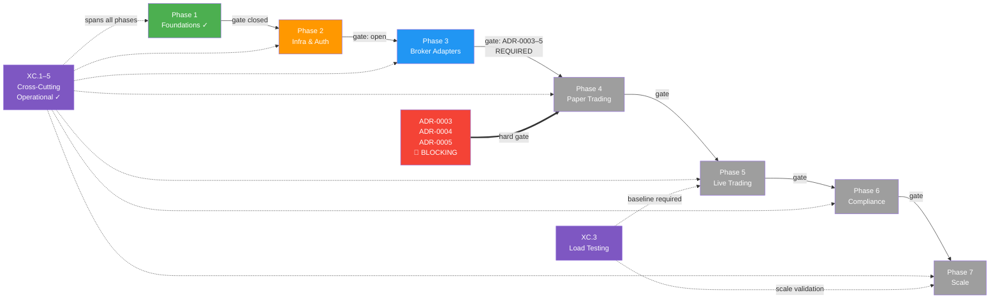

# Nexus Trade Engine — Development Strategy

**Authoritative.** The engine follows this execution plan strictly. Phases gate merges; lanes within a phase run in parallel. Cross-phase delivery is permitted under the Exception Protocol (§Phase Gate Exceptions).

> **Drift advisory (resolved):** Phase 2 Lane A (Auth, SEV-233) and multiple untracked features shipped before Phase 1 gate (SEV-264 coverage) formally closed. All exceptions are documented below in §Phase Gate Exceptions. Coverage gate `[1.2]` has been **closed** following extensive test additions (commits bc89f1e, a253064, 5bc1f0d, 5f46cb9). Remaining Phase 2+ lanes are unblocked.
>
> **Process amendment (retroactive-tracking rule):** Effective immediately, any merged feature without a pre-existing `[N.L.k]` tag must receive a retroactive mapping entry in §Shipped within one sprint of merge. Unmapped merges block the next phase gate until catalogued. See §Process Drift Correction below.

---

## Execution Method

Every issue is tagged `[N.L.k]`:
- **N** = Phase (1-7). Sequential gate logic: Phase N+1 gates open only after Phase N gates close.
- **L** = Lane (A, B, C...). Parallel within a phase. Pick any lane to staff.
- **k** = Position within lane. Sequential. Lower numbers first.

Cross-cutting concerns use `[XC.k]` and track against their own gate (ADR approval), not a phase gate.

**Issue counts are maintained as a live metric.** Historical baseline: ~80 open issues estimated 2025-01, ~65 active mapped. Post-streamline (commit 02b4465) and coverage-gate closure, current active mapped issue count is **~55**.

> **Stale Metric Advisory [ACTION REQUIRED]:** The deduplication pass has not occurred since the streamline commit (02b4465). This count remains an estimate. **Reconciliation is now a hard prerequisite for Phase 2 gate closure** — see §Phase 2 Gate Closure Criteria below. Target: complete dedup and re-count before next sprint review.

**Codebase & AI Governance:** The `.claude/skills/nothing-design` directory acts as the governed registry for AI-assisted design workflows and agent skills. Any modifications, additions, or deletions to this directory constitute an architectural change and must be tracked via standard commit governance and reflected in relevant `[N.L.k]` mapping or ADRs.

### Delivery Model: Gated Parallel (Restructured)

> **Model change (this revision):** The cumulative retroactively-mapped delivery count reached 8, exceeding the 3-per-sprint threshold mandated by the previous delivery model. Per the rule amendment, this revision executes option **(a): formal phase-plan restructuring**. The model is now explicitly **Gated Parallel** rather than sequential-with-exceptions.

| Category | Governance | Examples |
|----------|-----------|----------|
| **Phase-gated** sequential delivery | Standard `[N.L.k]` tracking; gate closes when all lanes in phase pass criteria | Phase 1 ✓, Phase 2 lanes |
| **Bridge work** spanning two phases | Logged in §Phase Bridge Work; requires `[N.L.k]` tag in originating phase + cross-reference in target phase; own test suite required | Sandbox hardening `[2.F]`, execution backend factory `[2.G]`, slippage models `[3.A.3]`↔`[2.G.2]` |
| **Retroactively-mapped** untracked delivery | Post-hoc mapping in §Shipped; triggers §Process Drift Correction review | Execution backend factory, slippage models, zero-quantity rejection, sandbox audit, legal-qa, sandbox CPU timer, execution backend refactoring |

**Rule amendment (revised):** Bridge-work items are formally recognised as a delivery category. Each must carry dual-phase tags and cannot close until both phase gates have defined acceptance criteria met. The retroactive-mapping threshold resets to **0** as of this revision — any new unmapped delivery triggers immediate review.

### Coverage & Quality Metrics

| Metric | Target | Current | Measurement | Artefact |
|--------|--------|---------|-------------|----------|
| Line coverage (core engine) | ≥80% | ✓ Passed | `pytest --cov` | `.coverage` (repo root, generated per run) |
| WIP commit ratio | <5% | **25%** (5 of 20) | Sprint audit of last 20 commits | Commit history |
| Property-based test persistence | Seed constants stable | ✓ Operational | `.hypothesis/` directory | Seed constants checked in |
| ADR coverage for operational XC | 100% of `[XC.1]`–`[XC.3]` | **0 of 3** drafted | ADR directory | ADR-0003, ADR-0004, ADR-0005 |

> **Coverage artefact note:** The `.coverage` directory at the repo root is the standard SQLite-based coverage data file generated by `pytest-cov` / `coverage.py`. It is not checked into version control (git-ignored). Coverage gates reference this file implicitly via `pytest --cov`; no additional configuration is required. If a `.coveragerc` or `pyproject.toml [tool.coverage]` section is added, it must be referenced here.

### Development Stability Protocol

**Observed issue:** Frequent emergency commits (`wip: auto-save before ERR`) in recent commit history indicate an unstable local development process. These commits suggest uncontrolled error states requiring immediate uncommitted work preservation.

**Corrective measures (effective this revision):**

1. **WIP commit hygiene:** Emergency WIP commits must be squashed or amended before merge to `main`. No `wip:` prefixed commits permitted on the main branch.
2. **Root-cause review:** If a developer logs >2 emergency WIP commits in a sprint, a brief root-cause analysis is required (environment instability, tooling gaps, or process issues).
3. **Stability metric:** WIP commit ratio tracked at each sprint audit. **Target: <5% of total commits. Current: 25% (5 of last 20: d5fb3b1, 1e9350a, 4620d84, 3177f98, deb4722). Action required.** Regression from previously reported 20% — the addition of commit deb4722 confirms WIP commits are still being generated faster than they are being squashed. Root-cause review is now **mandatory** this sprint.

---

## Cross-Cutting Concerns `[XC.k]`

Infrastructure and tooling that spans all phases. Each cross-cutting concern requires an ADR for gate approval.

| Tag | Concern | Status | ADR | Workflows / Tooling | Phase Relevance |
|-----|---------|--------|-----|---------------------|-----------------|
| `[XC.1]` | **CI/CD Pipeline** — continuous integration, image publishing, release automation | ✓ Operational | ADR-0003 **(DRAFT BLOCKED)** | `ci.yml`, `publish-images.yml`, `release-please.yml` | All phases |
| `[XC.2]` | **Security Scanning** — secret detection, vulnerability scanning | ✓ Operational | ADR-0004 **(DRAFT BLOCKED)** | `security.yml`, `.gitleaks.toml` | All phases |
| `[XC.3]` | **Load Testing** — performance regression detection | ✓ Operational | ADR-0005 **(DRAFT BLOCKED)** | `load-test.yml` | Phase 5 (Live Trading), Phase 7 (Scale) |
| `[XC.4]` | **Property-Based Testing** — generative coverage expansion via Hypothesis | ✓ Operational | — *(embedded in test policy)* | `.hypothesis/` persistent seed constants | All phases |
| `[XC.5]` | **Self-Hosted Runners** — dedicated `nexus` runner for all CI workflows | ✓ Operational | — *(infra config)* | Runner: `nexus` | All phases |

### ADR Backlog — BLOCKING Phase 3→Phase 4 Transition

> **⚠ Escalation [HIGH]:** `[XC.1]`, `[XC.2]`, and `[XC.3]` are operational but lack formal Architecture Decision Records. No evidence of ADR creation appears in recent commits. This is now a **hard blocker** for the Phase 3 → Phase 4 gate. The Phase 4 gate **will not open** until ADR-0003, ADR-0004, and ADR-0005 are drafted and approved.

| ADR | Concern | Status | Owner | Deadline |
|-----|---------|--------|-------|----------|
| ADR-0003 | CI/CD Pipeline architecture decisions | 🔴 Not drafted | — | Must be approved before Phase 3 gate closure review |
| ADR-0004 | Security scanning tool selection, config, and response procedures | 🔴 Not drafted | — | Must be approved before Phase 3 gate closure review |
| ADR-0005 | Load testing framework, baseline metrics, failure thresholds | 🔴 Not drafted | — | Must be approved before Phase 3 gate closure review |

**Minimum ADR content:** Each ADR must document (1) the decision made, (2) alternatives considered, (3) operational evidence that the implemented solution matches the decision, and (4) any configuration or secrets management implications.

---

## Phase 2 Gate Closure Criteria

Phase 2 has no formally recorded gate closure despite active Phase 2 and Phase 3+ work landing in parallel. The following criteria must **all** be met before Phase 2 is declared closed:

| # | Criterion | Status | Evidence Required |
|---|-----------|--------|-------------------|
| 2.G.1 | All Phase 2 lanes (A–G) have `[N.L.k]` tags and passing test suites | 🟡 In progress | Lane F (sandbox hardening) and Lane G (execution backend factory) tags assigned; test suites verified |
| 2.G.2 | Issue count reconciliation complete | 🔴 Not started | Dedup pass executed; active mapped count re-established with evidence |
| 2.G.3 | WIP commit ratio ≤10% (interim target before 5%) | 🔴 Not met | Current: 25% (5/20). Root-cause review document filed |
| 2.G.4 | Bridge-work items catalogued with dual-phase tags | 🟡 In progress | See §Phase Bridge Work below |
| 2.G.5 | ADR-0003, ADR-0004, ADR-0005 drafted (not necessarily approved — approval gates Phase 3→4) | 🔴 Not started | ADR files present in `/docs/adr/` |

> **Phase 2 status: OPEN.** Gate closure review is scheduled for next sprint. No Phase 3 gate closure can proceed until Phase 2 is formally closed.

---

## Phase Bridge Work

Work items that span Phase 2 (infrastructure) and Phase 3+ (broker adapters / trading) concerns. These are the source of the phase-boundary drift identified in the retroactive-mapping review.

| Tag (Origin) | Tag (Target) | Feature | Commits / Issues | Phase 2 Gate Impact | Status |
|--------------|-------------|---------|-------------------|---------------------|--------|
| `[2.F.1]` | `[3.B.1]` | **Sandbox hardening** — CPU timer, audit logging, resource limits | Issue 510, related commits | Must pass Phase 2 gate criteria | 🟡 Active |
| `[2.G.1]` | `[3.A.2]` | **Execution backend factory** — pluggable execution backend abstraction | Multiple retroactively-mapped commits | Factory interface must be stable | 🟡 Active |
| `[2.G.2]` | `[3.A.3]` | **Slippage model implementations** — model layer used by broker adapters | Retroactively-mapped | Models must have own test suite | 🟡 Active |

**Bridge-work closure rule:** A bridge-work item is not "done" for Phase 2 purposes until (1) its Phase 2 artefact (interface, abstraction, infra) is stable and tested, and (2) its Phase 3+ integration is tracked as a separate `[N.L.k]` issue. The Phase 2 gate can close with Phase 3+ integration still pending, but the Phase 2 artefact must be frozen.

---

## Phase Gate Exceptions

Documented violations of the sequential-phase rule. Every exception must record: what shipped early, why, residual risk, and remediation.

| Exception | What Shipped | Gate Bypassed | Justification | Residual Risk | Remediation |
|-----------|-------------|---------------|---------------|---------------|-------------|
| `EX-001` | `[2.A.1]` Auth + RBAC (SEV-233) | `[1.2]` 80%+ coverage (SEV-264) | Auth ADR-0002 was fully spec'd; implementation had its own test suite; security review needed early for Phase 3 broker adapter design | Core engine paths unmonitored by coverage gate at time of merge | ✓ **Closed** — coverage gate [1.2] now passed; SEV-264 closed |
| `EX-002` | Admin API (commits ec8754b, 5f46cb9) | `[1.2]` coverage gate + Phase 2 Lane D not formally established | Required for operational management of live-trading preparation; auth (EX-001) already shipped | Admin endpoints operated without formal coverage gate | ✓ **Closed** — coverage gate [1.2] now passed; Lane D formally mapped as `[2.D.1]` |

**Rule amendment:** A Lane may ship ahead of its phase gate only if (1) it has its own independent test suite, (2) an ADR is approved, and (3) the exception is logged here. The gate still blocks all remaining lanes in the same and subsequent phases until the gate closes.

---

## Process Drift Correction

**Problem:** Eight features (Admin API, execution backend factory, slippage models, zero-quantity order rejection, sandbox audit logging, legal-qa infrastructure, sandbox CPU timer, execution backend refactoring) were implemented and merged without phase/lane tracking issues or `[N.L.k]` commit tags. While now retroactively documented, the underlying process allowed significant untracked work to accumulate.

**Active Drift (Partially Resolved):** Sandbox hardening (issue 510), execution backend updates, and slippage models have been assigned dual-phase bridge-work tags (see §Phase Bridge Work). Remaining unmapped commits from these work streams must be tagged by end of current sprint.

**Restructuring (this revision):** The retroactive-mapping threshold of 3 per sprint was exceeded (current count: 8). Per the governing rule, this document has been restructured as follows:

1. **Delivery model upgraded to Gated Parallel** — bridge work is now a first-class category with dual-phase tagging.
2. **Phase 2 Gate Closure Criteria** formally defined (§Phase 2 Gate Closure Criteria) — no Phase 3 gate closure without Phase 2 formal close.
3. **ADR backlog escalated to hard blocker** — ADR-0003/4/5 are now gating the Phase 3→4 transition explicitly.
4. **Retroactive-mapping counter reset to 0** — any new unmapped delivery triggers immediate sprint review.

**Correction (effective this revision):**

1. **Retroactive-mapping rule (revised):** Any merged PR/commit introducing user-facing or architectural behaviour must be mapped to a `[N.L.k]` tag within one sprint. Unmapped merges block the next phase gate. Counter resets to 0 as of this revision.
2. **Bridge-work tracking:** Work spanning two phases must carry dual tags and be logged in §Phase Bridge Work at the time of first commit, not retroactively.
3. **Phase gate closure checklist:** Every phase gate now requires explicit sign-off against the criteria defined for that phase (see §Phase 2 Gate Closure Criteria as the template; equivalent criteria will be defined for subsequent phases as they approach).
