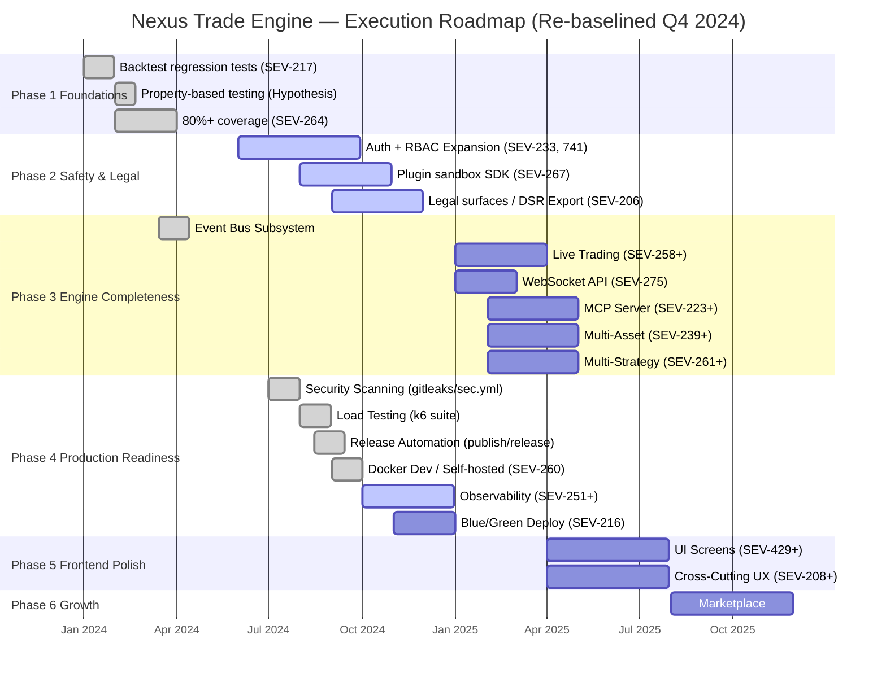

# Nexus Trade Engine — Development Strategy

**Authoritative.** The engine follows this execution plan strictly. Execution is **dependency-driven and concurrent**. Phases provide a logical progression (1-7), but parallel staffing allows Phase 2 (Safety) and Phase 4 (Production Readiness) to progress concurrently where dependencies allow. Lanes within a phase run in parallel.

---

## Execution Method

Every issue is tagged `[N.L.k]`:
- **N** = Phase (1-7). Logical progression. Phase N+1 typically starts as Phase N gates close, but infrastructure and safety lanes are processed concurrently to unblock delivery.
- **L** = Lane (A, B, C...). Parallel within a phase. Pick any lane to staff.
- **k** = Position within lane. Sequential. Lower numbers first.

**Updated Active Map:** Tracking active issues across concurrent phases, reconciling early delivery of CI infrastructure, security automation, and scope expansions in Auth/RBAC.

---

## Shipped & Completed

The following milestones have been marked as functionally complete based on recent execution evidence:

*   **[✓] Phase 1: 80%+ Coverage (SEV-264)** — Completed. Commit `51f605d` explicitly adds targeted tests for previously low-coverage modules.
*   **[✓] Phase 4: Security Scanning (4s)** — Completed. Lane functionally delivered via `.gitleaks.toml`, `security.yml`, and allowlist configurations (Commit `1177106`).
*   **[✓] Phase 4: Load Testing (4l)** — Completed. K6 load and performance regression suite landed (Commit `bd4a7fa`).
*   **[✓] Phase 4: Release Automation (4r)** — Completed. Workflows `release-please.yml` and `publish-images.yml` are fully integrated.
*   **[✓] Phase 4: Docker Dev (SEV-260)** — Completed Early. `publish-images.yml` is active and running on the self-hosted nexus runner (Commit `3f1af46`).
*   **[✓] Infrastructure: DevEx & CI** — Completed. Migration to self-hosted nexus runner succeeded (`3f1af46`), GitHub issue/PR templates established, and Claude skills directory integrated into the repository workflows.

---

## Active & In-Progress Work

*   **[Active] Phase 2: Auth + RBAC (SEV-233 / SEV-741)** — Scope has grown beyond the original lane to include critical role escalation fixes and developer access control hardening (PR #741).
*   **[Active] Phase 2: Plugin Sandbox (SEV-267)** — Execution initiated. Sandbox SDK tests and LDAP/sandbox SDK coverage actively merging (Commits `2af0632`, `ae7648e`).
*   **[Active] Phase 2: Legal Surfaces (SEV-206)** — Scope expanded to include the Privacy/DSR export module (Commit `035671a`).

---

## Roadmap Progress Overview

