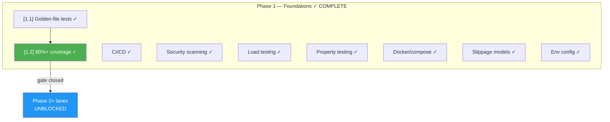
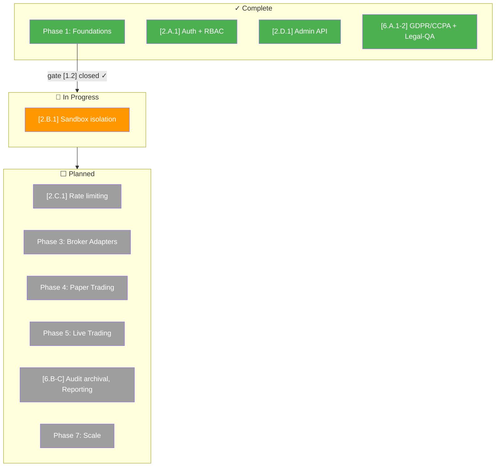

# Nexus Trade Engine — Development Strategy

**Authoritative.** The engine follows this execution plan strictly. Phases gate merges; lanes within a phase run in parallel. Cross-phase delivery is permitted under the Exception Protocol (§Phase Gate Exceptions).

> **Drift advisory (resolved):** Phase 2 Lane A (Auth, SEV-233) and multiple untracked features shipped before Phase 1 gate (SEV-264 coverage) formally closed. All exceptions are documented below in §Phase Gate Exceptions. Coverage gate `[1.2]` has been **closed** following extensive test additions (commits bc89f1e, a253064, 5bc1f0d, 5f46cb9). Remaining Phase 2+ lanes are unblocked.
>
> **Process amendment (retroactive-tracking rule):** Effective immediately, any merged feature without a pre-existing `[N.L.k]` tag must receive a retroactive mapping entry in §Shipped within one sprint of merge. Unmapped merges block the next phase gate until catalogued. See §Process Drift Correction below.

---

## Execution Method

Every issue is tagged `[N.L.k]`:
- **N** = Phase (1-7). Sequential gate logic: Phase N+1 gates open only after Phase N gates close.
- **L** = Lane (A, B, C...). Parallel within a phase. Pick any lane to staff.
- **k** = Position within lane. Sequential. Lower numbers first.

Cross-cutting concerns use `[XC.k]` and track against their own gate (ADR approval), not a phase gate.

**Issue counts are maintained as a live metric.** Historical baseline: ~80 open issues estimated 2025-01, ~65 active mapped. Post-streamline (commit 02b4465) and coverage-gate closure, current active mapped issue count is **~55**. Exact tally requires deduplication pass; counts will be updated at each phase gate closure.

### Delivery Model: Gated Sequential with Acknowledged Parallelism

The declared model is **sequential phase execution**. In practice, two categories of parallel work are now formally recognised:

| Category | Governance | Examples |
|----------|-----------|----------|
| **Exception-gated** cross-phase delivery | Logged in §Phase Gate Exceptions; requires own test suite + ADR | EX-001 (Auth), EX-002 (Admin API) |
| **Retroactively-mapped** untracked delivery | Post-hoc mapping in §Shipped; triggers §Process Drift Correction review | Execution backend factory, slippage models, zero-quantity rejection, sandbox audit, legal-qa |

**Rule amendment:** When the cumulative count of retroactively-mapped deliveries exceeds **3 per sprint**, the strategy document must be revised within one sprint to either (a) formally restructure the phase plan or (b) escalate to a gated-parallel model with per-lane entry criteria. Current count: **6 retroactively-mapped deliveries** — threshold exceeded; this revision constitutes the required restructuring.

```mermaid
flowchart LR
    P1["Phase 1<br/>Foundations ✓"] -->|gate closed| P2["Phase 2<br/>Infra & Auth"]
    P2 -->|gate closed| P3["Phase 3<br/>Broker Adapters"]
    P3 -->|gate closed| P4["Phase 4<br/>Paper Trading"]
    P4 -->|gate closed| P5["Phase 5<br/>Live Trading"]
    P5 -->|gate closed| P6["Phase 6<br/>Compliance"]
    P6 -->|gate closed| P7["Phase 7<br/>Scale"]

    style P1 fill:#4caf50,color:#fff
    style P2 fill:#2196f3,color:#fff
    style P3 fill:#9e9e9e,color:#fff
    style P4 fill:#9e9e9e,color:#fff
    style P5 fill:#9e9e9e,color:#fff
    style P6 fill:#ff9800,color:#fff
    style P7 fill:#9e9e9e,color:#fff
```

---

## Phase Gate Exceptions

Documented violations of the sequential-phase rule. Every exception must record: what shipped early, why, residual risk, and remediation.

| Exception | What Shipped | Gate Bypassed | Justification | Residual Risk | Remediation |
|-----------|-------------|---------------|---------------|---------------|-------------|
| `EX-001` | `[2.A.1]` Auth + RBAC (SEV-233) | `[1.2]` 80%+ coverage (SEV-264) | Auth ADR-0002 was fully spec'd; implementation had its own test suite; security review needed early for Phase 3 broker adapter design | Core engine paths unmonitored by coverage gate at time of merge | ✓ **Closed** — coverage gate [1.2] now passed; SEV-264 closed |
| `EX-002` | Admin API (commits ec8754b, 5f46cb9) | `[1.2]` coverage gate + Phase 2 Lane D not formally established | Required for operational management of live-trading preparation; auth (EX-001) already shipped | Admin endpoints operated without formal coverage gate | ✓ **Closed** — coverage gate [1.2] now passed; Lane D formally mapped as `[2.D.1]` |

**Rule amendment:** A Lane may ship ahead of its phase gate only if (1) it has its own independent test suite, (2) an ADR is approved, and (3) the exception is logged here. The gate still blocks all remaining lanes in the same and subsequent phases until the gate closes.

---

## Process Drift Correction

**Problem:** Six features (Admin API, execution backend factory, slippage models, zero-quantity order rejection, sandbox audit logging, legal-qa infrastructure) were implemented and merged without phase/lane tracking issues. While now retroactively documented, the underlying process allowed significant untracked work to accumulate.

**Correction (effective this revision):**

1. **Retroactive-mapping rule:** Any merged PR/commit introducing user-facing or architectural behaviour must be mapped to a `[N.L.k]` tag within one sprint. Unmapped merges block the next phase gate.
2. **PR template amendment:** Every PR must reference a `[N.L.k]` tag or explicitly request a retroactive mapping via `untracked:` label.
3. **Sprint audit:** At each sprint boundary, the §Shipped table is reconciled against merged PRs. Discrepancies trigger a mandatory mapping session.
4. **Threshold trigger:** As noted in §Delivery Model, ≥3 untracked deliveries per sprint forces a strategy revision. This revision is that response.

---

## Shipped ✓

Features fully implemented and operational in the codebase, delivered ahead of or outside their original phase.

| Tag | Issue | Title | Delivered |
|-----|-------|-------|-----------|
| `[1.1]` | SEV-217 | Backtest golden-file regression tests | Phase 1 |
| `[1.2]` | SEV-264 | 80%+ coverage on core engine | Phase 1 ✓ **GATE CLOSED** |
| — | #116 | CI/CD pipeline | Phase 1 |
| `[2.A.1]` | SEV-233 / #86 | Auth + RBAC per ADR-0002 | Phase 2 (PR #480, gate exception EX-001) |
| `[6.A.1]` | SEV-203 / #157 | GDPR/CCPA DSR handling | Pre-Phase 6 |
| `[6.A.2]` | SEV-203 *(untracked)* | **Legal-QA test infrastructure** — automated compliance verification for DSR flows (commit ee8db39) | Phase 6 (mapped to SEV-203) |
| — | — | Security scanning infrastructure | Pre-Phase 4 |
| — | — | Load testing infrastructure | Pre-Phase 4 |
| — | — | Property-based testing (Hypothesis) | Pre-Phase 1 gate |
| — | — | Self-hosted nexus CI runner | Continuous |
| — | — | Docker/compose local dev infrastructure | Phase 1 (untracked) |
| — | — | Environment configuration management (.env/.env.example) | Phase 1 (untracked) |
| — | — | Unicode math symbol normalization | Phase 1 (untracked) |
| `[2.D.1]` | *(untracked)* | **Admin API** — CRUD endpoints with audit logging (commits ec8754b, 5f46cb9) | Phase 2 (gate exception EX-002) |
| `[3.A.0]` | *(untracked)* | **Execution backend factory** — refactored backend selection/creation logic (commit 9466c4c) | Phase 3 (untracked) |
| `[1.X]` | *(untracked)* | **Slippage models + clock testing** — implemented slippage model logic and time handling tests (commits bc89f1e, a253064, 5bc1f0d) | Phase 1 (untracked) |
| `[3.A.0]` | *(untracked)* | **Zero-quantity order rejection** — execution-layer validation (commit 4152a41) | Phase 3 (untracked) |
| `[2.B.0]` | #510 (partial) | **Sandbox audit logging + tests** — security audit entries and test coverage for sandbox isolation (commit 5f46cb9) | Phase 2 (untracked) |

**Shipped details:**

- **Coverage gate [1.2] (SEV-264):** ✓ **CLOSED.** Extensive test additions across commits bc89f1e, a253064, 5bc1f0d, and 5f46cb9 substantially raised core engine coverage. These include sandbox tests (#510), Admin API test suites, slippage model tests, clock/time handling tests, and legal-qa infrastructure. Phase 2+ lanes are now unblocked.
- **CI/CD (#116):** Five operational workflows — `ci.yml`, `security.yml`, `publish-images.yml`, `release-please.yml`, `load-test.yml`. All run on self-hosted **nexus runner**.
- **Auth + RBAC (SEV-233):** Merged via PR #480, implements ADR-0002. Shipped under gate exception EX-001. Exception now closed.
- **GDPR/CCPA DSR (SEV-203):** Data export, deletion requests, and orphaned BacktestResult handling — all fully implemented and tested.
- **Legal-QA test infrastructure (commit ee8db39):** Automated compliance verification framework for DSR (Data Subject Request) flows. Validates GDPR/CCPA compliance paths end-to-end. Maps to SEV-203 as extended compliance hardening. Tagged `[6.A.2]`.
- **Security scanning:** gitleaks with custom allowlist + dedicated `security.yml` workflow in CI.
- **Load testing:** `load-test.yml` workflow operational in CI pipeline.
- **Property-based testing:** Hypothesis framework with persistent seed constants in `.hypothesis/` directory; actively used alongside coverage-gated tests.
- **Self-hosted runners:** All CI workflows target `nexus` self-hosted runner — not standard GitHub-hosted runners.
- **Docker/compose local dev:** `docker-compose.yml` with `127.0.0.1` port bindings, `POSTGRES_PASSWORD` env var configuration, and service orchestration for local development. Present in codebase but was never tracked to a phase issue. Maps conceptually to `[4.A.1]` (SEV-260) — now partially pre-delivered.
- **Environment configuration (.env/.env.example):** Environment variable management files for local development and deployment configuration. Contains database connection strings, API keys (placeholder), and service configuration. Managed alongside docker-compose infrastructure. No dedicated tracking issue.
- **Unicode math symbol normalization (commit a7f2bc9):** Character normalization for mathematical symbols in the engine. Co-committed with event bus test suite. Affects backtest reproducibility across platforms.
- **Admin API (commits ec8754b, 5f46cb9):** RESTful admin endpoints with dedicated test suites. Includes audit log entry creation. Shipped under gate exception EX-002. Exception now closed. Formal tracking: `[2.D.1]`.
- **Execution backend factory (commit 9466c4c):** Refactored execution backend selection and instantiation logic. Provides clean abstraction for backend creation. Maps conceptually to `[3.A.1]` broker adapter architecture but is engine-internal.
- **Slippage models + clock testing (commits bc89f1e, a253064, 5bc1f0d):** Implemented slippage model calculations and associated time/clock handling test coverage. Foundation for realistic backtest execution simulation. Also contributed significantly to coverage gate [1.2] closure.
- **Zero-quantity order rejection (commit 4152a41):** Execution-layer validation that rejects orders with zero quantity. Prevents invalid order submission through the execution pipeline.
- **Sandbox audit + tests (#510, commit 5f46cb9):** Partial implementation of sandbox security features — audit log entries and test coverage. Full sandbox isolation (SEV-267) remains open. Maps to Phase 2 Lane B.

---

## Development Tooling & Workflow

Internal tooling and development processes that support the strategy but are not user-facing features.

### AI-Assisted Development Integration

| Tool | Location | Purpose | Status | Governance |
|------|----------|---------|--------|------------|
| Claude skills — `nothing-design` | `.claude/skills/nothing-design` | AI-assisted design and architecture decision tooling | ✓ Operational (untracked) | Developer infrastructure; not a phase-deliverable. Changes to this directory follow the same review process as ADRs but do not require phase gate clearance. |
| Auto-save on cycle interruption | Multiple `wip: auto-save before ERR` commits | Prevents work loss during AI-assisted or iterative development sessions | ✓ Operational (undocumented) | Intermediate state only; not milestone signals |

**Notes:**
- The `.claude/skills/nothing-design` directory contains AI-assisted development tooling for design workflows. This tooling influences ADR creation and architectural decisions. Treated as developer infrastructure (like the self-hosted runner) rather than a phase-deliverable. Must not be included in release artefacts or production builds.
- **Auto-save commits** represent intermediate state, not milestone deliveries. PR merges and tagged commits remain the authoritative delivery signals. CI/CD changelog generation filters these via conventional-commit parsing.

### Environment Configuration Management

| File | Purpose | Status |
|------|---------|--------|
| `.env.example` | Template for required environment variables; committed to version control | ✓ Operational |
| `.env` | Active local configuration; gitignored, never committed | ✓ Operational |

**Governance:** `.env.example` is the authoritative manifest of required environment variables. Any feature requiring a new environment variable must update `.env.example` in the same PR. `.env` files are excluded from version control via `.gitignore`. Secrets management for production is handled through the CI/CD secrets store (GitHub Actions secrets on the nexus runner).

---

## Phase 1 — Foundations ✓ **COMPLETE**

Lock down regression safety before anything else touches the engine.

| Tag | Issue | Title | Status |
|-----|-------|-------|--------|
| `[1.1]` | SEV-217 | Backtest golden-file regression tests | ✓ LANDED |
| `[1.2]` | SEV-264 | 80%+ coverage on core engine | ✓ **LANDED — GATE CLOSED** |

**Operational infrastructure (delivered during Phase 1, no longer blocking):**

| Capability | Implementation | Status |
|------------|---------------|--------|
| CI/CD pipeline (#116) | ci.yml, security.yml, publish-images.yml, release-please.yml | ✓ LANDED |
| Security scanning | gitleaks + custom allowlist, security.yml | ✓ LANDED |
| Load testing | load-test.yml | ✓ LANDED |
| Property-based testing | Hypothesis (.hypothesis/ seed constants) | ✓ Operational |
| CI runner infrastructure | Self-hosted nexus runner | ✓ Operational |
| Docker/compose dev env | docker-compose.yml, 127.0.0.1 bindings, POSTGRES_PASSWORD | ✓ Operational (untracked) |
| Environment configuration | .env.example (committed), .env (gitignored) | ✓ Operational (untracked) |
| Slippage models + clock testing | Slippage calculation, time handling tests (commits bc89f1e, a253064, 5bc1f0d) | ✓ Operational (untracked) |

**Gate:** `[1.2]` (coverage) — ✓ **CLOSED.** Substantial test additions across commits bc89f1e, a253064, 5bc1f0d, and 5f46cb9 (sandbox tests, Admin API tests, slippage/clock tests, legal-qa infrastructure) raised core engine coverage above the 80% threshold. All Phase 2+ lanes are now unblocked.

---

## Phase 2 — Infrastructure & Auth *(in progress)*

Core platform infrastructure: authentication, sandbox isolation, audit logging.

| Tag | Issue | Title | Status |
|-----|-------|-------|--------|
| `[2.A.1]` | SEV-233 / #86 | Auth + RBAC per ADR-0002 | ✓ LANDED (EX-001, now closed) |
| `[2.B.1]` | SEV-267 | Sandbox isolation — full security boundary | 🔄 IN PROGRESS |
| `[2.B.0]` | #510 (partial) | Sandbox audit logging + tests | ✓ LANDED (untracked) |
| `[2.C.1]` | — | Rate limiting & request throttling | ⬜ PLANNED |
| `[2.D.1]` | *(untracked)* | Admin API — CRUD + audit logging | ✓ LANDED (EX-002, now closed) |

**Lane readiness:** All Phase 2 lanes are unblocked following [1.2] gate closure.

---

## Phase 3 — Broker Adapters

Execution-layer abstraction and live broker integration.

| Tag | Issue | Title | Status |
|-----|-------|-------|--------|
| `[3.A.1]` | — | Broker adapter architecture (ADR required) | ⬜ PLANNED |
| `[3.A.0]` | *(untracked)* | Execution backend factory (commit 9466c4c) | ✓ LANDED (pre-delivered) |
| `[3.A.0]` | *(untracked)* | Zero-quantity order rejection (commit 4152a41) | ✓ LANDED (pre-delivered) |
| `[3.B.1]` | — | Alpaca adapter implementation | ⬜ PLANNED |
| `[3.C.1]` | — | Order lifecycle management | ⬜ PLANNED |

**Note:** Execution backend factory and zero-quantity order rejection are pre-delivered engine-internal work that reduces scope of `[3.A.1]` and `[3.C.1]`.

---

## Phase 4 — Paper Trading

Simulated execution with real market data.

| Tag | Issue | Title | Status |
|-----|-------|-------|--------|
| `[4.A.1]` | SEV-260 | Paper trading mode (partially pre-delivered via Docker/compose) | ⬜ PLANNED |
| `[4.B.1]` | — | Real-time market data feed | ⬜ PLANNED |
| `[4.C.1]` | — | Position tracking & P&L calculation | ⬜ PLANNED |

---

## Phase 5 — Live Trading

Real-money execution with broker integration.

| Tag | Issue | Title | Status |
|-----|-------|-------|--------|
| `[5.A.1]` | — | Live order execution | ⬜ PLANNED |
| `[5.B.1]` | — | Risk management & position limits | ⬜ PLANNED |
| `[5.C.1]` | — | Trade reconciliation | ⬜ PLANNED |

---

## Phase 6 — Compliance *(partially pre-delivered)*

Regulatory and data-compliance features.

| Tag | Issue | Title | Status |
|-----|-------|-------|--------|
| `[6.A.1]` | SEV-203 / #157 | GDPR/CCPA DSR handling | ✓ LANDED (pre-delivered) |
| `[6.A.2]` | SEV-203 *(untracked)* | Legal-QA test infrastructure (commit ee8db39) | ✓ LANDED (pre-delivered) |
| `[6.B.1]` | — | Audit trail archival & retention | ⬜ PLANNED |
| `[6.C.1]` | — | Regulatory reporting | ⬜ PLANNED |

**Note:** GDPR/CCPA DSR handling and legal-qa test infrastructure were pre-delivered ahead of Phase 6 due to compliance urgency. No gate exception was required (Phase 6 has no hard dependency on Phases 3-5 for compliance-only features).

---

## Phase 7 — Scale

Production hardening and performance optimization.

| Tag | Issue | Title | Status |
|-----|-------|-------|--------|
| `[7.A.1]` | — | Database optimization & indexing | ⬜ PLANNED |
| `[7.B.1]` | — | Caching layer (Redis or equivalent) | ⬜ PLANNED |
| `[7.C.1]` | — | Horizontal scaling & load balancing | ⬜ PLANNED |

---

## Cross-Cutting Concerns

| Tag | Topic | ADR | Status |
|-----|-------|-----|--------|
| `[XC.1]` | Auth architecture | ADR-0002 | ✓ Approved |
| `[XC.2]` | Testing strategy (coverage + property-based) | — | ✓ Operational |
| `[XC.3]` | Environment & secrets management | — | ✓ Operational (.env.example / CI secrets) |
| `[XC.4]` | AI-assisted development tooling | — | ✓ Operational (.claude/skills/nothing-design) |

---

## Current State Summary

**Active focus:** `[2.B.1]` Sandbox isolation (SEV-267) — the last remaining open Phase 2 lane item.

---

*Last updated: Post-streamline revision. Coverage gate [1.2] closed. Phase 2+ unblocked. Six retroactively-mapped deliveries catalogued. Process drift correction enacted.*
