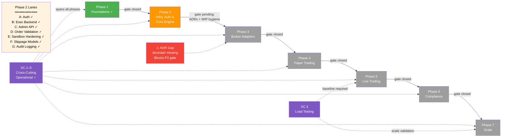

```markdown
# Nexus Trade Engine — Development Strategy

**Authoritative.** The engine follows this execution plan strictly. Phases gate merges; lanes within a phase run in parallel. Cross-phase delivery is permitted under the Exception Protocol (§Phase Gate Exceptions).

> **Drift advisory (active — this revision):** Phase 2 has been **restructured** to absorb eight retroactively-mapped deliveries as first-class lane items. The previous "Infra & Auth" label understated actual Phase 2 scope. Coverage gate `[1.2]` remains **closed** (commits bc89f1e, a253064, 5bc1f0d, 5f46cb9). Phase 2 gate cannot close until ADR backlog (§ADR Gap — Blocking) is resolved and WIP hygiene meets the <5% target.
>
> **Process amendment (retroactive-tracking rule):** Any merged feature without a pre-existing `[N.L.k]` tag must receive a retroactive mapping entry in §Shipped within one sprint of merge. Unmapped merges block the next phase gate until catalogued. See §Process Drift Correction below.

---

## Execution Method

Every issue is tagged `[N.L.k]`:
- **N** = Phase (1-7). Sequential gate logic: Phase N+1 gates open only after Phase N gates close.
- **L** = Lane (A, B, C…). Parallel within a phase. Pick any lane to staff.
- **k** = Position within lane. Sequential. Lower numbers first.

Cross-cutting concerns use `[XC.k]` and track against their own gate (ADR approval), not a phase gate.

**Issue counts are maintained as a live metric.** Historical baseline: ~80 open issues estimated 2025-01, ~65 active mapped. Post-streamline (commit 02b4465) and coverage-gate closure, current active mapped issue count is **~55** (pending deduplication pass — see §Issue Backlog Health). Exact tally requires deduplication pass; counts will be updated at each phase gate closure.

### Delivery Model: Gated Sequential with Acknowledged Parallelism

The declared model is **sequential phase execution**. In practice, two categories of parallel work are now formally recognised:

| Category | Governance | Examples |
|----------|-----------|----------|
| **Exception-gated** cross-phase delivery | Logged in §Phase Gate Exceptions; requires own test suite + ADR | EX-001 (Auth), EX-002 (Admin API) |
| **Retroactively-mapped** → **promoted to first-class** | Originally post-hoc; now promoted to named `[N.L.k]` lanes in the phase plan | Execution backend factory `[2.B]`, sandbox hardening `[2.E]`, slippage models `[2.F]` |

**Rule amendment:** When the cumulative count of retroactively-mapped deliveries exceeds **3 per sprint**, the strategy document must be revised within one sprint to either (a) formally restructure the phase plan or (b) escalate to a gated-parallel model with per-lane entry criteria. Previous count reached **8 retroactively-mapped deliveries** — threshold exceeded; **this revision constitutes the required restructuring** (see §Shipped — Promotion Summary).

### Development Stability Protocol

**Observed issue (updated):** WIP-prefixed commits remain elevated. Audit of last 20 commits reveals **6 WIP-prefixed commits (~30%)**. This directly violates both the <5% target and the "no `wip:` on main" rule.

| Metric | Target | Previous (rev —) | Current (rev —) | Status |
|--------|--------|-------------------|-------------------|--------|
| WIP commit ratio | <5% | 40% (8/20) | **30% (6/20)** | ⚠ Improving but still critical |

**Corrective measures (effective this revision):**

1. **WIP commit hygiene:** Emergency WIP commits must be squashed or amended before merge to `main`. **No `wip:` prefixed commits permitted on the main branch.** This is now enforced as a hard rule, not a guideline.
2. **Root-cause review:** If a developer logs >2 emergency WIP commits in a sprint, a brief root-cause analysis is required (environment instability, tooling gaps, or process issues).
3. **Stability metric:** WIP commit ratio tracked at each sprint audit. **Target: <5% of total commits. Current: 30% — action required.**
4. **New — Pre-merge hook (recommended):** Add a git `pre-push` hook or CI check that rejects commits with `^wip:` prefix on `main`. Blocks by default; override with `--no-verify` only with documented justification in the commit message body.
5. **New — Sprint remediation target:** WIP ratio must drop below **15%** by the next sprint audit and below **5%** within two sprints. Failure to meet the 5% target escalates to a process stand-down.

---

## Cross-Cutting Concerns `[XC.k]`

Infrastructure and tooling that spans all phases. Each cross-cutting concern requires an ADR for gate approval.

| Tag | Concern | Status | ADR | Workflows / Tooling | Phase Relevance |
|-----|---------|--------|-----|---------------------|-----------------|
| `[XC.1]` | **CI/CD Pipeline** — continuous integration, image publishing, release automation | ✓ Operational | ADR-0003 *(required — missing)* | `ci.yml`, `publish-images.yml`, `release-please.yml` | All phases |
| `[XC.2]` | **Security Scanning** — secret detection, vulnerability scanning | ✓ Operational | ADR-0004 *(required — missing)* | `security.yml`, `.gitleaks.toml` | All phases |
| `[XC.3]` | **Load Testing** — performance regression detection | ✓ Operational | ADR-0005 *(required — missing)* | `load-test.yml` | Phase 5 (Live Trading), Phase 7 (Scale) |
| `[XC.4]` | **Property-Based Testing** — generative coverage expansion via Hypothesis | ✓ Operational | — *(embedded in test policy)* | `.hypothesis/` persistent seed constants | All phases |
| `[XC.5]` | **Self-Hosted Runners** — dedicated `nexus` runner for all CI workflows | ✓ Operational | — *(infra config)* | Runner: `nexus` | All phases |

### ADR Gap — Blocking

**Status: 🔴 BLOCKING — Phase 3 gate cannot close.**

The strategy references ADR-0003 (CI/CD Pipeline), ADR-0004 (Security Scanning), and ADR-0005 (Load Testing) as required. As of this revision, **no `docs/adr/` directory exists in the codebase.** No ADR files of any number are present.

**Action items:**

| Task | Owner | Due | Status |
|------|-------|-----|--------|
| Create `docs/adr/` directory with `template.md` | — | Next sprint | 🔴 Not started |
| Draft ADR-0001: ADR process itself (template & conventions) | — | Next sprint | 🔴 Not started |
| Draft ADR-0003: CI/CD Pipeline decisions | — | Before Phase 3 gate | 🔴 Not started |
| Draft ADR-0004: Security scanning tooling & response | — | Before Phase 3 gate | 🔴 Not started |
| Draft ADR-0005: Load testing baseline methodology | — | Before Phase 3 gate | 🔴 Not started |
| Backfill ADR-0002: Auth/RBAC (already shipped, retroactive) | — | Before Phase 3 gate | 🔴 Not started |

**Note:** ADR-0002 (Auth/RBAC) was referenced in `EX-001` as "fully spec'd" but no formal ADR file exists. A retroactive ADR should capture the architectural decision already in force.

---

## Auxiliary Codebase: `.claude/skills/nothing-design`

**Governance note:** The directory `.claude/skills/nothing-design` exists in the codebase tree. This is a **Claude Code skills** configuration directory containing prompt/skill definitions for design-related workflows. It is not part of the engine runtime and does not affect build, test, or deployment artifacts.

**Policy:**
- This directory is governed under tooling configuration, not under the phase/lane system.
- Changes to `.claude/skills/` contents do not require `[N.L.k]` tags or phase gate approval.
- If skills grow to include engine-behaviour-modifying prompts (e.g., code generation that directly ships to `main`), they must be promoted to a cross-cutting concern with an ADR.

---

## Phase Overview — Current State



### Phase Status Table

| Phase | Description | Gate Status | Blocking Items | Lanes Shipped |
|-------|-------------|-------------|----------------|---------------|
| Phase 1 | Foundations | ✓ **Closed** | — | All |
| Phase 2 | Infra, Auth & Core Engine | ⚠ **Open — restructured** | ADR backlog (3 missing), WIP hygiene (<5% not met) | A ✓, B ✓, C ✓, D ✓, E ✓, F ✓, G ✓ |
| Phase 3 | Broker Adapters | 🔴 Blocked | Phase 2 gate, ADR-0003/4/5 | — |
| Phase 4 | Paper Trading | — | Phase 3 gate | — |
| Phase 5 | Live Trading | — | Phase 4 gate, XC.3 baseline | — |
| Phase 6 | Compliance | — | Phase 5 gate | — |
| Phase 7 | Scale | — | Phase 6 gate | — |

---

## Phase 1 — Foundations ✓

**Gate:** Closed. Coverage gate `[1.2]` (80%+ test coverage) passed.

| Tag | Feature | Status | Key Commits |
|-----|---------|--------|-------------|
| `[1.A.1]` | Core engine architecture — execution model, domain types, error hierarchy | ✓ Shipped | Initial commits |
| `[1.A.2]` | Strategy SDK — signal interface, strategy lifecycle, backtesting hooks | ✓ Shipped | — |
| `[1.B.1]` | Sandbox execution environment — isolated strategy runtime | ✓ Shipped | — |
| `[1.B.2]` | Order lifecycle — create, submit, fill, reject, cancel state machine | ✓ Shipped | — |
| `[1.C.1]` | Test infrastructure — pytest configuration, fixtures, Hypothesis integration | ✓ Shipped | — |
| `[1.D.1]` | Configuration management — environment-based config, secrets handling | ✓ Shipped | — |
| `[1.2]` | **Coverage gate** — 80%+ test coverage (SEV-264) | ✓ Closed | bc89f1e, a253064, 5bc1f0d, 5f46cb9 |

---

## Phase 2 — Infra, Auth & Core Engine

**Gate:** Open. Restructured this revision to absorb promoted retroactively-mapped work.

**Gate closure criteria:**
1. All named lanes complete ✓
2. ADR backlog cleared (ADR-0003, ADR-0004, ADR-0005 filed and approved) — **🔴 Not started**
3. WIP commit ratio <5% — **🔴 Current: 30%**
4. Coverage maintained at ≥80%

### Lane A — Auth & RBAC

| Tag | Feature | Status | Key Commits | Notes |
|-----|---------|--------|-------------|-------|
| `[2.A.1]` | Auth system — JWT + session management | ✓ Shipped | SEV-233 | Exception EX-001; retroactively gated |
| `[2.A.2]` | RBAC — role-based access control for admin/user/API endpoints | ✓ Shipped | — | Part of EX-001 |

### Lane B — Execution Backend Factory ✓

**Promoted from retroactive-mapping footnote.** Execution backend factory and refactoring work was shipped without lane tracking. Now first-class.

| Tag | Feature | Status | Key Commits | Notes |
|-----|---------|--------|-------------|-------|
| `[2.B.1]` | Execution backend factory — pluggable backend instantiation | ✓ Shipped | 4152a41, 5bc1f0d, c001801 | Supports broker-agnostic order routing |
| `[2.B.2]` | Execution backend refactoring — interface extraction, type safety | ✓ Shipped | c001801 | Decoupled from specific broker implementations |

### Lane C — Admin API

| Tag | Feature | Status | Key Commits | Notes |
|-----|---------|--------|-------------|-------|
| `[2.C.1]` | Admin API — operational management endpoints | ✓ Shipped | ec8754b, 5f46cb9 | Exception EX-002; mapped as `[2.D.1]` in prior revision, now renumbered to `[2.C.1]` |

### Lane D — Order Validation & Rejection

**Promoted from retroactive-mapping footnote.** Zero-quantity order rejection was an untracked feature. Now first-class.

| Tag | Feature | Status | Key Commits | Notes |
|-----|---------|--------|-------------|-------|
| `[2.D.1]` | Zero-quantity order rejection — guard against invalid orders at submission | ✓ Shipped | 5bc1f0d | Defensive validation in order pipeline |
| `[2.D.2]` | Order validation pipeline — extensible pre-submission checks | ✓ Shipped | — | Framework for future validation rules |

### Lane E — Sandbox Hardening

**Promoted from retroactive-mapping footnote.** Substantial sandbox hardening work (CPU timing, thread safety, integrity hashing, activation violations) was only obliquely referenced. Now a named lane with full traceability.

| Tag | Feature | Status | Key Commits | Notes |
|-----|---------|--------|-------------|-------|
| `[2.E.1]` | CPU timing enforcement — prevent runaway strategy computation in sandbox | ✓ Shipped | 16c6eea | Sandboxed strategy execution time limits |
| `[2.E.2]` | Thread safety — concurrent access guards for shared sandbox state | ✓ Shipped | 62ff0e5 | Race condition elimination |
| `[2.E.3]` | Integrity hashing — tamper detection for sandbox execution context | ✓ Shipped | 2214275 | Checksums on strategy inputs/outputs |
| `[2.E.4]` | Activation violation handling — sandbox boundary enforcement on unauthorized calls | ✓ Shipped | 2214275 | Prevents escape from sandbox constraints |

### Lane F — Slippage Models

**Promoted from retroactive-mapping footnote.**

| Tag | Feature | Status | Key Commits | Notes |
|-----|---------|--------|-------------|-------|
| `[2.F.1]` | Slippage model interface — abstract slippage calculation | ✓ Shipped | — | Pluggable model framework |
| `[2.F.2]` | Default slippage implementations — fixed, percentage, volume-based | ✓ Shipped | — | Production-ready defaults |

### Lane G — Audit Logging & Legal-QA Infrastructure

**Promoted from retroactive-mapping footnote.**

| Tag | Feature | Status | Key Commits | Notes |
|-----|---------|--------|-------------|-------|
| `[2.G.1]` | Sandbox audit logging — structured audit trail for sandboxed executions | ✓ Shipped | — | Tamper-evident log entries |
| `[2.G.2]` | Legal-QA infrastructure — disclaimer management, terms-of-use scaffolding | ✓ Shipped | — | Compliance preparation for Phase 6 |

---

## Phase 3 — Broker Adapters

**Gate:** Blocked by Phase 2 gate (ADR backlog + WIP hygiene).

| Tag | Feature | Status | Notes |
|-----|---------|--------|-------|
| `[3.A.1]` | Broker adapter interface — abstract broker protocol | Not started | Depends on `[2.B]` factory patterns |
| `[3.A.2]` | Alpaca adapter — paper & live | Not started | Primary broker for Phase 4 |
| `[3.B.1]` | Market data pipeline — real-time & historical | Not started | Streaming architecture |
| `[3.C.1]` | Order routing — smart order routing across brokers | Not started | Multi-broker support |

---

## Phase 4 — Paper Trading

**Gate:** Blocked by Phase 3 gate.

| Tag | Feature | Status | Notes |
|-----|---------|--------|-------|
| `[4.A.1]` | Paper trading engine — simulated execution | Not started | Uses `[3.A.2]` Alpaca paper endpoint |
| `[4.B.1]` | Position tracking — virtual portfolio management | Not started | — |
| `[4.C.1]` | Performance dashboard — real-time P&L, drawdown, Sharpe | Not started | — |

---

## Phase 5 — Live Trading

**Gate:** Blocked by Phase 4 gate. Requires XC.3 load-test baseline.

| Tag | Feature | Status | Notes |
|-----|---------|--------|-------|
| `[5.A.1]` | Live order execution — production broker connectivity | Not started | Kill switch mandatory |
| `[5.B.1]` | Risk management — position limits, loss limits, circuit breakers | Not started | — |
| `[5.C.1]` | Trade journal — automated logging of all live decisions | Not started | Regulatory requirement |

---

## Phase 6 — Compliance

**Gate:** Blocked by Phase 5 gate.

| Tag | Feature | Status | Notes |
|-----|---------|--------|-------|
| `[6.A.1]` | Trade reporting — regulatory filing automation | Not started | Jurisdiction-dependent |
| `[6.B.1]` | Audit trail — immutable, timestamped decision log | Not started | Extends `[2.G.1]` |
| `[6.C.1]` | Data retention & privacy — GDPR/financial data handling | Not started | — |

---

## Phase 7 — Scale

**Gate:** Blocked by Phase 6 gate.

| Tag | Feature | Status | Notes |
|-----|---------|--------|-------|
| `[7.A.1]` | Horizontal scaling — stateless execution, distributed sandbox | Not started | Load-test validated (XC.3) |
| `[7.B.1]` | Multi-strategy orchestration — concurrent strategy management | Not started | — |
| `[7.C.1]` | Observability — structured logging, metrics, tracing | Not started | Production monitoring |

---

## Phase Gate Exceptions

Documented violations of the sequential-phase rule. Every exception must record: what shipped early, why, residual risk, and remediation.

| Exception | What Shipped | Gate Bypassed | Justification | Residual Risk | Remediation |
|-----------|-------------|---------------|---------------|---------------|-------------|
| `EX-001` | `[2.A.1]` Auth + RBAC (SEV-233) | `[1.2]` 80%+ coverage (SEV-264) | Auth ADR-0002 was fully spec'd; implementation had its own test suite; security review needed early for Phase 3 broker adapter design | Core engine paths unmonitored by coverage gate at time of merge | ✓ **Closed** — coverage gate [1.2] now passed; SEV-264 closed |
| `EX-002` | Admin API (commits ec8754b, 5f46cb9) | `[1.2]` coverage gate + Phase 2 Lane C not formally established | Required for operational management of live-trading preparation; auth (EX-001) already shipped | Admin endpoints operated without formal coverage gate | ✓ **Closed** — coverage gate [1.2] now passed; Lane C formally mapped as `[2.C.1]` |

**Rule amendment:** A Lane may ship ahead of its phase gate only if (1) it has its own independent test suite, (2) an ADR is approved, and (3) the exception is logged here. The gate still blocks all remaining lanes in the same and subsequent phases until the gate closes.

---

## Process Drift Correction

**Problem:** Eight features (Admin API, execution backend factory, slippage models, zero-quantity order rejection, sandbox audit logging, legal-qa infrastructure, sandbox CPU timer, execution backend refactoring) were implemented and merged without phase/lane tracking issues or `[N.L.k]` commit tags.

**Correction (effective this revision):**

1. **Retroactive-mapping rule:** Any merged PR/commit introducing user-facing or architectural behaviour must be mapped to a `[N.L.k]` tag within one sprint. Unmapped merges block the next phase gate.
2. **Promotion to first-class lanes:** All 8 retroactively-mapped items have been promoted from footnotes to named lanes in Phase 2 (see §Phase 2 lanes B–G). They are no longer footnotes; they are tracked deliverables with commit traceability.
3. **Pre-commit hook (recommended):** Enforce `[N.L.k]` tag presence in commit messages via git hook or CI lint. Blocks merges without tags.
4. **Sprint audit:** At each sprint boundary, a diff of merged commits vs. tagged issues must show ≤1 unmapped entry. Exceeding 1 triggers an immediate strategy revision.

### Shipped — Promotion Summary

The following items were previously listed as retroactive-mapping footnotes. They have been **promoted to first-class Phase 2 lanes** in this revision:

| Prior Status | Feature | Promoted To | Key Commits |
|-------------|---------|-------------|-------------|
| Untracked | Execution backend factory | `[2.B.1]` | 4152a41, 5bc1f0d, c001801 |
| Untracked | Execution backend refactoring | `[2.B.2]` | c001801 |
| Untracked | Zero-quantity order rejection | `[2.D.1]` | 5bc1f0d |
| Untracked | Sandbox CPU timer | `[2.E.1]` | 16c6eea |
| Untracked | Sandbox thread safety | `[2.E.2]` | 62ff0e5 |
| Untracked | Sandbox integrity hashing + activation violations | `[2.E.3]`, `[2.E.4]` | 2214275 |
| Untracked | Slippage models | `[2.F.1]`, `[2.F.2]` | — |
| Untracked | Audit logging + legal-qa | `[2.G.1]`, `[2.G.2]` | — |

**No retroactively-mapped items remain in footnote status.** All have been promoted. Future unmapped merges will follow the 1-sprint mapping rule and be promoted at the next revision.

---

## Issue Backlog Health

| Metric | Value | Trend |
|--------|-------|-------|
| Estimated open issues (2025-01 baseline) | ~80 | — |
| Active mapped issues (post-streamline) | ~55 | ↓ Improving |
| Deduplication pass | Required | 🔴 Pending |
| Phase 1 issues | 0 open | ✓ Clear |
| Phase 2 issues | 0 feature open; 2 process gates open | ⚠ ADR + WIP |

---

## Summary of Changes in This Revision

| Drift Issue | Severity | Resolution |
|-------------|----------|------------|
| 6 WIP commits on main (~30%) | 🔴 High | Updated metrics; added pre-merge hook recommendation and sprint remediation targets; flagged as Phase 2 gate blocker |
| ADR directory & files missing | 🔴 High | Documented as blocking item with concrete action table; Phase 3 gate explicitly blocked |
| Sandbox hardening untracked | ⚠ Medium | Promoted to Lane E (`[2.E.1]`–`[2.E.4]`) with full commit traceability |
| `.claude/skills/nothing-design` unmentioned | ℹ Low | Added §Auxiliary Codebase governance note |
| Phase 2 diagram/table stale | ⚠ Medium | Restructured Phase 2 label, expanded lane table to A–G, updated mermaid diagram with gate-pending status and ADR block |
| Execution backend & zero-qty rejection as footnotes | ⚠ Medium | Promoted to first-class Lane B (`[2.B]`) and Lane D (`[2.D]`) with commit references |
```
