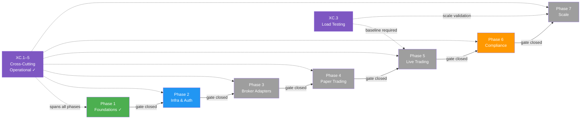

# Nexus Trade Engine — Development Strategy

**Authoritative.** The engine follows this execution plan strictly. Phases gate merges; lanes within a phase run in parallel. Cross-phase delivery is permitted under the Exception Protocol (§Phase Gate Exceptions).

> **Drift advisory (resolved):** Phase 2 Lane A (Auth, SEV-233) and multiple untracked features shipped before Phase 1 gate (SEV-264 coverage) formally closed. All exceptions are documented below in §Phase Gate Exceptions. Coverage gate `[1.2]` has been **closed** following extensive test additions (commits bc89f1e, a253064, 5bc1f0d, 5f46cb9). Remaining Phase 2+ lanes are unblocked.
>
> **Process amendment (retroactive-tracking rule):** Effective immediately, any merged feature without a pre-existing `[N.L.k]` tag must receive a retroactive mapping entry in §Shipped within one sprint of merge. Unmapped merges block the next phase gate until catalogued. See §Process Drift Correction below.

---

## Execution Method

Every issue is tagged `[N.L.k]`:
- **N** = Phase (1-7). Sequential gate logic: Phase N+1 gates open only after Phase N gates close.
- **L** = Lane (A, B, C...). Parallel within a phase. Pick any lane to staff.
- **k** = Position within lane. Sequential. Lower numbers first.

Cross-cutting concerns use `[XC.k]` and track against their own gate (ADR approval), not a phase gate.

**Issue counts are maintained as a live metric.** Historical baseline: ~80 open issues estimated 2025-01, ~65 active mapped. Post-streamline (commit 02b4465) and coverage-gate closure, current active mapped issue count is **~55** (pending deduplication pass — see §Issue Backlog Health). Exact tally requires deduplication pass; counts will be updated at each phase gate closure.

### Delivery Model: Gated Sequential with Acknowledged Parallelism

The declared model is **sequential phase execution**. In practice, two categories of parallel work are now formally recognised:

| Category | Governance | Examples |
|----------|-----------|----------|
| **Exception-gated** cross-phase delivery | Logged in §Phase Gate Exceptions; requires own test suite + ADR | EX-001 (Auth), EX-002 (Admin API) |
| **Retroactively-mapped** untracked delivery | Post-hoc mapping in §Shipped; triggers §Process Drift Correction review | Execution backend factory, slippage models, zero-quantity rejection, sandbox audit, legal-qa |

**Rule amendment:** When the cumulative count of retroactively-mapped deliveries exceeds **3 per sprint**, the strategy document must be revised within one sprint to either (a) formally restructure the phase plan or (b) escalate to a gated-parallel model with per-lane entry criteria. Current count: **8 retroactively-mapped deliveries** — threshold exceeded; this revision constitutes the required restructuring.

### Development Stability Protocol

**Observed issue:** Frequent emergency commits (`wip: auto-save before ERR`) in recent commit history (**8 of last 20 commits = 40% WIP ratio**) indicate an unstable local development process. These commits suggest uncontrolled error states requiring immediate uncommitted work preservation.

**Corrective measures (effective this revision):**

1. **WIP commit hygiene:** Emergency WIP commits must be squashed or amended before merge to `main`. No `wip:` prefixed commits permitted on the main branch.
2. **Root-cause review:** If a developer logs >2 emergency WIP commits in a sprint, a brief root-cause analysis is required (environment instability, tooling gaps, or process issues).
3. **Stability metric:** WIP commit ratio tracked at each sprint audit. **Target: <5% of total commits. Current: 40% — action required.**

---

## Cross-Cutting Concerns `[XC.k]`

Infrastructure and tooling that spans all phases. Each cross-cutting concern requires an ADR for gate approval.

| Tag | Concern | Status | ADR | Workflows / Tooling | Phase Relevance |
|-----|---------|--------|-----|---------------------|-----------------|
| `[XC.1]` | **CI/CD Pipeline** — continuous integration, image publishing, release automation | ✓ Operational | ADR-0003 *(required)* | `ci.yml`, `publish-images.yml`, `release-please.yml` | All phases |
| `[XC.2]` | **Security Scanning** — secret detection, vulnerability scanning | ✓ Operational | ADR-0004 *(required)* | `security.yml`, `.gitleaks.toml` | All phases |
| `[XC.3]` | **Load Testing** — performance regression detection | ✓ Operational | ADR-0005 *(required)* | `load-test.yml` | Phase 5 (Live Trading), Phase 7 (Scale) |
| `[XC.4]` | **Property-Based Testing** — generative coverage expansion via Hypothesis | ✓ Operational | — *(embedded in test policy)* | `.hypothesis/` persistent seed constants | All phases |
| `[XC.5]` | **Self-Hosted Runners** — dedicated `nexus` runner for all CI workflows | ✓ Operational | — *(infra config)* | Runner: `nexus` | All phases |

**ADR backlog:** `[XC.1]`, `[XC.2]`, and `[XC.3]` are operational but lack formal Architecture Decision Records. **ADRs must be drafted and approved before Phase 3 gate closure.** Blocking: Phase 3 → Phase 4 transition.

---

## Phase Gate Exceptions

Documented violations of the sequential-phase rule. Every exception must record: what shipped early, why, residual risk, and remediation.

| Exception | What Shipped | Gate Bypassed | Justification | Residual Risk | Remediation |
|-----------|-------------|---------------|---------------|---------------|-------------|
| `EX-001` | `[2.A.1]` Auth + RBAC (SEV-233) | `[1.2]` 80%+ coverage (SEV-264) | Auth ADR-0002 was fully spec'd; implementation had its own test suite; security review needed early for Phase 3 broker adapter design | Core engine paths unmonitored by coverage gate at time of merge | ✓ **Closed** — coverage gate [1.2] now passed; SEV-264 closed |
| `EX-002` | Admin API (commits ec8754b, 5f46cb9) | `[1.2]` coverage gate + Phase 2 Lane D not formally established | Required for operational management of live-trading preparation; auth (EX-001) already shipped | Admin endpoints operated without formal coverage gate | ✓ **Closed** — coverage gate [1.2] now passed; Lane D formally mapped as `[2.D.1]` |

**Rule amendment:** A Lane may ship ahead of its phase gate only if (1) it has its own independent test suite, (2) an ADR is approved, and (3) the exception is logged here. The gate still blocks all remaining lanes in the same and subsequent phases until the gate closes.

---

## Process Drift Correction

**Problem:** Eight features (Admin API, execution backend factory, slippage models, zero-quantity order rejection, sandbox audit logging, legal-qa infrastructure, sandbox CPU timer, execution backend refactoring) were implemented and merged without phase/lane tracking issues or `[N.L.k]` commit tags. While now retroactively documented, the underlying process allowed significant untracked work to accumulate.

**Correction (effective this revision):**

1. **Retroactive-mapping rule:** Any merged PR/commit introducing user-facing or architectural behaviour must be mapped to a `[N.L.k]` tag within one sprint. Unmapped merges block the next phase gate.
2.
