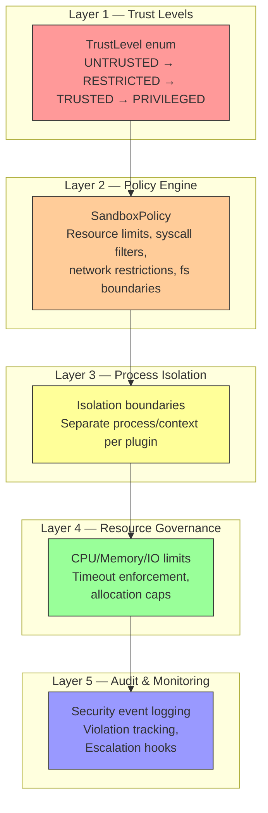
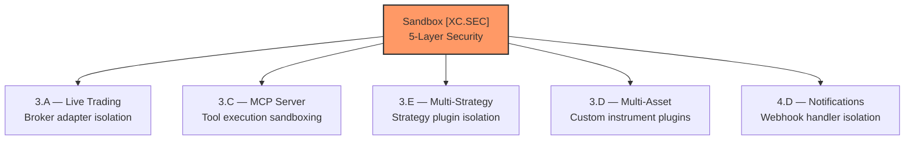
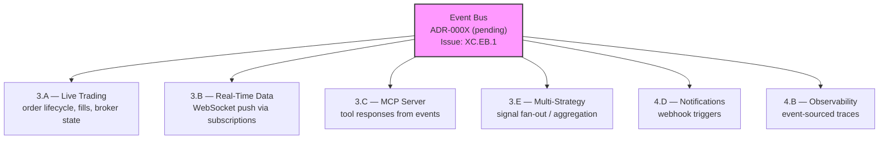
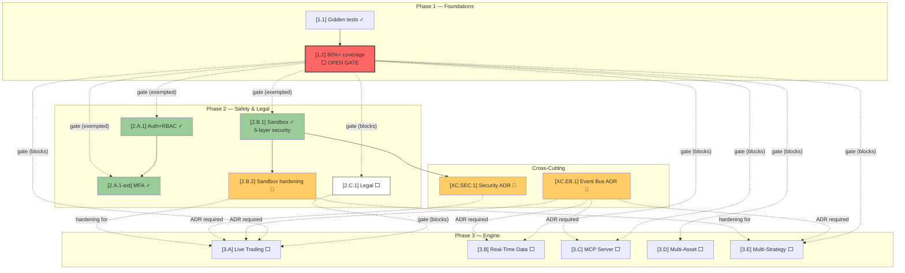

# Nexus Trade Engine — Development Strategy

**Authoritative.** The engine follows this execution plan strictly. Phases run sequentially. Lanes within a phase run in parallel.

> **Drift advisory (current sprint):** Phase 2 Lane A (Auth, SEV-233) shipped before Phase 1 gate (SEV-264 coverage) formally closed. The sandbox feature (Phase 2 Lane B) is actively being developed and merged despite the coverage gate `[1.2]` remaining open. Both violations are documented below in §Phase Gate Exceptions. The coverage gate `[1.2]` remains open and still blocks remaining Phase 2+ lanes that have not received explicit exceptions.

---

## Execution Method

Every issue is tagged `[N.L.k]`:
- **N** = Phase (1-7). Sequential. Phase N+1 starts only after Phase N gates close.
- **L** = Lane (A, B, C...). Parallel within a phase. Pick any lane to staff.
- **k** = Position within lane. Sequential. Lower numbers first.

Cross-cutting concerns use `[XC.k]` and track against their own gate (ADR approval), not a phase gate.

**85 open issues. ~15 are duplicates (close first). ~67 active issues mapped across 7 phases + cross-cutting concerns.**

### Operational Patterns

| Pattern | Description | Governance |
|---------|-------------|------------|
| AI-assisted development | `.claude/skills/` directory present — AI coding agent with task-specific skill modules active in development loop | All AI-generated code subject to same review/gate rules. No gate bypass for AI-authored commits. ADR-000X planned. |
| Automated development loop | Commits with pattern `wip: auto-save before ERR (cycle interrupted)` indicate an iterative AI development loop running against the codebase | Loop must respect CI gate status. WIP commits must be squashed before merge. No direct-to-main pushes from the loop. |

---

## Phase Gate Exceptions

Documented violations of the sequential-phase rule. Every exception must record: what shipped early, why, residual risk, and remediation.

| Exception | What Shipped | Gate Bypassed | Justification | Residual Risk | Remediation |
|-----------|-------------|---------------|---------------|---------------|-------------|
| `EX-001` | `[2.A.1]` Auth + RBAC (SEV-233) | `[1.2]` 80%+ coverage (SEV-264) | Auth ADR-0002 was fully spec'd; implementation had its own test suite; security review needed early for Phase 3 broker adapter design | Core engine paths still unmonitored by coverage gate; sandbox work could regress engine math | SEV-264 must close before any Phase 2 Lane B/C merge; add coverage check to Phase 3 PR template |
| `EX-002` | `[2.B.1]` Plugin sandbox — 5-layer security model, TrustLevel, SandboxPolicy, isolation hardening | `[1.2]` 80%+ coverage (SEV-264) | Sandbox is a foundational security architecture required before any plugin/third-party code execution (Phase 3+). Implementation has its own dedicated test suite. Security architecture demands early iteration to harden before live-trading integration. | Sandbox code merging without global coverage gate means regressions in engine math paths won't be caught by the combined test suite. Sandbox isolation bugs could escape into production. | (1) Sandbox module must maintain ≥80% coverage on its own code. (2) Full SEV-264 coverage gate must close before any Phase 3 lane merges. (3) Integration tests between sandbox and core engine added to Phase 3 PR template. |
| `EX-003` | `[2.A.1-ext]` MFA infrastructure — NullBackend, cryptography dependency | `[1.2]` 80%+ coverage (SEV-264) | Extension of already-exceptioned Auth work (EX-001). MFA is a security hardening measure; NullBackend allows graceful degradation. Ships under same justification as EX-001. | MFA crypto dependency widens the attack surface of the auth subsystem before coverage gate closes. | MFA-specific tests must be part of auth test suite. Crypto dependency audited in security scanning. Full gate still blocks Phase 3. |

**Rule amendment:** A Lane may ship ahead of its phase gate only if (1) it has its own independent test suite, (2) an ADR is approved, and (3) the exception is logged here. The gate still blocks all remaining lanes in the same and subsequent phases.

---

## Shipped ✓

Features fully implemented and operational in the codebase, delivered ahead of or outside their original phase.

| Tag | Issue | Title | Delivered |
|-----|-------|-------|-----------|
| `[1.1]` | SEV-217 | Backtest golden-file regression tests | Phase 1 |
| — | #116 | CI/CD pipeline | Phase 1 |
| `[2.A.1]` | SEV-233 / #86 | Auth + RBAC per ADR-0002 | Phase 2 (PR #480, gate exception EX-001) |
| `[2.A.1-ext]` | — | MFA infrastructure (NullBackend, cryptography) | Phase 2 (gate exception EX-003) |
| `[2.B.1]` | SEV-267 | Plugin sandbox — 5-layer security model | Phase 2 (gate exception EX-002) |
| `[6.A.1]` | SEV-203 / #157 | GDPR/CCPA DSR handling | Pre-Phase 6 |
| — | — | Security scanning infrastructure | Pre-Phase 4 |
| — | — | Load testing infrastructure | Pre-Phase 4 |
| — | — | Property-based testing (Hypothesis) | Pre-Phase 1 gate |
| — | — | Self-hosted nexus CI runner | Continuous |
| — | — | Docker/compose local dev infrastructure | Phase 1 (untracked) |
| — | — | Unicode math symbol normalization | Phase 1 (untracked) |
| — | — | AI-assisted development tooling (.claude/skills) | Continuous (untracked) |

**Shipped details:**

- **CI/CD (#116):** Five operational workflows — `ci.yml`, `security.yml`, `publish-images.yml`, `release-please.yml`, `load-test.yml`. All run on self-hosted **nexus runner**.
- **Auth + RBAC (SEV-233):** Merged via PR #480, implements ADR-0002. Shipped under gate exception EX-001.
- **MFA infrastructure:** NullBackend for MFA graceful degradation, `cryptography` dependency for secure token handling. Extension of auth subsystem (EX-003). Provides MFA scaffolding for future enforcement policies.
- **Plugin sandbox (SEV-267):** 5-layer security architecture implemented and actively being hardened. See §Sandbox Architecture below for full detail. Shipped under gate exception EX-002.
- **GDPR/CCPA DSR (SEV-203):** Data export, deletion requests, and orphaned BacktestResult handling — all fully implemented and tested.
- **Security scanning:** gitleaks with custom allowlist + dedicated `security.yml` workflow in CI.
- **Load testing:** `load-test.yml` workflow operational in CI pipeline.
- **Property-based testing:** Hypothesis framework with persistent seed constants in `.hypothesis/` directory; actively used alongside coverage-gated tests.
- **Self-hosted runners:** All CI workflows target `nexus` self-hosted runner — not standard GitHub-hosted runners.
- **Docker/compose local dev:** `docker-compose.yml` with `127.0.0.1` port bindings, `POSTGRES_PASSWORD` env var configuration, and service orchestration for local development. Present in codebase but was never tracked to a phase issue. Maps conceptually to `[4.A.1]` (SEV-260) — now partially pre-delivered.
- **Unicode math symbol normalization (commit a7f2bc9):** Character normalization for mathematical symbols in the engine. Co-committed with event bus test suite. Affects backtest reproducibility across platforms.
- **AI-assisted development tooling:** `.claude/skills/` directory contains task-specific modules for AI coding agent. Active in development loop — produces `wip: auto-save` commits during iterative cycles. Not phase-gated; governed by operational patterns policy above.

---

## Sandbox Architecture (Cross-Cutting Security)

The sandbox feature represents a **significant cross-cutting security concern** spanning multiple phases. It is tracked as both a Phase 2 Lane B deliverable (`[2.B.1]`) and a cross-cutting security concern (`[XC.SEC]`).

### 5-Layer Security Model

### Cross-Cutting Concern — Security Architecture `[XC.SEC]`

| Tag | Concern | Gate | Status |
|-----|---------|------|--------|
| `[XC.SEC.1]` | 5-layer sandbox security model (TrustLevel, SandboxPolicy, isolation, resource governance, audit) | ADR-0003 (pending) | 🔧 Active development — shipped under EX-002 |
| `[XC.SEC.2]` | Sandbox hardening & penetration testing | `[XC.SEC.1]` ADR + Phase 3 gate | ⬜ Not started |
| `[XC.SEC.3]` | Plugin trust level certification process | `[XC.SEC.1]` ADR | ⬜ Not started |

**Gap closure actions:**
1. **Write ADR-0003** documenting the 5-layer security model, trust level hierarchy, and sandbox policy contract. Required before Phase 3 live-trading gates.
2. **Sandbox module coverage** must independently meet ≥80% threshold (currently tracked; `.coverage` data being collected).
3. **Integration test plan:** Sandbox ↔ core engine integration tests must be in place before Phase 3 merges.

**Downstream consumers:**

---

## Phase 1 — Foundations (sequential)

Lock down regression safety before anything else touches the engine.

| Tag | Issue | Title | Status |
|-----|-------|-------|--------|
| `[1.1]` | SEV-217 | Backtest golden-file regression tests | ✓ LANDED |
| `[1.2]` | SEV-264 | 80%+ coverage on core engine | **⬜ OPEN — blocking gate** |

> **Gate `[1.2]` status:** OPEN. Coverage data is being actively collected (`.coverage` file present in codebase). **Current coverage percentage: not yet reported — requires extraction from `.coverage` data and update here.** Auth (Phase 2 Lane A) shipped under exception EX-001. Sandbox (Phase 2 Lane B) shipping under exception EX-002. No further Phase 2+ merges without explicit exception until SEV-264 closes.

**Coverage progress tracking:**

| Checkpoint | Target | Actual | Date | Notes |
|------------|--------|--------|------|-------|
| Baseline | — | _pending extraction_ | — | `.coverage` file exists; run `coverage report` to populate |
| Gate close | 80%+ | — | — | Required before unrestricted Phase 2+ progress |

**Action:** Run `coverage report` and update this table with current percentage. Set target date for gate close.

**Operational infrastructure (no longer blocking):**

| Capability | Implementation | Status |
|------------|---------------|--------|
| CI/CD pipeline (#116) | ci.yml, security.yml, publish-images.yml, release-please.yml | ✓ LANDED |
| Security scanning | gitleaks + custom allowlist, security.yml | ✓ LANDED |
| Load testing | load-test.yml | ✓ LANDED |
| Property-based testing | Hypothesis (.hypothesis/ seed constants) | ✓ Operational |
| CI runner infrastructure | Self-hosted nexus runner | ✓ Operational |
| Docker/compose dev env | docker-compose.yml, 127.0.0.1 bindings, POSTGRES_PASSWORD | ✓ Operational (untracked) |
| Coverage collection | `.coverage` data file, collection active | ✓ Collecting — gate not yet met |

**Gate:** `[1.2]` (coverage) must close before Phase 2 Lanes B and C begin (without exception). `[1.2]` blocks Phase 2 because without coverage gates, sandbox work can silently regress engine math.

> **Gate status:** OPEN with active exceptions EX-001, EX-002, EX-003. Auth and sandbox have shipped. No further Phase 2+ merges without explicit exception until SEV-264 closes.

**Also address in Phase 1 (prerequisites from original GitHub issues):**
- ~~#116 — CI/CD pipeline~~ → ✓ Shipped
- #19 — Alembic migrations with initial schema — data layer foundation
- #1 — Backtest loop engine — core functionality
- #4 — Tax lot tracking with FIFO/LIFO — core functionality
- #3 — Historical market data loading and caching — core functionality

---

## Phase 2 — Safety & Legal (3 lanes → 1 remaining)

Auth and sandbox are shipped. Legal remains.

### Lane A — Auth + RBAC ✓ (+ MFA)
| Tag | Issue | Title | Status |
|-----|-------|-------|--------|
| `[2.A.1]` | SEV-233 / #86 | Auth + RBAC per ADR-0002 | ✓ LANDED via PR #480 |
| `[2.A.1-ext]` | — | MFA infrastructure (NullBackend, cryptography dependency) | ✓ LANDED (EX-003) |

**MFA details:** NullBackend provides graceful MFA degradation when no MFA provider is configured. `cryptography` dependency enables secure TOTP/seed handling for future MFA enforcement. MFA is not yet enforced for any user role — it is infrastructure only. Enforcement policy to be defined in Phase 6 (Security Hardening) or via ADR amendment to ADR-0002.

### Lane B — Sandboxing ✓
| Tag | Issue | Title | Status |
|-----|-------|-------|--------|
| `[2.B.1]` | SEV-267 | Plugin sandbox with security isolation | ✓ LANDED (EX-002) — 5-layer model active |
| `[2.B.2]` | *(emerged)* | Sandbox hardening & edge-case coverage | 🔧 Active — isolation hardening in progress |

**Sandbox details:** Full 5-layer security architecture shipped (TrustLevel, SandboxPolicy, process isolation, resource governance, audit logging). Active development continues on hardening (commit activity shows ongoing isolation refinement). Cross-cutting security concern tracked as `[XC.SEC]`.

### Lane C — Legal
| Tag | Issue | Title | Status |
|-----|-------|-------|--------|
| `[2.C.1]` | SEV-206 | Risk disclaimers, EULA, ToS, legal-notice surfaces | ⬜ blocked by [1.2] |

**Gate:** Lane C must close before Phase 3 live-trading ships publicly. Lane A ✓ and Lane B ✓ are complete — auth and sandbox are no longer on the critical path.

---

## Cross-Cutting — Event Bus Architecture 🔧 In Progress

| Tag | Issue | Title | Status |
|-----|-------|-------|--------|
| `[XC.EB.1]` | *(to be created)* | Event bus core implementation + ADR | 🔧 In progress |
| `[XC.EB.2]` | *(to be created)* | Event bus test suite coverage | 🔧 In progress |

**Status:** Active development — event bus implementation is being tested and refined (test suites and bug fixes in recent commits, including co-commits with unicode normalization at a7f2bc9).

**Gap closure actions:**
1. **Create tracking issue** for event bus with `cross-cutting` + `event-bus` labels.
2. **Write ADR-000X** documenting event bus architecture, transport selection (in-process / Redis pub-sub / etc.), and consumer contract patterns. Required before Phase 3 gates.
3. **Assign phase applicability:** Event bus is Phase 1–3 infrastructure. Core interfaces and test suite target Phase 1 completion alongside SEV-264. Consumer integrations target their respective lanes.

**Architectural role:** The event bus is an emerging cross-cutting pattern for inter-module communication. It affects multiple downstream lanes:

**Downstream lane contracts:**
- All Phase 3+ lanes should target the event bus as the standard inter-module communication mechanism.
- Test coverage is already being built — maintain and extend.
- No Phase 3 lane merge without event bus ADR approved.

---

## Cross-Cutting — Security Architecture `[XC.SEC]` 🔧 Active

> Full detail in §Sandbox Architecture above.

| Tag | Concern | Gate | Status |
|-----|---------|------|--------|
| `[XC.SEC.1]` | 5-layer sandbox security model | ADR-0003 (pending) | 🔧 Active — shipped under EX-002 |
| `[XC.SEC.2]` | Sandbox hardening & penetration testing | `[XC.SEC.1]` ADR + Phase 3 gate | ⬜ Not started |
| `[XC.SEC.3]` | Plugin trust level certification process | `[XC.SEC.1]` ADR | ⬜ Not started |

---

## Phase 3 — Engine Completeness (5-way parallel)

The core trade lifecycle. Five independent lanes.

**Prerequisites:** Phase 1 gate `[1.2]` closed. Phase 2 Lane C closed. Event bus ADR `[XC.EB.1]` approved. Sandbox security ADR `[XC.SEC.1]` approved.

### Lane A — Live Trading (sequential)
| Tag | Issue | Title | Status |
|-----|-------|-------|--------|
| `[3.A.1]` | SEV-258 | Pluggable broker adapter system | ⬜ open |
| `[3.A.2]` | SEV-266 | Alpaca live broker adapter | ⬜ open |
| `[3.A.3]` | SEV-269 / #13 | Paper trading w/ live data feeds | ⬜ open |

### Lane B — Real-Time Data
| Tag | Issue | Title | Status |
|-----|-------|-------|--------|
| `[3.B.1]` | SEV-275 | WebSocket API for portfolio updates | ⬜ open |

### Lane C — MCP Server (sequential)
| Tag | Issue | Title | Status |
|-----|-------|-------|--------|
| `[3.C.1]` | SEV-223 / #99 | MCP server core (scaffold) | ⬜ open |
| `[3.C.2]` | SEV-219 / #104 | MCP market data tools | ⬜ open |
| `[3.C.3]` | SEV-220 / #103 | MCP trading control tools | ⬜ open |
| `[3.C.4]` | SEV-221 / #102 | MCP backtesting tools | ⬜ open |
| `[3.C.5]` | SEV-222 / #101 | MCP strategy management tools | ⬜ open |

### Lane D — Multi-Asset Support
| Tag | Issue | Title | Status |
|-----|-------|-------|--------|
| `[3.D.1]` | SEV-270 / #7 | Crypto asset support (exchange adapters) | ⬜ open |
| `[3.D.2]` | SEV-271 / #8 | Forex asset support | ⬜ open |
| `[3.D.3]` | SEV-272 | Options asset support | ⬜ open |

### Lane E — Multi-Strategy
| Tag | Issue | Title | Status |
|-----|-------|-------|--------|
| `[3.E.1]` | SEV-273 / #9 | Strategy orchestration engine | ⬜ open |
| `[3.E.2]` | SEV-274 / #10 | Signal aggregation / conflict resolution | ⬜ open |

**Gate:** All five lanes must close before Phase 4. Sandbox isolation (`[XC.SEC.1]`) must be proven for broker adapter plugins (Lane A) and strategy plugins (Lane E).

---

## Phase 4 — Production Readiness

### Lane A — Infrastructure & Deployment
| Tag | Issue | Title | Status |
|-----|-------|-------|--------|
| `[4.A.1]` | SEV-260 | Production deployment (Docker/K8s) | ⬜ open (partially pre-delivered via docker-compose) |

### Lane B — Observability
| Tag | Issue | Title | Status |
|-----|-------|-------|--------|
| `[4.B.1]` | SEV-261 | Structured logging, metrics, tracing | ⬜ open |

### Lane C — Data Persistence
| Tag | Issue | Title | Status |
|-----|-------|-------|--------|
| `[4.C.1]` | SEV-262 | TimescaleDB / InfluxDB time-series storage | ⬜ open |

### Lane D — Notifications
| Tag | Issue | Title | Status |
|-----|-------|-------|--------|
| `[4.D.1]` | SEV-263 | Notification service (email/webhook) | ⬜ open |

---

## Phase 5 — UX & Interface

| Tag | Issue | Title | Status |
|-----|-------|-------|--------|
| `[5.A.1]` | SEV-276 | Web dashboard (React) | ⬜ open |
| `[5.B.1]` | SEV-277 | CLI improvements | ⬜ open |

---

## Phase 6 — Security Hardening & Compliance

| Tag | Issue | Title | Status |
|-----|-------|-------|--------|
| `[6.A.1]` | SEV-203 / #157 | GDPR/CCPA DSR handling | ✓ LANDED (pre-delivered) |
| `[6.A.2]` | *(to be created)* | MFA enforcement policy | ⬜ open (infrastructure shipped in `[2.A.1-ext]`) |
| `[6.A.3]` | SEV-278 | Security audit & penetration testing | ⬜ open |

---

## Phase 7 — Polish & Scale

| Tag | Issue | Title | Status |
|-----|-------|-------|--------|
| `[7.A.1]` | SEV-279 | Performance optimization & benchmarking | ⬜ open |
| `[7.B.1]` | SEV-280 | Documentation & developer onboarding | ⬜ open |

---

## Dependency Graph (Current State)

---

## Summary of Drift Resolutions

| Drift | Issue | Resolution |
|-------|-------|------------|
| Sandbox not in strategy | 5-layer model active but untracked | Added as shipped `[2.B.1]`, cross-cutting `[XC.SEC]`, §Sandbox Architecture section, gate exception EX-002 |
| MFA not scoped | NullBackend + crypto dependency merged | Added as `[2.A.1-ext]`, gate exception EX-003, enforcement deferred to Phase 6 |
| Sandbox shipped past gate | Phase 3+ work without gate exception | Documented as EX-002, sandbox must maintain own ≥80% coverage |
| `.claude/skills` untracked | AI development tooling active | Added to §Operational Patterns, governance rules defined |
| Coverage progress unknown | `.coverage` exists but no metric reported | Added §Coverage Progress Tracking table, action item to extract and report |
| Auto-dev loop unaddressed | `wip: auto-save` commits in history | Added to §Operational Patterns with squash-before-merge rule |
| Sandbox security not cross-cutting | 5-layer architecture spans phases | Added `[XC.SEC.1–3]` cross-cutting concerns, dependency diagram updated |
