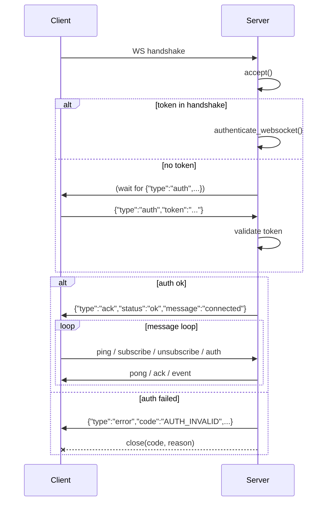

# WebSocket API

Two WebSocket entrypoints, both mounted under `/api/v1` by
[`engine/api/router.py`](../../engine/api/router.py):

| Path | Module | Auth model |
|---|---|---|
| `/api/v1/ws` | [`engine/api/ws/router.py`](../../engine/api/ws/router.py) | Token **after** accept (header / subprotocol / query / first message). |
| `/api/v1/ws/events` | [`engine/api/ws/events.py`](../../engine/api/ws/events.py) | Session token **before** accept — invalid token rejects the HTTP upgrade. |

Both endpoints fan out events from the
[`EventBus`](../../engine/events/bus.py) to subscribed rooms via the
[`EventBusBridge`](../../engine/api/ws/event_bridge.py) (cross-replica —
see [ADR-0009](../adr/0009-cross-replica-eventbus-bridge.md)). The two
exist because the auth models are *deliberately* different:

- `/ws` keeps back-compat with clients that send the token as the first
  JSON message. The server `accept()`s first and authenticates inside
  the message loop, so a missing/invalid token surfaces as a WebSocket
  close (with a structured close code) rather than an HTTP 401.
- `/ws/events` authenticates the session token **at the HTTP layer**,
  before the socket is upgraded. A bad or missing token rejects the
  handshake with `4401`, so the server never accepts an unauthenticated
  socket.

Use `/ws/events` for new clients. Keep `/ws` only if you cannot migrate
off first-message auth.

## Authentication

### `/api/v1/ws` — token-bearing priority

[`authenticate_websocket`](../../engine/api/ws/auth.py) reads the token
from, in priority order:

1. `Authorization: Bearer <token>` header (preferred — mirrors REST).
2. `Sec-WebSocket-Protocol: bearer.<token>` subprotocol (for browsers
   that can't set headers on a WS handshake).
3. `?token=` query parameter (lowest-priority fallback; query strings
   are logged by proxies, so prefer header / subprotocol).
4. The first JSON message `{"type":"auth","token":"..."}` within
   `auth_timeout` seconds (default 10s) — back-compat with existing
   clients.

When the handshake supplies a token, the message-loop auth is skipped.
Per-IP rate limiting (`AuthRateLimiter`, token bucket: 10 attempts /
60s, refilled continuously) gates every auth attempt — a brute-force
attempt is closed with `4401 "auth rate limited"`.

If a `db` session is injected into `authenticate_websocket` the full
REST-mirroring path runs: `validate_session_token_for_ws` decodes the
JWT, resolves `sub` to an **active** user (disabled / missing →
revoked), enforces `required_scopes`, and applies the legal-acceptance
gate. Without a `db`, a lightweight decode + scope extraction is used.

### `/api/v1/ws/events` — pre-accept session token

The session token must be in the **handshake query string**:

```
wss://host/api/v1/ws/events?token=<jwt>
```

`session_token` is accepted as an alias. The token is decoded by the
same `decode_token` the REST dependency uses; `sub` is required, scopes
are derived via `extract_scopes`. A missing / malformed / expired token
closes the socket with `4401` *before* `ws.accept()` runs.

### Scopes

JWT scopes are derived from the `role` claim by
[`extract_scopes`](../../engine/api/ws/auth.py):

| Role | Scopes |
|---|---|
| `admin`, `portfolio_manager` | `read:portfolio`, `read:portfolio:all`, `read:orders`, `read:orders:all`, `read:strategies`, `read:strategies:all` |
| `quant_dev`, `developer`, `retail_trader`, `user`, `viewer` | `read:portfolio`, `read:orders`, `read:strategies` |

The `:all` scopes are what grant cross-account visibility (see
[Permissions](#permissions) below).

## Wire protocol

Pydantic schemas in [`engine/api/ws/protocol.py`](../../engine/api/ws/protocol.py).
Every message is a JSON object with a `type` discriminator.

### Inbound (client → server)

| `type` | Shape | Purpose |
|---|---|---|
| `auth` | `{type:"auth", token, ref?}` | First-message auth (only meaningful on `/ws`). Refreshes the session mid-connection; an invalid token closes the socket with `4403`. |
| `subscribe` | `{type:"subscribe", channel, params:{...}, ref?}` | Join a room. See [Channels](#channels). |
| `unsubscribe` | `{type:"unsubscribe", channel, params:{...}, ref?}` | Leave a room. |
| `ping` | `{type:"ping", ref?}` | Keepalive. Server replies `pong` with the same `ref`. |

Unknown types return `error` with `code:"PARSE_ERROR"`. Non-object
input returns `error` with `code:"INVALID_MESSAGE"`.

`ref` is an opaque client-chosen correlation id echoed back in the
matching `ack` — use it to multiplex several in-flight subscribes on
one socket.

### Outbound (server → client)

| `type` | Shape | Notes |
|---|---|---|
| `ack` | `{type:"ack", ref?, status:"ok"\|"error", error_code?, message?}` | Confirms a `subscribe` / `unsubscribe` / `auth`. `error_code` mirrors an HTTP status (`404` unknown channel, `403` denied, `400` missing params, `429` subscription cap hit). |
| `error` | `{type:"error", code, message, ref?}` | Asynchronous error. `code` is a string (e.g. `AUTH_INVALID`, `PARSE_ERROR`, `INVALID_MESSAGE`). |
| `event` | `{type:"event", channel, room, payload:{...}, seq, ts}` | Event delivery. `seq` is per-room (gap detection); `ts` is ISO-8601 UTC. |
| `pong` | `{type:"pong", ref?}` | Reply to `ping`. |
| `close` | `{type:"close", code, reason}` | Server-initiated close notice (informational — the WebSocket itself is also closed with the same code). |

### Connection lifecycle (`/ws`)



On `/ws/events` the handshake-time token check happens **before**
`accept()`, so an invalid token never reaches the message loop.

## Channels

A small, fixed channel set — declared as `VALID_CHANNELS` in
[`protocol.py`](../../engine/api/ws/protocol.py):

| Channel | Sub-keyed by | Room shape |
|---|---|---|
| `portfolio` | `account_id` or `strategy_id` | `portfolio:account:<id>` / `portfolio:strategy:<id>` |
| `orders` | `symbol` or `status` | `orders:symbol:<sym>` / `orders:status:<status>` |
| `strategies` | `strategy_id` | `strategies:strategy:<id>` |

A `subscribe` for an unknown channel returns `ack status:"error"
error_code:"404"`. The `ChannelResolver`
([`engine/api/ws/channels.py`](../../engine/api/ws/channels.py)) caps a
single connection at **50 non-`user:` rooms** (`max_subscriptions_per_connection`)
— the per-user room (`user:<id>`, joined automatically) does not count
toward the cap.

### Permissions

[`check_channel_access`](../../engine/api/ws/permissions.py) enforces
an owner-vs-`:all` split per channel:

| Channel | Base scope | `:all` scope | Owner field |
|---|---|---|---|
| `portfolio` | `read:portfolio` | `read:portfolio:all` | `account_id` |
| `orders` | `read:orders` | `read:orders:all` | `account_id` |
| `strategies` | `read:strategies` | `read:strategies:all` | `strategy_id` |

A caller with the base scope but not `:all` may subscribe **only** to
rooms whose owner field equals their own `user_id`. A caller with the
`:all` scope may subscribe to any room. Missing both →
`ack status:"error" error_code:"403"`.

## Close codes

Defined in [`protocol.py`](../../engine/api/ws/protocol.py):

| Code | Meaning |
|---|---|
| `1000` | Normal close. |
| `1001` | Going away — sent to existing clients during a `/ws/events` re-init (`server reinitializing events stream`). |
| `1008` | Policy violation. |
| `1011` | Server error / endpoint not initialised. |
| `4401` | Auth invalid (mirrors HTTP 401). Rate-limited attempts also close with `4401`. |
| `4402` | Auth timeout — no `auth` message within `auth_timeout` (`/ws` only). |
| `4403` | Token expired (mirrors HTTP 401 — used for mid-session refresh failure). |
| `4404` | Forbidden — token decoded but lacks required scope (mirrors HTTP 403). |
| `4451` | Legal re-acceptance required (mirrors HTTP 451). |

<a id="cross-replica-event-delivery"></a>
## Cross-replica delivery

`EventBus.publish(event)` does two things per call: it `await`s every
registered in-process handler in turn, **and** it republishes onto a
Redis/Valkey pub/sub channel (`nexus:<event_type>`). Every replica's
`EventBusBridge` consumes that channel and re-delivers received events
to its local rooms — so a portfolio update emitted on replica A reaches
WS clients connected to replica B. If Redis is unavailable the bus
falls back to in-process-only delivery (logged at warning level).

The bridge is started by `init_ws_events(...)` (called from the app
lifespan). Re-init is safe: existing clients are disconnected (`1001`)
and the previous bridge is stopped before the new one starts, so a
config reload cannot leak connections or double-subscribe to the bus.

## Metrics

Every auth failure, inbound message, and subscribe/unsubscribe is
counted through the shared `ws_metrics` adapter (see
[`engine/api/ws/metrics.py`](../../engine/api/ws/metrics.py)):

- `sev_ws_auth_failures_total{reason=…}` — reasons include
  `events_invalid`, `ratelimit`, `revoked`, `scope`, `legal`.
- `sev_ws_messages_received_total{type=…}` — per inbound `type`.

These feed the SLOs in [`operations/slos.md`](../operations/slos.md).

## Limitations

- The connection registry is **process-local** — see
  [`known-limitations.md`](../known-limitations.md). Cross-replica
  fan-out works (via the bridge), but a client connected to replica A
  cannot be addressed by a `connection_id` minted on replica B.
- Token refresh on `/ws` replaces the in-memory `session.user_id` /
  `session.scopes` but does **not** re-evaluate already-joined rooms.
  A role downgrade mid-session therefore needs a reconnect to take
  effect on existing subscriptions.
- Heartbeats are application-level (`ping`/`pong`); there is no
  dedicated server-side keepalive thread today. Idle connections rely
  on the proxy / load balancer's timeout.
