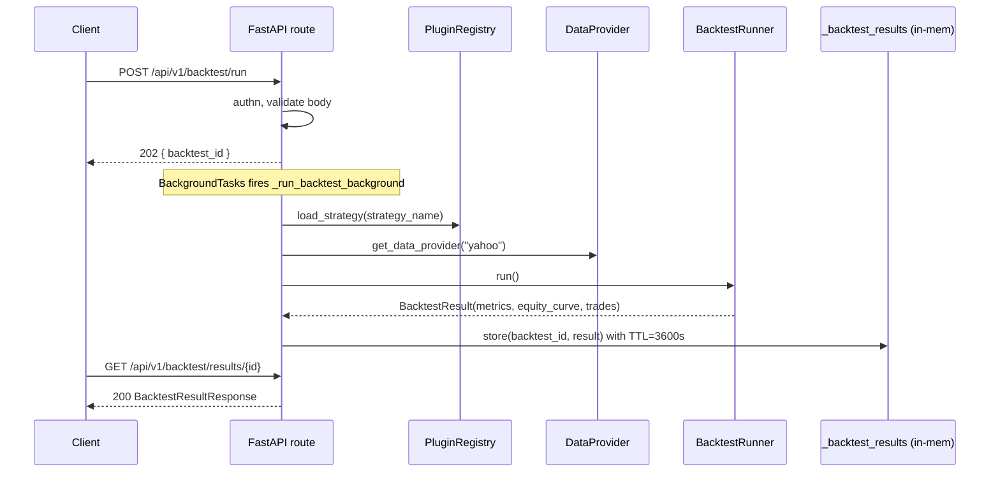

# Trading API — Portfolios, Strategies, Backtests, Scoring

> **Source:** [`engine/api/routes/portfolio.py`](../../engine/api/routes/portfolio.py),
> [`engine/api/routes/strategies.py`](../../engine/api/routes/strategies.py),
> [`engine/api/routes/backtest.py`](../../engine/api/routes/backtest.py),
> [`engine/api/routes/scoring.py`](../../engine/api/routes/scoring.py)

All routes in this file are **legal-gated**: the caller must have
accepted the current version of every `requires_acceptance=true` legal
document. The dependency is `require_legal_acceptance` in
[`engine/legal/dependencies.py`](../../engine/legal/dependencies.py);
it returns 403 with `detail="legal_acceptance_required"` if any
document is unaccepted. See [privacy-legal.md](privacy-legal.md) for
the acceptance flow.

## Portfolios — `/api/v1/portfolio`

A portfolio is the unit of capital allocation. Strategies are installed
*into* a portfolio; positions, orders, and tax lots all belong to one.

| Method | Path | Body / Result |
|--------|------|----------------|
| `POST` | `/` | `CreatePortfolioRequest { name, description?, initial_capital? }` → **200** `PortfolioResponse` |
| `GET` | `/` | Lists caller's portfolios. |
| `GET` | `/{portfolio_id}` | Single portfolio. **403** if not owner. **400** if `portfolio_id` is not a UUID. |
| `DELETE` | `/{portfolio_id}` | Hard-delete (`ON DELETE CASCADE` takes positions / orders / tax lots with it). |

`PortfolioResponse` is `{ id, name, description, initial_capital, created_at }`.

> **Limitation:** there is no soft-delete / archive today. Deleting a
> portfolio drops every backtest that referenced it (the
> `BacktestResult.portfolio_id` column is nullable exactly so ad-hoc
> backtests survive — but anything tied to the portfolio goes). See
> [../limitations.md](../limitations.md).

## Strategies — `/api/v1/strategies`

The strategy registry is the in-process plugin registry kept on
`app.state.plugin_registry`. Discovery happens at startup; strategies
can also be hot-reloaded from disk.

| Method | Path | Body / Notes |
|--------|------|----------------|
| `GET` | `/` | `{ strategies: [...] }` — all installed strategies and their load status. |
| `GET` | `/{strategy_id}` | Full manifest (config schema, data feeds, watchlist, requires_network, requires_gpu). **404** if not registered. |
| `POST` | `/{strategy_id}/activate` | `StrategyConfigRequest { params: dict }`. Instantiates the plugin with the supplied params. |
| `POST` | `/{strategy_id}/deactivate` | Unloads the plugin instance. |
| `POST` | `/{strategy_id}/reload` | Hot-reload from disk. Used during dev. |
| `GET` | `/{strategy_id}/health` | `{ strategy_id, is_loaded }`. Future sandbox metrics will land here. |

Strategy IDs are filesystem-derived slugs from the plugin manifest.
See [../PLUGIN_DEV_GUIDE.md](../PLUGIN_DEV_GUIDE.md) and
[../architecture/plugins.md](../architecture/plugins.md) for the
manifest format and sandbox model.

## Backtests — `/api/v1/backtest`

Backtests are **async**: the `POST` enqueues a background task on the
FastAPI `BackgroundTasks` runner (not TaskIQ — see Limitations) and
returns immediately with a backtest id. The client polls `GET /results/{id}`.

### `POST /api/v1/backtest/run`

- **Body:** `BacktestRequest { strategy_name, symbol, start_date,
  end_date, initial_capital?, config? }`.
- **Auth:** Bearer or API key.
- **202:** `BacktestResponse { status: "accepted", backtest_id }`.
- The runner resolves the strategy via `PluginRegistry.load_strategy`,
  fetches bars via `get_data_provider("yahoo")`, and pushes the result
  into an in-process dict keyed by `backtest_id` with a 1-hour TTL.

### `GET /api/v1/backtest/results/{backtest_id}`

- **Auth:** Bearer or API key.
- **404:** backtest id unknown or expired (TTL = 1h, see
  `_RESULTS_TTL_SECONDS` in [`engine/api/routes/backtest.py`](../../engine/api/routes/backtest.py)).
- **403:** caller is not the owner.
- **202:** status = `running` (the runner is still computing).
- **200, status = failed:** `error` field populated, metrics zeroed.
- **200, status = completed:** full `BacktestResultResponse`.

The completed response carries a `MetricsSummary` with every metric the
runner computes (Sharpe, Sortino, Calmar, drawdown duration + recovery,
rolling Sharpe / Sortino / vol, win rate, profit factor, cost drag,
turnover, exposure, taxes). The shape is the same one persisted to
`backtest_results.metrics` (JSONB) — see
[../architecture/database.md](../architecture/database.md).

### Why an in-process dict?

The current implementation stores results in a module-level dict, not
in Postgres. This is intentional for the MVP: every backtest is bound
to a single API pod, so horizontal scaling is impossible until this is
externalised. That is tracked as a P1 limitation — see
[../limitations.md](../limitations.md).

## Scoring — `/api/v1/scoring`

Scoring strategies are a *specialisation* of the strategy interface:
they take a universe of symbols + raw factor data and emit per-symbol
scores. Use them when you want to *rank* rather than *trade*.

| Method | Path | Body / Notes |
|--------|------|----------------|
| `POST` | `/{strategy_name}/run` | `ScoringRunRequest { universe: [symbol...], raw_data: { symbol: { factor: value } } }`. The strategy must declare itself a scoring strategy (checked by `is_scoring_strategy`); otherwise **400**. Persists a `ScoringSnapshot` row. |
| `GET` | `/{strategy_name}/results` | Paginated list of past scoring runs. Query params: `limit` (≤100), `offset`, `sort_by`, `sort_order`. |

`ScoringRunResponse` is `{ strategy_id, scores: [...], excluded_factors,
universe_size }`. `excluded_factors` is the set of inputs the strategy
declared non-informative (e.g. constant or all-NaN columns); persisting
it next to the result makes every snapshot self-describing.

## How a backtest flows end-to-end

The strategy evaluator (post-processing in
[`engine/core/strategy_evaluator.py`](../../engine/core/strategy_evaluator.py))
is invoked inside `BacktestRunner.run()` and writes the composite score
+ breakdown into the metrics dict before storage.

## What this surface does *not* do

- **No live order submission.** Live execution backends exist
  ([`engine/core/execution/live.py`](../../engine/core/execution/live.py))
  but no route triggers them yet — that is the live-trading feature
  tracked in [../limitations.md](../limitations.md).
- **No paper-trading stream.** Paper broker exists
  ([`engine/core/brokers/paper.py`](../../engine/core/brokers/paper.py))
  but no route exposes a "start paper trading" call.
- **No multi-symbol backtest.** `BacktestRequest.symbol` is a single
  string. Multi-symbol support is in the SDK contract (`IStrategy.evaluate`
  receives a portfolio object) but not in the API yet.
