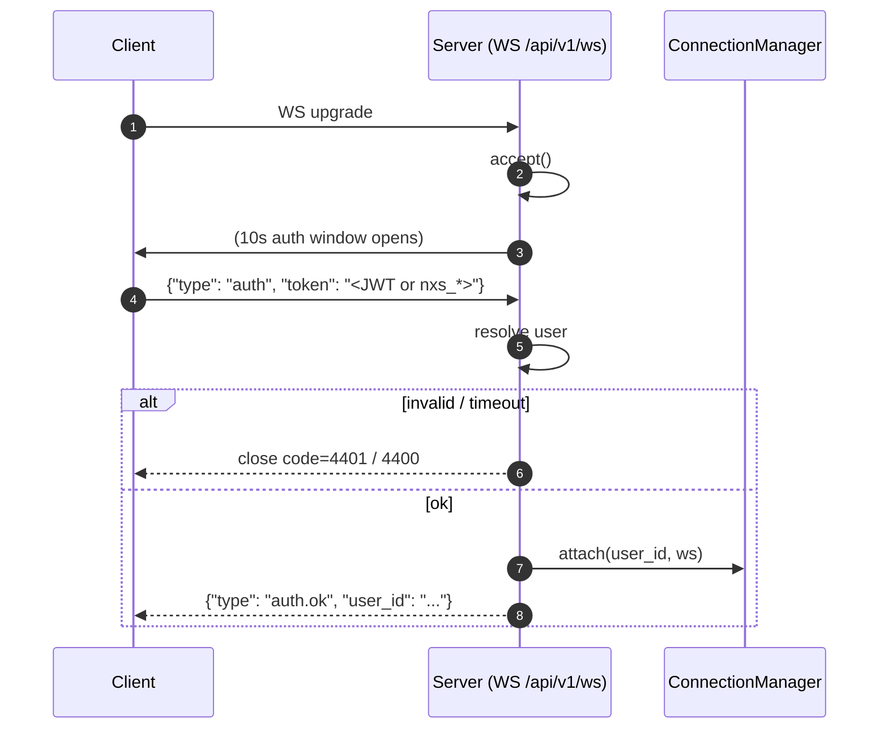

# WebSocket API

Mounted at `/api/v1/ws`. Implementation:
`engine/api/routes/websocket.py`. Manager:
`engine/api/websocket/manager.py`.

Real-time push channel for portfolio, backtest, order, and alert
events. The connection is per-user (not per-session): one user can
hold multiple connections, and each subscribes independently to
topics.

## Handshake



The auth message must arrive within `AUTH_TIMEOUT_SECONDS` (10.0).
Token in the URL is **not** supported — query strings end up in
proxy logs and are an established secret-leak vector. Both JWTs and
engine API keys (`nxs_*`) are accepted.

Close codes used by the server:

| Code | Reason                  |
|------|-------------------------|
| 4400 | `auth_required` / `auth_token_missing` |
| 4401 | `auth_invalid` / `auth_timeout` |

## Messages (client → server)

### Subscribe

```json
{ "type": "subscribe", "topics": ["portfolio", "order"] }
```

Server reply:
```json
{ "type": "subscribed", "topics": ["order", "portfolio"] }
```

`topics` is echoed back as the resulting subscription set (sorted).
Invalid topic names are silently dropped by `_coerce_topic_list`.

### Unsubscribe

```json
{ "type": "unsubscribe", "topics": ["order"] }
```

Server reply:
```json
{ "type": "unsubscribed", "topics": ["portfolio"] }
```

### Ping

```json
{ "type": "ping" }
```

Server reply:
```json
{ "type": "pong" }
```

### Anything else

Server reply:
```json
{ "type": "error", "code": "unknown_message_type", "detail": "<echoed>" }
```

## Messages (server → client)

### Broadcast (server push)

```json
{
  "type": "broadcast",
  "topic": "portfolio",
  "event": "portfolio.updated",
  "data": { /* event-specific */ },
  "timestamp": "2026-06-05T12:00:00Z"
}
```

### Auth / protocol messages

`auth.ok`, `subscribed`, `unsubscribed`, `pong`, `error` — see above.

## Topics

Defined in `engine/api/websocket/manager.py:Topic`:

| Topic        | Includes                                                |
|--------------|---------------------------------------------------------|
| `portfolio`  | `portfolio.updated`, `position.opened`, `position.closed`|
| `backtest`   | `backtest.started`, `backtest.completed`                |
| `order`      | `order.created`, `order.validated`, `order.submitted`, `order.filled`, `order.rejected`, `order.failed` |
| `alert`      | `risk.warning`, `risk.circuit_breaker`                  |

Topic strings are validated against a frozen set — anything outside
`{portfolio, backtest, order, alert}` is dropped on the floor.

## Multi-replica limitations

The `ConnectionManager` is process-local. A broadcast issued by
engine replica A reaches only the connections held by A. Multi-replica
fan-out needs a Redis/Valkey pub/sub bridge so that broadcasts are
mirrored across replicas. The shape that bridge will consume is
already in `manager.py`; the wire-up is on the roadmap (see
[`limitations.md`](../limitations.md)).

## Connection lifecycle and back-pressure

- The server keeps a single `asyncio.Lock` on the connection map.
  Contention is minimal — only `attach` / `detach` / `subscribe` /
  `unsubscribe` contend, and these are rare relative to broadcasts.
- Broadcasts are best-effort: a slow client that backs up its
  receive queue does not block sibling connections. Send errors are
  swallowed (`contextlib.suppress` in `_send`) and the connection is
  allowed to time out from the underlying ASGI worker.
- There is no maximum-connections-per-user limit today. Operators
  who need one should add it in `manager.attach`.
