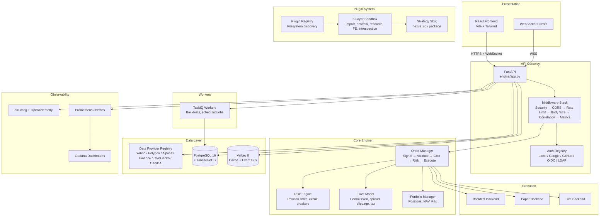
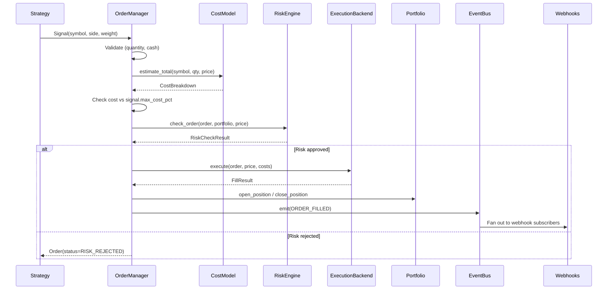
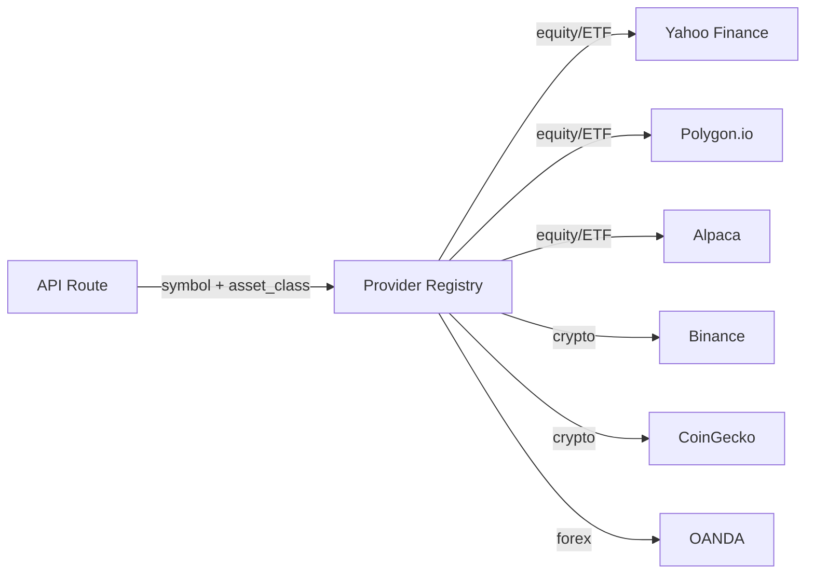

# Architecture

## System Overview

Nexus Trade Engine is a modular, plugin-driven algorithmic trading platform.
Every component is independently replaceable: execution backends, data providers,
auth providers, and strategy plugins all implement well-defined ABCs and are
wired together at app startup.



## Signal-to-Fill Pipeline

The core trading pipeline is the critical path through the engine. Every trade
follows this exact sequence, regardless of execution mode:



**Key invariant:** The RiskEngine has final authority. Even if a strategy emits
a signal, the risk engine can veto it. Strategies cannot bypass risk checks.

## Execution Modes

All three execution backends implement the same `ExecutionBackend` ABC
(`engine/core/execution/base.py`):

| Mode | Class | Data Source | Order Routing | Use Case |
|------|-------|-------------|---------------|----------|
| Backtest | `BacktestBackend` | Historical OHLCV | Simulated fill at bar price | Strategy validation |
| Paper | `PaperBroker` | Live market data | Simulated fill at live price | Forward testing |
| Live | `LiveBackend` | Live market data | Real broker (Alpaca, IBKR) | Production trading |

The `OrderManager.set_execution_backend()` call swaps the active backend.
Strategies never know which mode they're running in — they just receive
`MarketState` and return `list[Signal]`.

## Cost-First Design

The `ICostModel` interface (`engine/core/cost_model.py`) is injected into every
strategy's evaluate cycle. This is the architectural decision that most
differentiates Nexus from other trading frameworks: costs are an **input** to
strategy logic, not a post-hoc deduction from returns.

The cost model computes:

| Component | Method | Default Config |
|-----------|--------|---------------|
| Commission | `estimate_commission()` | `$0.00/trade` (zero-commission brokers) |
| Spread | `estimate_spread()` | 5 bps |
| Slippage | `estimate_slippage()` | 10 bps base, scales with participation rate |
| Exchange fees | `estimate_total()` | $0.0003/share |
| Tax estimate | `estimate_tax()` | FIFO/LIFO lot method, 37% short-term / 20% long-term |
| Wash sale | `check_wash_sale()` | 30-day window |

Strategies call `costs.estimate_pct()` for a quick round-trip cost estimate
and can reject trades where costs exceed a threshold via `signal.max_cost_pct`.

## Plugin System

Strategies are self-contained directories discovered by the `PluginRegistry`
(`engine/plugins/registry.py`):

```
strategies/
  mean_reversion/
    manifest.yaml          # Metadata, permissions, resource limits
    strategy.py            # Must export a `Strategy` class
```

### Sandbox (5-Layer Security)

When `NEXUS_PLUGIN_SANDBOX_ENABLED=true`, strategies run inside a sandbox
(`engine/plugins/sandbox/_sandbox.py`) that enforces:

1. **Import restrictions** — Blocked modules via `RestrictedImporter`
2. **Network whitelist** — Only declared endpoints from manifest
3. **Resource limits** — Memory, file descriptors, CPU timeout (Linux `resource` module)
4. **Filesystem isolation** — Temp working directory, read-only artifacts
5. **Introspection blocking** — `__subclasses__`, `__globals__`, etc.

All evaluations are serialized via an `asyncio.Lock` to prevent global-state
races between concurrent strategy invocations.

## Event Bus

The `EventBus` (`engine/events/bus.py`) is the system's nervous system.
It supports 18 event types across five domains:

| Domain | Events |
|--------|--------|
| Market | `MARKET_DATA_UPDATE`, `MARKET_OPEN`, `MARKET_CLOSE` |
| Signal | `SIGNAL_EMITTED`, `SIGNAL_BATCH` |
| Order | `ORDER_CREATED`, `ORDER_VALIDATED`, `ORDER_SUBMITTED`, `ORDER_FILLED`, `ORDER_REJECTED`, `ORDER_FAILED` |
| Portfolio | `PORTFOLIO_UPDATED`, `POSITION_OPENED`, `POSITION_CLOSED` |
| Risk | `RISK_WARNING`, `CIRCUIT_BREAKER` |
| Strategy | `STRATEGY_LOADED`, `STRATEGY_UNLOADED`, `STRATEGY_ERROR` |

Events flow through Valkey pub/sub for cross-process communication
(worker → app → frontend WebSocket). When Valkey is unavailable, the bus
falls back to in-process-only delivery.

## Middleware Stack

The FastAPI app (`engine/app.py`) layers middleware in this order
(outermost first):

```
HttpMetricsMiddleware      — times full request lifecycle, exposes /metrics
CorrelationIdMiddleware    — stamps X-Request-Id, propagates OTel context
BodySizeLimitMiddleware    — hard cap at 1 MiB
RateLimitMiddleware        — per-IP sliding window (default 600/min, burst 60)
CORSMiddleware             — configurable origins
SecurityHeadersMiddleware  — X-Content-Type-Options, X-Frame-Options, etc.
```

## Risk Engine

The `RiskEngine` (`engine/core/risk_engine.py`) enforces portfolio-level
constraints that individual strategies cannot override:

| Check | Default | Config |
|-------|---------|--------|
| Max position concentration | 20% of portfolio | `max_position_pct` |
| Max open positions | 50 | `max_open_positions` |
| Circuit breaker drawdown | 10% | `circuit_breaker_drawdown_pct` |
| Max daily trades | 100 | `max_daily_trades` |
| Max single order value | $50,000 | `max_single_order_value` |

The circuit breaker is a hard stop: once triggered, all orders are rejected
until an operator manually resets it. The live trading kill-switch
(`engine/core/live/kill_switch.py`) is a separate, even more aggressive
mechanism that blocks all broker communication at the transport layer.

## Data Provider System

Market data flows through a pluggable provider registry
(`engine/data/providers/registry.py`):



Providers are registered at startup from `config/data_providers.yaml` (or
fall back to Yahoo Finance with no configuration). The registry routes by
asset class and priority, with circuit-breaker-style fallback when a
provider is unhealthy.

## Background Task Architecture

Backtests are dispatched to TaskIQ workers via Valkey:

```
POST /api/v1/backtest/run
  → API handler persists BacktestResult row (status=running)
  → Enqueues run_backtest_task.kiq() via TaskIQ broker
  → Returns 202 Accepted with backtest_id

TaskIQ worker picks up the job:
  → Loads strategy via PluginRegistry
  → Runs engine/core/backtest_runner.py
  → Evaluates via engine/core/strategy_evaluator.py
  → Writes results + composite score to DB
  → Emits BACKTEST_COMPLETED event
```

The result store (`engine/tasks/result_store.py`) uses Valkey for
short-lived result caching with automatic expiry.

## Tax Engine

Multi-jurisdiction tax reporting lives under `engine/core/tax/`:

| Jurisdiction | Module | Reports |
|---|---|---|
| United States | `us.py` | Schedule D, Form 1099-B, Form 6781 (Parts I, II, III), Section 1256 |
| United Kingdom | `gb.py` | HMRC CGT, KEST |
| Germany | `de.py` | German capital gains |
| France | `fr.py` | PFU (flat tax) |
| Cross-border | `mifid2.py` | MiFID II cost disclosure |

The `TaxDispatcher` (`engine/core/tax/reports/dispatcher.py`) routes to the
correct summarizer based on a two-letter jurisdiction code. Wash sale
detection (`engine/core/tax/`) applies US-specific 30-day window rules with
cost basis adjustments to replacement lots.
