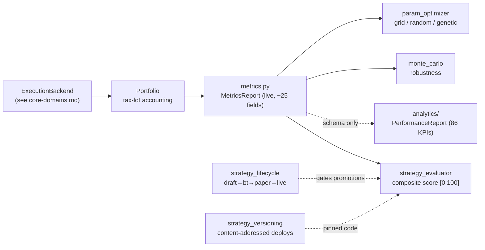

# Analytics, scoring & optimization

This file is the second half of the domain map started in
[`core-domains.md`](core-domains.md). That document covers the
**decision/execution** layer — instruments, multi-strategy orchestration,
cost & risk, execution backends, portfolio accounting. This one covers
the **analytics & evaluation** layer: the two performance-report
containers, the composite strategy scorer, strategy lifecycle/versioning
governance, and the parameter optimizer.

The split exists for one reason: `core-domains.md` crossed the 500-line
documentation cap. The boundary between "runtime that turns signals into
fills" and "post-trade numerics that score the result" is clean, so the
analytics tail lives here. Cross-references go both ways.

## Component map

## Performance analytics

There are **two** analytics containers. Do not conflate them:

### `MetricsReport` — live, used today

[`engine/core/metrics.py`](../../engine/core/metrics.py). The container
the backtest runner actually computes and that `GET /backtest/results/{id}`
returns as `metrics`. ~25 scalar fields (total/annualized return, Sharpe,
Sortino, Calmar, max drawdown + duration + recovery, volatility,
win-rate, profit factor, avg winner/loser, streaks, total costs/taxes,
cost-drag %, turnover, exposure %) plus three series (`equity_curve`,
`drawdown_curve`, `rolling_metrics`).

### `PerformanceReport` — 86-KPI schema, not yet wired

[`engine/core/analytics/`](../../engine/core/analytics/) is the
**86-KPI taxonomy** (gh#97), split into eight section models:

| Section (file) | KPI range | Covers |
|---|---|---|
| `returns.py` | 1–14 | Return ratios + `PeriodReturn` value object. |
| `risk_adjusted.py` | 15–24 | Sharpe/Sortino/Omega/Calmar/Treynor/Information/Payoff/Profit-factor. Infinite/undefined ratios → `null`. |
| `drawdown.py` | 25–34 | Underwater series + duration/recovery. |
| `trades.py` | 35–50 | Win/loss rates, streaks, holding periods, cadence. |
| `costs.py` | 51–58 | Cost breakdown + slippage/IS in basis points. |
| `positions.py` | 59–66 | Exposure, long/short, concentration, simultaneous positions. |
| `volatility.py` | 67–76 | VaR/CVaR (positive magnitudes), capture ratios, tail ratio. |
| `time_analysis.py` | 77–86 | Monthly heatmap, day-of-week/hour returns, rolling Sharpe/DD, dual equity curve. |
| `report.py` | envelope | `PerformanceReport` aggregates the eight; `metric_count` asserts all 86 present. |

> **Status — accurate caveat.** The section modules and the envelope
> are on disk, but the builder (`engine/core/analytics/analyzer.py`)
> referenced by their docstrings is **not**, and nothing under
> `engine/api/` or `engine/core/backtest_runner.py` imports the report.
> So `PerformanceReport` is a landed schema, not yet a live output: the
> API surface still serves `MetricsReport`. Treat the 86-KPI contract as
> the intended shape; a future PR wires an analyzer and a route.

### Companion analytics modules

These operate on an equity curve / trade log and are independently
usable:

| Module | Computes |
|---|---|
| [`rolling_metrics.py`](../../engine/core/rolling_metrics.py) / [`rolling_correlation.py`](../../engine/core/rolling_correlation.py) / [`rolling_benchmark.py`](../../engine/core/rolling_benchmark.py) / [`rolling_trade_stats.py`](../../engine/core/rolling_trade_stats.py) | Rolling-window Sharpe, correlation, benchmark-relative, and trade statistics. |
| [`drawdown_analytics.py`](../../engine/core/drawdown_analytics.py) | Drawdown depth/duration/recovery + excursion stats ([`excursion_stats.py`](../../engine/core/excursion_stats.py)). |
| [`distribution_metrics.py`](../../engine/core/distribution_metrics.py) | VaR / CVaR / skew / kurtosis / tail ratio. |
| [`benchmark_comparison.py`](../../engine/core/benchmark_comparison.py) | Alpha/beta/R-squared, up/down capture, tracking error vs. a benchmark. |
| [`cumulative_returns.py`](../../engine/core/cumulative_returns.py) | Cumulative + `PeriodReturn` series (daily/weekly/monthly). |
| [`monte_carlo.py`](../../engine/core/monte_carlo.py) | Robustness testing — `bootstrap_returns` (Efron i.i.d.) and `block_bootstrap` (Künsch, preserves autocorrelation). Pure numpy, deterministic given a `seed`. |
| [`portfolio_aggregator.py`](../../engine/core/portfolio_aggregator.py) / [`portfolio_concentration.py`](../../engine/core/portfolio_concentration.py) | Cross-portfolio rollups and concentration metrics. |

## Strategy scoring & governance

### Composite scoring — [`strategy_evaluator.py`](../../engine/core/strategy_evaluator.py)

Turns a `MetricsReport` into one number in `[0, 100]` plus a
per-dimension breakdown, a letter grade, and warnings. Used by the
marketplace ranking, A/B comparison surfaces, and the backtest summary
endpoint (so the UI doesn't re-derive it). **Six dimensions**, each
normalized to `[0, 100]`:

| Dimension | Inputs |
|---|---|
| `RISK_ADJUSTED_RETURN` | Sharpe ratio, piecewise mapping. |
| `DRAWDOWN_CONTROL` | Max drawdown, piecewise mapping. |
| `CONSISTENCY` | Coefficient of variation of rolling-window Sharpe. |
| `COST_EFFICIENCY` | Exponential decay on `cost_drag_pct`. |
| `WIN_RATE_QUALITY` | `win_rate × (avg_winner / |avg_loser|)`. |
| `STABILITY` | Annual volatility, piecewise mapping. |

Default weights mirror the spec and sum to 1.0 (risk-adjusted 0.30, …).
Composite = `Σ(dimension × weight)`. The evaluator is **stateless** —
construct one per weight configuration. (See also the persisted
`scoring_snapshots` table, written by the scoring routes.)

### Legal compliance gate — [`engine/legal/scoring_gate.py`](../../engine/legal/scoring_gate.py)

A composite score is also a **compliance act**: exposing it is governed
by a single stateless `LegalScoreValidator` that every scoring surface
composes. Full rationale in
[ADR-0013](../adr/0013-legal-score-compliance-gate.md); the short
version: one operator-configured class is the only structurally
enforceable way to guarantee every exposure surface (scoring API, read
path, future marketplace sort) applies the *same* rule.

Two distinct requirements drive the gate, both operator-controlled:

1. **Flagged strategies** (`NEXUS_LEGAL_SCORE_FLAGGED_STRATEGIES`, CSV).
   A strategy on the hold list has its score **suppressed** (dropped) —
   the maths is fine, the exposure is the problem.
2. **Hard compliance ceiling** (`NEXUS_LEGAL_SCORE_MAX_COMPOSITE`, float).
   A score above the operator's ceiling is **clamped down**, not dropped.

The gate runs at the compute→expose boundary on `POST /scoring/…/run`
(*before* the snapshot is persisted *and* before the response is
serialised), and again on the read path in
`GET /scoring/…/results` so a snapshot stored before a strategy was
flagged is brought into compliance at exposure time. Two invariants are
load-bearing:

- **`universe_size` is captured pre-gate.** The recorded count reflects
  how many symbols were *scored*, not how many *survived* the gate — a
  flagged strategy must not silently shrink the recorded universe.
- **Misconfiguration degrades to no-op.** A non-numeric ceiling falls
  back to `100.0` and logs a warning rather than failing every scoring
  call; the validator is built lazily from settings, so a bad env value
  cannot take the surface down.

Scope is intentionally narrow for v1: per-symbol flagging,
time-windowed holds, per-user overrides, and DB-backed persistence of
the flagged set are all out of scope. The class boundary is preserved
so a future DB-backed source can land behind the same interface
without touching a caller.

### Lifecycle & versioning

Two services govern *when* a strategy may run and *what code* runs:

| Module | Responsibility |
|---|---|
| [`strategy_lifecycle.py`](../../engine/core/strategy_lifecycle.py) | State machine `draft → backtest → paper → live`, with `retired` reachable from any non-draft stage. **No skipping** — you cannot jump draft→live. Each promotion is gated by a `LifecycleEvidence` payload: paper requires a backtest id + minimum Sharpe; live requires a paper window + minimum live-paper Sharpe. |
| [`strategy_versioning.py`](../../engine/core/strategy_versioning.py) | **Content-addressed deploys.** A `StrategyVersion` is a SHA-256 of the code blob + a hash of its canonical-JSON config, so the same code+config never creates two records (re-deploys are idempotent). `deploy` → new `DRAFT`; `activate` promotes to `ACTIVE` (demoting the prior); `rollback` returns to a previous `ACTIVE`. |

Together: `StrategyVersionService` controls *what* code runs;
`StrategyLifecycleService` controls *which stage* it's allowed to run at.

## Optimization — [`param_optimizer.py`](../../engine/core/param_optimizer.py)

Pure-Python hyperparameter search against an objective function
(typically a backtest's Sharpe or compound return).

- **`ParameterSpace`** — typed search space (continuous / discrete /
  categorical dimensions).
- **`Optimizer`** — Protocol the algorithms implement.
- **`optimize(...)`** — the dispatch entry point.

Algorithms shipped (PR1): `GridSearchOptimizer`,
`RandomSearchOptimizer`, `GeneticOptimizer`. Bayesian search and
Hyperband are TODO and noted in the module docstring. Runs are
deterministic given a seed; pair with `monte_carlo` to sanity-check that
an "optimal" parameter set isn't an overfit artifact.

## Wired vs. schema-only (quick reference)

| Capability | Wired into a route/runner? |
|---|---|
| `MetricsReport`, `strategy_evaluator`, `monte_carlo`, `param_optimizer` | Yes — consumed by the backtest runner / scoring routes. |
| `MultiStrategyPortfolio` | **No** — capital-aware voter is library-only and fully unit-tested today; the live/paper run route that would drive it is the open P1 (see [`known-limitations.md`](../known-limitations.md)). |
| `tca.py`, `market_impact.py` | Library-only today — no public route, and neither is consumed by `DefaultCostModel` yet (the square-root model is available for strategies / evaluators to call directly). |
| `PerformanceReport` (86-KPI) | **No** — schema landed, no analyzer/route yet. |
| `strategy_lifecycle` / `strategy_versioning` | Library-only; the public promotion/version API is part of the still-partial live-trading story (see [`known-limitations.md`](../known-limitations.md)). |

## See also

- [`core-domains.md`](core-domains.md) — the decision/execution half of
  this map (instruments, multi-strategy orchestration, cost & risk,
  execution backends, portfolio accounting).
- [`ARCHITECTURE.md`](../../ARCHITECTURE.md) — headline components
  (`OrderManager`, `CostModel`, `Portfolio`, `RiskEngine`,
  `BacktestRunner`), the signal→fill pipeline, and the SDK plugin
  interface.
- [`known-limitations.md`](../known-limitations.md) — what is
  half-built, including the live/paper execution and the 86-KPI
  analyzer gap.
