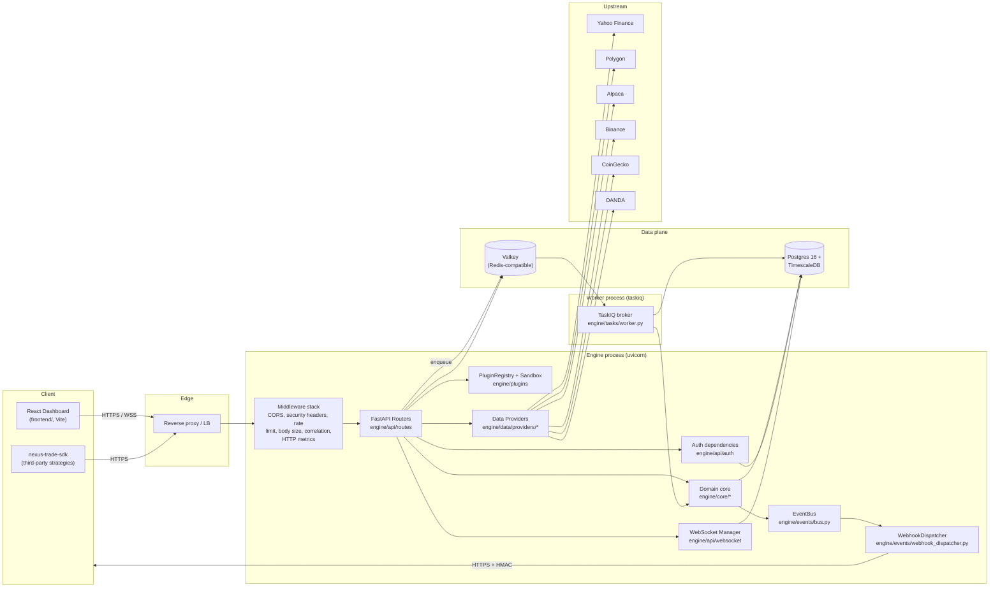
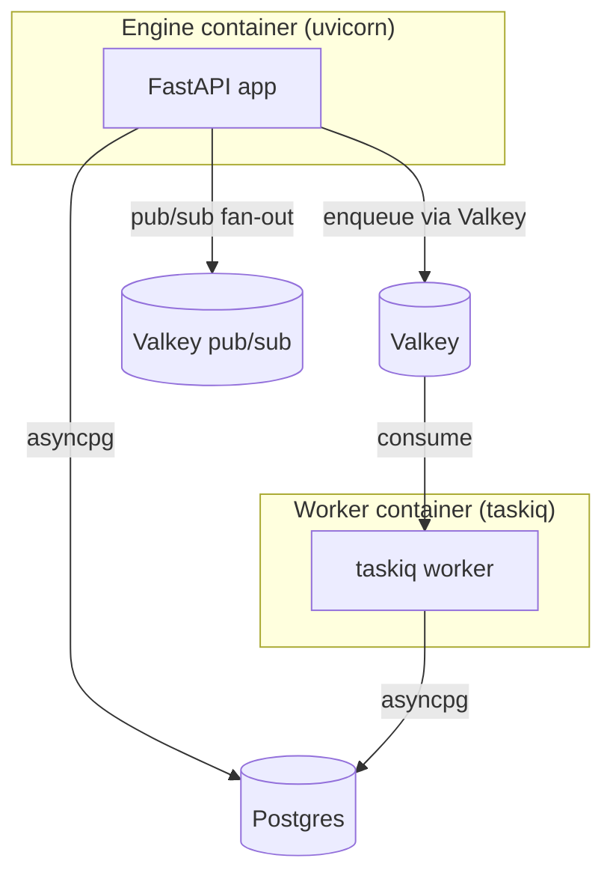

# Component map

The engine is one Python package (`engine/`) deployed as two processes
—the FastAPI app and a TaskIQ worker — sharing a Postgres database
and a Valkey broker. The frontend is a separate Vite/React app under
`frontend/` that talks to the engine over HTTP and WebSocket.

## Layered responsibilities

The code is organized so that dependencies always point downward (in
the diagram above) and inward (toward the domain core). A change in
`engine/core/` must not require a change in `engine/api/`; the reverse
is expected.

| Layer              | Module(s)                                     | Owns                                                        | Does NOT own                                  |
|--------------------|-----------------------------------------------|-------------------------------------------------------------|-----------------------------------------------|
| Edge               | Reverse proxy (operator-supplied)             | TLS termination, request routing, DDoS protection            | Auth, business logic                          |
| Transport          | `engine/api/routes`, `engine/api/websocket`   | HTTP/WS serialization, Pydantic models, status codes        | Domain logic, persistence                     |
| Authn / Authz      | `engine/api/auth/*`                           | JWT issuance, API-key verification, MFA, RBAC, scopes       | Strategy / portfolio state                    |
| Cross-cutting      | `engine/api/{rate_limit,body_size_limit,security_headers}`, `engine/observability/*` | Per-request middleware | Business rules |
| Domain core        | `engine/core/*`                               | Backtest loop, cost model, risk engine, OMS, tax engine     | HTTP, persistence to DB                       |
| Plugins / SDK      | `engine/plugins/*`, `sdk/nexus_sdk/*`         | Strategy interface, manifest schema, sandboxing, registry   | Trading capital                               |
| Data providers     | `engine/data/providers/*`, `engine/data/feeds.py` | Market data adapters, registry, caching, retries       | Schema of stored OHLCV                        |
| Persistence        | `engine/db/{models,session,migrations}`       | SQLAlchemy models, async session factory, Alembic chain     | What the columns *mean* (that's domain core)  |
| Async work         | `engine/tasks/worker.py`                      | TaskIQ broker, scheduled and on-demand jobs                 | HTTP request lifecycle                        |
| Events             | `engine/events/{bus,webhook_dispatcher}.py`   | In-process pub/sub, outbound webhook fan-out                | Domain invariants                             |
| Legal              | `engine/legal/*`                              | Document registry, acceptance audit, operator substitutions | Trade decisions                               |
| Privacy / DSR      | `engine/privacy/*`                            | GDPR/CCPA export, deletion-with-grace, SLA timer            | Identity (that's `User`)                      |
| Reference data     | `engine/reference/*`                          | Instrument search, Yahoo fallback, OpenFIGI ingestion       | Live prices (that's data providers)           |
| Frontend           | `frontend/` (separate package)                | React UI, error boundary reporting                          | Any business logic                            |

## Process boundaries

Two processes share the same image (`Dockerfile`) and the same code;
the difference is the entrypoint. `docker-compose.yml` boots both.

- **Engine** (`app` service) runs `uvicorn engine.app:create_app
  --factory`. Handles HTTP and WebSocket traffic. Synchronous reads
  (e.g. `GET /portfolio`) return immediately; long-running work
  (backtests) is enqueued onto Valkey via TaskIQ and the route returns
  `202 Accepted` with a job id.
- **Worker** (`worker` service) runs `taskiq worker
  engine.tasks.worker:broker`. Drains the queue, executes backtests,
  and writes results to Postgres. There is no HA story — a single
  replica per deployment is the supported topology today.

The current `engine/api/routes/backtest.py` runs backtests in a
FastAPI `BackgroundTasks` handler in the *engine* process, not the
worker — this is a known limitation (see
[`limitations.md`](../limitations.md)). The worker entrypoint exists
and is wired but is not the primary path yet; switching to it is on
the roadmap.

## Key boundaries that look permeable but aren't

- **The sandbox is the trust boundary, not the route handler.** A
  strategy plugin runs inside `engine/plugins/sandbox.py` with blocked
  imports, an httpx whitelist, a tmpfs-style working dir, and rlimit
  caps. Anything outside the sandbox (the rest of `engine/core`) runs
  with full engine privileges — never execute strategy code in the
  engine process un-sandboxed.
- **`require_legal_acceptance` is enforced at the router level** (see
  `engine/api/router.py`). Endpoints that touch money decisions
  (backtest, scoring, market-data, portfolio) inherit it via the
  `dependencies=[Depends(require_legal_acceptance)]` argument on the
  sub-router. Adding a new money-handling endpoint? Mount it under a
  router that has this dependency, don't re-implement the check.
- **`require_api_scope` vs `require_role`.** JWT-authenticated
  sessions bypass scope checks (their permission is expressed by
  role). API-key sessions bypass role checks (their permission is
  expressed by scope). Both go through `get_current_user` first.

## Configuration surface

Every operator-tunable lives in [`engine/config.py`](../../engine/config.py)
as a Pydantic-Settings field with the `NEXUS_` prefix. The full
enumeration with defaults is in [`setup.md`](../setup.md) and
[`deployment.md`](../deployment.md). There is no other source of
truth — settings do not get read from YAML, Consul, or the database.

## What's not in scope for this diagram

- The MCP server (planned, not implemented).
- Live broker integration with Alpaca / IBKR (scaffolding only; see
  `engine/core/execution/live.py`).
- React dashboard internals (separate app, lives under `frontend/`).
- Multi-replica broadcast over Redis pub/sub (the WebSocket manager
  is process-local; multi-replica fan-out is a follow-up).
