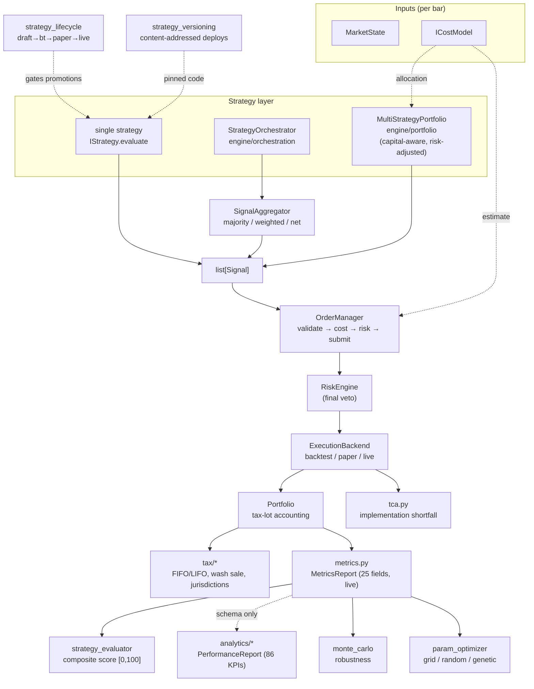

# Core engine domains

[`overview.md`](overview.md) describes the engine as a *service* —
FastAPI app, request lifecycle, middleware, deploy topology. This
document is the companion view: it maps the **domain layer** under
[`engine/core/`](../../engine/core/) (and its sibling
[`engine/orchestration/`](../../engine/orchestration/)) — the modules
that turn signals into decisions, decisions into fills, and fills into
performance numbers.

The repo-root [`ARCHITECTURE.md`](../../ARCHITECTURE.md) is the
authoritative reference for the four "headline" components
(`OrderManager`, `CostModel`, `Portfolio`, `RiskEngine`,
`BacktestRunner`); we cross-reference it rather than duplicate it and
focus here on the layers that file does **not** enumerate: multi-strategy
orchestration, the analytics taxonomy, strategy governance, optimization,
and post-trade cost analysis.

## Component map

## Instruments & multi-asset model

[`engine/core/instruments.py`](../../engine/core/instruments.py) replaces
the legacy string-`symbol` plumbing with a typed `Instrument` Pydantic
model that knows its asset class, venue, currency, and the
asset-class-specific fields (option strike/expiration, crypto base/quote,
forex pip/lot, futures multiplier). This is the engine-side identity
layer — what the OMS keys positions and lots on, distinct from the
**data-routing** taxonomy in
[`engine.data.providers.base.AssetClass`](../../engine/data/providers/base.py)
(which decides *which provider* can serve a query). The two evolve
independently; bridge them with `InstrumentAssetClass.to_provider_class()`.

`InstrumentAssetClass` is an `StrEnum` with eight members: `EQUITY`,
`ETF`, `CRYPTO`, `CRYPTO_PERP`, `CRYPTO_FUTURE`, `FOREX`, `OPTION`,
`FUTURE`. The split between spot crypto, perpetuals, and dated crypto
futures matters because they are *different products* on the same pair
— see the `uid` invariant below.

**Failure signal, not silent fallback.**
`InstrumentAssetClass.to_provider_class()` raises
`UnknownAssetClassError` for any member with no provider mapping. The
exception *is* the signal — there is no default asset class — and
constructing it also emits a `WARNING` log so an unmapped value is
visible even when the caller swallows the error (#1227). It is raised
**unconditionally, with no `__debug__` guard**, so an optimized
(`-O`) interpreter cannot silently turn a hard error into a no-op
(#1229).

Key invariants and behaviours, all enforced in the model:

| Concern | Rule |
|---|---|
| Class-specific fields | `OPTION` requires `strike`/`expiration`/`option_type`/`underlying`; `CRYPTO*` and `FOREX` require `base_asset`+`quote_asset` (else `ValueError`). |
| `uid` (stable identity) | Distinct per `(asset_class, identifying fields)`: `BTC/USD` (spot), `BTC/USD:PERP`, and `BTC/USD:<yyyymmdd>` (dated future) produce **different** uids, so positions in different products never collapse onto one key. |
| `model_copy(update=…)` | Rebuilds through `model_validate` so the symbol/whitespace validator and every class invariant run again — pydantic's default `model_copy` short-circuits validation and would let `update={"symbol":" x "}` bypass every check. |
| `from_string(raw)` | **Conservative**: defaults to `EQUITY` and treats `EUR/USD` / `BRK/B` as equity to avoid silently misclassifying slash-bearing symbols as crypto. Crypto/forex callers must use the explicit factories. |
| Legacy alias | `expiry_date` is folded into the canonical `expiration` field. |

**Integration with signals.**
[`Signal.instrument`](../../engine/core/signal.py) is a required, typed
field. For backward compatibility it is auto-populated as
`Instrument.from_string(symbol)` (i.e. equity by default) when a caller
passes only a string `symbol` — so existing backtest code keeps working.
A strategy that emits non-equity signals must construct the `Instrument`
explicitly (e.g. `Instrument.crypto("BTC", "USDT")`) so the asset class
is unambiguous.

> **Status.** The model, the per-class invariants, the provider-class
> bridge, and the market-data route's symbol-shape `detect_asset_class`
> (see [`api-reference.md`](../api-reference.md#market-data)) are landed
> and unit-tested. Multi-asset support is still **partial**: not every
> cost model and tax jurisdiction path has been validated against every
> asset class, and live/paper execution for non-equity instruments is
> not wired (see [`known-limitations.md`](../known-limitations.md)).

## Multi-strategy orchestration

There are **five** strategy coordinators across three packages. They
overlap in spirit but are deliberately separate, because the answers to
three independent questions — *does a strategy own money or just a
vote?*, *do conflicting symbols collapse or stay separate?*, and
*whose `strategy_id` wins?* — change the right design. Pick by those
answers, not by file name.

The three detailed below are the ones most code paths reach. Two more
landed since the last audit pass and are documented in full in
[`multi-strategy.md`](multi-strategy.md) (the authoritative map with a
side-by-side comparison table):

- [`engine/portfolio/orchestrator.py`](../../engine/portfolio/orchestrator.py)
  — a **lightweight net-weighted-vote** voter (`StrategyOrchestrator` +
  `SignalSet`), the synchronous counterpart to the async
  `core/strategy_orchestrator`. The smallest of the voters and the one
  most often overlooked because it shares a package with
  `MultiStrategyPortfolio`.
- [`engine/strategies/multi_manager.py`](../../engine/strategies/multi_manager.py)
  — `MultiStrategyManager`, the **second capital-aware** coordinator.
  Where `MultiStrategyPortfolio` *merges* (relative-share dollar netting
  into one position per symbol), `MultiStrategyManager` *forwards*: it
  treats `allocation_pct` as an **absolute** per-strategy budget, scales
  each strategy's active weights down to respect its own cap, and
  **re-tags every signal with the caller's registered id** so
  per-strategy attribution survives end-to-end. It is the right loop
  when strategies run with independent budgets and you must attribute
  every signal to its source (the contract multi-strategy attribution
  reports and per-strategy risk limits need). It was recently hardened
  (#1390 / #1392 — see [`multi-strategy.md`](multi-strategy.md)).

> **Three classes are named `StrategyOrchestrator`.** They live in
> `engine/orchestration/`, `engine/core/`, and `engine/portfolio/` and
> have *different* conflict-resolution semantics. Always qualify by
> import path; the bare class name is ambiguous.

### `engine/orchestration/orchestrator.py` — `StrategyOrchestrator`

The "register N strategies, run them all, collapse to one decision set"
loop. Two-step API: `await orch.run_all(market)` collects every
strategy's signals, then `orch.aggregate_signals()` resolves conflicts.

`ConflictResolution` selects the merge rule:

| Mode | Rule |
|---|---|
| `PRIORITY` *(default)* | The highest-priority strategy with a non-HOLD opinion wins. Opposing signals from strategies tied at top priority → HOLD (stalemate). HOLD abstains. |
| `NET_POSITION` | `BUY = +weight`, `SELL = −weight` summed per symbol. Positive net → BUY, negative → SELL, zero → HOLD. Resolved weight is the net magnitude clamped to `[0, 1]`, so conviction can override headcount. *(Unique to this orchestrator.)* |

### `engine/core/strategy_orchestrator.py` — async orchestrator

The heavier async counterpart. Three responsibilities that the bare
[`SignalAggregator`](../../engine/core/signal_aggregator.py) (gh#21) does
not own:

1. **Registry** — each strategy is registered with a per-strategy
   `weight`.
2. **Evaluation** — every registered strategy sees the *same*
   `market_data` and `cost_model` so cross-strategy comparisons are
   apples-to-apples. A single failing strategy is isolated: its error is
   recorded and the rest still vote.
3. **Dispatch** — hands the per-strategy `SignalBatch`es to
   `SignalAggregator`, which is the single source of truth for tie
   handling.

Aggregation modes (in [`signal_aggregator.py`](../../engine/core/signal_aggregator.py)):

| Mode | Rule |
|---|---|
| `MAJORITY` | Strictly more than half of BUY-vs-SELL votes wins; tie → HOLD. HOLD abstains and is excluded from the denominator. |
| `WEIGHTED` | Vote × registered weight (default 1.0); strictly higher total wins; tie → HOLD. Lets a high-conviction strategy override a numerical majority. |

HOLD-as-abstain is the unifying contract across all three orchestrators:
a strategy that declines to vote never blocks the others, and a symbol
on which every strategy abstains still yields a single HOLD record so
downstream consumers know it was considered.

### `engine/portfolio/multi_strategy.py` — `MultiStrategyPortfolio`

The **capital-aware** orchestrator. Where `StrategyOrchestrator` and
`SignalAggregator` are pure signal voters (one signal = one vote, scaled
at most by a unitless weight), `MultiStrategyPortfolio` is the only one
that knows *how much money* each strategy may deploy. It owns three
concerns the voters deliberately do not:

1. **Capital allocation** — each strategy is registered with a
   `capital_weight` (a *relative*, non-negative share of a fixed
   `total_capital`). Weights need not sum to 1.0: dollar allocations
   (`allocation(id)`, `allocations()`) are computed on demand by
   normalising against the weight sum, so `{a:2, b:1}` deploys 2/3 to `a`
   and 1/3 to `b`. This is the source of truth for how much of the book
   a strategy can move.
2. **Evaluation** — `await evaluate_all(market_data, merge_mode=…)` runs
   every registered strategy against the *same* `market_data` and the
   portfolio's own `ICostModel` (per the cost-first spec), each strategy
   receiving an **independent `copy.deepcopy`** of both inputs so a
   misbehaving plugin cannot poison its siblings or the caller's
   originals. A single failing — or timed-out — strategy is isolated:
   its `{id: error}` lands in `errors` and the rest still contribute.
3. **Risk-adjusted signal merging** — per symbol, the **capital-weighted
   dollar exposure** is netted: signed exposure =
   `side_sign(sid) * allocation(sid) * sig.weight` (BUY `+1`, SELL `-1`,
   HOLD `0`, abstains). The merged side is the sign of the net (a
   `_NET_EPSILON` = 1e-9 dead band treats float dust as a stalemate →
   HOLD); the merged weight is `|net exposure| / total_capital` clamped
   to `[0, 1]`. This makes the merge *risk-adjusted* in two senses: a
   strategy with more capital at risk moves the decision proportionally
   more, **and** the emitted weight is itself a measure of how much of
   the book is committed. Opposing equal-dollar signals net to zero
   (stalemate → HOLD); non-finite `NaN`/`Inf` weights abstain so they
   cannot poison the sum.

The only merge mode today is `SignalMergeMode.RISK_ADJUSTED`; the enum
is reserved for future cycles (e.g. a net-position mode), mirroring the
placeholder discipline on `StrategyOrchestrator.ConflictResolution`.

#### Outcome shape — `PortfolioEvaluation` / `CombinedPosition`

`evaluate_all` returns a `PortfolioEvaluation`, which is richer than a
bare `list[Signal]` for the same audit/safety reasons the other two
orchestrators' results are:

| Field | Meaning |
|---|---|
| `signals` | Merged decisions (HOLD-on-stalemate symbols are dropped to match the engine's "HOLD = no action" semantics). |
| `positions` | `dict[symbol, CombinedPosition]` — per-symbol net exposure, weight, and `contributors` (the strategy ids that expressed a non-HOLD opinion). A pure-HOLD symbol still appears here so risk reports know it was considered. |
| `per_strategy_signals` | Raw per-strategy provenance (`dict[id, list[Signal]]`) for the audit trail. |
| `capital_deployed` / `net_exposure` | Gross (`Σ|net exposure|`) and signed capital at risk. |
| `capital_utilization` | `capital_deployed / total_capital` — how much of the book is committed this cycle. |
| `errors` | `dict[id, message]` for any strategy that raised *or* exceeded `eval_timeout`. A timeout is reported as `TimeoutError: evaluate exceeded <N>s timeout` and never stalls the cycle. |
| `trade_signals` / `is_noop` | Convenience views: non-HOLD signals, and the "nothing to do" predicate (empty registry, all-empty results, **or** zero total capital). |

Each merged `Signal` is stamped with `strategy_id="portfolio"` and a
`metadata.portfolio_contributors` list so the decision stays auditable
end-to-end; nested `metadata` is deep-copied so downstream mutation can't
leak back into the source signals.

#### Fault isolation contract

Two guards keep one bad plugin from aborting a cycle:

- **Snapshot before iterate.** `evaluate_all` snapshots the registry
  before walking it, so a strategy that registers/unregisters a sibling
  mid-cycle cannot mutate the dict under us (added strategies run next
  cycle).
- **Tight `wait_for` guard.** Only the *awaitable* result is bounded by
  the per-strategy `eval_timeout` (default 30 s); the synchronous call
  frame is not (it has already returned before the cap could apply). A
  builtin `TimeoutError` raised inside the coroutine is therefore
  classified as a strategy failure, not a deadline — only a genuine
  `asyncio.wait_for` expiry is reported as a timeout.

#### When to pick it

Use `MultiStrategyPortfolio` when strategies compete for *capital* (you
have N strategies and a fixed dollar book to split between them). Use
`StrategyOrchestrator`/`SignalAggregator` when strategies merely *vote*
(one signal per strategy, no money model). The portfolio is the heavier
abstraction: it composes a cost model and the allocation value object
([`engine/portfolio/allocation.py`](../../engine/portfolio/allocation.py))
and is the natural top-level loop once paper/live routes land.

> **Status:** `MultiStrategyPortfolio` is **library-only** today — there
> is no public run route that drives it, and it is not registered in the
> execution factory. It is fully unit-tested
> ([`tests/test_multi_strategy_portfolio.py`](../../tests/test_multi_strategy_portfolio.py)).
> See [`known-limitations.md`](../known-limitations.md): the live/paper
> run route that would naturally consume it is the open P1. The same
> status applies to `MultiStrategyManager` and the lightweight
> `portfolio/orchestrator.py` voter — see [`multi-strategy.md`](multi-strategy.md)
> for the full coordinator map.

## Cost & risk modeling

The cost model is what makes Nexus "cost-first" — `ICostModel` is an
argument to every `evaluate()`, so a strategy can price in commissions,
spread, slippage, taxes, and wash-sale risk *before* emitting a signal.
The headline `DefaultCostModel` (`cost_model.py`) is documented in
[`ARCHITECTURE.md`](../../ARCHITECTURE.md). The specialized models layer on top:

| Module | Adds |
|---|---|
| [`market_impact.py`](../../engine/core/market_impact.py) | **Almgren-Chriss** square-root market-impact model (gh#96). Estimates the price drift an order *causes*, decomposed into temporary impact (reverts post-fill) and permanent impact (information leakage, does not revert). The institutional standard when order size is large vs. ADV. |
| [`tca.py`](../../engine/core/tca.py) | **Post-trade TCA.** Per-fill implementation shortfall and arrival slippage, plus `aggregate_tca()` rollups by broker and symbol. Distinct decision price (signal quote) vs. arrival price (venue entry). |
| [`execution_costs.py`](../../engine/core/execution_costs.py) / [`holding_costs.py`](../../engine/core/holding_costs.py) | Per-leg execution cost and borrow/carry holding-cost accrual. |
| [`regulatory_fees.py`](../../engine/core/regulatory_fees.py) / [`crypto_costs.py`](../../engine/core/crypto_costs.py) | Asset-class-specific statutory and venue fees. |

`RiskEngine` (`risk_engine.py`) is the **final veto** in the
`OrderManager` pipeline: it runs after the cost estimate and can reject
an order the cost model was happy with. Circuit breaker (10 % drawdown
halt), max open positions, concentration cap, single-order value cap, and
daily trade limit are the default rule set — see
[`ARCHITECTURE.md`](../../ARCHITECTURE.md) for the table.

## Execution backends

The order manager never calls a broker directly — it goes through the
`ExecutionBackend` ABC
([`engine/core/execution/base.py`](../../engine/core/execution/base.py)),
so the same strategy code runs unchanged in backtest, paper, and live.
The split across two packages is deliberate and worth knowing:

| Location | What it is |
|---|---|
| [`core/execution/base.py`](../../engine/core/execution/base.py) | `ExecutionBackend` ABC + `FillResult` dataclass. The single contract the order manager holds. |
| [`core/execution/backtest.py`](../../engine/core/execution/backtest.py) | `BacktestBackend` — fills at the bar's price. |
| [`core/execution/paper.py`](../../engine/core/execution/paper.py) | `PaperExecutionBackend` — simulated fills with a pluggable `SlippageModel`. |
| [`core/execution/live.py`](../../engine/core/execution/live.py) | `LiveBackend` — a **scaffold base class** (`_is_scaffold = True`). It tracks connection state but talks to *no* broker; concrete subclasses flip the flag and implement `_do_connect` / `_submit_order`. |
| [`core/execution/factory.py`](../../engine/core/execution/factory.py) | `create_backend(name)` registry. Built-ins: `backtest`, `paper`, `live`. Extensible at startup via `register_backend()`. |
| [`engine/execution/`](../../engine/execution/) *(top-level, SEV-223)* | `LiveExecutionBackend` — the **concrete** Alpaca-compatible REST adapter. Implements the ABC's `connect`/`disconnect`/`execute` *and* exposes broker-direct async helpers `submit_order` (`POST /v2/orders`), `cancel_order` (`DELETE /v2/orders/{id}`), `get_order_status` (`GET /v2/orders/{id}`). |

A second concrete Alpaca trading client lives in
[`engine/core/brokers/alpaca/`](../../engine/core/brokers/alpaca/) —
`AlpacaTradingClient` (gh#136) implements the `BrokerClient` Protocol
from [`engine/core/brokers/models.py`](../../engine/core/brokers/models.py)
and goes direct to Alpaca's REST API over an injectable `httpx.AsyncClient`
(no `alpaca-py` dependency). The two adapters are **not** unified yet:
the `brokers/` package targets the broker Protocol surface (clock,
account, positions), while `engine/execution/` targets the
`ExecutionBackend` surface the order manager calls. Pick by which
interface you hold.

Both concrete adapters share the typed error vocabulary from
[`engine/core/brokers/base.py`](../../engine/core/brokers/base.py):
`401/403 → BrokerAuthError` (permanent, kill-switch), `5xx/429/408 +
transport errors → BrokerConnectionError` (retried with backoff, then
raised), `400/404/422 → BrokerRejectError` (per-order).
`LiveExecutionBackend` also stamps a broker `client_order_id` (uuid4)
on every submit so the broker can de-duplicate retries (gh#49eec71) —
the same idempotency convention the order manager relies on.

> **Status:** the `BacktestBackend` is the only execution backend wired
> into a run path (the backtest runner). `PaperExecutionBackend`,
> `LiveBackend`, `LiveExecutionBackend`, and `AlpacaTradingClient` are
> library-only today — none is registered in the factory *and* mounted
> by a route. See [`known-limitations.md`](../known-limitations.md).

## Portfolio accounting

[`Portfolio`](../../engine/core/portfolio.py) is full tax-lot accounting.
`open_position()` deducts cash and opens a lot; `close_position()`
walks lots under the selected method (FIFO / LIFO / SPECIFIC_LOT),
computes realized P&L, and records the sale for wash-sale detection.
`snapshot()` returns an immutable `PortfolioSnapshot` handed to
strategies (mutating it can't corrupt the live book). The root
[`ARCHITECTURE.md`](../../ARCHITECTURE.md) covers the lot mechanics.

Two allocation modules sit beside it, plus the capital-aware orchestrator
documented above:

| Module | Purpose |
|---|---|
| [`capital_allocation.py`](../../engine/core/capital_allocation.py) | **Largest-remainder (Hamilton) apportionment** of total capital across strategies proportional to weights, computed in fixed-point `Decimal` so the result is exact to the cent. Floors each raw share, then distributes the leftover cents to the largest fractional remainders. |
| [`portfolio/allocation.py`](../../engine/portfolio/allocation.py) | `CapitalAllocation` — the **immutable value object** recording the split. Weights sum to exactly 1.0 (ε-tolerant), are non-negative, and the strategy count is capped by `max_strategies`. In-place mutation is blocked (gh#1042). |
| [`portfolio/multi_strategy.py`](../../engine/portfolio/multi_strategy.py) | `MultiStrategyPortfolio` — the **capital-aware runtime** that consumes an allocation, evaluates every strategy, and merges signals risk-adjusted. See the [Multi-strategy orchestration](#engineportfoliomulti_strategypy-multistrategyportfolio) section above for the full contract. |
| [`portfolio/rebalancer.py`](../../engine/portfolio/rebalancer.py) | `PortfolioRebalancer` — the **drift detector** that compares a portfolio's *target* policy weights against its *current* dollar allocation and emits advisory `RebalanceOrder` signals. Companion to `MultiStrategyPortfolio` (which decides *what to trade*); the rebalancer decides *how to get back to target*. See [Drift-driven rebalancing](#drift-driven-rebalancing-portfoliorebalancer) below. |

### Drift-driven rebalancing — `PortfolioRebalancer`

`MultiStrategyPortfolio` answers *"given a capital split, what should we
trade this cycle?"* `PortfolioRebalancer` answers the slower, periodic
question: *"the strategies' dollar values have drifted away from the
policy weights — by how much, and what capital transfers would restore
them?"* It is the closing half of the allocation story and lives in the
same `engine/portfolio/` package (which, by design, owns **no
execution**).

Construct once with the *target* policy weights, the *current* dollar
value per strategy, and a drift `threshold` (default `0.05` = 5%); then
query three things:

| Method | Returns |
|---|---|
| `compute_drift()` | Signed `current_weight − target_weight` per strategy (positive = **overweight**, negative = **underweight**). |
| `needs_rebalance()` | `True` when `max(|drift|)` strictly exceeds `threshold`. Zero total capital is a hard `False` (nothing can move). |
| `generate_rebalance_orders()` | One `RebalanceOrder` per strategy whose current dollar value differs from target (beyond a `1e-9` float-dust floor), sorted by id for determinism. |

A `RebalanceOrder` is an **advisory signal**, not a trade: `action` is
`RebalanceAction.BUY` (underweight → add `|delta|` dollars) or `SELL`
(overweight → withdraw `|delta|`), with full provenance (`current/target
weight`, signed `drift`) so an audit trail never re-derives *why* an
order was emitted. A portfolio already on target yields an empty list.

**Design contract.** The class is **pure / no I/O** — synchronous and
effectively stateless over its construction inputs (no network, broker,
or DB call), which keeps it inside `engine.portfolio`'s "no execution"
boundary and makes it trivially unit-testable. Targets are **relative**
(normalised internally, so `{"a":1,"b":1}` ≡ `{"a":0.5,"b":0.5}`,
matching `MultiStrategyPortfolio`; an all-zero set falls back to equal
shares). Every numeric input funnels through `_finite`, which rejects
`bool` (a sneaky `int` subclass), numeric strings, `None`, and
non-finite values — `math.isfinite` is the gate because bare `w < 0`
silently admits `NaN`. Finally, `needs_rebalance` is a strict `>`
against the threshold but wraps the comparison in `math.isclose` so a
drift sitting *exactly* on the boundary is treated as within tolerance
(float noise can neither spuriously trip nor suppress a rebalance);
this edge is pinned by tests.

> **Status.** Like `MultiStrategyPortfolio`, the rebalancer is
> **library-only**: no route drives it and no execution layer consumes
> its `RebalanceOrder`s yet. The module imports cleanly (441 lines, no
> outstanding conflicts); the open work is the live/paper run route that
> would naturally consume it — see [`known-limitations.md`](../known-limitations.md).

Tax reporting lives in [`engine/core/tax/`](../../engine/core/tax/):
FIFO/LIFO lot matching, US wash-sale detection (`wash_sale.py`), and
per-jurisdiction summarizers exposed by `POST /api/v1/tax/report/{code}`
(`US`, `GB`, `DE`, `FR`) — see [`api-reference.md`](../api-reference.md#tax).

## Performance analytics

There are **two** analytics containers. Do not conflate them:

### `MetricsReport` — live, used today

[`engine/core/metrics.py`](../../engine/core/metrics.py). The container
the backtest runner actually computes and that `GET /backtest/results/{id}`
returns as `metrics`. ~25 scalar fields (total/annualized return, Sharpe,
Sortino, Calmar, max drawdown + duration + recovery, volatility,
win-rate, profit factor, avg winner/loser, streaks, total costs/taxes,
cost-drag %, turnover, exposure %) plus three series (`equity_curve`,
`drawdown_curve`, `rolling_metrics`).

### `PerformanceReport` — 86-KPI schema, not yet wired

[`engine/core/analytics/`](../../engine/core/analytics/) is the
**86-KPI taxonomy** (gh#97), split into eight section models:

| Section (file) | KPI range | Covers |
|---|---|---|
| `returns.py` | 1–14 | Return ratios + `PeriodReturn` value object. |
| `risk_adjusted.py` | 15–24 | Sharpe/Sortino/Omega/Calmar/Treynor/Information/Payoff/Profit-factor. Infinite/undefined ratios → `null`. |
| `drawdown.py` | 25–34 | Underwater series + duration/recovery. |
| `trades.py` | 35–50 | Win/loss rates, streaks, holding periods, cadence. |
| `costs.py` | 51–58 | Cost breakdown + slippage/IS in basis points. |
| `positions.py` | 59–66 | Exposure, long/short, concentration, simultaneous positions. |
| `volatility.py` | 67–76 | VaR/CVaR (positive magnitudes), capture ratios, tail ratio. |
| `time_analysis.py` | 77–86 | Monthly heatmap, day-of-week/hour returns, rolling Sharpe/DD, dual equity curve. |
| `report.py` | envelope | `PerformanceReport` aggregates the eight; `metric_count` asserts all 86 present. |

> **Status — accurate caveat.** The section modules and the envelope
> are on disk, but the builder (`engine/core/analytics/analyzer.py`)
> referenced by their docstrings is **not**, and nothing under
> `engine/api/` or `engine/core/backtest_runner.py` imports the report.
> So `PerformanceReport` is a landed schema, not yet a live output: the
> API surface still serves `MetricsReport`. Treat the 86-KPI contract as
> the intended shape; a future PR wires an analyzer and a route.

### Companion analytics modules

These operate on an equity curve / trade log and are independently
usable:

| Module | Computes |
|---|---|
| [`rolling_metrics.py`](../../engine/core/rolling_metrics.py) / [`rolling_correlation.py`](../../engine/core/rolling_correlation.py) / [`rolling_benchmark.py`](../../engine/core/rolling_benchmark.py) / [`rolling_trade_stats.py`](../../engine/core/rolling_trade_stats.py) | Rolling-window Sharpe, correlation, benchmark-relative, and trade statistics. |
| [`drawdown_analytics.py`](../../engine/core/drawdown_analytics.py) | Drawdown depth/duration/recovery + excursion stats ([`excursion_stats.py`](../../engine/core/excursion_stats.py)). |
| [`distribution_metrics.py`](../../engine/core/distribution_metrics.py) | VaR / CVaR / skew / kurtosis / tail ratio. |
| [`benchmark_comparison.py`](../../engine/core/benchmark_comparison.py) | Alpha/beta/R-squared, up/down capture, tracking error vs. a benchmark. |
| [`cumulative_returns.py`](../../engine/core/cumulative_returns.py) | Cumulative + `PeriodReturn` series (daily/weekly/monthly). |
| [`monte_carlo.py`](../../engine/core/monte_carlo.py) | Robustness testing — `bootstrap_returns` (Efron i.i.d.) and `block_bootstrap` (Künsch, preserves autocorrelation). Pure numpy, deterministic given a `seed`. |
| [`portfolio_aggregator.py`](../../engine/core/portfolio_aggregator.py) / [`portfolio_concentration.py`](../../engine/core/portfolio_concentration.py) | Cross-portfolio rollups and concentration metrics. |

## Strategy scoring & governance

### Composite scoring — [`strategy_evaluator.py`](../../engine/core/strategy_evaluator.py)

Turns a `MetricsReport` into one number in `[0, 100]` plus a
per-dimension breakdown, a letter grade, and warnings. Used by the
marketplace ranking, A/B comparison surfaces, and the backtest summary
endpoint (so the UI doesn't re-derive it). **Six dimensions**, each
normalized to `[0, 100]`:

| Dimension | Inputs |
|---|---|
| `RISK_ADJUSTED_RETURN` | Sharpe ratio, piecewise mapping. |
| `DRAWDOWN_CONTROL` | Max drawdown, piecewise mapping. |
| `CONSISTENCY` | Coefficient of variation of rolling-window Sharpe. |
| `COST_EFFICIENCY` | Exponential decay on `cost_drag_pct`. |
| `WIN_RATE_QUALITY` | `win_rate × (avg_winner / |avg_loser|)`. |
| `STABILITY` | Annual volatility, piecewise mapping. |

Default weights mirror the spec and sum to 1.0 (risk-adjusted 0.30, …).
Composite = `Σ(dimension × weight)`. The evaluator is **stateless** —
construct one per weight configuration. (See also the persisted
`scoring_snapshots` table, written by the scoring routes.)

### Lifecycle & versioning

Two services govern *when* a strategy may run and *what code* runs:

| Module | Responsibility |
|---|---|
| [`strategy_lifecycle.py`](../../engine/core/strategy_lifecycle.py) | State machine `draft → backtest → paper → live`, with `retired` reachable from any non-draft stage. **No skipping** — you cannot jump draft→live. Each promotion is gated by a `LifecycleEvidence` payload: paper requires a backtest id + minimum Sharpe; live requires a paper window + minimum live-paper Sharpe. |
| [`strategy_versioning.py`](../../engine/core/strategy_versioning.py) | **Content-addressed deploys.** A `StrategyVersion` is a SHA-256 of the code blob + a hash of its canonical-JSON config, so the same code+config never creates two records (re-deploys are idempotent). `deploy` → new `DRAFT`; `activate` promotes to `ACTIVE` (demoting the prior); `rollback` returns to a previous `ACTIVE`. |

Together: `StrategyVersionService` controls *what* code runs;
`StrategyLifecycleService` controls *which stage* it's allowed to run at.

## Optimization — [`param_optimizer.py`](../../engine/core/param_optimizer.py)

Pure-Python hyperparameter search against an objective function
(typically a backtest's Sharpe or compound return).

- **`ParameterSpace`** — typed search space (continuous / discrete /
  categorical dimensions).
- **`Optimizer`** — Protocol the algorithms implement.
- **`optimize(...)`** — the dispatch entry point.

Algorithms shipped (PR1): `GridSearchOptimizer`,
`RandomSearchOptimizer`, `GeneticOptimizer`. Bayesian search and
Hyperband are TODO and noted in the module docstring. Runs are
deterministic given a seed; pair with `monte_carlo` to sanity-check that
an "optimal" parameter set isn't an overfit artifact.

## Wired vs. schema-only (quick reference)

| Capability | Wired into a route/runner? |
|---|---|
| `MetricsReport`, `strategy_evaluator`, `monte_carlo`, `param_optimizer` | Yes — consumed by the backtest runner / scoring routes. |
| `MultiStrategyPortfolio` | **No** — capital-aware voter is library-only and fully unit-tested today; the live/paper run route that would drive it is the open P1 (see [`known-limitations.md`](../known-limitations.md)). |
| `tca.py`, `market_impact.py` | Library-only today — no public route, and neither is consumed by `DefaultCostModel` yet (the square-root model is available for strategies / evaluators to call directly). |
| `PerformanceReport` (86-KPI) | **No** — schema landed, no analyzer/route yet. |
| `strategy_lifecycle` / `strategy_versioning` | Library-only; the public promotion/version API is part of the still-partial live-trading story (see [`known-limitations.md`](../known-limitations.md)). |

## See also

- [`ARCHITECTURE.md`](../../ARCHITECTURE.md) — headline components
  (`OrderManager`, `CostModel`, `Portfolio`, `RiskEngine`,
  `BacktestRunner`), the signal→fill pipeline, and the SDK plugin
  interface.
- [`overview.md`](overview.md) — service-level view (app factory,
  middleware, request lifecycle, deploy topology).
- [`plugins.md`](plugins.md) — strategy discovery, the registry, and the
  five-layer sandbox.
- [`known-limitations.md`](../known-limitations.md) — what is
  half-built, including the live/paper execution and TaskIQ wiring.
