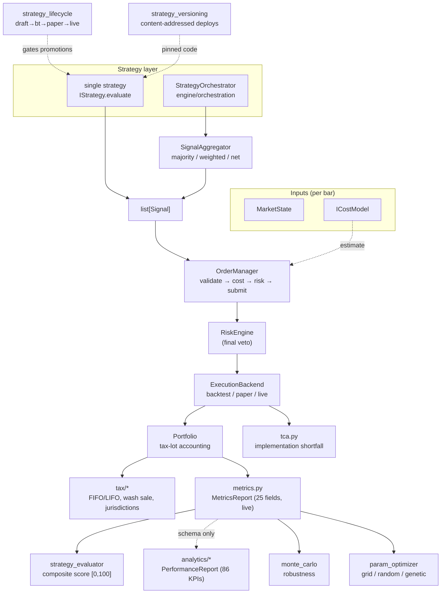

# Core engine domains

[`overview.md`](overview.md) describes the engine as a *service* —
FastAPI app, request lifecycle, middleware, deploy topology. This
document is the companion view: it maps the **domain layer** under
[`engine/core/`](../../engine/core/) (and its sibling
[`engine/orchestration/`](../../engine/orchestration/)) — the modules
that turn signals into decisions, decisions into fills, and fills into
performance numbers.

The repo-root [`ARCHITECTURE.md`](../../ARCHITECTURE.md) is the
authoritative reference for the four "headline" components
(`OrderManager`, `CostModel`, `Portfolio`, `RiskEngine`,
`BacktestRunner`); we cross-reference it rather than duplicate it and
focus here on the layers that file does **not** enumerate: multi-strategy
orchestration, the analytics taxonomy, strategy governance, optimization,
and post-trade cost analysis.

## Component map

## Multi-strategy orchestration

Three strategy combiners exist. They overlap in spirit but are
deliberately separate modules with different conflict-resolution
semantics. Pick by voting model **and capital awareness**, not by file
name — the first two are pure signal voters (capital-agnostic); the
third is capital-aware (see below).

### `engine/orchestration/orchestrator.py` — `StrategyOrchestrator`

The "register N strategies, run them all, collapse to one decision set"
loop. Two-step API: `await orch.run_all(market)` collects every
strategy's signals, then `orch.aggregate_signals()` resolves conflicts.

`ConflictResolution` selects the merge rule:

| Mode | Rule |
|---|---|
| `PRIORITY` *(default)* | The highest-priority strategy with a non-HOLD opinion wins. Opposing signals from strategies tied at top priority → HOLD (stalemate). HOLD abstains. |
| `NET_POSITION` | `BUY = +weight`, `SELL = −weight` summed per symbol. Positive net → BUY, negative → SELL, zero → HOLD. Resolved weight is the net magnitude clamped to `[0, 1]`, so conviction can override headcount. *(Unique to this orchestrator.)* |

### `engine/core/strategy_orchestrator.py` — async orchestrator

The heavier async counterpart. Three responsibilities that the bare
[`SignalAggregator`](../../engine/core/signal_aggregator.py) (gh#21) does
not own:

1. **Registry** — each strategy is registered with a per-strategy
   `weight`.
2. **Evaluation** — every registered strategy sees the *same*
   `market_data` and `cost_model` so cross-strategy comparisons are
   apples-to-apples. A single failing strategy is isolated: its error is
   recorded and the rest still vote.
3. **Dispatch** — hands the per-strategy `SignalBatch`es to
   `SignalAggregator`, which is the single source of truth for tie
   handling.

Aggregation modes (in [`signal_aggregator.py`](../../engine/core/signal_aggregator.py)):

| Mode | Rule |
|---|---|
| `MAJORITY` | Strictly more than half of BUY-vs-SELL votes wins; tie → HOLD. HOLD abstains and is excluded from the denominator. |
| `WEIGHTED` | Vote × registered weight (default 1.0); strictly higher total wins; tie → HOLD. Lets a high-conviction strategy override a numerical majority. |

HOLD-as-abstain is the unifying contract across both modes and both
orchestrators: a strategy that declines to vote never blocks the others,
and a symbol on which every strategy abstains still yields a single HOLD
record so downstream consumers know it was considered.

### `engine/portfolio/multi_strategy.py` — `MultiStrategyPortfolio`

The **capital-aware** combiner. Unlike the two orchestrators above
(which answer "given these signals, what do we do?" with no notion of
dollars), this one answers "given these strategies *and this much money
split this way*, what do we do?" — dollar allocation is a first-class
input to the merge. It owns three concerns the pure voters do not:

1. **Capital allocation** — each strategy is registered with a relative
   `capital_weight`; dollar allocations are normalised against the
   weight sum at lookup time, so weights need not sum to 1.0 and the
   portfolio is the source of truth for *how much money* each strategy
   may deploy. Construction rejects `total_capital < 0` outright
   (division-by-zero guard, gh#1179) and rejects non-finite weights.
2. **Evaluation** — every registered strategy is invoked with the same
   `market_data` and the portfolio's `ICostModel`, each receiving an
   independent deep copy so a misbehaving plugin cannot poison its
   siblings or the caller's originals. A strategy that raises — or
   exceeds the configured `eval_timeout` — is isolated: its error lands
   in `PortfolioEvaluation.errors` and the remaining strategies still
   contribute. Sync and async strategies are both supported; only the
   awaitable result is bounded by the timeout.
3. **Risk-adjusted merging** — per symbol, the capital-weighted *dollar
   exposure* is netted (`BUY = +allocation·weight`, `SELL = −`…, HOLD
   abstains). The merged side is the sign of the net; the merged
   `net_weight` is `|net exposure| / total_capital` clamped to `[0, 1]`.
   Conviction is therefore dollar-weighted: a strategy with more capital
   at risk moves the decision proportionally more, and the merged
   weight is itself a measure of how much of the book is committed.

| Merge mode | Rule |
|---|---|
| `RISK_ADJUSTED` *(default, only mode today)* | Net signed dollar exposure per symbol; `|net|` within `_NET_EPSILON` (1e-9) → HOLD so float dust (e.g. `100 − 50 − 50`) cannot manufacture a phantom trade. |

The merged `Signal` is re-stamped `strategy_id = "portfolio"` with a
`metadata.portfolio_contributors` list of the voting strategy ids, so
the audit trail preserves the merge and its provenance.
`PortfolioEvaluation` also exposes `positions` (per-symbol
`CombinedPosition`), `per_strategy_signals` (full provenance),
`capital_deployed`, `net_exposure`, `capital_utilization`, and `errors`.
`is_noop` is true only when no merged signal was produced *or* total
capital is zero — both short-circuit before any strategy runs.

> **Status:** landed and fully unit-tested
> ([`tests/test_multi_strategy_portfolio.py`](../../tests/test_multi_strategy_portfolio.py))
> but **library-only** — it is not referenced anywhere in `engine/`
> outside `engine/portfolio/` and is not wired to a route or the
> execution factory. See [known-limitations.md](../known-limitations.md).

## Cost & risk modeling

The cost model is what makes Nexus "cost-first" — `ICostModel` is an
argument to every `evaluate()`, so a strategy can price in commissions,
spread, slippage, taxes, and wash-sale risk *before* emitting a signal.
The headline `DefaultCostModel` (`cost_model.py`) is documented in
[`ARCHITECTURE.md`](../../ARCHITECTURE.md). The specialized models layer on top:

| Module | Adds |
|---|---|
| [`market_impact.py`](../../engine/core/market_impact.py) | **Almgren-Chriss** square-root market-impact model (gh#96). Estimates the price drift an order *causes*, decomposed into temporary impact (reverts post-fill) and permanent impact (information leakage, does not revert). The institutional standard when order size is large vs. ADV. |
| [`tca.py`](../../engine/core/tca.py) | **Post-trade TCA.** Per-fill implementation shortfall and arrival slippage, plus `aggregate_tca()` rollups by broker and symbol. Distinct decision price (signal quote) vs. arrival price (venue entry). |
| [`execution_costs.py`](../../engine/core/execution_costs.py) / [`holding_costs.py`](../../engine/core/holding_costs.py) | Per-leg execution cost and borrow/carry holding-cost accrual. |
| [`regulatory_fees.py`](../../engine/core/regulatory_fees.py) / [`crypto_costs.py`](../../engine/core/crypto_costs.py) | Asset-class-specific statutory and venue fees. |

`RiskEngine` (`risk_engine.py`) is the **final veto** in the
`OrderManager` pipeline: it runs after the cost estimate and can reject
an order the cost model was happy with. Circuit breaker (10 % drawdown
halt), max open positions, concentration cap, single-order value cap, and
daily trade limit are the default rule set — see
[`ARCHITECTURE.md`](../../ARCHITECTURE.md) for the table.

## Execution backends

The order manager never calls a broker directly — it goes through the
`ExecutionBackend` ABC
([`engine/core/execution/base.py`](../../engine/core/execution/base.py)),
so the same strategy code runs unchanged in backtest, paper, and live.
The split across two packages is deliberate and worth knowing:

| Location | What it is |
|---|---|
| [`core/execution/base.py`](../../engine/core/execution/base.py) | `ExecutionBackend` ABC + `FillResult` dataclass. The single contract the order manager holds. |
| [`core/execution/backtest.py`](../../engine/core/execution/backtest.py) | `BacktestBackend` — fills at the bar's price. |
| [`core/execution/paper.py`](../../engine/core/execution/paper.py) | `PaperExecutionBackend` — simulated fills with a pluggable `SlippageModel`. |
| [`core/execution/live.py`](../../engine/core/execution/live.py) | `LiveBackend` — a **scaffold base class** (`_is_scaffold = True`). It tracks connection state but talks to *no* broker; concrete subclasses flip the flag and implement `_do_connect` / `_submit_order`. |
| [`core/execution/factory.py`](../../engine/core/execution/factory.py) | `create_backend(name)` registry. Built-ins: `backtest`, `paper`, `live`. Extensible at startup via `register_backend()`. |
| [`engine/execution/`](../../engine/execution/) *(top-level, SEV-223)* | `LiveExecutionBackend` — the **concrete** Alpaca-compatible REST adapter. Implements the ABC's `connect`/`disconnect`/`execute` *and* exposes broker-direct async helpers `submit_order` (`POST /v2/orders`), `cancel_order` (`DELETE /v2/orders/{id}`), `get_order_status` (`GET /v2/orders/{id}`). |

A second concrete Alpaca trading client lives in
[`engine/core/brokers/alpaca/`](../../engine/core/brokers/alpaca/) —
`AlpacaTradingClient` (gh#136) implements the `BrokerClient` Protocol
from [`engine/core/brokers/models.py`](../../engine/core/brokers/models.py)
and goes direct to Alpaca's REST API over an injectable `httpx.AsyncClient`
(no `alpaca-py` dependency). The two adapters are **not** unified yet:
the `brokers/` package targets the broker Protocol surface (clock,
account, positions), while `engine/execution/` targets the
`ExecutionBackend` surface the order manager calls. Pick by which
interface you hold.

Both concrete adapters share the typed error vocabulary from
[`engine/core/brokers/base.py`](../../engine/core/brokers/base.py):
`401/403 → BrokerAuthError` (permanent, kill-switch), `5xx/429/408 +
transport errors → BrokerConnectionError` (retried with backoff, then
raised), `400/404/422 → BrokerRejectError` (per-order).
`LiveExecutionBackend` also stamps a broker `client_order_id` (uuid4)
on every submit so the broker can de-duplicate retries (gh#49eec71) —
the same idempotency convention the order manager relies on.

> **Status:** the `BacktestBackend` is the only execution backend wired
> into a run path (the backtest runner). `PaperExecutionBackend`,
> `LiveBackend`, `LiveExecutionBackend`, and `AlpacaTradingClient` are
> library-only today — none is registered in the factory *and* mounted
> by a route. See [`known-limitations.md`](../known-limitations.md).

## Portfolio accounting

[`Portfolio`](../../engine/core/portfolio.py) is full tax-lot accounting.
`open_position()` deducts cash and opens a lot; `close_position()`
walks lots under the selected method (FIFO / LIFO / SPECIFIC_LOT),
computes realized P&L, and records the sale for wash-sale detection.
`snapshot()` returns an immutable `PortfolioSnapshot` handed to
strategies (mutating it can't corrupt the live book). The root
[`ARCHITECTURE.md`](../../ARCHITECTURE.md) covers the lot mechanics.

Two allocation modules sit beside it:

| Module | Purpose |
|---|---|
| [`capital_allocation.py`](../../engine/core/capital_allocation.py) | **Largest-remainder (Hamilton) apportionment** of total capital across strategies proportional to weights, computed in fixed-point `Decimal` so the result is exact to the cent. Floors each raw share, then distributes the leftover cents to the largest fractional remainders. |
| [`portfolio/allocation.py`](../../engine/portfolio/allocation.py) | `CapitalAllocation` — the **immutable value object** recording the split. Weights sum to exactly 1.0 (ε-tolerant), are non-negative, and the strategy count is capped by `max_strategies`. In-place mutation is blocked (gh#1042). |
| [`portfolio/multi_strategy.py`](../../engine/portfolio/multi_strategy.py) | `MultiStrategyPortfolio` — the capital-aware registry that *evaluates* every strategy with a deep-copied cost model and merges signals by netted dollar exposure (the `RISK_ADJUSTED` mode above). Distinct from the two pure-voter orchestrators because the dollar allocation drives the merge. Library-only today (gh#1179). |

Tax reporting lives in [`engine/core/tax/`](../../engine/core/tax/):
FIFO/LIFO lot matching, US wash-sale detection (`wash_sale.py`), and
per-jurisdiction summarizers exposed by `POST /api/v1/tax/report/{code}`
(`US`, `GB`, `DE`, `FR`) — see [`api-reference.md`](../api-reference.md#tax).

## Performance analytics

There are **two** analytics containers. Do not conflate them:

### `MetricsReport` — live, used today

[`engine/core/metrics.py`](../../engine/core/metrics.py). The container
the backtest runner actually computes and that `GET /backtest/results/{id}`
returns as `metrics`. ~25 scalar fields (total/annualized return, Sharpe,
Sortino, Calmar, max drawdown + duration + recovery, volatility,
win-rate, profit factor, avg winner/loser, streaks, total costs/taxes,
cost-drag %, turnover, exposure %) plus three series (`equity_curve`,
`drawdown_curve`, `rolling_metrics`).

### `PerformanceReport` — 86-KPI schema, not yet wired

[`engine/core/analytics/`](../../engine/core/analytics/) is the
**86-KPI taxonomy** (gh#97), split into eight section models:

| Section (file) | KPI range | Covers |
|---|---|---|
| `returns.py` | 1–14 | Return ratios + `PeriodReturn` value object. |
| `risk_adjusted.py` | 15–24 | Sharpe/Sortino/Omega/Calmar/Treynor/Information/Payoff/Profit-factor. Infinite/undefined ratios → `null`. |
| `drawdown.py` | 25–34 | Underwater series + duration/recovery. |
| `trades.py` | 35–50 | Win/loss rates, streaks, holding periods, cadence. |
| `costs.py` | 51–58 | Cost breakdown + slippage/IS in basis points. |
| `positions.py` | 59–66 | Exposure, long/short, concentration, simultaneous positions. |
| `volatility.py` | 67–76 | VaR/CVaR (positive magnitudes), capture ratios, tail ratio. |
| `time_analysis.py` | 77–86 | Monthly heatmap, day-of-week/hour returns, rolling Sharpe/DD, dual equity curve. |
| `report.py` | envelope | `PerformanceReport` aggregates the eight; `metric_count` asserts all 86 present. |

> **Status — accurate caveat.** The section modules and the envelope
> are on disk, but the builder (`engine/core/analytics/analyzer.py`)
> referenced by their docstrings is **not**, and nothing under
> `engine/api/` or `engine/core/backtest_runner.py` imports the report.
> So `PerformanceReport` is a landed schema, not yet a live output: the
> API surface still serves `MetricsReport`. Treat the 86-KPI contract as
> the intended shape; a future PR wires an analyzer and a route.

### Companion analytics modules

These operate on an equity curve / trade log and are independently
usable:

| Module | Computes |
|---|---|
| [`rolling_metrics.py`](../../engine/core/rolling_metrics.py) / [`rolling_correlation.py`](../../engine/core/rolling_correlation.py) / [`rolling_benchmark.py`](../../engine/core/rolling_benchmark.py) / [`rolling_trade_stats.py`](../../engine/core/rolling_trade_stats.py) | Rolling-window Sharpe, correlation, benchmark-relative, and trade statistics. |
| [`drawdown_analytics.py`](../../engine/core/drawdown_analytics.py) | Drawdown depth/duration/recovery + excursion stats ([`excursion_stats.py`](../../engine/core/excursion_stats.py)). |
| [`distribution_metrics.py`](../../engine/core/distribution_metrics.py) | VaR / CVaR / skew / kurtosis / tail ratio. |
| [`benchmark_comparison.py`](../../engine/core/benchmark_comparison.py) | Alpha/beta/R-squared, up/down capture, tracking error vs. a benchmark. |
| [`cumulative_returns.py`](../../engine/core/cumulative_returns.py) | Cumulative + `PeriodReturn` series (daily/weekly/monthly). |
| [`monte_carlo.py`](../../engine/core/monte_carlo.py) | Robustness testing — `bootstrap_returns` (Efron i.i.d.) and `block_bootstrap` (Künsch, preserves autocorrelation). Pure numpy, deterministic given a `seed`. |
| [`portfolio_aggregator.py`](../../engine/core/portfolio_aggregator.py) / [`portfolio_concentration.py`](../../engine/core/portfolio_concentration.py) | Cross-portfolio rollups and concentration metrics. |

## Strategy scoring & governance

### Composite scoring — [`strategy_evaluator.py`](../../engine/core/strategy_evaluator.py)

Turns a `MetricsReport` into one number in `[0, 100]` plus a
per-dimension breakdown, a letter grade, and warnings. Used by the
marketplace ranking, A/B comparison surfaces, and the backtest summary
endpoint (so the UI doesn't re-derive it). **Six dimensions**, each
normalized to `[0, 100]`:

| Dimension | Inputs |
|---|---|
| `RISK_ADJUSTED_RETURN` | Sharpe ratio, piecewise mapping. |
| `DRAWDOWN_CONTROL` | Max drawdown, piecewise mapping. |
| `CONSISTENCY` | Coefficient of variation of rolling-window Sharpe. |
| `COST_EFFICIENCY` | Exponential decay on `cost_drag_pct`. |
| `WIN_RATE_QUALITY` | `win_rate × (avg_winner / |avg_loser|)`. |
| `STABILITY` | Annual volatility, piecewise mapping. |

Default weights mirror the spec and sum to 1.0 (risk-adjusted 0.30, …).
Composite = `Σ(dimension × weight)`. The evaluator is **stateless** —
construct one per weight configuration. (See also the persisted
`scoring_snapshots` table, written by the scoring routes.)

### Lifecycle & versioning

Two services govern *when* a strategy may run and *what code* runs:

| Module | Responsibility |
|---|---|
| [`strategy_lifecycle.py`](../../engine/core/strategy_lifecycle.py) | State machine `draft → backtest → paper → live`, with `retired` reachable from any non-draft stage. **No skipping** — you cannot jump draft→live. Each promotion is gated by a `LifecycleEvidence` payload: paper requires a backtest id + minimum Sharpe; live requires a paper window + minimum live-paper Sharpe. |
| [`strategy_versioning.py`](../../engine/core/strategy_versioning.py) | **Content-addressed deploys.** A `StrategyVersion` is a SHA-256 of the code blob + a hash of its canonical-JSON config, so the same code+config never creates two records (re-deploys are idempotent). `deploy` → new `DRAFT`; `activate` promotes to `ACTIVE` (demoting the prior); `rollback` returns to a previous `ACTIVE`. |

Together: `StrategyVersionService` controls *what* code runs;
`StrategyLifecycleService` controls *which stage* it's allowed to run at.

## Optimization — [`param_optimizer.py`](../../engine/core/param_optimizer.py)

Pure-Python hyperparameter search against an objective function
(typically a backtest's Sharpe or compound return).

- **`ParameterSpace`** — typed search space (continuous / discrete /
  categorical dimensions).
- **`Optimizer`** — Protocol the algorithms implement.
- **`optimize(...)`** — the dispatch entry point.

Algorithms shipped (PR1): `GridSearchOptimizer`,
`RandomSearchOptimizer`, `GeneticOptimizer`. Bayesian search and
Hyperband are TODO and noted in the module docstring. Runs are
deterministic given a seed; pair with `monte_carlo` to sanity-check that
an "optimal" parameter set isn't an overfit artifact.

## Wired vs. schema-only (quick reference)

| Capability | Wired into a route/runner? |
|---|---|
| `MetricsReport`, `strategy_evaluator`, `monte_carlo`, `param_optimizer` | Yes — consumed by the backtest runner / scoring routes. |
| `tca.py`, `market_impact.py` | Library-only today — no public route, and neither is consumed by `DefaultCostModel` yet (the square-root model is available for strategies / evaluators to call directly). |
| `PerformanceReport` (86-KPI) | **No** — schema landed, no analyzer/route yet. |
| `strategy_lifecycle` / `strategy_versioning` | Library-only; the public promotion/version API is part of the still-partial live-trading story (see [`known-limitations.md`](../known-limitations.md)). |

## See also

- [`ARCHITECTURE.md`](../../ARCHITECTURE.md) — headline components
  (`OrderManager`, `CostModel`, `Portfolio`, `RiskEngine`,
  `BacktestRunner`), the signal→fill pipeline, and the SDK plugin
  interface.
- [`overview.md`](overview.md) — service-level view (app factory,
  middleware, request lifecycle, deploy topology).
- [`plugins.md`](plugins.md) — strategy discovery, the registry, and the
  five-layer sandbox.
- [`known-limitations.md`](../known-limitations.md) — what is
  half-built, including the live/paper execution and TaskIQ wiring.
