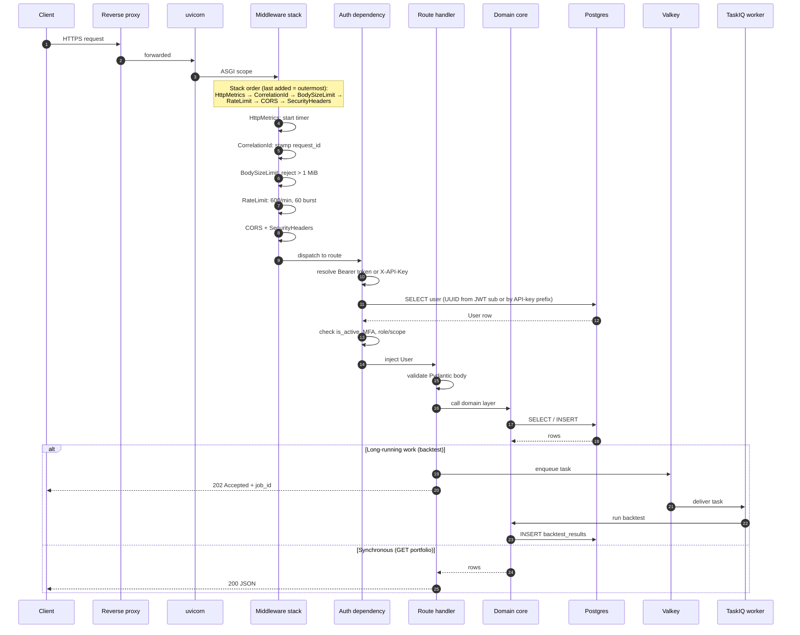
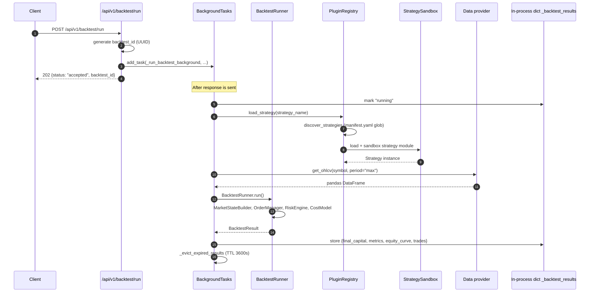
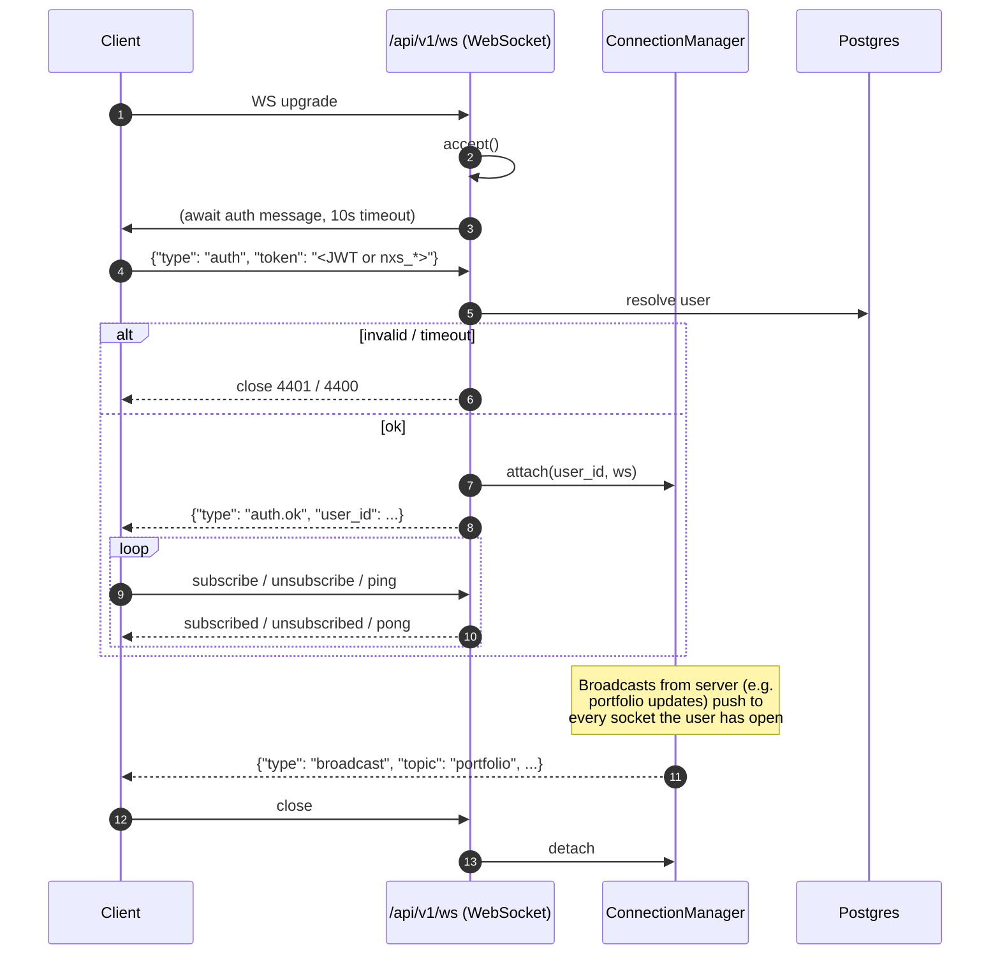
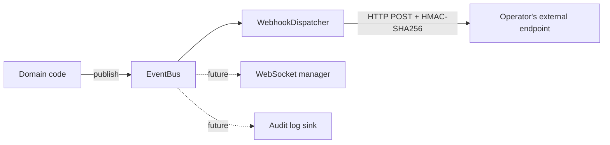

# Request and event lifecycle

How a single call traverses the engine, and how side-effects fan out
once it's done. Read this alongside [`components.md`](components.md) —
same boxes, time dimension added.

## HTTP request lifecycle

### Middleware order is significant

`engine/app.create_app` adds middleware in reverse-execution order:
the *last* `add_middleware` call becomes the *outermost* wrapper. The
current order, from outermost to innermost:

1. `HttpMetricsMiddleware` — times the full request including every
   other middleware. The `/metrics` endpoint is included so scrape
   latency is visible.
2. `CorrelationIdMiddleware` — stamps a request id and propagates the
   OpenTelemetry context.
3. `BodySizeLimitMiddleware` — hard 1 MiB cap on request body
   (`max_bytes=1_048_576`). Starlette has no default; this guard
   prevents a hostile payload from exhausting the form parser.
4. `RateLimitMiddleware` — 600/min default with 60-burst, exempt paths
   from `NEXUS_RATE_LIMIT_EXEMPT_PATHS` (defaults to `/health,/metrics`).
   Per-route overrides live in code; today the only override is
   `/api/v1/client/errors` (30/min) so a buggy React error boundary
   can't DoS the log pipeline.
5. `CORSMiddleware` — origins from `NEXUS_CORS_ORIGINS`.
6. `SecurityHeadersMiddleware` — HSTS, X-Content-Type-Options, etc.

If you add a new middleware, document where in the stack it belongs.
The order matters: rate limiting must run before any expensive work,
and metrics must wrap everything.

### Auth dependency resolution

`get_current_user` (`engine/api/auth/dependency.py`) accepts either
credential shape:

- **JWT** in `Authorization: Bearer <token>`. Decoded by
  `engine.api.auth.jwt.decode_token`; the `sub` claim must be a UUID
  matching a row in `users`. Role and scope enforcement happens via
  `require_role(...)` factories that read `user.role` directly.
- **API key** in `X-API-Key: nxs_<env>_<random>`. Routed to
  `engine.api.auth.api_keys.find_active_by_token` which looks up by
  the first 12 chars (`prefix`) and bcrypt-verifies the full token.
  The matched `ApiKey` row is stashed on `request.state.api_key` so
  `require_api_scope(...)` can enforce `["read" | "trade" | "admin"]`.

JWT auth bypasses scope checks (full-scope); API-key auth bypasses
role checks. Mixing them is intentional: a JWT-authenticated operator
cannot have their permissions revoked by editing an API key, and a
scoped API key cannot escalate by editing the user row.

### MFA gate on login

If the user has `mfa_enabled = True`, `POST /api/v1/auth/login` does
*not* mint tokens. Instead it returns
`{"mfa_required": true, "challenge_token": "<short-lived jwt>"}` and
the client must complete `POST /api/v1/auth/mfa/verify` with a TOTP
code or backup code to receive tokens. Challenge TTL is
`NEXUS_MFA_CHALLENGE_TTL_SECONDS` (default 300s).

## Background-task lifecycle (backtest)

Today backtests run via FastAPI `BackgroundTasks` inside the engine
process — a known limitation tracked in
[`limitations.md`](../limitations.md). The wire-up exists to move
them onto TaskIQ workers without changing the public API:

The client polls `GET /api/v1/backtest/results/{backtest_id}` until
`status != "running"`. The result lives in a process-local dict with
a 1-hour TTL; restart loses pending results. The TaskIQ path
(`engine.tasks.worker.run_backtest_task`) is identical but persists
via the result backend.

## WebSocket lifecycle

The manager is process-local. Multi-replica deployments need a Redis
pub/sub fan-out so that a broadcast issued by replica A reaches
connections held by replica B. That work is on the roadmap; see
`engine/api/websocket/manager.py` docstring.

## Event flow (post-handler side effects)

The `EventBus` (`engine/events/bus.py`) is an in-process pub/sub. The
single production subscriber today is `WebhookDispatcher`
(`engine/events/webhook_dispatcher.py`), which:

1. Loads every active `WebhookConfig` row whose `event_types` overlap
   the event.
2. Renders the payload using the configured template (`generic`,
   `discord`, `slack`, or `telegram`).
3. POSTs to the configured URL with HMAC-SHA256 signature header
   (`X-Nexus-Signature`).
4. Records a `WebhookDelivery` row (status, response code, attempts,
   error). Retries up to `max_retries` on 5xx or network failure;
   gives up on 4xx.

Adding a new subscriber type (e.g. broadcast-to-WebSocket, audit log)
means registering a handler on the bus at startup. The bus does not
persist events — durability is the subscriber's responsibility.

## Database session lifecycle

One session per request, injected via the `get_db` FastAPI dependency
(`engine/deps.py`). The session is created by the async sessionmaker
in `engine/db/session.py` and closed when the dependency's `async with`
exits. Commits happen at the route handler boundary; helper functions
must not call `commit()` because that breaks atomicity reasoning.

Tests use the same async session factory against either SQLite (for
fast unit tests) or Postgres (for integration tests, gated by the
`@pytest.mark.integration` marker).

## Failure modes by layer

| Layer            | What fails                          | How the engine responds                                      |
|------------------|-------------------------------------|--------------------------------------------------------------|
| Auth dependency  | Invalid JWT / API key               | 401 Unauthorized                                             |
| Auth dependency  | User `is_active = False`            | 401 Unauthorized ("User account is disabled")                |
| Auth dependency  | API key missing scope               | 403 Forbidden                                                |
| Auth dependency  | Role below required                 | 403 Forbidden                                                |
| Legal dependency | User hasn't accepted required doc   | 403 Forbidden with `{"detail": "Legal acceptance required"}` |
| Rate limiter     | Over budget                         | 429 Too Many Requests                                        |
| Body size limiter| Body > 1 MiB                        | 413 Payload Too Large                                        |
| Data provider    | Upstream timeout / 5xx              | 503 Service Unavailable                                      |
| Data provider    | Upstream 4xx (bad symbol, etc.)     | 400 Bad Request                                              |
| Data provider    | No provider registered for asset    | 501 Not Implemented                                          |
| Background task  | Exception in backtest               | Result marked `failed`; `error` and `error_type` captured    |
| Webhook delivery | Endpoint unreachable / 5xx          | Retried up to `max_retries`; final state `failed`            |
