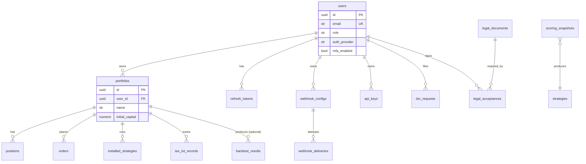

# Data model

Every persistent entity in Nexus Trade Engine, its columns, the
constraints it carries, and how it relates to its neighbours. The
authoritative source is
[`engine/db/models.py`](../../engine/db/models.py); the migration
chain that creates these tables lives in
[`engine/db/migrations/versions/`](../../engine/db/migrations/versions/).

For the **operational** view (migration policy, TimescaleDB usage,
async access patterns), see [`database.md`](database.md). This file
is the entity-relationship view; that one is the run-it view.

## Conventions

- **Primary keys.** UUIDs (`uuid.uuid4` default) on every table.
- **Timestamps.** `DateTime(timezone=True)`. `created_at` defaults to
  `now()`; `updated_at` is updated by an ORM event listener.
- **Money.** `Numeric(18, 8)` — 18 digits total, 8 after the decimal.
  The 8 fractional digits cover crypto quote precision (e.g. satoshi).
- **Semi-structured.** `JSONB` exclusively; no `JSON`. Indexed with
  `GIN` when the application queries by key.
- **Foreign keys.** Default `ON DELETE CASCADE` for owned data
  (orders, positions, webhooks, deliveries). `ON DELETE RESTRICT`
  with `DEFERRABLE INITIALLY DEFERRED` for audit rows
  (`legal_acceptances`) — see that table for details.
- **CHECK constraints.** Largely absent; data correctness is enforced
  at the Pydantic layer. The trade-off is that the DB will accept any
  JSON shape in `JSONB` columns, so schema migrations for those
  columns are application-level concerns.

## Entity map



The diagram covers every model in `engine/db/models.py` except the
pure-data tables (`ohlcv_bars`, `data_provider_attributions`).

---

## Users and identity

### `users` — `engine/db/models.py:25`

```python
id                  UUID PK
email               str(255), unique, indexed
hashed_password     str?                    # null for federated-only users
display_name        str(100)
is_active           bool, default True
role                str(20), default "user"
auth_provider       str(20), default "local"   # local|google|github|oidc|ldap
external_id         str?                       # IdP-specific identifier
mfa_enabled         bool, default False
mfa_secret_encrypted Text?                    # Fernet-encrypted TOTP seed
mfa_backup_codes    JSONB?                    # bcrypt-hashed one-time codes
created_at, updated_at DateTime
```

- **Unique index** `uq_user_provider_external (auth_provider, external_id)`
  lets a single email be claimed by different providers without
  collision.
- `role` is enforced by the application — see
  [`api/reference.md`](../api/reference.md#roles-and-scopes) for the
  hierarchy.
- The role column is **not** overwritten on federated login by default
  (decision #12 in [`decisions.md`](decisions.md)). Operator must
  opt in via `NEXUS_AUTH_OVERWRITE_ROLE_ON_LOGIN=true`.

### `refresh_tokens` — `engine/db/models.py:288`

```python
id           UUID PK
user_id      UUID FK→users.id ON DELETE CASCADE, indexed
token_hash   str(64), unique                  # SHA-256 hex
expires_at   DateTime
revoked_at   DateTime?
created_at   DateTime
user_agent   str?
ip_address   str?
```

`user` relationship cascade-delete means deleting a user kills all
their sessions. Replay detection lives in the auth service: re-using
a revoked token revokes **all** of the user's tokens.

### `api_keys` — `engine/db/models.py:355`

```python
id           UUID PK
user_id      UUID FK→users.id CASCADE, indexed
name         str(255)
prefix       str(32), unique, indexed         # first 12 chars of token
key_hash     str(255)                          # bcrypt
scopes       JSONB list[str]                  # subset of {read, trade, admin}
last_used_at DateTime?
expires_at   DateTime?
revoked_at   DateTime?
created_at, updated_at DateTime
```

- Index `ix_api_keys_user_active (user_id, revoked_at)` backs the
  "list my active keys" query.
- The plaintext token (`nxs_<env>_<32hex>`) is shown only on create.
- See [`api/reference.md#api-keys`](../api/reference.md#api-keys) for
  the issue flow.

---

## Trading

### `portfolios` — `engine/db/models.py:60`

```python
id              UUID PK
user_id         UUID FK→users.id CASCADE, indexed
name            str(200)
description     Text?
initial_capital Numeric(18, 4), default 100000
created_at      DateTime
```

A user can have many portfolios. Strategies are activated per
portfolio.

### `positions` — `engine/db/models.py:75`

```python
id              UUID PK
portfolio_id    UUID FK CASCADE, indexed
symbol          str(20), indexed
quantity        Numeric(18, 8)
avg_entry_price Numeric(18, 8)
current_price   Numeric(18, 8)
updated_at      DateTime
```

- **Unique constraint** `uq_position_portfolio_symbol (portfolio_id,
  symbol)` — one row per (portfolio, symbol).
- `current_price` is updated by `Portfolio.update_prices()` during
  backtests and periodically in paper mode.

### `orders` — `engine/db/models.py:90`

```python
id            UUID PK
portfolio_id  UUID FK CASCADE, indexed
symbol        str(20), indexed
side          str(10)                     # buy|sell
order_type    str(20)                     # market|limit|stop|stop_limit
quantity      Numeric
price         Numeric?
status        str, default "pending"
filled_at     DateTime?
created_at    DateTime
```

**Two Order types coexist** in the codebase:
- `engine.db.models.Order` — this row, the read model.
- `engine.core.oms.order.Order` — frozen dataclass, event-sourced, the
  write model.

The projection from write to read is not yet wired; today the DB row
is the source of truth. See decision #9 in [`decisions.md`](decisions.md).

### `installed_strategies` — `engine/db/models.py:108`

```python
id            UUID PK
portfolio_id  UUID FK CASCADE, indexed
strategy_name str(100)
config        JSONB                       # last-applied params + secrets map
is_active     bool
installed_at  DateTime
```

---

## Tax and accounting

### `tax_lot_records` — `engine/db/models.py:185`

```python
id                      UUID PK
lot_id                  str(36), unique, indexed    # external lot identifier
portfolio_id            UUID FK CASCADE, indexed
symbol                  str(20), indexed
quantity                Numeric
remaining_quantity      Numeric                     # decremented on close
purchase_price          Numeric
purchase_date           DateTime
cost_basis_adjustment   Numeric, default 0          # wash-sale delta
status                  str, default "open"         # open|partially_consumed|closed
created_at, updated_at  DateTime
```

- Index `ix_tax_lot_portfolio_symbol (portfolio_id, symbol)` for the
  FIFO/LIFO consume query.
- `TaxLotStatus` enum is defined in the same file at line 183:
  `OPEN`, `PARTIALLY_CONSUMED`, `CLOSED`.
- Wash-sale cost-basis adjustment is applied to **existing** lots
  when a losing sale triggers the rule; see
  [`engine/core/tax/wash_sale.py`](../../engine/core/tax/wash_sale.py)
  and [`engine/core/portfolio.py:162-178`](../../engine/core/portfolio.py).

---

## Strategy results

### `backtest_results` — `engine/db/models.py:135`

```python
id              UUID PK
portfolio_id    UUID FK CASCADE, indexed, nullable  # migration 003
strategy_name   str(100)
start_date, end_date DateTime
metrics         JSONB                               # full metrics dict
composite_score Numeric?                             # migration 008
score_breakdown JSONB?                               # per-dimension scores
created_at      DateTime
```

`portfolio_id` is nullable so a backtest can be submitted ad-hoc
without first creating a portfolio object.

### `scoring_snapshots` — `engine/db/models.py:305`

```python
id                UUID PK
strategy_id       str(100), indexed
universe_size     int
excluded_factors  JSONB list         # factors dropped (e.g. all-NaN)
results           JSONB dict         # {symbol: SymbolScore.to_dict()}
created_at        DateTime
```

Index `ix_scoring_snapshot_strategy_time (strategy_id, created_at)`
backs the paginated history query.

---

## Webhooks

### `webhook_configs` — `engine/db/models.py:118`

```python
id              UUID PK
user_id         UUID FK CASCADE, indexed
portfolio_id    UUID FK CASCADE, indexed, nullable
url             str(2048)
event_types     JSONB list[str]
signing_secret  str(128)                    # HMAC-SHA256 key
custom_headers  JSONB dict
template        str, default "generic"      # generic|discord|slack|telegram
max_retries     int, default 3
is_active       bool, default True
created_at, updated_at DateTime
```

The signing secret is shown only on `POST /api/v1/webhooks` response.
The DB stores it in plaintext (we need it to sign payloads); protect
DB backups accordingly.

### `webhook_deliveries` — `engine/db/models.py:155`

```python
id              UUID PK
webhook_id      UUID FK CASCADE, indexed
event_type      str(64), indexed
payload         JSONB                       # canonical payload, post-template
status          str(20), default "pending", indexed  # pending|delivered|failed|retry
response_status int?
response_ms     int?
attempts        int
error           Text?
created_at      DateTime, indexed
delivered_at    DateTime?
```

Every attempt is a row, not an update — append-only audit trail.

---

## Legal and compliance

### `legal_documents` — `engine/db/models.py:240`

```python
id                  UUID PK
slug                str(50), unique, indexed       # e.g. "terms-of-service"
title               str(200)
current_version     str(20)                        # semver-ish
effective_date      Date
requires_acceptance bool, default True
category            str(30), default "general", indexed
display_order       int
file_path           str(255)
created_at, updated_at DateTime
```

Populated at startup by `sync_legal_documents()` in
[`engine/legal/sync.py`](../../engine/legal/sync.py), which walks
`NEXUS_LEGAL_DOCUMENTS_DIR/*.md` and upserts.

### `legal_acceptances` — `engine/db/models.py:260`

```python
id               UUID PK
user_id          UUID FK→users.id ON DELETE RESTRICT DEFERRABLE INITIALLY DEFERRED
                 indexed
document_slug    str
document_version str
accepted_at      DateTime
ip_address       str(45)
user_agent       str(500)
context          str, default "onboarding"      # onboarding|settings|api
revoked_at       DateTime?
```

- Indexes: `ix_acceptance_user_doc`, `ix_acceptance_user_doc_ver`,
  `ix_acceptance_time`.
- The FK is the **only** non-CASCADE FK in the schema. The deferred
  RESTRICT means a `DELETE FROM users` will fail at commit time if any
  acceptance row references it. Migration 006 made the table
  effectively immutable (`UPDATE` and `DELETE` are blocked by
  triggers). This is intentional — acceptances are legal evidence.

---

## Privacy / DSR

### `dsr_requests` — `engine/db/models.py:330`

```python
id            UUID PK
user_id       UUID FK CASCADE, indexed
kind          str(32)                    # export|delete|rectify|restrict|object
status        str, default "pending"     # pending|in_progress|completed|failed|cancelled
note          str?
details       JSONB
sla_due_at    DateTime                   # default now() + 30 days
completed_at  DateTime?
cancelled_at  DateTime?
created_at, updated_at DateTime
```

- Index `ix_dsr_requests_user_kind_status (user_id, kind, status)`.
- SLA = 30 days by default (GDPR Art. 12). `record_request()` in
  [`engine/privacy/dsr.py`](../../engine/privacy/dsr.py) sets the
  due date.

---

## Reference / market data

### `ohlcv_bars` — `engine/db/models.py:215

```python
id         UUID PK
symbol     str(20)
timestamp  DateTime
open, high, low, close, volume  Numeric
```

- Index `ix_ohlcv_symbol_timestamp (symbol, timestamp)`.
- Unique constraint `uq_ohlcv_symbol_timestamp (symbol, timestamp)`.
- Production deployments should convert this to a TimescaleDB
  hypertable — see [`database.md`](database.md#timescaledb-usage).

### `data_provider_attributions` — `engine/db/models.py:280`

```python
id                UUID PK
provider_slug     str(50), unique
provider_name     str
attribution_text  Text
attribution_url   str?
logo_path         str?
display_contexts  JSONB list    # ["dashboard","api","export"]
is_active         bool
created_at, updated_at DateTime
```

Drives the `/api/v1/legal/attributions` endpoint — required by some
data-provider terms of service.

---

## Migration chain

| # | What it adds |
|---|---|
| 001 | Initial schema: users, portfolios, positions, orders, installed_strategies, backtest_results, ohlcv_bars |
| 002 | Auxiliary tables (webhook_deliveries-related, fills) |
| 003 | Make `backtest_results.portfolio_id` nullable |
| 004 | `legal_documents` |
| 005 | Auth/RBAC columns on users (`role`, `auth_provider`, `external_id`) |
| 006 | `legal_acceptances` immutability trigger |
| 007 | `scoring_snapshots` |
| 008 | `backtest_results.composite_score`, `score_breakdown` |
| 009 | `users.{mfa_enabled, mfa_secret_encrypted, mfa_backup_codes}` |
| 010 | `webhook_configs`, `webhook_deliveries` |
| 011 | `api_keys` |
| 012 | `dsr_requests` |

The list of files lives in
[`engine/db/migrations/versions/`](../../engine/db/migrations/versions/).
There is a stray `/workspace/alembic/versions/001_tax_lots.py` that
is **not** in the active chain — see known-issues. Always pick the
next number from the highest file in `engine/db/migrations/versions/`.

## Index cheat-sheet

| Index | Purpose |
|---|---|
| `users.email` (unique) | Login lookup |
| `uq_user_provider_external` | Federated identity dedup |
| `positions.uq_position_portfolio_symbol` | One row per holding |
| `ix_ohlcv_symbol_timestamp` (unique) | OHLCV bar dedup + range scan |
| `ix_tax_lot_portfolio_symbol` | FIFO/LIFO consume |
| `ix_acceptance_user_doc_ver` | "Has user X accepted version Y?" |
| `ix_dsr_requests_user_kind_status` | DSR queue scan |
| `ix_api_keys_user_active` | "List my active keys" |
| `webhook_deliveries.created_at` | Recent-delivery dashboard |
| `scoring_snapshots (strategy_id, created_at)` | Paginated history |

## Sizing notes

- `numeric(18, 8)` per monetary column ≈ 12 bytes. A row in
  `tax_lot_records` is ~120 bytes; 10M lots ≈ 1.2 GB, comfortably
  in memory for analytics.
- `JSONB` columns compress well. `backtest_results.metrics` averages
  ~3 KB compressed for a 5-year daily backtest.
- `webhook_deliveries` is the fastest-growing table in production.
  Plan retention accordingly — see
  [`operations/backup-and-recovery.md`](../operations/backup-and-recovery.md).
- `ohlcv_bars` should be a TimescaleDB hypertable. With daily bars
  for 10 000 symbols over 10 years you have ~25 M rows; vanilla
  Postgres handles this fine but compression + continuous aggregates
  drop the storage cost ~10× and let you serve aggregate queries
  without scanning.
