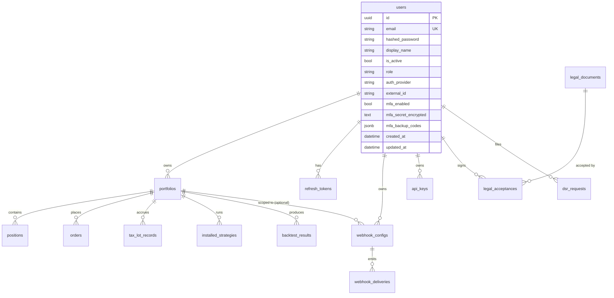

# Data model

The authoritative source for the schema is
[`engine/db/models.py`](../../engine/db/models.py); the authoritative
source for the chain that gets you there is
[`engine/db/migrations/versions/`](../../engine/db/migrations/versions/).
This page is the *reader's* view: every entity, what it means, what it
constrains, and how it relates to its neighbours.

It is intentionally a flat reference, not a tutorial. For the
operational rules around migrations, async access patterns, and
TimescaleDB usage, see [`database.md`](database.md).

## Entity-relationship map

The diagram is illustrative — every relationship is restated with its
exact cardinality and FK semantics below.

## Tables

### `users`

Identity and credentials. One row per human (or, in federated auth, one
per IdP-scoped human — see `auth_provider` + `external_id`).

| Column                   | Type             | Notes                                                                                      |
|--------------------------|------------------|--------------------------------------------------------------------------------------------|
| `id`                     | `UUID` PK        | Default `uuid4`. Used as the JWT `sub` claim.                                              |
| `email`                  | `VARCHAR(255)`   | Unique. Case-sensitive on insert (lower-case on write is the convention).                 |
| `hashed_password`        | `VARCHAR(255)`   | bcrypt. Nullable for federated-only users (e.g. OAuth users that never set a local password). |
| `display_name`           | `VARCHAR(100)`   | Free-form, shown in the UI.                                                                |
| `is_active`              | `BOOL`           | Soft-delete flag. Disabled users fail auth at `_load_active_user`.                         |
| `role`                   | `VARCHAR(20)`    | One of the keys in `ROLE_HIERARCHY` (see `engine/api/auth/dependency.py`). Default `user`. |
| `auth_provider`          | `VARCHAR(20)`    | `local`, `google`, `github`, `oidc`, `ldap`.                                               |
| `external_id`            | `VARCHAR(255)`   | Stable identifier returned by the federated IdP. Null for `local`.                         |
| `mfa_enabled`            | `BOOL`           | TOTP MFA flag. When true, `mfa_secret_encrypted` must be non-null.                         |
| `mfa_secret_encrypted`   | `TEXT`           | TOTP secret, Fernet-encrypted with `NEXUS_MFA_ENCRYPTION_KEY`.                             |
| `mfa_backup_codes`       | `JSONB`          | Hashed backup codes. Consumed once on use.                                                 |
| `created_at`, `updated_at` | `TIMESTAMPTZ`  | Standard.                                                                                  |

**Constraints / indexes**

- `uq_user_provider_external (auth_provider, external_id)` — at most
  one local row per IdP-scoped identity.
- `email` is `UNIQUE`.

### `portfolios`

A user's trading account. Backtests and live positions belong to one
of these.

| Column             | Type               | Notes                                                |
|--------------------|--------------------|------------------------------------------------------|
| `id`               | `UUID` PK          |                                                      |
| `user_id`          | `UUID` FK → users  | `ON DELETE CASCADE`. Indexed.                        |
| `name`             | `VARCHAR(200)`     |                                                      |
| `description`      | `TEXT`             | Default `''`.                                        |
| `initial_capital`  | `NUMERIC(18, 4)`   | Default `100000.0`.                                  |
| `created_at`       | `TIMESTAMPTZ`      |                                                      |

### `positions`

The current live state of one symbol in one portfolio. One row per
`(portfolio_id, symbol)`.

| Column            | Type              | Notes                                              |
|-------------------|-------------------|----------------------------------------------------|
| `id`              | `UUID` PK         |                                                    |
| `portfolio_id`    | `UUID` FK → portfolios | `ON DELETE CASCADE`.                          |
| `symbol`          | `VARCHAR(20)`     | Indexed.                                           |
| `quantity`        | `NUMERIC(18, 8)`  | Signed; negative = short.                          |
| `avg_entry_price` | `NUMERIC(18, 8)`  | Maintained by the OMS on each fill.                |
| `current_price`   | `NUMERIC(18, 8)`  | Last-known mark; refreshed by the data feed.       |
| `updated_at`      | `TIMESTAMPTZ`     |                                                    |

**Constraints**

- `uq_position_portfolio_symbol (portfolio_id, symbol)` — at most one
  position per symbol per portfolio.

### `orders`

Order intent + lifecycle. Written by the OMS before the executor
fills it.

| Column         | Type              | Notes                                            |
|----------------|-------------------|--------------------------------------------------|
| `id`           | `UUID` PK         |                                                  |
| `portfolio_id` | `UUID` FK → portfolios | `ON DELETE CASCADE`.                        |
| `symbol`       | `VARCHAR(20)`     | Indexed.                                         |
| `side`         | `VARCHAR(10)`     | `buy` / `sell`.                                  |
| `order_type`   | `VARCHAR(20)`     | `market` / `limit` / `stop` / etc.               |
| `quantity`     | `NUMERIC`         | Signed.                                          |
| `price`        | `NUMERIC(18, 8)`  | Nullable (market orders).                        |
| `status`       | `VARCHAR(20)`     | FSM: see [`engine/core/oms/states.py`](../../engine/core/oms/states.py). |
| `filled_at`    | `TIMESTAMPTZ`     | Nullable.                                        |
| `created_at`   | `TIMESTAMPTZ`     |                                                  |

### `installed_strategies`

Which strategies a portfolio has installed and what config they run
with. Strategies themselves live on disk under `strategies/` and are
discovered by the plugin registry at startup.

| Column           | Type              | Notes                                            |
|------------------|-------------------|--------------------------------------------------|
| `id`             | `UUID` PK         |                                                  |
| `portfolio_id`   | `UUID` FK → portfolios | `ON DELETE CASCADE`.                        |
| `strategy_name`  | `VARCHAR(100)`    | Matches `manifest.yaml#name`.                    |
| `config`         | `JSONB`           | Arbitrary user-supplied params; checked against the manifest's `config_schema`. |
| `is_active`      | `BOOL`            | Hot-toggleable without uninstall.                |
| `installed_at`   | `TIMESTAMPTZ`     |                                                  |

### `backtest_results`

One row per backtest run. Written by the HTTP handler; updated by the
background worker when it finishes.

| Column              | Type              | Notes                                            |
|---------------------|-------------------|--------------------------------------------------|
| `id`                | `UUID` PK         |                                                  |
| `portfolio_id`      | `UUID` FK → portfolios, nullable | Made nullable in `003` because some ad-hoc backtests aren't tied to a portfolio. |
| `strategy_name`     | `VARCHAR(100)`    |                                                  |
| `start_date`, `end_date` | `TIMESTAMPTZ` |                                                  |
| `metrics`           | `JSONB`           | Full metrics summary (see `BacktestResultResponse` in `engine/api/routes/backtest.py`). |
| `composite_score`   | `FLOAT` nullable  | Single-number grade from the strategy evaluator. |
| `score_breakdown`   | `JSONB` nullable  | Per-dimension score map.                         |
| `created_at`        | `TIMESTAMPTZ`     |                                                  |

### `tax_lot_records`

Tax-lot accounting per portfolio per symbol. Closed lots are retained
for audit — they are not deleted on close.

| Column                   | Type               | Notes                                       |
|--------------------------|--------------------|---------------------------------------------|
| `id`                     | `UUID` PK          |                                             |
| `lot_id`                 | `VARCHAR(36)` UK   | External identifier.                        |
| `portfolio_id`           | `UUID` FK → portfolios | `ON DELETE CASCADE`.                   |
| `symbol`                 | `VARCHAR(20)`      | Indexed.                                    |
| `quantity`               | `NUMERIC(18, 8)`   | Original acquired quantity.                 |
| `remaining_quantity`     | `NUMERIC(18, 8)`   | Decremented on each disposal.               |
| `purchase_price`         | `NUMERIC(18, 8)`   |                                             |
| `purchase_date`          | `TIMESTAMPTZ`      |                                             |
| `cost_basis_adjustment`  | `NUMERIC(18, 8)`   | Wash-sale adjustments accrue here.          |
| `status`                 | `VARCHAR(30)`      | `open` / `partially_consumed` / `closed`.   |
| `created_at`, `updated_at` | `TIMESTAMPTZ`    |                                             |

**Constraints**

- `ix_tax_lot_portfolio_symbol (portfolio_id, symbol)` — the working
  index for the lot-finder on each disposal.

### `ohlcv_bars`

The market-data cache. TimescaleDB hypertable candidate (see
[`database.md`](database.md)).

| Column       | Type              | Notes                                            |
|--------------|-------------------|--------------------------------------------------|
| `id`         | `UUID` PK         |                                                  |
| `symbol`     | `VARCHAR(20)`     |                                                  |
| `timestamp`  | `TIMESTAMPTZ`     | Bar start.                                       |
| `open`, `high`, `low`, `close` | `NUMERIC(18, 8)` |                          |
| `volume`     | `NUMERIC(24, 4)`  |                                                  |

**Constraints**

- `uq_ohlcv_symbol_timestamp (symbol, timestamp)` — upsert key.
- `ix_ohlcv_symbol_timestamp` — primary read pattern.

### `webhook_configs`

Outbound webhook subscriptions.

| Column            | Type              | Notes                                            |
|-------------------|-------------------|--------------------------------------------------|
| `id`              | `UUID` PK         |                                                  |
| `user_id`         | `UUID` FK → users | `ON DELETE CASCADE`.                             |
| `portfolio_id`    | `UUID` FK → portfolios, nullable | Scope the webhook to a single portfolio, or null for all of the user's portfolios. |
| `url`             | `VARCHAR(2048)`   |                                                  |
| `event_types`     | `JSONB`           | List of event names to subscribe to.             |
| `signing_secret`  | `VARCHAR(128)`    | Generated server-side; returned to the operator **once** on create. Reads return null. |
| `custom_headers`  | `JSONB`           | Headers added to every outbound POST.            |
| `template`        | `VARCHAR(20)`     | One of `generic`, `discord`, `slack`, `telegram`. |
| `max_retries`     | `INT`             | Default 3.                                       |
| `is_active`       | `BOOL`            |                                                  |
| `created_at`, `updated_at` | `TIMESTAMPTZ` |                                                  |

### `webhook_deliveries`

Audit trail of every outbound webhook attempt.

| Column            | Type              | Notes                                            |
|-------------------|-------------------|--------------------------------------------------|
| `id`              | `UUID` PK         |                                                  |
| `webhook_id`      | `UUID` FK → webhooks | `ON DELETE CASCADE`.                          |
| `event_type`      | `VARCHAR(64)`     | Indexed.                                         |
| `payload`         | `JSONB`           | The body that was sent.                          |
| `status`          | `VARCHAR(20)`     | `pending`, `delivered`, `failed`, `dead`.        |
| `response_status` | `INT` nullable    |                                                  |
| `response_ms`     | `INT` nullable    |                                                  |
| `attempts`        | `INT`             | Bumped by the dispatcher on each retry.          |
| `error`           | `TEXT` nullable   | Last error string.                               |
| `created_at`, `delivered_at` | `TIMESTAMPTZ` | `delivered_at` is null until terminal success. |

### `legal_documents`

Markdown documents that the engine requires users to accept (Terms,
Privacy, Risk Disclaimer, etc.). Seeded from `legal/` on startup.

| Column               | Type            | Notes                                       |
|----------------------|-----------------|---------------------------------------------|
| `id`                 | `UUID` PK       |                                             |
| `slug`               | `VARCHAR(50)` UK | URL-safe identifier.                       |
| `title`              | `VARCHAR(200)`  |                                             |
| `current_version`    | `VARCHAR(20)`   | Semver.                                     |
| `effective_date`     | `DATE`          |                                             |
| `requires_acceptance`| `BOOL`          | If false, the doc is informational only.    |
| `category`           | `VARCHAR(30)`   | Indexed. Used by the UI to group docs.      |
| `display_order`      | `INT`           |                                             |
| `file_path`          | `VARCHAR(255)`  | Path under `legal/` to the source markdown. |
| `created_at`, `updated_at` | `TIMESTAMPTZ` |                                             |

### `legal_acceptances`

Audit row per acceptance. **Immutable** after insert (enforced by
trigger — see migration `006`).

| Column             | Type              | Notes                                        |
|--------------------|-------------------|----------------------------------------------|
| `id`               | `UUID` PK         |                                              |
| `user_id`          | `UUID` FK → users | `ON DELETE RESTRICT`, deferred. **Never** cascade — audit trail must survive user delete. |
| `document_slug`    | `VARCHAR(50)`     | Denormalised for query speed.                |
| `document_version` | `VARCHAR(20)`     |                                              |
| `accepted_at`      | `TIMESTAMPTZ`     |                                              |
| `ip_address`       | `VARCHAR(45)`     | IPv4 or IPv6.                                |
| `user_agent`       | `VARCHAR(500)`    |                                              |
| `context`          | `VARCHAR(50)`     | `onboarding`, `settings`, etc.               |
| `revoked_at`       | `TIMESTAMPTZ` nullable | Reserved; today no code path writes it. |

**Indexes**: `ix_acceptance_user_doc`, `ix_acceptance_user_doc_ver`,
`ix_acceptance_time`.

### `data_provider_attributions`

Statically seeded attribution text per upstream market-data provider.
Required by some providers' TOS and surfaced by
`GET /api/v1/legal/attributions`.

| Column              | Type            | Notes                                            |
|---------------------|-----------------|--------------------------------------------------|
| `id`                | `UUID` PK       |                                                  |
| `provider_slug`     | `VARCHAR(50)` UK | Matches the registry's `provider.name`.         |
| `provider_name`     | `VARCHAR(100)`  |                                                  |
| `attribution_text`  | `TEXT`          |                                                  |
| `attribution_url`   | `VARCHAR(500)` nullable |                                          |
| `logo_path`         | `VARCHAR(255)` nullable |                                          |
| `display_contexts`  | `JSONB`         | Where to surface this attribution.              |
| `is_active`         | `BOOL`          |                                                  |
| `created_at`, `updated_at` | `TIMESTAMPTZ` |                                             |

### `refresh_tokens`

Long-lived bearer-refresh pairs. Stored as `token_hash = SHA-256(token)`
— the plaintext is shown to the operator only on issue.

| Column          | Type              | Notes                                            |
|-----------------|-------------------|--------------------------------------------------|
| `id`            | `UUID` PK         |                                                  |
| `user_id`       | `UUID` FK → users | `ON DELETE CASCADE`.                             |
| `token_hash`    | `VARCHAR(64)` UK  | SHA-256 hex.                                     |
| `expires_at`    | `TIMESTAMPTZ`     | Default 7 days (see `jwt_refresh_token_expire_days`). |
| `revoked_at`    | `TIMESTAMPTZ` nullable | Null = still valid. Reuse of a revoked token triggers family-wide revocation (replay defence in `routes/auth.py`). |
| `user_agent`    | `VARCHAR(512)` nullable |                                            |
| `ip_address`    | `VARCHAR(45)` nullable |                                            |
| `created_at`    | `TIMESTAMPTZ`     |                                                  |

### `scoring_snapshots`

Persisted output of a scoring strategy run. Stored separately from
`backtest_results` because scoring is a different shape: it produces a
*vector* of scores over a universe rather than a single equity curve.

| Column             | Type            | Notes                                            |
|--------------------|-----------------|--------------------------------------------------|
| `id`               | `UUID` PK       |                                                  |
| `strategy_id`      | `VARCHAR(100)`  | Indexed.                                          |
| `universe_size`    | `INT`           |                                                  |
| `excluded_factors` | `JSONB`         | List of factor names the strategy dropped.       |
| `results`          | `JSONB`         | Full results blob.                               |
| `created_at`       | `TIMESTAMPTZ`   |                                                  |

**Index**: `ix_scoring_snapshot_strategy_time (strategy_id, created_at)`
— primary read pattern for time-series queries.

### `dsr_requests`

GDPR / CCPA data-subject request audit row. One per export / delete /
rectify / restrict / object request.

| Column         | Type             | Notes                                            |
|----------------|------------------|--------------------------------------------------|
| `id`           | `UUID` PK        |                                                  |
| `user_id`      | `UUID` FK → users | `ON DELETE CASCADE`.                            |
| `kind`         | `VARCHAR(32)`    | `export`, `delete`, `rectify`, `restrict`, `object`. |
| `status`       | `VARCHAR(32)`    | `pending`, `completed`, `cancelled`.             |
| `note`         | `TEXT` nullable  |                                                  |
| `details`      | `JSONB`          | Operator notes, links to artifacts, etc.         |
| `sla_due_at`   | `TIMESTAMPTZ`    | GDPR Art. 12 SLA — 1 month default.              |
| `completed_at` | `TIMESTAMPTZ` nullable |                                            |
| `cancelled_at` | `TIMESTAMPTZ` nullable |                                            |
| `created_at`, `updated_at` | `TIMESTAMPTZ` |                                             |

**Index**: `ix_dsr_requests_user_kind_status` — common operator query
("show pending deletions for user X").

### `api_keys`

Long-lived tokens for headless / automation use (CI, MCP server,
trading bots). Format: `nxs_<env>_<32-hex-chars>`.

| Column        | Type              | Notes                                            |
|---------------|-------------------|--------------------------------------------------|
| `id`          | `UUID` PK         |                                                  |
| `user_id`     | `UUID` FK → users | `ON DELETE CASCADE`.                             |
| `name`        | `VARCHAR(255)`    | Human-readable label.                            |
| `prefix`      | `VARCHAR(32)` UK  | First 12 chars of the token — the lookup key.    |
| `key_hash`    | `VARCHAR(255)`    | bcrypt of the full token.                        |
| `scopes`      | `JSONB`           | Subset of `read`, `trade`, `admin`.              |
| `last_used_at` | `TIMESTAMPTZ` nullable | Bumped by `touch_last_used` on each request. |
| `expires_at`  | `TIMESTAMPTZ` nullable | Null = no expiry.                             |
| `revoked_at`  | `TIMESTAMPTZ` nullable | Soft revoke. Reads still recognise the row, but auth fails. |
| `created_at`, `updated_at` | `TIMESTAMPTZ` |                                             |

**Index**: `ix_api_keys_user_active (user_id, revoked_at)` — fast
"show me my active keys" query.

## Cardinality cheat-sheet

| From              | To                  | Cardinality | Cascade?  |
|-------------------|---------------------|-------------|-----------|
| `users`           | `portfolios`        | 1 → N       | CASCADE   |
| `users`           | `refresh_tokens`    | 1 → N       | CASCADE   |
| `users`           | `webhook_configs`   | 1 → N       | CASCADE   |
| `users`           | `api_keys`          | 1 → N       | CASCADE   |
| `users`           | `legal_acceptances` | 1 → N       | RESTRICT (deferred) |
| `users`           | `dsr_requests`      | 1 → N       | CASCADE   |
| `portfolios`      | `positions`         | 1 → N       | CASCADE   |
| `portfolios`      | `orders`            | 1 → N       | CASCADE   |
| `portfolios`      | `tax_lot_records`   | 1 → N       | CASCADE   |
| `portfolios`      | `installed_strategies` | 1 → N    | CASCADE   |
| `portfolios`      | `backtest_results`  | 1 → N (nullable FK) | CASCADE |
| `portfolios`      | `webhook_configs`   | 1 → N (nullable FK) | CASCADE |
| `webhook_configs` | `webhook_deliveries`| 1 → N       | CASCADE   |

## Conventions

These hold across every table; the migration chain enforces them:

- **Primary keys** are UUIDs (legacy tables pre-UUID stay as-is; new
  tables use UUIDs).
- **Timestamps** are `TIMESTAMPTZ`. `created_at` defaults to `now()`;
  `updated_at` is bumped by a SQLAlchemy event listener.
- **JSON columns** are `JSONB`, never `JSON`. Add a `GIN` index if you
  query by key.
- **Foreign keys**: `ON DELETE CASCADE` for owned data (a user's
  portfolios, a portfolio's orders); `ON DELETE RESTRICT` for audit
  rows (`legal_acceptances`).
- **Money** uses `NUMERIC(18, 8)` — the 8 fractional digits cover
  crypto precision without needing a separate column type.
- **Unique constraints** are always named (`uq_<table>_<cols>`) so
  migrations that drop / recreate them are unambiguous.

## Where the schema can grow

The most likely additions over the next few quarters:

- **Live trading tables** — `accounts`, `broker_connections`, fills
  history. Today positions/orders exist but no live broker integration
  has shipped.
- **Per-strategy param-store** — `installed_strategies.config` is
  free-form JSONB today; once the marketplace lands a schema-validated
  config API, this becomes a typed column set.
- **Notification log** — `webhook_deliveries` covers outbound HTTP;
  in-app notifications (email, push) currently have no audit table.
