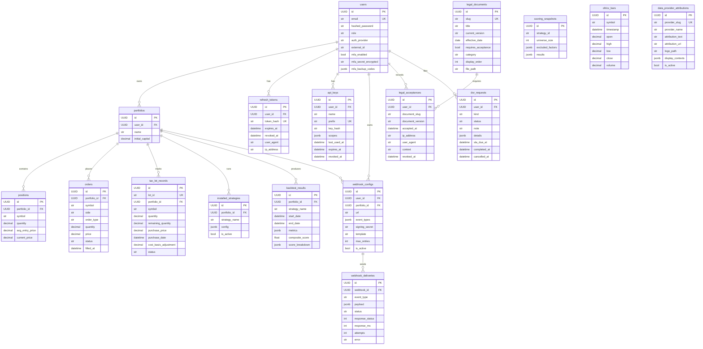

# Data model

This page documents the entities, their relationships, and the
constraints the schema enforces. The source of truth is
[`engine/db/models.py`](../../engine/db/models.py); this page is the
narrative companion.

For migration policy and operational concerns, see
[database.md](database.md).

## Entity-relationship diagram

## Entity-by-entity

### `users` — primary identity

The hub of the data model. Every other entity traces back to a
user. Strategies, backtests, portfolios, webhooks, API keys — all
are scoped by `user_id`.

Notable fields:

- `email` — unique. Used as the login handle for the local auth
  provider.
- `role` — one of `viewer`, `user`, `retail_trader`, `quant_dev`,
  `developer`, `portfolio_manager`, `admin`. See
  `ROLE_HIERARCHY` in
  [`engine/api/auth/dependency.py`](../../engine/api/auth/dependency.py).
- `auth_provider` + `external_id` — composite unique. A user
  created via Google OAuth2 has `auth_provider="google"` and the
  provider's subject claim in `external_id`.
- `hashed_password` — nullable; absent for OAuth2-only users.
- `mfa_secret_encrypted` — Fernet-encrypted TOTP secret. Empty
  when MFA is disabled.
- `mfa_backup_codes` — JSONB of bcrypt-hashed one-time codes.

### `portfolios` — strategy sandboxes

A user owns many portfolios. Each portfolio is the unit of
capital allocation, strategy activation, and P&L reporting.

- `initial_capital` — `Numeric(18, 4)`. Decimal, not float, to
  avoid rounding drift between backtest and live modes.
- Soft-deleted via `archive_portfolio` (`DELETE /portfolio/{id}`),
  which actually deletes the row today; a soft-delete column is
  on the roadmap.

### `positions` — current holdings

One row per `(portfolio_id, symbol)` — enforced by the unique
constraint `uq_position_portfolio_symbol`. The engine updates
these in place on every fill.

`avg_entry_price` is maintained by the OMS; the tax-lot ledger
(`tax_lot_records`) is the auditable counterpart.

### `orders` — order intent and lifecycle

Every order emitted by a strategy lands here regardless of
execution mode (backtest / paper / live). `status` transitions
through `pending → submitted → filled | rejected | failed`.

### `tax_lot_records` — FIFO/LIFO/specific-id ledger

The auditable basis for every position. `status` is one of
`open`, `partially_consumed`, `closed`. `cost_basis_adjustment`
captures wash-sale basis bumps so the strategy can see the
post-wash basis at decision time.

### `backtest_results` — historical run outputs

`portfolio_id` is **nullable** — a backtest can be run ad-hoc
without being attached to a portfolio (e.g. for marketplace
evaluation).

`metrics` is JSONB and carries the full
[`MetricsSummary`](../../engine/api/routes/backtest.py) shape
(Sharpe, Sortino, max drawdown, win rate, cost drag, rolling
windows, etc.). `composite_score` + `score_breakdown` are filled
in by the strategy evaluator
([`engine/core/strategy_evaluator.py`](../../engine/core/strategy_evaluator.py))
and persist the per-dimension rubric used to compare strategies.

### `webhook_configs` + `webhook_deliveries` — outbound fan-out

A user (or operator) registers a webhook target. Every event the
engine emits runs through
[`engine/events/webhook_dispatcher.py`](../../engine/events/webhook_dispatcher.py),
filtered by `event_types` and `portfolio_id`.

- `signing_secret` — returned to the operator only on `POST
  /webhooks`. Reads return null. Used to compute the
  `X-Nexus-Signature` HMAC header on every delivery.
- `template` — one of `generic`, `discord`, `slack`, `telegram`.
  The dispatcher re-shapes the payload per template.
- `webhook_deliveries` is the audit trail: every attempt, response
  status, latency, error.

### `refresh_tokens` — JWT refresh ledger

One row per refresh token ever issued. `token_hash` is a SHA-256
of the raw token; the raw token is never stored.

Replay detection: every refresh atomically flips `revoked_at`
from NULL to now. If the row was already revoked, we know the
token was reused and we revoke every other live token for the
user (see ADR-0007).

### `api_keys` — long-lived headless credentials

- `prefix` — first 8-12 chars of the token, stored in plaintext
  for UI display and DB lookup.
- `key_hash` — bcrypt hash of the full token.
- `scopes` — JSONB array; one or more of `read`, `trade`, `admin`.
- `expires_at` — nullable; absent = no expiry.
- `revoked_at` — nullable; set on `DELETE /api-keys/{id}`.

The full token is returned to the operator exactly once on
create (prefixed `nxs_`); the engine never logs it.

### `legal_documents` + `legal_acceptances` — compliance gate

Every operator ships a set of legal documents (Terms, Privacy,
EULA, Risk Disclaimer, Marketplace EULA, etc.). Each document has
a `slug`, `current_version`, and `effective_date`. Bumping the
version of any `requires_acceptance=true` document forces every
user to re-accept on next API call.

`legal_acceptances` is append-only and immutable (migration 006
installed triggers that block UPDATE and DELETE). This is a
defence-in-depth measure for litigation / regulatory defence.

### `dsr_requests` — GDPR / CCPA request log

One row per data-subject request (export, delete, rectify,
restrict, object). `sla_due_at` is set 30 days from creation to
match GDPR Art. 12(3). The privacy service
([`engine/privacy/`](../../engine/privacy/)) updates `status` and
`completed_at` as the request progresses.

### `installed_strategies` — which strategies are active

Maps a portfolio to a strategy by name (string lookup against
the plugin registry). `config` is the JSONB blob the user passed
on activation.

### `scoring_snapshots` — cross-strategy composite scoring

When a user runs a scoring strategy via
`POST /api/v1/scoring/{strategy_name}/run`, the engine persists
the full result set here. This is the basis for the strategy
comparison views in the dashboard.

### `ohlcv_bars` — market data cache

`(symbol, timestamp)` is unique. The schema is vanilla Postgres
today; the TimescaleDB hypertable conversion is on the roadmap
(see database.md → TimescaleDB usage).

### `data_provider_attributions` — license-required attribution

Provider attributions that must be displayed alongside data they
served. Surfaced at `GET /api/v1/legal/attributions`.

## Constraints and invariants

The schema enforces:

- **Email uniqueness** — `users.email` UNIQUE.
- **Per-provider user uniqueness** —
  `(auth_provider, external_id)` UNIQUE. A Google user can't be
  created twice.
- **Per-portfolio position uniqueness** —
  `(portfolio_id, symbol)` UNIQUE on `positions`.
- **OHLCV deduplication** —
  `(symbol, timestamp)` UNIQUE on `ohlcv_bars`.
- **Legal acceptance immutability** — migration 006 installs a
  trigger that blocks UPDATE/DELETE on `legal_acceptances`.
- **Refresh-token uniqueness** — `token_hash` UNIQUE.
- **API-key prefix uniqueness** — `prefix` UNIQUE.
- **DSR status invariants** — at most one `pending` delete
  request per user, enforced in `engine/privacy/deletion.py`.

## Indexing strategy

The migration chain installs:

- `(symbol, timestamp)` on `ohlcv_bars` (the time-series access
  pattern).
- `(portfolio_id, symbol)` on `tax_lot_records` (the typical
  query is "all lots for this portfolio+symbol").
- `(strategy_id, created_at)` on `scoring_snapshots` (time-
  ordered scan for the results endpoint).
- `(user_id, kind, status)` on `dsr_requests` (status filter +
  kind filter on the operator dashboard).
- `(user_id, revoked_at)` on `api_keys` (active-key lookup).
- `created_at` on `webhook_deliveries` (retention sweep).

GIN indexes on JSONB columns are added lazily as query patterns
emerge. The `metrics` JSONB on `backtest_results` does not yet
have a GIN — operators who need it for analytics should add one
in a migration.

## Decimal precision

Money and quantity columns use `Numeric(18, 4)` and
`Numeric(18, 8)` respectively. Never `float`. The reasoning is
two-fold:

1. Backtest equity curves drift measurably when rounded to float
   precision over thousands of trades.
2. The Python-side types are `Decimal`, which round-trips cleanly
   through `asyncpg` to Postgres `NUMERIC` but loses precision
   through `float`.

When adding a new monetary column, copy the precision from an
existing one (`avg_entry_price`, `proceeds`, etc.) rather than
picking a new pair of numbers.

## Conventions

- Primary keys are UUIDs (`uuid.uuid4` default).
- All tables have `created_at`; mutable tables also have
  `updated_at` (default `now()`, refreshed by SQLAlchemy
  `onupdate`).
- Foreign keys: `ON DELETE CASCADE` for owned data (a user's
  portfolios, orders, positions), `ON DELETE RESTRICT` for audit
  rows (`legal_acceptances`).
- No raw `JSON` columns; everything is `JSONB` for indexability.
- Enum-like values are stored as `String` rather than Postgres
  `ENUM` — easier to migrate, and the validation lives in the
  Pydantic layer.
