# Data model

Entities, relationships, constraints. Schema lives in
[`engine/db/models.py`](../../engine/db/models.py); the migration
chain in [`engine/db/migrations/versions/`](../../engine/db/migrations/versions/).

This doc is a *view* of the schema, not the source of truth — for the
exact column type or constraint, read the model or run
`alembic upgrade head && \d <table>`.

## Entity-relationship diagram

```mermaid
erDiagram
    users ||--o{ portfolios : owns
    users ||--o{ refresh_tokens : has
    users ||--o{ webhook_configs : owns
    users ||--o{ api_keys : owns
    users ||--o{ legal_acceptances : records
    users ||--o{ dsr_requests : files

    portfolios ||--o{ positions : has
    portfolios ||--o{ orders : places
    portfolios ||--o{ installed_strategies : runs
    portfolios ||--o{ tax_lot_records : tracks
    portfolios ||--o{ backtest_results : "produces (optional)"
    portfolios ||--o{ webhook_configs : "scoped-to (optional)"

    webhook_configs ||--o{ webhook_deliveries : sends

    legal_documents ||--o{ legal_acceptances : "accepted-in"

    users {
        UUID id PK
        string email UK
        string hashed_password "nullable (federated)"
        string display_name
        string role "viewer|user|retail_trader|quant_dev|developer|portfolio_manager|admin"
        string auth_provider "local|google|github|oidc|ldap"
        string external_id "nullable, UK with auth_provider"
        bool   mfa_enabled
        text   mfa_secret_encrypted "Fernet-encrypted, nullable"
        jsonb  mfa_backup_codes "nullable"
        bool   is_active
    }

    portfolios {
        UUID     id PK
        UUID     user_id FK
        string   name
        text     description
        decimal  initial_capital "18,4"
        datetime created_at
    }

    positions {
        UUID    id PK
        UUID    portfolio_id FK
        string  symbol
        decimal quantity "18,8"
        decimal avg_entry_price "18,8"
        decimal current_price "18,8"
    }

    orders {
        UUID     id PK
        UUID     portfolio_id FK
        string   symbol
        string   side "buy|sell"
        string   order_type "market|limit|..."
        decimal  quantity
        decimal  price "nullable"
        string   status "pending|filled|cancelled"
        datetime filled_at
    }

    tax_lot_records {
        UUID     id PK
        string   lot_id UK
        UUID     portfolio_id FK
        string   symbol
        decimal  quantity "18,8"
        decimal  remaining_quantity "18,8"
        decimal  purchase_price "18,8"
        datetime purchase_date
        decimal  cost_basis_adjustment "18,8"
        string   status "open|partially_consumed|closed"
    }

    backtest_results {
        UUID     id PK
        UUID     portfolio_id FK "nullable since rev 003"
        string   strategy_name
        datetime start_date
        datetime end_date
        jsonb    metrics
        float    composite_score "nullable, since rev 008"
        jsonb    score_breakdown "nullable, since rev 008"
    }

    installed_strategies {
        UUID     id PK
        UUID     portfolio_id FK
        string   strategy_name
        jsonb    config
        bool     is_active
        datetime installed_at
    }

    webhook_configs {
        UUID     id PK
        UUID     user_id FK
        UUID     portfolio_id FK "nullable"
        string   url
        jsonb    event_types
        string   signing_secret "shown once on create"
        jsonb    custom_headers
        string   template "generic|discord|slack|telegram"
        int      max_retries
        bool     is_active
    }

    webhook_deliveries {
        UUID     id PK
        UUID     webhook_id FK
        string   event_type
        jsonb    payload
        string   status "pending|delivered|failed"
        int      response_status
        int      response_ms
        int      attempts
        text     error
        datetime delivered_at
    }

    refresh_tokens {
        UUID     id PK
        UUID     user_id FK
        string   token_hash UK "SHA-256"
        datetime expires_at
        datetime revoked_at "nullable"
        string   user_agent
        string   ip_address
    }

    api_keys {
        UUID     id PK
        UUID     user_id FK
        string   name
        string   prefix UK "first 12 chars"
        string   key_hash "bcrypt"
        jsonb    scopes "['read'|'trade'|'admin']"
        datetime last_used_at
        datetime expires_at
        datetime revoked_at
    }

    legal_documents {
        UUID    id PK
        string  slug UK
        string  title
        string  current_version
        date    effective_date
        bool    requires_acceptance
        string  category
        int     display_order
        string  file_path
    }

    legal_acceptances {
        UUID     id PK
        UUID     user_id FK "ON DELETE RESTRICT DEFERRABLE"
        string   document_slug
        string   document_version
        datetime accepted_at
        string   ip_address
        string   user_agent
        string   context
        datetime revoked_at "nullable"
    }

    dsr_requests {
        UUID     id PK
        UUID     user_id FK
        string   kind "export|delete|rectify|restrict|object"
        string   status "pending|completed|cancelled"
        text     note
        jsonb    details
        datetime sla_due_at "30 days default"
        datetime completed_at
        datetime cancelled_at
    }

    scoring_snapshots {
        UUID     id PK
        string   strategy_id
        int      universe_size
        jsonb    excluded_factors
        jsonb    results
        datetime created_at
    }

    data_provider_attributions {
        UUID    id PK
        string  provider_slug UK
        string  provider_name
        text    attribution_text
        string  attribution_url
        string  logo_path
        jsonb   display_contexts
        bool    is_active
    }

    ohlcv_bars {
        UUID     id PK
        string   symbol
        datetime timestamp
        decimal  open "18,8"
        decimal  high "18,8"
        decimal  low "18,8"
        decimal  close "18,8"
        decimal  volume "24,4"
    }
```

## Conventions

| Concern | Convention |
|---|---|
| Primary keys | UUIDs (the few bigserial holdouts are gone). |
| Timestamps | `timestamptz` everywhere; default `now()`; `updated_at` maintained by SQLAlchemy `onupdate`. |
| Money / quantity | `NUMERIC(18, 8)` for prices/quantities; `NUMERIC(18, 4)` for capital; `NUMERIC(24, 4)` for volume. |
| JSON | `JSONB`, never `JSON`. Index with `GIN` if you need to query keys. |
| Foreign keys | `ON DELETE CASCADE` for owned data (positions, orders, deliveries); `ON DELETE RESTRICT` for audit rows (`legal_acceptances`). |
| Soft delete | Not used. Rows go away when the parent goes away, or stay forever (audit). |
| Multi-tenant | Not modeled — see ADR-0002 / `non-goals` in [`overview.md`](overview.md). |

## Critical tables

These are the rows you must protect during a restore. The list mirrors
the one in [`docs/operations/backup-and-recovery.md`](../operations/backup-and-recovery.md).

1. **`users`** — identity + role + MFA. The Fernet key for
   `mfa_secret_encrypted` is itself a critical secret (back up
   separately; see [`docs/operations/backup-and-recovery.md`](../operations/backup-and-recovery.md#secrets-and-keys)).
2. **`backtest_results`** — every run a user has ever submitted,
   including `composite_score` + `score_breakdown`.
3. **`portfolios`** + **`positions`** + **`orders`** + **`tax_lot_records`** —
   operational trading state. Becomes write-hot when live trading lands.
4. **`webhook_configs`** + **`webhook_deliveries`** — outbound webhook
   registry + delivery audit trail. `signing_secret` is sensitive.
5. **`legal_acceptances`** — the operator's evidence of consent. The
   immutability trigger (migration `006`) is what makes it evidence.

## Migration chain

| Rev | What it adds |
|---|---|
| 001 | Initial schema: users, portfolios, positions, orders, installed_strategies, backtest_results, ohlcv_bars (TimescaleDB hypertable). |
| 002 | Auxiliary tables (tax_lot_records, etc.). |
| 003 | Make `backtest_results.portfolio_id` nullable (so ad-hoc backtests without a portfolio are valid). |
| 004 | Legal documents + acceptances. |
| 005 | Auth/RBAC: `users.{role,auth_provider,external_id}` + `refresh_tokens`. |
| 006 | Make `legal_acceptances` immutable (no UPDATE / DELETE). |
| 007 | `scoring_snapshots`. |
| 008 | `backtest_results.{composite_score, score_breakdown}`. |
| 009 | `users.{mfa_enabled, mfa_secret_encrypted, mfa_backup_codes}`. |
| 010 | `webhook_configs` + `webhook_deliveries`. |
| 011 | `api_keys`. |
| 012 | `dsr_requests`. |

Run `alembic history` for the source of truth.

## Indexes worth knowing

- `users (email)` — login lookup.
- `users (auth_provider, external_id) WHERE external_id IS NOT NULL` —
  federated login lookup (partial unique index).
- `positions (portfolio_id, symbol)` UNIQUE — one position per symbol
  per portfolio.
- `tax_lot_records (portfolio_id, symbol)` — FIFO/LIFO consumption
  scan.
- `ohlcv_bars (symbol, timestamp)` — the index backing every
  market-data lookup; lives inside the TimescaleDB hypertable.
- `legal_acceptances (user_id, document_slug, document_version)` —
  the legal-gate check.
- `webhook_deliveries (webhook_id, created_at)` — the per-webhook
  delivery history query.
- `api_keys (user_id, revoked_at)` — "my active keys" query.
- `dsr_requests (user_id, kind, status)` — `/privacy/requests` and
  the pending-deletion check.

## TimescaleDB hypertables

- **`ohlcv_bars`** — converted in migration `001` via
  `SELECT create_hypertable('ohlcv_bars', 'timestamp', ...)`. Chunk
  interval: 1 day (engine default).

To add another hypertable (e.g. account-equity history, tick data),
follow the recipe in [`database.md`](database.md#timescaledb-usage).

## Constraints that aren't visible in the model

- **`legal_acceptances` immutability** — a Postgres trigger (added in
  migration `006`) raises an exception on `UPDATE` or `DELETE`. The
  SQLAlchemy model has no `MutableMixin`; the constraint is
  database-side only.
- **`(auth_provider, external_id)` uniqueness** — only enforced when
  `external_id IS NOT NULL` (partial index). Local-only users have
  `external_id=NULL` and don't collide.
- **`ON DELETE RESTRICT` on `legal_acceptances.user_id`** — you
  cannot delete a user row that has acceptances. This forces a soft
  delete via `is_active=false` or a manual cleanup of acceptances
  first. Useful for audit; surprising if you're trying to GDPR-delete.
  See the [Privacy API](../api/privacy.md) for the user-driven flow.

## Where entities are used

| Entity | Read by | Written by |
|---|---|---|
| `User` | every authed route | auth routes (register/login/oauth callback), MFA routes, privacy/delete (sets `is_active=false`) |
| `Portfolio` | portfolio + backtest + strategies routes | portfolio routes, strategy-activate, privacy/delete |
| `Position` / `Order` / `TaxLotRecord` | portfolio aggregator, tax reports | backtest runner, paper/live brokers (planned) |
| `BacktestResult` | backtest results route, scoring route | backtest runner (composite score), scoring executor |
| `WebhookConfig` | webhooks CRUD, dispatcher | webhooks CRUD |
| `WebhookDelivery` | webhooks deliveries route | webhook dispatcher |
| `RefreshToken` | `/auth/refresh`, `/auth/logout` | `/auth/login`, `/auth/refresh`, `/auth/logout` |
| `ApiKey` | `get_current_user` dependency, api-keys routes | `/auth/api-keys` POST + DELETE |
| `LegalDocument` / `LegalAcceptance` | legal routes, `require_legal_acceptance` | legal routes (`/accept`), `legal/sync.py` at startup |
| `DSRequest` | `/privacy/*` | `/privacy/export`, `/privacy/delete`, `/privacy/delete/cancel` |
| `ScoringSnapshot` | `/scoring/{name}/results` | `/scoring/{name}/run` |
| `DataProviderAttribution` | `/legal/attributions` | `legal/sync.py` at startup |
| `OHLCVBar` | market data route (when persisted), backtest runner | data providers (Yahoo today; more planned) |
| `InstalledStrategy` | strategies routes | strategies `/activate` route |

## Related

- [`database.md`](database.md) — migration policy, async access
  patterns, conventions.
- [API reference](../api/) — every entity has at least one route that
  reads or writes it.
- [`docs/operations/backup-and-recovery.md`](../operations/backup-and-recovery.md) —
  what to back up and how to restore.
