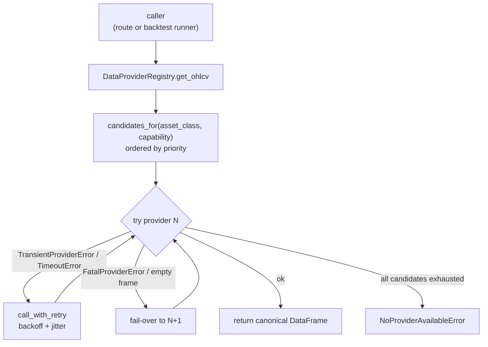

# Data providers

The data layer is the one subsystem that talks to the outside world on
the read path. Every OHLCV bar, quote, options chain, and order book
the engine ever sees comes through it. This document describes how that
layer is structured, how a request is routed, and the invariants it
guarantees — including the security-critical symbol-validation rule.

All of this lives under [`engine/data/providers/`](../../engine/data/providers/).
The trading-domain side of market data (the `MarketState` handed to
strategies) is covered in [`core-domains.md`](core-domains.md); this
doc is the *provider* view.

## Why a provider layer at all

Three forces shape the design:

1. **Vendor lock-in is the enemy of a backtest engine.** A strategy
   that backtests on Yahoo data must be runnable against Polygon in
   production without touching strategy code. The `IDataProvider`
   abstract base ([`base.py`](../../engine/data/providers/base.py)) is
   the seam: every concrete adapter returns the *same* canonical shape
   (a `pandas.DataFrame` with lowercase `open/high/low/close/volume`
   on an ascending UTC `DatetimeIndex`), so callers never branch on
   "which vendor am I talking to".
2. **Every vendor fails differently.** A rate-limit is transient; a
   bad symbol is fatal. The error hierarchy
   (`TransientProviderError` / `FatalProviderError` /
   `CapabilityNotSupportedError`) lets the registry make an
   *automated* fail-over decision instead of a `try/except: pass`.
3. **Vendors are untrusted input handlers.** Symbols are user-supplied
   and interpolated into provider URL paths and cache keys. The layer
   enforces a single symbol grammar *before* any network call so a
   hostile symbol can never become a path-traversal or URL-injection
   vector. See [Symbol validation](#symbol-validation) below.

## Module map

| File | Responsibility |
|---|---|
| [`base.py`](../../engine/data/providers/base.py) | `IDataProvider` ABC, `DataProviderCapability`, `AssetClass` enum, `RateLimit`, the `ProviderError` hierarchy, `HealthCheckResult`. The canonical OHLCV column tuple and the symbol grammar live here. |
| [`registry.py`](../../engine/data/providers/registry.py) | `DataProviderRegistry` — holds configured providers, routes a call to the right one(s) by asset class + capability + priority, and implements fail-over. |
| [`config.py`](../../engine/data/providers/config.py) | YAML loader (`configure_from_file`) + `build_provider` factory. Resolves `${VAR}` placeholders and `NEXUS_<PROVIDER>_<KEY>` overrides. |
| [`_http.py`](../../engine/data/providers/_http.py) | Shared async HTTP client: `validate_symbol` / `encode_path_segment`, response-size guard, redaction of bearer-like strings from logs. |
| [`_resilience.py`](../../engine/data/providers/_resilience.py) | `TokenBucket` (per-provider throttle) + `call_with_retry` (exponential backoff + jitter on transient errors). |
| [`_cache.py`](../../engine/data/providers/_cache.py) | `ProviderCache` — optional Valkey/Redis response cache with an 8 MiB per-payload cap. |
| [`yahoo.py`](../../engine/data/providers/yahoo.py), [`polygon.py`](../../engine/data/providers/polygon.py), [`alpaca_data.py`](../../engine/data/providers/alpaca_data.py), [`binance.py`](../../engine/data/providers/binance.py), [`coingecko.py`](../../engine/data/providers/coingecko.py), [`oanda.py`](../../engine/data/providers/oanda.py) | Concrete adapters. |

## How a request is routed

The registry is the only thing the API and backtest runner talk to —
they never import a concrete provider. A `get_ohlcv(symbol, …)` call
walks this path (mirrored for quote / chain / orderbook):



Routing rules (see the registry module docstring for the canonical
statement):

1. **Candidate set** = providers whose `asset_classes` contains the
   requested class, whose `DataProviderCapability` advertises the
   requested operation, and that are `enabled`. Ordered by `priority`
   ascending (lower number = higher priority); ties break
   alphabetically by name for determinism.
2. **Try in order.** Each adapter runs through `call_with_retry`, which
   retries only `TransientProviderError` / `TimeoutError` with
   exponential backoff + jitter (the `TokenBucket` throttles the
   *outbound* call rate below the vendor's quota so retries don't make
   rate-limiting worse).
3. **Fail-over on fatal or empty.** A `FatalProviderError` (bad symbol,
   bad credentials, unsupported asset) or a `CapabilityNotSupportedError`
   skips to the next candidate. A **non-error but empty** OHLCV frame
   is treated as a *soft miss* and also fails over — e.g. Yahoo
   returning `[]` for a delisted symbol still lets Polygon try. This is
   why the empty check (`_is_empty_dataframe`) exists in the registry
   rather than in the adapter.
4. **Surface the cause.** The final `NoProviderAvailableError` chains
   the last exception as its `__cause__` so the operator can see *why*
   every candidate failed, not just *that* they did.

This fail-over posture is also what the REST error mapping in
[`api-reference.md`](../api-reference.md#market-data) reflects:
`TransientProviderError`/`TimeoutError` → `503`,
`NoProviderAvailableError` → `503`, `CapabilityNotSupportedError` →
`501`, `FatalProviderError` → `400`.

## Capability model

`DataProviderCapability` (a frozen dataclass) is the static contract a
provider advertises. The registry consults it **before** dispatching so
an adapter that doesn't declare `supports_options_chain` is never asked
for one:

| Field | Purpose |
|---|---|
| `name` | Provider identity (matches the YAML key). |
| `asset_classes` | `frozenset[AssetClass]` it can serve. |
| `supports_realtime` / `supports_options_chain` / `supports_orderbook` / `supports_streaming` | Capability flags used as registry predicates. |
| `max_history_days` | Hard ceiling the route clamps the `period` to. |
| `min_interval` | Smallest bar interval the vendor offers (`1d`, `1m`, …). |
| `rate_limit` | `RateLimit(requests_per_minute, burst)`; `0` = unlimited. Feeds the `TokenBucket`. |
| `requires_api_key` | Whether the config builder should warn if no key is present. |

`AssetClass` is a `StrEnum` with six members: `equity`, `etf`,
`options`, `forex`, `crypto`, `futures`. A request pins one explicitly
via the `asset_class` query param; if omitted, the route infers it from
the symbol shape in [`market_data.py:detect_asset_class`](../../engine/api/routes/market_data.py)
(`EURUSD=X → FOREX`, `BTC/USD → CRYPTO`, default `EQUITY`).

## Provider inventory

| Provider | Asset classes | API key? | Notes |
|---|---|---|---|
| `yahoo` | equity, etf | no | The free, no-key default. Lowest trust for production market data but perfect for backtests and dev. |
| `polygon` | equity, options, forex | yes | REST aggregator; rich options chain. |
| `alpaca` | equity | yes (key + secret) | Read-only market data sibling of the `AlpacaTradingClient` broker adapter. |
| `binance` | crypto | optional (key + secret) | Public endpoints work without a key; authenticated endpoints raise the rate ceiling. |
| `coingecko` | crypto | no | No key; heavily rate-limited, so it sits at a low priority. |
| `oanda` | forex | yes | `environment: practice` for the sandbox. |

Adapters are constructed by the `build_provider` factory in
[`config.py`](../../engine/data/providers/config.py), which is the
single place that maps a YAML provider name to a constructor. Adding a
new provider therefore means: (1) a new `*DataProvider(IDataProvider)`
module, (2) one branch in `build_provider`, (3) an entry in the YAML.
The registry and routing code never change.

> **The "CSV provider" in commit messages.** Several recent security
> commits (gh#1440) reference a "CSV provider". That work hardened the
> *shared* symbol grammar and column map in `base.py` that any
> local-file provider (CSV included) inherits — there is no separate
> `csv.py` adapter registered in the factory today. If you add one,
> route its file access through the same `validate_symbol` guard so a
> symbol like `../../etc/passwd` can never reach the filesystem.

## Cross-cutting infrastructure

### Resilience (`_resilience.py`)

Every adapter wraps its network calls in `call_with_retry`:

- **Retry only on transient failures** — `TransientProviderError`,
  `TimeoutError`. A `FatalProviderError` (bad credentials, 4xx) is
  returned immediately; retrying a fatal error would just burn quota.
- **Exponential backoff + jitter** — the sleep grows exponentially and
  is perturbed by jitter so a cohort of retries doesn't synchronise
  into a thundering herd against the vendor.
- **Outbound throttling** — a per-provider `TokenBucket` (capacity =
  `burst`, refill = `requests_per_minute`) caps the outbound rate
  *below* the vendor's published limit, so the engine never trips the
  vendor's own limiter. `rate_limit.requests_per_minute=0` disables
  the bucket.

### Response cache (`_cache.py`)

`ProviderCache` is an *optional* Valkey/Redis-backed cache. Adapters
opt in per call. Design choices worth knowing:

- **Keyed by a hash of the call parameters**, not the raw string, so
  `("1", 1)` and `(1, 1)` can't collide and a long symbol can't blow
  up the key size.
- **8 MiB per-payload cap** (`_MAX_PAYLOAD_BYTES`). An oversized frame
  is refused (`cache.refuse_oversized_set`) rather than cached — a
  hostile or malformed vendor reply can never OOM the cache node.
- **Graceful degradation.** If Valkey is unreachable, the cache logs
  `cache.redis_unavailable` and the adapter proceeds uncached. The
  *trading path* must never depend on the cache being up.

### Shared HTTP client (`_http.py`)

One async `httpx`-based client backs the REST adapters. Two
defensive behaviours live here for *every* vendor call:

- **Response-size guard.** The client streams the body and bails once
  it exceeds the cap, so a hostile/malformed vendor reply can't buffer
  into memory.
- **Log redaction.** Long alphanumeric runs (bearer tokens, HMAC
  signatures) are scrubbed from structured logs so a leaked header
  can't land in the log sink.

## Symbol validation

Symbols are the single user-controlled value that flows deep into the
data path — into provider URL paths (`f"/v2/aggs/ticker/{symbol}/..."`)
and into cache keys. The layer therefore enforces **one** symbol
grammar, in two places, so a hostile value can never reach a network or
filesystem boundary unsanitised.

**The grammar** ([`base.py:SYMBOL_PATTERN`](../../engine/data/providers/base.py)):

```
^[A-Za-z0-9._=^-]{1,32}$
```

The character class is deliberately *narrow*. It permits alphanumerics
plus `.` (share classes like `BRK.B`), `_`, `=` (Yahoo forex like
`EURUSD=X`), `^` (Yahoo indices like `^GSPC`), and `-` (placed last so
it is a literal hyphen, not a range). Critically, it **excludes `/`**
(a URL path separator) and therefore rejects any `..` traversal by
construction — a symbol like `../../etc/passwd` cannot match.

**Enforcement is layered:**

| Layer | Where | What it does |
|---|---|---|
| Route edge | [`market_data.py:_validate_symbol`](../../engine/api/routes/market_data.py) | Strips whitespace, rejects `..`, then `re.fullmatch` (not `match`) against the pattern so a trailing newline can't satisfy the `$` anchor and slip an unsanitised value into logs or response echoes. Returns `400 Invalid symbol format`. |
| Provider edge | [`_http.py:validate_symbol`](../../engine/data/providers/_http.py) | Rejects non-strings, rejects any symbol containing `/` or `..` *before* cosmetic rewriting, then `fullmatch`. Raises `FatalProviderError`. |
| Path encoding | [`_http.py:encode_path_segment`](../../engine/data/providers/_http.py) | `quote(validate_symbol(symbol), safe="")` — the single source of truth for how a symbol becomes a URL path segment. |

> **Why two layers.** Defence in depth. The route check protects the
> public API and produces a clean `400`; the provider check protects
> any *internal* caller (the MCP server, the backtest runner, a future
> CLI) that might construct a request without going through the HTTP
> route. The recent hardening (gh#1440) closed the gap where the
> pattern once admitted `/`, which would have let a symbol break out
> of its URL path segment. Both checks now run `fullmatch` so a
> partial-match bypass is impossible.

This is the same class of "validate before you interpolate" invariant
the strategy sandbox applies to filesystem paths
([`plugins.md`](plugins.md) layer 4). User input never reaches a
filesystem or URL path without passing through a frozen grammar.

## Configuration

Providers are declared in a YAML file pointed at by
`NEXUS_DATA_PROVIDERS_CONFIG` (see
[`config/data_providers.example.yaml`](../../config/data_providers.example.yaml)).
`configure_from_file` loads it at startup and registers every
`enabled` provider with its priority and asset classes.

Resolution order for each value (see the `config.py` module docstring):

1. **`${VAR}` placeholders** inside the YAML are substituted from the
   environment. A reference to an *unset* variable raises — silent
   expansion to `""` would mask a forgotten `POLYGON_API_KEY` and was
   flagged as security-relevant. Only keys in `EXPANDABLE_OPTION_KEYS`
   (`api_key`, `api_secret`, `environment`, `passphrase`,
   `account_id`) are eligible; structural fields (`priority`,
   `asset_classes`) can never come from an arbitrary env var.
2. **`NEXUS_<PROVIDER>_<KEY>` override** — an adapter-specific env var
   wins over the YAML value, so secrets never need to live on disk.
3. Lower `priority` wins; identical priorities tie-break alphabetically.
   `enabled: false` keeps the entry visible to operators but skips
   registration.

```yaml
data_providers:
  polygon:
    enabled: true
    priority: 1
    asset_classes: [equity, options, forex]
    api_key: ${POLYGON_API_KEY}      # resolved from the environment
  yahoo:
    enabled: true
    priority: 99                     # free, no key → fallback
    asset_classes: [equity, etf]
```

> **Secrets caveat.** This is the same P1 noted in
> [`known-limitations.md`](../known-limitations.md): provider secrets
> live in a file on disk read by the engine process. There is no
> Vault / Secrets Manager integration and no per-tenant secrets.
> Render the YAML at deploy time from your secrets manager and ship it
> as a read-only bind mount.

The registry is async-safe and mutable at runtime, so a future
hot-reload of the YAML (operator edits priorities, enables a new
provider) can take effect without a restart — readers snapshot the
registration dict before iterating, so a concurrent mutation never
exposes a torn view.

## Health checks

`IDataProvider.health_check()` returns a `HealthCheckResult(name,
status, latency_ms, detail)` with `status ∈ {up, degraded, down}`. The
`GET /health/providers` route (see
[`api-reference.md`](../api-reference.md#health-observability)) fans
this out across every registered provider so an operator can tell at a
glance which vendor is degraded — the registry's fail-over hides a
single degraded provider from callers, so `/health/providers` is often
the *only* signal that a vendor is struggling.

## Where to put new code

| Adding… | Goes in |
|---|---|
| A new vendor adapter | `engine/data/providers/<vendor>.py` implementing `IDataProvider`; one branch in `config.py:build_provider`; a YAML entry. Register its `DataProviderCapability` so the routing predicates work. |
| A new capability (e.g. futures greeks) | A flag on `DataProviderCapability` + a predicate the registry passes to `candidates_for`. Don't special-case by provider name in the registry. |
| A new asset class | A member of the `AssetClass` enum; update `detect_asset_class` if it should be inferable from a symbol shape. |
| A cached endpoint | Call `ProviderCache.set_dataframe`/`get_dataframe` from the adapter, with a TTL proportional to how stale the data may be. Keep the trading path uncached-degradable. |

## See also

- [`core-domains.md`](core-domains.md) — the `MarketState` and `MarketView`
  types that consume provider output on the strategy path.
- [`api-reference.md`](../api-reference.md#market-data) — the REST error
  mapping for provider exceptions.
- [`plugins.md`](plugins.md) — the (target) model where data providers
  are a plugin kind; today they're YAML-registered, not filesystem-discovered.
- [`known-limitations.md`](../known-limitations.md) — the secrets-on-disk
  caveat and the "data providers" roadmap item.
