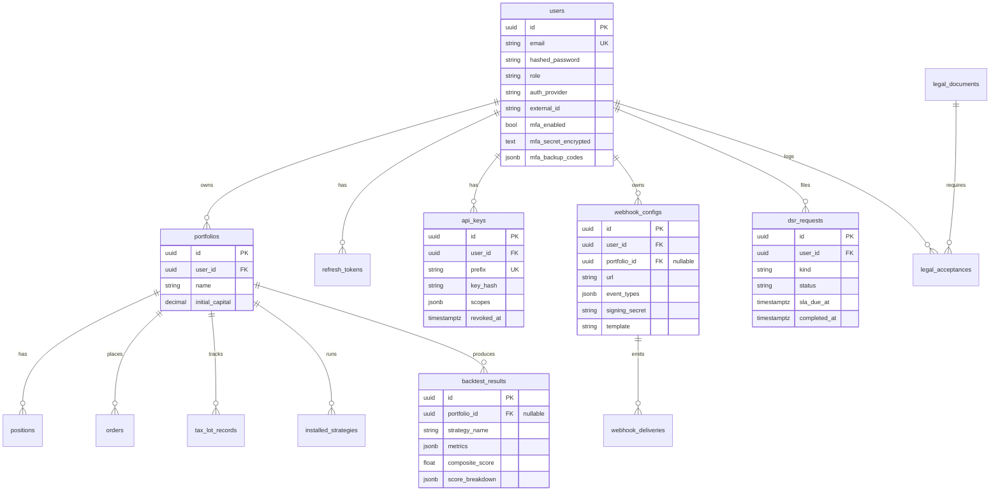

# Database

Nexus Trade Engine stores all durable state in a single Postgres
database (TimescaleDB extension enabled for time-series tables).
The schema is owned by the Alembic migration chain in
[`engine/db/migrations/versions/`](../../engine/db/migrations/versions/).

## Migration policy

- **One revision per logical change.** The chain is numbered
  sequentially: `001_initial_schema.py`, `002_additional_tables.py`,
  `003_bt_result_nullable_pid.py`, …, `010_webhooks.py`. Pick the next
  number when adding a migration.
- Every migration must define both `upgrade()` and `downgrade()`. If a
  step is genuinely irreversible (data loss), make `downgrade()` an
  explicit `op.execute("...")` that destroys what was created — but
  *do* write it down.
- Migrations run via `make migrate` locally and on the operator's
  schedule in production. Long-running migrations should be split into
  reversible steps so they can be rolled out without locking writes.
- Models live in [`engine/db/models.py`](../../engine/db/models.py).
  Keep them and the migration that creates them in the same PR.

## Current chain

| Rev   | Adds / changes                                                 |
|-------|----------------------------------------------------------------|
| 001   | Initial schema: users, strategies, backtest_results, accounts. |
| 002   | Auxiliary tables (portfolios, journals, positions, fills).     |
| 003   | Make `backtest_results.portfolio_id` nullable.                 |
| 004   | Legal documents (Terms, Privacy, Disclaimer, …).               |
| 005   | Auth/RBAC tables (roles, role_assignments).                    |
| 006   | Make `legal_acceptance` rows immutable (no update/delete).     |
| 007   | `scoring_snapshots` for cross-strategy composite scoring.      |
| 008   | `backtest_results.composite_score` + `score_breakdown` (gh#8). |
| 009   | `users.{mfa_enabled, mfa_secret_encrypted, mfa_backup_codes}`. |
| 010   | `webhook_configs` + `webhook_deliveries` (gh#80).              |
| 011   | `api_keys` for long-lived headless access (gh#94).             |
| 012   | `dsr_requests` for GDPR / CCPA request tracking (gh#157).      |

Run `alembic history` for the source of truth.

## Critical tables

These are the rows you must protect during a restore. See the backup
runbook at [`docs/operations/backup-and-recovery.md`](../operations/backup-and-recovery.md).

- **`users`** — primary identity. Password hashes are bcrypt; MFA
  TOTP secrets are Fernet-encrypted with the engine's
  `MFA_ENCRYPTION_KEY` (see [auth-mfa runbook](../operations/runbooks/auth-mfa.md)).
  Federated users also live here — `(auth_provider, external_id)` is
  unique. The `role` column is the source of truth for RBAC; the
  role hierarchy lives in code at
  [`engine/api/auth/dependency.py:ROLE_HIERARCHY`](../../engine/api/auth/dependency.py).
- **`refresh_tokens`** — hash-stored, atomic-revoke-on-rotate (see
  [`engine/api/routes/auth.py`](../../engine/api/routes/auth.py)). A
  reused token revokes every active session for that user.
- **`api_keys`** (migration 011) — long-lived headless credentials.
  Plaintext secret returned exactly once on `POST /auth/api-keys`;
  the `prefix` column is the lookup key, `key_hash` is bcrypt.
  `revoked_at` soft-deletes; rows are kept for audit. Index
  `ix_api_keys_user_active` covers the common "list my active keys"
  query.
- **`portfolios`, `positions`, `orders`** — operational trading state.
  When live trading lands these tables will see write traffic on every
  fill. Today they hold backtest-derived state and manual portfolio
  definitions.
- **`tax_lot_records`** — FIFO/LIFO lot tracking with cost-basis
  adjustments (wash-sale disallowance lives in
  [`engine/core/tax/wash_sale.py`](../../engine/core/tax/wash_sale.py)).
  `status` enum is `open | partially_consumed | closed`.
- **`installed_strategies`** — which strategy plugin a portfolio uses,
  with the JSON config blob it was started with.
- **`backtest_results`** — every run a user has ever submitted. The
  `score_breakdown` JSONB column is the per-dimension score map from
  the strategy evaluator. **Note:** the API does not yet persist into
  this table (see [../limitations.md](../limitations.md)); it is the
  intended destination.
- **`scoring_snapshots`** (migration 007) — one row per
  `POST /api/v1/scoring/{name}/run`. `excluded_factors` is the set
  of inputs the strategy declared non-informative; `results` is the
  per-symbol score dict.
- **`webhook_configs`, `webhook_deliveries`** (migration 010) — the
  outbound webhook registry and a delivery audit trail. The
  `signing_secret` column is returned to the operator only on create;
  reads return null. **Do not log delivery payloads** — they may
  contain user data.
- **`legal_documents`, `legal_acceptances`** — the legal-doc registry
  and per-user acceptance audit. Acceptance rows are immutable
  (migration 006 enforces this at the DB level) for compliance.
  `acceptances.user_id` is `ON DELETE RESTRICT` with deferred FK so
  a user cannot be hard-deleted while their acceptance trail is on
  legal hold.
- **`dsr_requests`** (migration 012) — GDPR / CCPA request audit row.
  One row per export / delete / rectify / restrict / object request.
  Carries the SLA timer (`sla_due_at`, 30 days by default).
- **`data_provider_attributions`** — vendor attribution texts
  required by some data providers. Surfaced via
  `GET /api/v1/legal/attributions`.
- **`ohlcv_bars`** — the only TimescaleDB hypertable today. Retention
  policy is operator-defined.

## Entity relationships



**Notes on the diagram:**

- `legal_acceptances.user_id` is `ON DELETE RESTRICT DEFERRABLE
  INITIALLY DEFERRED` — a user cannot be deleted while they have
  unrevoked acceptance rows. This is intentional: compliance wants
  the trail to survive the user.
- Everything else cascading off `users` is `ON DELETE CASCADE`. The
  DSR-driven deletion path in
  [`engine/privacy/deletion.py`](../../engine/privacy/deletion.py)
  relies on this.
- `backtest_results.portfolio_id` is nullable on purpose: ad-hoc
  backtests (those submitted without a portfolio context, e.g. through
  the public SDK demo) survive a portfolio delete.

## TimescaleDB usage

We use the TimescaleDB extension for time-series tables that grow
unboundedly (market data, OHLCV bars, account equity history). When
adding such a table:

1. Define it as a regular Postgres table in the migration.
2. Convert it to a hypertable in the same migration:
   ```python
   op.execute(
       "SELECT create_hypertable('ohlcv', 'ts', "
       "if_not_exists => TRUE, chunk_time_interval => INTERVAL '1 day');"
   )
   ```
3. Add a retention policy if the data has a sane retention window.
4. Note the dependency in this doc.

Operators can run on vanilla Postgres if they accept the storage cost.

## Async access pattern

All DB access goes through SQLAlchemy 2's async API:

```python
from engine.db.session import session_factory

async with session_factory() as session:
    result = await session.execute(select(User).where(User.id == user_id))
    user = result.scalar_one_or_none()
```

- **No sync sessions in route handlers.** They block the event loop.
- **One session per request.** Don't pass a session across async
  boundaries; use the dependency in
  [`engine/api/deps.py`](../../engine/api/deps.py).
- **Don't `commit` inside utility functions.** Commit at the route
  handler boundary so the request's atomicity is obvious.
- **Use `select` + `where`, not `query`.** SQLAlchemy 2's legacy API
  is still importable but we don't use it.

## Conventions

- Primary keys are UUIDs except for legacy bigserial tables. New
  tables should use UUIDs.
- All tables have `created_at` and `updated_at` (default `now()`,
  `updated_at` set by SQLAlchemy event listener).
- JSON-shaped columns use `JSONB`, never `JSON`. Index with `GIN` if
  you query by key.
- Foreign keys default to `ON DELETE CASCADE` for owned data and
  `ON DELETE RESTRICT` for shared / audit rows.

## Testing

Unit tests run against SQLite when possible to keep CI fast. Tests
that exercise Postgres-specific features (JSONB queries, TimescaleDB
hypertables, immutable triggers) should be marked
`@pytest.mark.integration` and run in a Postgres-backed CI job.

When adding a migration, also add a test that:
1. Asserts the table / column exists at the new head.
2. Round-trips a representative row.
3. Exercises whatever invariant the migration is enforcing
   (e.g. uniqueness, immutability).
