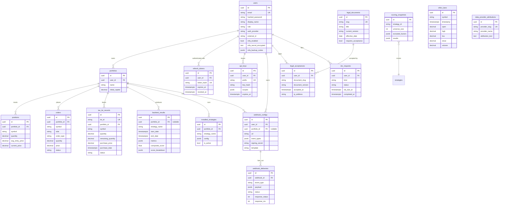

# Database & data model

Nexus Trade Engine stores all durable state in a single Postgres
database (TimescaleDB extension enabled for time-series tables).
The schema is owned by the Alembic migration chain in
[`engine/db/migrations/versions/`](../../engine/db/migrations/versions/),
and the canonical model definitions are in
[`engine/db/models.py`](../../engine/db/models.py).

## Migration policy

- **One revision per logical change.** The chain is numbered
  sequentially: `001_initial_schema.py`, `002_additional_tables.py`,
  `003_bt_result_nullable_pid.py`, …, `012_dsr_requests.py`. Pick the
  next number when adding a migration.
- Every migration must define both `upgrade()` and `downgrade()`. If a
  step is genuinely irreversible (data loss), make `downgrade()` an
  explicit `op.execute("...")` that destroys what was created — but
  *do* write it down.
- Migrations run via `make migrate` locally and on the operator's
  schedule in production. Long-running migrations should be split into
  reversible steps so they can be rolled out without locking writes.
- Models live in [`engine/db/models.py`](../../engine/db/models.py).
  Keep them and the migration that creates them in the same PR.

## Current chain

| Rev   | Adds / changes                                                          |
|-------|-------------------------------------------------------------------------|
| 001   | Initial schema: users, strategies, backtest_results, accounts.          |
| 002   | Auxiliary tables (portfolios, journals, positions, fills).              |
| 003   | Make `backtest_results.portfolio_id` nullable.                          |
| 004   | Legal documents (Terms, Privacy, Disclaimer, …).                        |
| 005   | Auth/RBAC columns on users (role, auth_provider, external_id).          |
| 006   | Make `legal_acceptance` rows immutable (no update/delete).              |
| 007   | `scoring_snapshots` for cross-strategy composite scoring.               |
| 008   | `backtest_results.composite_score` + `score_breakdown` (gh#8).          |
| 009   | `users.{mfa_enabled, mfa_secret_encrypted, mfa_backup_codes}`.          |
| 010   | `webhook_configs` + `webhook_deliveries` (gh#80).                       |
| 011   | `api_keys` for long-lived scoped credentials (gh#94).                   |
| 012   | `dsr_requests` for GDPR / CCPA audit (gh#157).                          |

Run `alembic history` for the source of truth.

## Entity-relationship shape



## Entity reference

The descriptions below assume you have
[`engine/db/models.py`](../../engine/db/models.py) open in another
tab. Names match the SQLAlchemy class names.

### Identity & auth

| Entity              | Purpose                                              | Notable constraints                                                                                       |
|---------------------|------------------------------------------------------|-----------------------------------------------------------------------------------------------------------|
| `User`              | Identity row. One per human or service principal.    | `email` unique. `(auth_provider, external_id)` unique — same email can exist across IdPs.                 |
| `RefreshToken`      | Long-lived session. Hashed; one row per refresh.     | `token_hash` unique. `revoked_at` is the rotation ledger.                                                 |
| `ApiKey`            | Long-lived scoped credential for headless access.    | `prefix` unique (first 12 chars shown in UI). `key_hash` is bcrypt. `scopes ⊆ {read, trade, admin}`.      |

### Trading domain

| Entity              | Purpose                                              | Notes                                                                                                     |
|---------------------|------------------------------------------------------|-----------------------------------------------------------------------------------------------------------|
| `Portfolio`         | An account-like container for one strategy stack.    | One user has many. CASCADE on user delete.                                                                |
| `Position`          | Current holdings for a `(portfolio, symbol)`.        | Unique on `(portfolio_id, symbol)`.                                                                       |
| `Order`             | Buy/sell intent + fill state.                        | `side ∈ {buy, sell}`, `order_type ∈ {market, limit, …}`, `status ∈ {pending, filled, …}`.                 |
| `TaxLotRecord`      | Open lot for FIFO/LIFO tax accounting.               | `status ∈ {open, partially_consumed, closed}`. `purchase_date` drives long-term / short-term classification. |
| `InstalledStrategy` | Plugin instance bound to a portfolio + config.       | Config is JSONB; the manifest schema validates the user-supplied portion.                                 |
| `OHLCVBar`          | Market-data bar (timeseries, intended hypertable).   | Unique on `(symbol, timestamp)`. Index `ix_ohlcv_symbol_timestamp` is the hot path for backtests.          |

### Operational & audit

| Entity              | Purpose                                              | Notes                                                                                                     |
|---------------------|------------------------------------------------------|-----------------------------------------------------------------------------------------------------------|
| `WebhookConfig`     | Outbound webhook subscription.                       | `signing_secret` returned on create only; never logged. `template ∈ {generic, discord, slack, telegram}`. |
| `WebhookDelivery`   | One attempted delivery per `WebhookConfig` per event.| Status: `pending`, `delivered`, `failed`. Index on `(webhook_id, created_at)` for the UI timeline.        |
| `BacktestResult`    | Backtest run record + evaluator output.              | `portfolio_id` nullable (some operators run unscoped backtests). Composite score + breakdown in JSONB.    |
| `ScoringSnapshot`   | Cross-strategy scoring run output.                   | Indexed on `(strategy_id, created_at)` for time-windowed queries.                                         |
| `LegalDocument`     | Markdown legal document version.                     | `slug` unique. Sync from disk on app start (`engine/legal/sync.py`).                                      |
| `LegalAcceptance`   | Immutable proof a user accepted a document version.  | RESTRICT on user delete (audit retention). Migration 006 made rows immutable at the DB level.             |
| `DataProviderAttribution` | Compliance attribution per provider.            | `provider_slug` unique; shown in the UI footer.                                                           |
| `DSRequest`         | GDPR / CCPA data-subject request audit row.          | `kind ∈ {export, delete, rectify, restrict, object}`. `sla_due_at` defaults to 30 d per GDPR Art. 12.     |

## Critical tables

These are the rows you must protect during a restore. See the backup
runbook at [`docs/operations/backup-and-recovery.md`](../operations/backup-and-recovery.md).

- **`users`** — primary identity. Password hashes are bcrypt; MFA
  TOTP secrets are Fernet-encrypted with the engine's
  `MFA_ENCRYPTION_KEY` (see [auth-mfa runbook](../operations/runbooks/auth-mfa.md)).
- **`backtest_results`** — every run a user has ever submitted. The
  `score_breakdown` JSONB column is the per-dimension score map from
  the strategy evaluator.
- **`portfolios`, `positions`, `orders`, `tax_lot_records`** — operational
  trading state. When live trading lands these tables will see write
  traffic on every fill.
- **`webhook_configs`, `webhook_deliveries`** — the outbound webhook
  registry and a delivery audit trail. The `signing_secret` column is
  returned to the operator only on create; reads return null. **Do not
  log delivery payloads** — they may contain user data.
- **`legal_acceptances`** — legally-binding audit row. Migration 006
  makes the table append-only; never restore a version that loses rows.

## Constraints worth knowing

These are easy to miss because they live in migration files rather
than model definitions:

- `legal_acceptances` is **append-only** (migration 006 installs a
  trigger that prevents `UPDATE` and `DELETE`). Restore from a
  snapshot that has lost rows → trigger is recreated, but the audit
  gap remains.
- `tax_lot_records.lot_id` is unique. Same lot can't be re-imported.
  Wash-sale adjustments modify `cost_basis_adjustment` on existing
  rows; they never create a new `lot_id`.
- `OHLCVBar` unique on `(symbol, timestamp)` — providers that report
  duplicate bars (Yahoo intraday on DST boundaries) are de-duplicated
  by the ingestion code, not the schema.
- `RefreshToken.token_hash` is unique. Two refresh tokens cannot share
  a hash; rotation always issues a fresh token.
- `users` unique on `(auth_provider, external_id)` — same email can
  exist across IdPs. When linking a federated login to an existing
  local user, write both rows or use the
  `auth_overwrite_role_on_login` setting deliberately (see SEV-741).

## TimescaleDB usage

We use the TimescaleDB extension for time-series tables that grow
unboundedly (market data, OHLCV bars, account equity history). When
adding such a table:

1. Define it as a regular Postgres table in the migration.
2. Convert it to a hypertable in the same migration:
   ```python
   op.execute(
       "SELECT create_hypertable('ohlcv', 'ts', "
       "if_not_exists => TRUE, chunk_time_interval => INTERVAL '1 day');"
   )
   ```
3. Add a retention policy if the data has a sane retention window.
4. Note the dependency in this doc.

Operators can run on vanilla Postgres if they accept the storage cost.

## Async access pattern

All DB access goes through SQLAlchemy 2's async API:

```python
from engine.db.session import session_factory

async with session_factory() as session:
    result = await session.execute(select(User).where(User.id == user_id))
    user = result.scalar_one_or_none()
```

- **No sync sessions in route handlers.** They block the event loop.
- **One session per request.** Don't pass a session across async
  boundaries; use the dependency in
  [`engine/api/deps.py`](../../engine/api/deps.py).
- **Don't `commit` inside utility functions.** Commit at the route
  handler boundary so the request's atomicity is obvious.
- **Use `select` + `where`, not `query`.** SQLAlchemy 2's legacy API
  is still importable but we don't use it.

## Conventions

- Primary keys are UUIDs except for legacy bigserial tables. New
  tables should use UUIDs.
- All tables have `created_at` and `updated_at` (default `now()`,
  `updated_at` set by SQLAlchemy event listener).
- JSON-shaped columns use `JSONB`, never `JSON`. Index with `GIN` if
  you query by key.
- Foreign keys default to `ON DELETE CASCADE` for owned data and
  `ON DELETE RESTRICT` for shared / audit rows.

## Testing

Unit tests run against SQLite when possible to keep CI fast. Tests
that exercise Postgres-specific features (JSONB queries, TimescaleDB
hypertables, immutable triggers) should be marked
`@pytest.mark.integration` and run in a Postgres-backed CI job.

When adding a migration, also add a test that:
1. Asserts the table / column exists at the new head.
2. Round-trips a representative row.
3. Exercises whatever invariant the migration is enforcing
   (e.g. uniqueness, immutability).
