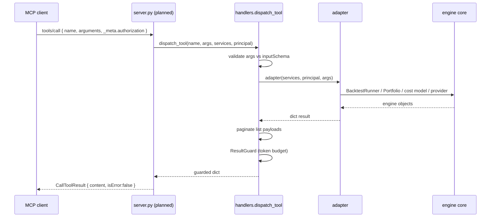

# MCP server

`engine/mcp/` exposes the engine to AI assistants over the
[Model Context Protocol](https://modelcontextprotocol.io/). An MCP-aware
client (Claude Desktop, a custom agent, a service-to-service caller) can
inspect portfolios, list strategies, pull market data, estimate costs,
compute metrics, and run backtests — all without a human driving the REST
UI. It landed in gh#959 and is a first-class peer of the REST and
WebSocket surfaces.

> **Current status (read this first).** The *server components* are
> complete and unit-testable: tool definitions, adapters, auth, rate
> limiting, pagination, the resource registry, the error model, and
> observability. The **transport-wiring bootstrap (`engine/mcp/server.py`)
> is not present in the tree**, and the package is **not mounted** by
> [`engine/app.py`](../../engine/app.py) or
> [`engine/api/router.py`](../../engine/api/router.py). `pyproject.toml`
> still carries a `[tool.ruff]` ignore for `engine/mcp/server.py`
> (`PLR0911`), which is the footprint of the planned entrypoint. The MCP
> test sources were also removed (only stale `.pyc` remain under
> `tests/mcp/__pycache__/`). Treat the module as a landed library awaiting
> its runner — see [Status & limitations](#status--limitations) below.

## Where it lives

```
engine/mcp/
├── config.py            ← MCPServerSettings (NEXUS_MCP_* env)
├── tool_definitions.py  ← the 9 tools, their JSON Schema, required roles
├── handlers.py          ← dispatch_tool(): name → adapter → guard
├── adapters/            ← one file per tool family, thin wrappers over engine core
│   ├── __init__.py      ← EngineServices container + PortfolioStore
│   ├── backtest_adapter.py
│   ├── portfolio_adapter.py
│   ├── strategy_adapter.py
│   └── market_data_adapter.py
├── resources.py         ← 5 static context resources (nexus:// URIs)
├── auth.py              ← AuthPrincipal + JWT/static-key/anonymous resolution
├── rate_limiter.py      ← per-principal token bucket
├── pagination.py        ← cursor paging + ResultGuard (token-budget truncation)
├── errors.py            ← MCPError hierarchy + JSON-RPC code map
├── progress.py          ← ProgressReporter for long-running tools
└── observability.py     ← mcp.tool.* metrics via the shared backend
```

The design rule for the whole package: **every adapter is a pure async
function `(services, principal, arguments) -> dict`**. There is no global
state, no running database, and no event loop owned by the module. That is
what lets the same code run under stdio, under an HTTP mount, and under a
test harness with injected fakes.

## Request lifecycle (intended)



`AuthPrincipal` is resolved from the request `_meta` *before* dispatch (see
[Auth](#authentication--authorization)), and the per-principal rate limiter
runs on every call.

## Tools

Defined declaratively in [`tool_definitions.py`](../../engine/mcp/tool_definitions.py).
Each `ToolDefinition` carries a JSON Schema (used for both MCP
`inputSchema` advertisement and a defence-in-depth runtime check in
`handlers._validate_arguments`), an MCP `ToolAnnotations` hint
(`readOnlyHint`, `destructiveHint`, `idempotentHint`), and a
`required_role` enforced by [`auth.require_role`](../../engine/mcp/auth.py).

The role names are the **same `ROLE_HIERARCHY` the REST API uses**
([`engine/api/auth/dependency.py`](../../engine/api/auth/dependency.py)), so
"viewer / user / … / admin" mean exactly what they mean over HTTP.

| Tool | Min role | Paginated | What it does |
|---|---|---|---|
| `run_backtest` | `quant_dev` | no | Runs `BacktestRunner` for one strategy × symbol × date range. Returns total return, Sharpe, max drawdown, win rate, cost drag, trade count, final capital. **Compute-only — never places a live order.** Capped at `backtest_max_bars` (50 000). Emits progress notifications when a reporter is wired. |
| `get_portfolio_status` | `viewer` | no | Cash, total market value, total return %, realized P&L for a portfolio. |
| `get_positions` | `viewer` | no | Open positions: quantity, average cost, current price, market value, allocation weight. |
| `get_orders` | `viewer` | yes (`orders`) | Chronological order history. |
| `list_strategies` | `viewer` | yes (`strategies`) | Installed strategies: version, description, author, symbols, default params. |
| `get_strategy_details` | `viewer` | no | Full metadata for one strategy (requires `strategy_name`). |
| `get_market_data` | `viewer` | yes (`bars`) | OHLCV bars. Intervals: `1m 5m 15m 1h 1d 1wk 1mo`; period default `1y`. |
| `get_cost_model` | `viewer` | no | Transaction-cost breakdown (commission, spread, slippage, exchange fee, tax) for a hypothetical trade. Requires `symbol`, `quantity`, `price`. |
| `get_performance_metrics` | `viewer` | no | Computes total/annualized return, Sharpe, Sortino, max drawdown, win rate, profit factor from a caller-supplied equity curve (`minItems: 2`). |

Every tool is advertised as `readOnlyHint=true, destructiveHint=false,
idempotentHint=true` — including `run_backtest`, which mutates nothing
outside its own result. `run_backtest` is the only tool that gates on a
role above `viewer`, because it is the only compute-heavy call.

## Resources

Resources ([`resources.py`](../../engine/mcp/resources.py)) give the
assistant cheap context *without* a tool call. They are read-only and
served from `nexus://` URIs:

| URI | Payload |
|---|---|
| `nexus://strategies/catalog` | Strategy catalog from the plugin registry (version, description, author, symbols, params). |
| `nexus://symbols/list` | Curated default symbol universe (AAPL, MSFT, GOOGL, AMZN, SPY). |
| `nexus://timeframes/list` | `1m 5m 15m 1h 1d 1wk 1mo`. |
| `nexus://risk-parameters/ranges` | Min/max/default for `max_position_pct`, `max_drawdown_pct`, `stop_loss_pct`, `take_profit_pct`, `max_open_positions`. |
| `nexus://cost-model/defaults` | Live cost-model defaults read off `EngineServices.cost_model` (commission, spread/slippage bps, tax rates, wash-sale window). |

`read_resource()` raises `ValueError` for unknown URIs; the server layer is
expected to map that onto an MCP resource-not-found response.

## Authentication & authorization

[`auth.py`](../../engine/mcp/auth.py) reuses the engine's existing JWT
validator (`engine.api.auth.jwt.decode_token`) and RBAC hierarchy
verbatim — an MCP principal is indistinguishable from a REST principal.

Because stdio MCP has no HTTP headers, the credential is resolved in
priority order inside `extract_principal()`:

1. **Per-request `_meta`** — `_meta.authorization` (`Bearer <jwt>`) or
   `_meta.api_key` / `_meta.x-api-key`. Works for both transports.
2. **Static API-key table** — `NEXUS_MCP_STATIC_API_KEYS`, a JSON map of
   `{"<token>": "<role>"}`. DB-free service tokens; the role is taken
   verbatim from the map.
3. **Process-level token** — `NEXUS_MCP_TOKEN`. The standard way to hand a
   local stdio server a credential it can't otherwise receive.

If `NEXUS_MCP_AUTH_REQUIRED=false` (local dev), an **anonymous** principal
is issued with `NEXUS_MCP_DEFAULT_ROLE` (default `viewer`) and
`auth_method="anonymous"`. With auth required (the default), a request
with no resolvable credential raises `AuthenticationError`.

`AuthPrincipal` exposes `has_role(minimum)` / `role_level` against
`ROLE_HIERARCHY`; `require_role(principal, minimum)` raises
`AuthorizationError` (HTTP-equivalent `403`) when the principal is too
low-trust. `to_public_dict()` is the safe, loggable shape — the raw token
is never serialized.

## Rate limiting

[`rate_limiter.py`](../../engine/mcp/rate_limiter.py) is a per-principal
sliding token bucket (in-memory, `threading.Lock`). Defaults:
**120 calls/min, burst 30**, keyed by principal identity. Exhausting the
bucket raises `RateLimitError` (code `-32003`) carrying
`retry_after_seconds`, `limit_per_minute` in `data`.

> The bucket is process-local, so a multi-process deployment effectively
> multiplies the limit by the process count. For a single stdio server
> (the intended deploy model) this is exact.

## Pagination & result safety

Two helpers in [`pagination.py`](../../engine/mcp/pagination.py) keep
responses inside an LLM's context window:

- **`paginate(items, cursor, limit)`** — opaque base64 cursor encoding the
  integer offset. `default_page_size=50`, `max_page_size=500` (both from
  `MCPServerSettings`). Applied automatically to `get_orders`,
  `get_market_data`, `list_strategies` (see `_PAGINATED_KEYS` in
  `handlers.py`). The response gains `total`, `limit`, `offset`,
  `next_cursor`.
- **`ResultGuard`** — estimates tokens at ~4 chars/token; when a payload
  exceeds `result_token_budget` (default **24 000**), it binary-searches
  the largest slice of the longest list that fits, then stamps
  `truncated=true`, `token_budget`, and per-field `<key>_truncated` /
  `<key>_total` so the assistant knows to page for more.

`ResultGuard.guard()` runs on **every** tool result in `dispatch_tool`,
so no tool can return a context-busting payload by accident.

## Error model

[`errors.py`](../../engine/mcp/errors.py) distinguishes two failure
surfaces, following the MCP spec:

1. **JSON-RPC protocol errors** — numeric codes that fail the whole
   request. Used for transport/auth rejections.
2. **Tool execution errors** — returned as a `CallToolResult` with
   `isError=true`. The spec-recommended way to surface validation,
   engine, and operational errors *without* tearing down the session.

| Class | Code | Meaning |
|---|---|---|
| `AuthenticationError` | `-32001` | No/invalid credential. |
| `AuthorizationError` | `-32002` | Authenticated but below required role. |
| `RateLimitError` | `-32003` | Token bucket exhausted. |
| `EngineError` | `-32004` | Engine-level failure; internal traceback never leaked. |
| `NotFoundError` | `-32005` | Referenced entity (strategy/portfolio/symbol) missing. |
| `ValidationError` | `-32602` (`INVALID_PARAMS`) | Bad tool arguments. |

`map_engine_exception()` translates arbitrary engine exceptions onto this
hierarchy: messages containing "not found"/"no position" → `NotFoundError`,
`ValueError`/`TypeError` → `ValidationError`, everything else → opaque
`EngineError` so internal tracebacks are **never** exposed to the model.

## Observability

[`observability.py`](../../engine/mcp/observability.py) reuses the shared
`engine.observability.metrics` backend, so MCP traffic lands in the same
dashboards as REST/WebSocket traffic. Emitted metrics (tags: `tool`,
`role`, `status`, `auth_method`):

| Metric | Type | When |
|---|---|---|
| `mcp.tool.call` | counter | every dispatch (ok or error). |
| `mcp.tool.duration_ms` | histogram | every dispatch. |
| `mcp.tool.error` | counter | on error, tagged with the exception class as `status`. |

`render_metrics()` exposes the backend in Prometheus text-exposition
format. Structured `structlog` events are emitted at
`mcp.tool.invoke` / `mcp.tool.complete` / `mcp.tool.error`.

## The `EngineServices` container

[`adapters/__init__.py`](../../engine/mcp/adapters/__init__.py) defines the
single dependency the server needs. Everything is injectable with default
factories that build the real engine objects, so the server runs in two
modes:

- **Online** — defaults build a live `PluginRegistry`, a
  `DefaultCostModel`, and the configured market-data provider
  (`backtest_default_provider`, default `yahoo`).
- **Hermetic** — `EngineServices.for_testing(...)` pins fakes (an
  in-memory provider, a stub registry) so tests need no network or DB.

| Field | Default | Notes |
|---|---|---|
| `plugin_registry` | `PluginRegistry()` | Strategy discovery + loading. |
| `portfolio_store` | `PortfolioStore()` | In-memory; seeds a `default` portfolio at **$100 000**. Not the SQLAlchemy `portfolios` table. |
| `cost_model` | `DefaultCostModel()` | Powers `get_cost_model` and the cost-defaults resource. |
| `market_data_provider_factory` | `get_data_provider("yahoo")` | Called fresh per backtest. |
| `strategies_dir` | `None` | Overrides the discovery root for resources. |

`to_jsonable()` normalizes `Decimal` → `float`, datetimes → ISO-8601,
dataclasses → dicts, and NaN/inf → `None` so results are always valid JSON.

## Configuration

`MCPServerSettings` ([`config.py`](../../engine/mcp/config.py)) is a
**separate** `pydantic-settings` class from `engine.config.Settings` —
env prefix is `NEXUS_MCP_`, not `NEXUS_`. This is deliberate: the server
must run as a standalone stdio process *without* pulling in the full
API/DB surface, so it does not read `NEXUS_DATABASE_URL` etc.

> Note: these variables are **not** in [`.env.example`](../../.env.example)
> (which mirrors `engine/config.py` only) nor in
> [`docs/deployment.md`](../deployment.md). They are fully specified in
> `config.py`.

| Variable | Default | Notes |
|---|---|---|
| `NEXUS_MCP_SERVER_NAME` | `nexus-mcp-server` | |
| `NEXUS_MCP_SERVER_VERSION` | `0.1.0` | |
| `NEXUS_MCP_INSTRUCTIONS` | *(help text)* | Shown to the model as server capabilities. |
| `NEXUS_MCP_TRANSPORT` | `stdio` | `stdio` \| `http`. |
| `NEXUS_MCP_HTTP_HOST` | `127.0.0.1` | HTTP transport only. |
| `NEXUS_MCP_HTTP_PORT` | `8765` | HTTP transport only. |
| `NEXUS_MCP_HTTP_PATH` | `/mcp` | HTTP transport only. |
| `NEXUS_MCP_HTTP_LOG_LEVEL` | `info` | |
| `NEXUS_MCP_AUTH_REQUIRED` | `true` | `false` → anonymous principal. |
| `NEXUS_MCP_DEFAULT_ROLE` | `viewer` | Role for anonymous/local sessions. |
| `NEXUS_MCP_TOKEN` | `""` | Process-level JWT/engine token (stdio). |
| `NEXUS_MCP_STATIC_API_KEYS` | `""` | JSON `{"<token>":"<role>"}` map. |
| `NEXUS_MCP_RATE_LIMIT_PER_MINUTE` | `120` | Per-principal token bucket. |
| `NEXUS_MCP_RATE_LIMIT_BURST` | `30` | |
| `NEXUS_MCP_RESULT_TOKEN_BUDGET` | `24000` | `ResultGuard` ceiling (~4 chars/token). |
| `NEXUS_MCP_DEFAULT_PAGE_SIZE` | `50` | |
| `NEXUS_MCP_MAX_PAGE_SIZE` | `500` | |
| `NEXUS_MCP_BACKTEST_PROGRESS_INTERVAL` | `0` | `0` disables intra-run progress. |
| `NEXUS_MCP_BACKTEST_MAX_BARS` | `50000` | Hard cap on bars per backtest. |
| `NEXUS_MCP_BACKTEST_DEFAULT_PROVIDER` | `yahoo` | |

## Running it

The intended entrypoints (not yet present as `engine/mcp/server.py`):

- **stdio** (default, for local assistant hosts):
  `python -m engine.mcp.server` — speaks JSON-RPC over stdin/stdout.
  Credentials via `NEXUS_MCP_TOKEN` or `_meta.authorization`.
- **http** (`NEXUS_MCP_TRANSPORT=http`): a Streamable-HTTP endpoint at
  `http://127.0.0.1:8765/mcp`, suitable for mounting behind the same
  reverse proxy as the REST API.

The `mcp>=1.0.0` SDK dependency is already in
[`pyproject.toml`](../../pyproject.toml); the wiring that turns
`dispatch_tool` + `mcp_tools()` + `list_resources()` into a running
`Server`/`FastMCP` is what `server.py` needs to provide.

## Status & limitations

Be honest with operators about what is and isn't shipping:

1. **No runnable entrypoint.** `engine/mcp/server.py` is absent; nothing
   imports `engine.mcp` from `engine/app.py` or `engine/api/router.py`.
   The HTTP transport endpoint is therefore not served today. Until
   `server.py` lands, the module is a library.
2. **Tests were removed.** `tests/mcp/` contains only stale `.pyc`; the
   `test_mcp*` sources under `tests/` are gone too. Re-adding adapter
   + dispatch + auth tests is part of finishing the server.
3. **Portfolio data is in-memory.** `PortfolioStore` is a process-local
   dict seeded with a single `$100 000` "default" book. It is **not**
   backed by the `portfolios` table, so MCP portfolio/position/order reads
   do not reflect REST-created portfolios until the store is wired to the
   DB.
4. **Rate limit is per-process.** See [Rate limiting](#rate-limiting).
5. **No MCP entry in `.env.example` / `deployment.md`.** Operators
   discovering MCP via config have to read `config.py`.

The companion decision record,
[`adr/0010-mcp-server.md`](../adr/0010-mcp-server.md), records *why* the
server reuses engine auth/RBAC, why it has its own settings class, and why
the stdio transport is primary.
