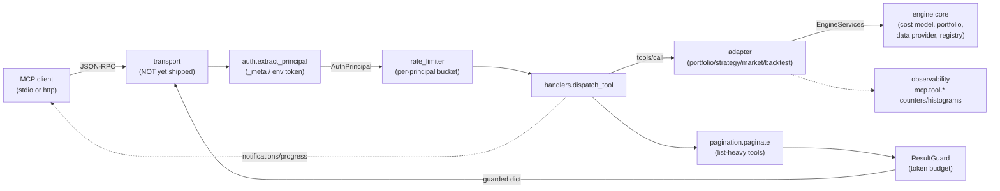

# MCP server (`engine/mcp/`)

The Nexus MCP (Model Context Protocol) server exposes a curated subset of
the engine's capabilities — backtests, portfolio inspection, strategy
catalog, market data, and the cost model — to LLM assistants and other MCP
clients as **tools** and **resources**. It landed in gh#959 and was
stabilised by gh#961.

> **Status:** the tool/auth/resource/dispatch layer is complete and
> unit-tested-in-spirit, but the runnable transport bootstrap is **not
> shipped**. See [Known limitation](#known-limitation-no-runnable-server)
> below. Treat this doc as the design contract for the in-flight feature,
> not a runbook for a live server.

This doc is the engineering companion to the wire-level behaviour. For
*why* we added an MCP server at all, see
[ADR-0012](../adr/0012-mcp-server.md).

## Where it lives

```
engine/mcp/
├── config.py            ← MCPServerSettings (NEXUS_MCP_* env), parsed at import
├── auth.py              ← AuthPrincipal + extract_principal(); reuses engine JWT/RBAC
├── errors.py            ← MCPError hierarchy + map_engine_exception()
├── rate_limiter.py      ← per-principal token bucket
├── pagination.py        ← cursor pagination + ResultGuard (token-budget cap)
├── progress.py          ← ProgressReporter (MCP notifications/progress)
├── observability.py     ← structlog + MetricsBackend, mcp.* namespace
├── resources.py         ← static resources (strategies/symbols/timeframes/…)
├── tool_definitions.py  ← declarative ToolDefinition catalog + JSON Schemas
├── handlers.py          ← dispatch_tool(): name → adapter, paginate, guard
└── adapters/
    ├── __init__.py      ← EngineServices container + PortfolioStore + to_jsonable
    ├── portfolio_adapter.py
    ├── strategy_adapter.py
    ├── market_data_adapter.py
    └── backtest_adapter.py
```

## Components and request flow



A `tools/call` flows: **resolve principal → rate-limit → dispatch to
adapter → paginate if list-heavy → guard the result size → return**. Every
step is transport-agnostic, which is why `handlers.dispatch_tool` can be
driven directly from tests without a real socket.

## Tool catalog

Defined declaratively in [`tool_definitions.py`](../../engine/mcp/tool_definitions.py).
Each `ToolDefinition` carries a JSON Schema (`inputSchema`), MCP
`ToolAnnotations` hints (`readOnlyHint`, `idempotentHint`, …), and a
`required_role` evaluated against the same `ROLE_HIERARCHY` the REST API
uses.

| Tool | Min role | Paginated | Purpose |
|---|---|---|---|
| `run_backtest` | `quant_dev` | — | Historical backtest over a date range; returns metrics, trade count, final capital. **Compute-only, never places live orders.** |
| `get_portfolio_status` | `viewer` | — | Cash, market value, total return %, realized P&L. |
| `get_positions` | `viewer` | — | Open positions: qty, avg cost, price, weight. |
| `get_orders` | `viewer` | `orders` | Order history (chronological). |
| `list_strategies` | `viewer` | `strategies` | Installed strategies: version, author, symbols, defaults. |
| `get_strategy_details` | `viewer` | — | Full metadata for one strategy. |
| `get_market_data` | `viewer` | `bars` | OHLCV bars for a symbol/interval/period. |
| `get_cost_model` | `viewer` | — | Commission/spread/slippage/fee/tax breakdown for a hypothetical trade. |
| `get_performance_metrics` | `viewer` | — | Total/annualised return, Sharpe, Sortino, max DD, win rate, profit factor from an equity curve. |

Only `run_backtest` requires elevation; everything else is read-only and
gated at `viewer`. The `required_role` is enforced in
[`handlers.dispatch_tool`](../../engine/mcp/handlers.py) via
[`auth.require_role`](../../engine/mcp/auth.py).

The three paginated tools (`get_orders`, `get_market_data`, `list_strategies`)
have their list key declared in `_PAGINATED_KEYS` in `handlers.py`; their
responses are wrapped into a `{items, next_cursor, has_more, limit}` envelope.

## Resources

Static, read-only context published via `resources/list` & `resources/read`
(see [`resources.py`](../../engine/mcp/resources.py)). They give the
assistant background without spending a tool call:

| URI | Contents |
|---|---|
| `nexus://strategies/catalog` | Strategy catalog |
| `nexus://symbols/list` | Default tradeable symbol universe |
| `nexus://timeframes/list` | `1m, 5m, 15m, 1h, 1d, 1wk, 1mo` |
| `nexus://risk-parameters/ranges` | Risk parameter ranges |
| `nexus://cost-model/defaults` | Cost-model default assumptions |

## Authentication & authorisation

The MCP server deliberately **reuses the engine's JWT validator and RBAC
hierarchy** so a principal authenticated over MCP is indistinguishable from
one authenticated over the REST API. See
[`auth.py:extract_principal`](../../engine/mcp/auth.py).

Because stdio MCP has no HTTP headers, credentials are resolved in priority
order:

1. **Per-request `_meta`** — `_meta.authorization` (`Bearer <jwt>`) or
   `_meta.api_key` / `_meta.x-api-key`. Works on every transport.
2. **Static API-key table** — `NEXUS_MCP_STATIC_API_KEYS` JSON map
   `{"<token>": "<role>"}` for DB-free service-to-service auth.
3. **Process-level token** — `NEXUS_MCP_TOKEN`, the standard way to hand a
   credential to a local stdio server.

When `NEXUS_MCP_AUTH_REQUIRED=false` (local dev), an anonymous principal is
issued with `NEXUS_MCP_DEFAULT_ROLE` (default `viewer`). The resulting
`AuthPrincipal` records its `auth_method` (`jwt` | `api_key` | `anonymous`),
which is tagged onto every metric and log line.

RBAC is identical to REST:
[`auth.require_role(principal, "quant_dev")`](../../engine/mcp/auth.py) uses
the same numeric `ROLE_HIERARCHY` as
[`engine/api/auth/dependency.py`](../../engine/api/auth/dependency.py). See
[api-reference.md](../api-reference.md) for the role table.

## Result safety: pagination + token budget

Two guards keep a single tool response from blowing out an assistant's
context window:

- **Cursor pagination** ([`pagination.py`](../../engine/mcp/pagination.py)):
  list-heavy tools return at most `limit` items (default 50, capped at
  `NEXUS_MCP_MAX_PAGE_SIZE` = 500) plus an opaque base64 `next_cursor`.
- **`ResultGuard`**: estimates response size at ~4 chars/token and trims the
  payload when it would exceed `NEXUS_MCP_RESULT_TOKEN_BUDGET` (default
  24 000 tokens). The guard runs *after* pagination, on every dispatch.

Both are deliberately conservative defaults — operators can raise them, but
the shipped values mean a misbehaving strategy can never silently OOM an
assistant.

## Rate limiting

[`rate_limiter.py`](../../engine/mcp/rate_limiter.py) is a per-principal
token bucket (`NEXUS_MCP_RATE_LIMIT_PER_MINUTE` = 120,
`NEXUS_MCP_RATE_LIMIT_BURST` = 30 by default). Anonymous principals are
bucketed by their transport-level identity so one anonymous session cannot
starve another on a shared http transport. Over-limit calls raise
`RateLimitError` → MCP error code (see `errors.py`).

## Observability

[`observability.py`](../../engine/mcp/observability.py) reuses the engine's
structlog + pluggable `MetricsBackend` so MCP traffic lands in the same
dashboards as REST/WebSocket traffic. Metric namespace is `mcp.*`:

| Metric | Type | Tags |
|---|---|---|
| `mcp.tool.call` | counter | `tool`, `role`, `status`, `auth_method` |
| `mcp.tool.duration_ms` | histogram | same |
| `mcp.tool.error` | counter | same |

`record_start` / `record_success` / `record_error` bracket every dispatch in
`handlers.py`. `render_metrics()` exposes the Prometheus text format
(`mcp_settings` is independent of `engine.config`, but the metrics backend
is the shared singleton set by `set_metrics` in the engine lifespan).

## Configuration

All MCP knobs live in [`MCPServerSettings`](../../engine/mcp/config.py)
under the `NEXUS_MCP_` prefix — **separate from `engine.config.settings`**
so the server can run as a standalone stdio process without the full
API/DB surface.

| Env var | Default | Notes |
|---|---|---|
| `NEXUS_MCP_SERVER_NAME` | `nexus-mcp-server` | Reported in MCP `initialize`. |
| `NEXUS_MCP_SERVER_VERSION` | `0.1.0` | Same. |
| `NEXUS_MCP_TRANSPORT` | `stdio` | `stdio` \| `http`. |
| `NEXUS_MCP_HTTP_HOST` | `127.0.0.1` | Bind host for http transport. |
| `NEXUS_MCP_HTTP_PORT` | `8765` | Bind port for http transport. |
| `NEXUS_MCP_HTTP_PATH` | `/mcp` | Streamable-HTTP endpoint path. |
| `NEXUS_MCP_AUTH_REQUIRED` | `true` | Set `false` for trusted-local dev. |
| `NEXUS_MCP_DEFAULT_ROLE` | `viewer` | Role issued when auth is disabled. |
| `NEXUS_MCP_TOKEN` | `""` | Process-level JWT/engine token (stdio). |
| `NEXUS_MCP_STATIC_API_KEYS` | `""` | JSON `{"token":"role"}` map. |
| `NEXUS_MCP_RATE_LIMIT_PER_MINUTE` | `120` | Per-principal bucket. |
| `NEXUS_MCP_RATE_LIMIT_BURST` | `30` | Per-principal burst. |
| `NEXUS_MCP_RESULT_TOKEN_BUDGET` | `24000` | `ResultGuard` cap (~4 chars/token). |
| `NEXUS_MCP_DEFAULT_PAGE_SIZE` | `50` | Pagination default. |
| `NEXUS_MCP_MAX_PAGE_SIZE` | `500` | Pagination hard cap. |
| `NEXUS_MCP_BACKTEST_PROGRESS_INTERVAL` | `0` | 0 disables intra-run progress. |
| `NEXUS_MCP_BACKTEST_MAX_BARS` | `50000` | Hard cap on bars per backtest. |
| `NEXUS_MCP_BACKTEST_DEFAULT_PROVIDER` | `yahoo` | Market-data provider name. |

## The `EngineServices` seam

[`adapters/__init__.py`](../../engine/mcp/adapters/__init__.py) defines the
single dependency the whole server needs: `EngineServices`, a dataclass of
`plugin_registry`, `portfolio_store`, `cost_model`,
`market_data_provider_factory`, and `strategies_dir`. Adapters are pure
async functions `(services, principal, arguments) -> dict`, so they are
trivially unit-testable without a socket.

`EngineServices.for_testing(...)` pins every component to a fake (in-memory
market-data provider, stub registry), which is how the hermetic test path
works. The `PortfolioStore` keeps an in-memory `default` portfolio seeded
with `$100 000` — it does **not** read the SQLAlchemy `portfolios` table,
so MCP portfolio state is decoupled from REST portfolio state today.

`to_jsonable()` is the one normaliser every adapter routes results through:
it converts `Decimal` → float, datetimes → ISO-8601, dataclasses → dicts,
and **NaN/inf → None** so metrics output stays valid JSON.

## Known limitation: no runnable server

**What is missing:** the transport bootstrap. There is no
`engine/mcp/server.py` that instantiates an MCP `Server`/`FastMCP`, wires
`handlers.dispatch_tool` into the tool-list / tool-call handlers, registers
`resources`, and runs the stdio or streamable-HTTP loop. Likewise:

- No `[project.scripts]` console entrypoint and no `engine/mcp/__main__.py`,
  so there is no `python -m engine.mcp` or `nexus-mcp` CLI.
- No Makefile target to launch it.
- `pyproject.toml` line ~103 carries a `per-file-ignores` entry for
  `"engine/mcp/server.py" = ["PLR0911"]` — that file does not exist, so the
  lint override is aspirational/stale.
- `tests/mcp/` contains only stale `__pycache__/*.pyc`; the `test_mcp_*.py`
  sources were removed. The adapter contract is therefore exercised only by
  the general test suite today.

**Impact:** every component needed to *answer* an MCP request exists and is
importable; nothing wires them to a *listener*. You cannot currently point
an MCP client (Claude Desktop, `mcp-cli`, …) at this codebase.

**Workaround today:** call `handlers.dispatch_tool(name, args, services,
principal)` directly from Python, or write the ~60-line `FastMCP` bootstrap
locally (register `mcp_tools()` + `dispatch_tool`, add the resource
handlers from `resources.py`, pick the transport from
`mcp_settings.transport`).

**Fix path (tracked as part of the umbrella):**

1. Add `engine/mcp/server.py`: build an MCP server, register the tool
   catalog (`mcp_tools()`), wire `tools/call` → `dispatch_tool`, register
   the resources, run the stdio/http loop from `mcp_settings.transport`.
2. Add a `[project.scripts]` entry (`nexus-mcp = "engine.mcp.server:main"`)
   and/or `python -m engine.mcp`.
3. Restore `tests/mcp/test_mcp_adapters.py` (or equivalent) and add an
   end-to-end transport test against a stub session.
4. Drop the stale `"engine/mcp/server.py"` ignore from `pyproject.toml`
   once the file exists, or remove it now if it is misleading.

When that lands, update this section from "no runnable server" to the real
transport story and add an entry to [api-reference.md](../api-reference.md).
