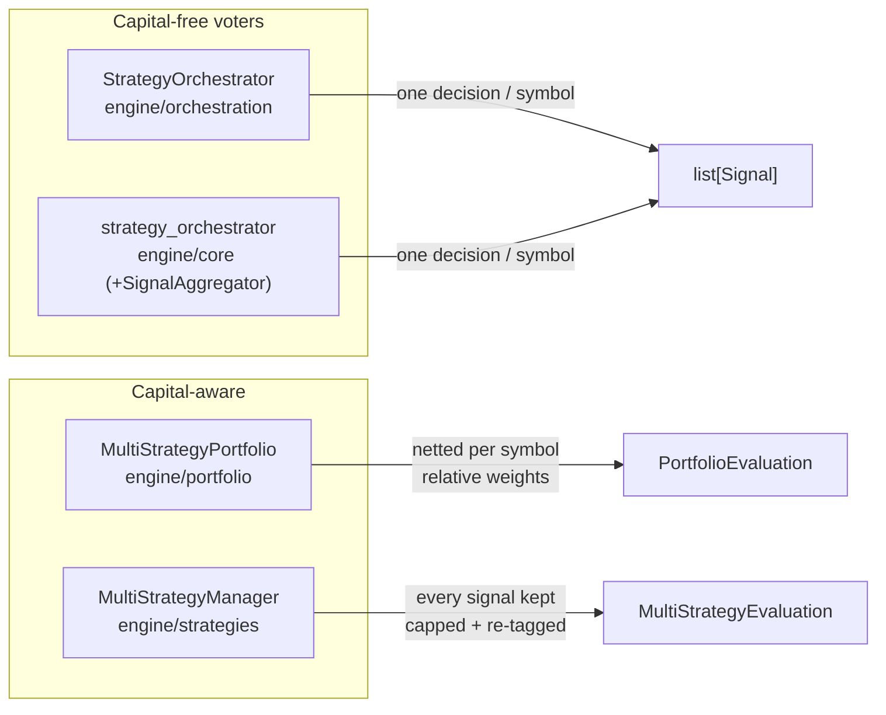

# Multi-strategy orchestration

Nexus has **four** cooperating classes that turn "run N strategies and
produce a tradeable signal set" into a single answer. They overlap in
spirit but are deliberately separate modules with different
conflict-resolution semantics, different responsibilities around
*capital*, and different provenance contracts. Pick by **voting model
AND capital model AND whether you need per-symbol merging**, not by file
name.



## Decision matrix — which one do I reach for?

| You need… | Use | Why |
|---|---|---|
| Pure voting, no money model, collapse conflicts per symbol | `StrategyOrchestrator` (`engine/orchestration`) | Two-step `run_all` → `aggregate_signals`; `PRIORITY` / `NET_POSITION`. |
| Async registry + weighted/majority voting, still no money | `strategy_orchestrator` (`engine/core`) + `SignalAggregator` | `MAJORITY` / `WEIGHTED` tie handling; per-strategy `weight`. |
| A fixed dollar book split across strategies, net to **one** position per symbol | `MultiStrategyPortfolio` (`engine/portfolio`) | Relative `capital_weight` (normalised); risk-adjusted dollar-exposure netting. |
| Per-strategy **absolute** budgets, **keep every signal**, enforce a cap per strategy | `MultiStrategyManager` (`engine/strategies`) | `allocation_pct` (sum ≤ 100); proportional weight scaling; provenance preserved. |

The two capital-aware classes are the ones people confuse. The
one-line rule: **`MultiStrategyPortfolio` *merges* into one position per
symbol (relative weights); `MultiStrategyManager` *forwards* every
strategy's signals, just allocation-capped and re-tagged (absolute
budgets).** The first is right for "I have one book and want one
decision"; the second is right for "I have per-strategy risk limits and
need to attribute every signal to its source."

---

## `engine/orchestration/orchestrator.py` — `StrategyOrchestrator`

The "register N strategies, run them all, collapse to one decision set"
loop. Two-step API: `await orch.run_all(market)` collects every
strategy's signals, then `orch.aggregate_signals()` resolves conflicts.

`ConflictResolution` selects the merge rule:

| Mode | Rule |
|---|---|
| `PRIORITY` *(default)* | The highest-priority strategy with a non-HOLD opinion wins. Opposing signals from strategies tied at top priority → HOLD (stalemate). HOLD abstains. |
| `NET_POSITION` | `BUY = +weight`, `SELL = −weight` summed per symbol. Positive net → BUY, negative → SELL, zero → HOLD. Resolved weight is the net magnitude clamped to `[0, 1]`, so conviction can override headcount. *(Unique to this orchestrator.)* |

---

## `engine/core/strategy_orchestrator.py` — async orchestrator

The heavier async counterpart. Three responsibilities the bare
[`SignalAggregator`](../../engine/core/signal_aggregator.py) (gh#21) does
not own:

1. **Registry** — each strategy is registered with a per-strategy
   `weight`.
2. **Evaluation** — every registered strategy sees the *same*
   `market_data` and `cost_model` so cross-strategy comparisons are
   apples-to-apples. A single failing strategy is isolated: its error is
   recorded and the rest still vote.
3. **Dispatch** — hands the per-strategy `SignalBatch`es to
   `SignalAggregator`, which is the single source of truth for tie
   handling.

Aggregation modes (in [`signal_aggregator.py`](../../engine/core/signal_aggregator.py)):

| Mode | Rule |
|---|---|
| `MAJORITY` | Strictly more than half of BUY-vs-SELL votes wins; tie → HOLD. HOLD abstains and is excluded from the denominator. |
| `WEIGHTED` | Vote × registered weight (default 1.0); strictly higher total wins; tie → HOLD. Lets a high-conviction strategy override a numerical majority. |

---

## `engine/portfolio/multi_strategy.py` — `MultiStrategyPortfolio`

The **capital-aware merger**. Where the two voters above are pure signal
voters (one signal = one vote, scaled at most by a unitless weight),
this is the class that knows *how much money* each strategy may deploy
*and* collapses to one position per symbol. It owns three concerns the
voters deliberately do not:

1. **Capital allocation** — each strategy is registered with a
   `capital_weight` (a *relative*, non-negative share of a fixed
   `total_capital`). Weights need not sum to 1.0: dollar allocations
   (`allocation(id)`, `allocations()`) are computed on demand by
   normalising against the weight sum, so `{a:2, b:1}` deploys 2/3 to `a`
   and 1/3 to `b`.
2. **Evaluation** — `await evaluate_all(market_data, merge_mode=…)` runs
   every registered strategy against the *same* `market_data` and the
   portfolio's own `ICostModel` (cost-first spec), each strategy
   receiving an **independent `copy.deepcopy`** of both inputs so a
   misbehaving plugin cannot poison its siblings or the caller's
   originals. A single failing — or timed-out — strategy is isolated.
3. **Risk-adjusted signal merging** — per symbol, the **capital-weighted
   dollar exposure** is netted: signed exposure =
   `side_sign(sid) * allocation(sid) * sig.weight` (BUY `+1`, SELL `-1`,
   HOLD `0`, abstains). The merged side is the sign of the net (a
   `_NET_EPSILON` = 1e-9 dead band treats float dust as stalemate →
   HOLD); the merged weight is `|net exposure| / total_capital` clamped
   to `[0, 1]`. Opposing equal-dollar signals net to zero (HOLD);
   non-finite `NaN`/`Inf` weights abstain.

The only merge mode today is `SignalMergeMode.RISK_ADJUSTED`; the enum
is reserved for future cycles, mirroring the placeholder discipline on
`StrategyOrchestrator.ConflictResolution`.

`evaluate_all` returns a `PortfolioEvaluation` richer than a bare
`list[Signal]`: merged `signals`, per-symbol `CombinedPosition`s with
`contributors`, raw `per_strategy_signals` provenance, gross
`capital_deployed` / signed `net_exposure`, `capital_utilization`, an
`errors` map, and `trade_signals` / `is_noop` convenience views. Each
merged `Signal` is stamped `strategy_id="portfolio"` with a
`metadata.portfolio_contributors` list.

Fault isolation: the registry is snapshotted before iterate, and only the
*awaitable* result is bounded by `eval_timeout` (default 30 s) — so a
builtin `TimeoutError` raised inside the coroutine is classified as a
strategy failure, not a deadline.

Fully unit-tested: [`tests/test_multi_strategy_portfolio.py`](../../tests/test_multi_strategy_portfolio.py).

---

## `engine/strategies/multi_manager.py` — `MultiStrategyManager` *(newest)*

The **capital-aware, provenance-preserving registry**. Added in the
most recent feature commit (`decf8ca`), it is the fourth orchestrator
and exists because none of the other three simultaneously owns *absolute
per-strategy budgets*, *allocation-cap enforcement*, and *per-strategy
signal provenance*.

Where `MultiStrategyPortfolio` (the section above) treats
`capital_weight` as a **relative** share and **merges** signals to one
position per symbol, `MultiStrategyManager` treats `allocation_pct`
as an **absolute** budget per strategy and **forwards every signal** —
just allocation-capped and re-tagged. That is the contract that
per-strategy attribution and per-strategy risk limits need.

### What it owns (that the siblings do not)

1. **Registration with explicit ids.** Strategies register under a
   caller-supplied `strategy_id` together with an `allocation_pct`. The
   id is the *source of truth* for provenance: every signal a strategy
   emits is re-tagged with its registered id, so a strategy that
   mislabels its own `Signal.strategy_id` can never impersonate a sibling
   or hide its origin.
2. **Per-strategy capital budgets.** Each registration carries a dollar
   cap = `total_capital * allocation_pct / 100`, exposed via
   `allocation_cap(id)` / `allocations()` for risk/UI consumers. The sum
   of all `allocation_pct` is enforced `≤ 100` at `register()` time
   (rejecting an over-commit), so two strategies can never silently claim
   overlapping capital.
3. **Allocation-cap enforcement.** When a strategy emits active
   (BUY/SELL) signals whose collective target weight exceeds its
   allocation fraction (`allocation_pct / 100`), the manager scales *that
   strategy's* weights down proportionally so the cap is respected. HOLD
   signals abstain and pass through; the original weights are recorded
   on the signal (never silently lost).
4. **Provenance-preserving aggregation.** Every emitted signal keeps its
   registered `strategy_id` (it is **not** collapsed to an
   `"aggregated"` / `"portfolio"` sentinel), so downstream consumers can
   attribute each signal to the strategy that produced it.

### Outcome shape — `MultiStrategyEvaluation`

`await evaluate_all(market_data, cost_model)` returns:

| Field | Meaning |
|---|---|
| `signals` | **All** emitted signals across every strategy (capped + re-tagged). |
| `per_strategy_signals` | `dict[id, list[Signal]]` — full provenance, grouped by source id. |
| `allocation_caps` | Dollar budget per strategy (`total_capital * pct / 100`). |
| `allocation_adjustments` | `dict[id, scale]` for each strategy whose weights were scaled (`0 ≤ scale < 1`); absent if untouched. |
| `errors` | `dict[id, message]` for any strategy that raised *or* exceeded `eval_timeout`. |
| `trade_signals` | Convenience view: non-HOLD signals. |
| `is_noop` | True when no signal was produced (empty registry, all-empty results, or every strategy failed). |
| `strategy_count` | Number of strategies that contributed. |

Each capped signal carries `metadata` recording its capital budget
(`allocation_cap_pct`, `allocation_cap_dollars`), and — if scaled —
`allocation_capped=True` plus `allocation_original_weight`.

### Construction & registration

```python
from engine.strategies import MultiStrategyManager

mgr = MultiStrategyManager(total_capital=1_000_000, eval_timeout=30.0)
mgr.register("momentum",  momentum_strategy,  allocation_pct=40)  # $400k cap
mgr.register("mean_rev",  mean_rev_strategy,  allocation_pct=30)  # $300k cap
mgr.register("hedged",    hedged_strategy,    allocation_pct=0)   # warm, capital-starved

result = await mgr.evaluate_all(market_data, cost_model)
```

Validation is strict (raises `MultiStrategyManagerError`):

- `strategy_id` must be a non-empty **string** (it is *not* derived from
  `strategy.id` — provenance is caller-controlled). Duplicate ids
  rejected.
- `strategy` must expose a callable `evaluate` (sync **or** async).
- `allocation_pct` must be a finite number in `[0, 100]`. `0` is allowed
  — it registers a strategy that is intentionally capital-starved (e.g.
  paused) while keeping its code path warm; its active weights are
  zeroed rather than dropped, so the audit trail still shows intent.
- `total_capital` must be finite and `≥ 0`; `0` is allowed (every cap is
  then `$0`, but allocation *fractions* are still enforced).
- `eval_timeout` must be finite and `> 0`; `max_strategies` must be `≥ 1`.
- Numeric inputs go through a `_finite` gate that explicitly rejects
  `bool` (a sneaky `int` subclass), numeric **strings**, `None`, and
  non-finite values — `math.isfinite` is the gate because bare `w < 0`
  silently admits `NaN`.

### Fault isolation contract

Same two guards as `MultiStrategyPortfolio`, for the same reasons:

- **Snapshot before iterate.** `evaluate_all` snapshots the registry
  (`list(self._registrations.items())`) before walking it, so a strategy
  that registers/unregisters a sibling mid-cycle cannot mutate the dict
  under us. Added strategies run next cycle.
- **Tight `wait_for` guard.** Only the *awaitable* result is bounded by
  `eval_timeout`. A builtin `TimeoutError` raised inside the coroutine
  is classified as a strategy failure (`strategy_failed`), not a
  deadline; only a genuine `asyncio.wait_for` expiry is reported as
  `TimeoutError: evaluate exceeded <N>s timeout`.

Sync and async strategies are both supported transparently: if
`inspect.isawaitable(raw)` the result is awaited under the timeout,
otherwise the sync return is used directly.

Fully unit-tested: [`tests/test_multi_strategy_manager.py`](../../tests/test_multi_strategy_manager.py)
(942 lines covering registration validation, cap enforcement, sync/async
strategies, fault isolation, and provenance).

---

## Shared contracts across all four

| Contract | Rule |
|---|---|
| **HOLD-as-abstain** | A HOLD signal never blocks the others; a symbol on which every strategy abstains still yields a single HOLD record so downstream consumers know it was considered. (In `MultiStrategyManager`, HOLDs pass through uncapped.) |
| **Apples-to-apples evaluation** | Every registered strategy sees the *same* `market_data` / `cost_model`; capital-aware variants deep-copy per strategy so a plugin can't poison siblings. |
| **Single-failure isolation** | One failing or timed-out strategy is recorded in `errors`; the rest still contribute. A timeout never stalls the cycle. |
| **Caller-controlled provenance** | `MultiStrategyManager` makes this explicit — the `strategy_id` is a registration parameter, not derived from the plugin. The other three derive it from the strategy object. |

---

## Status — all four are library-only today

None of the four orchestrators is wired to a public run route yet. The
**only** execution backend reachable from an HTTP route is the
`BacktestBackend` (single-strategy) driven by the backtest runner. The
capital-aware classes are the natural consumers of the missing
live/paper run route.

| Class | Unit-tested? | Wired to a route? |
|---|---|---|
| `StrategyOrchestrator` (`engine/orchestration`) | yes | no |
| `strategy_orchestrator` + `SignalAggregator` (`engine/core`) | yes | no |
| `MultiStrategyPortfolio` (`engine/portfolio`) | yes | no |
| `MultiStrategyManager` (`engine/strategies`) | yes | no |

The open P1 is the **live/paper run route** that would drive these — see
[`known-limitations.md`](../known-limitations.md). The broker-direct
plumbing the route needs (`LiveExecutionBackend`, `AlpacaTradingClient`,
`client_order_id` idempotency, typed broker-error translation) is already
on disk; the missing piece is the route + worker glue.

## See also

- [`core-domains.md`](core-domains.md) — where multi-strategy fits in the
  wider domain map (cost/risk modeling, execution backends, analytics,
  governance). The allocation value object
  ([`engine/portfolio/allocation.py`](../../engine/portfolio/allocation.py))
  and the `PortfolioRebalancer` drift detector
  ([`engine/portfolio/rebalancer.py`](../../engine/portfolio/rebalancer.py))
  are documented there.
- [`known-limitations.md`](../known-limitations.md) — the live/paper
  execution gap (P1) and the TaskIQ wiring that a run route depends on.
- [`ARCHITECTURE.md`](../../ARCHITECTURE.md) — the signal→fill pipeline
  and the SDK `IStrategy` interface every registered strategy implements.
