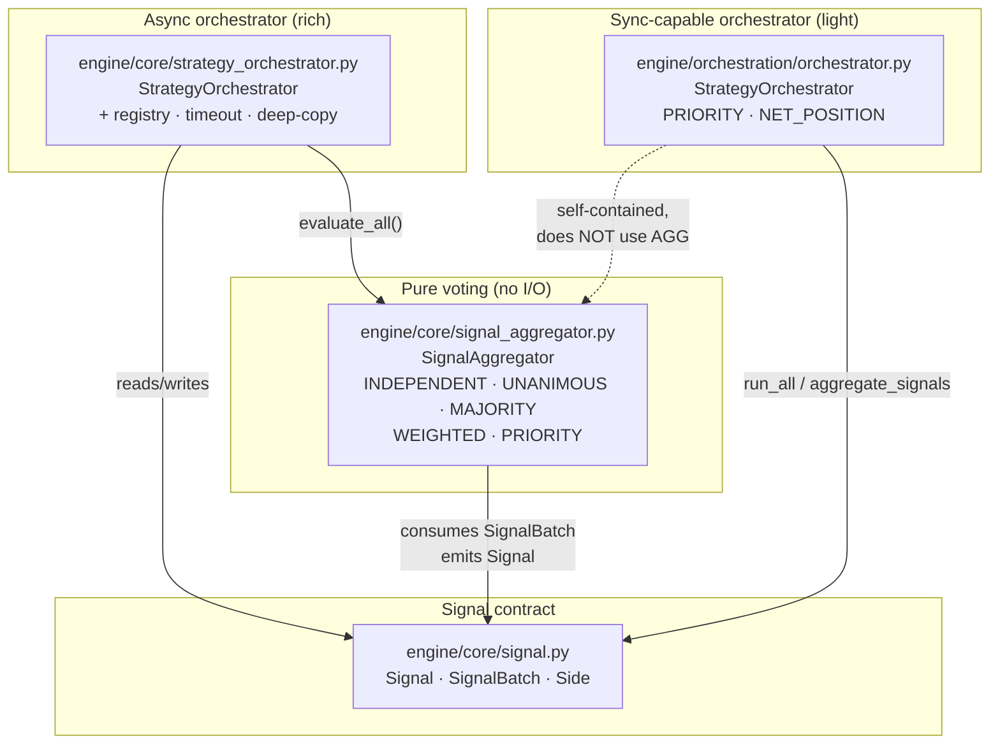

# Multi-strategy orchestration

> **Current state.** The orchestration layer is landed and **partially**
> unit-tested — the async `StrategyOrchestrator` and `SignalAggregator`
> have full coverage; the newer light orchestrator (`engine.orchestration`)
> does not. None of it is exposed on an HTTP route yet. It is an internal
> library today; this doc describes that library precisely so the route
> that binds it has a stable contract to build against. See
> [known-limitations.md](../known-limitations.md) ("Multi-strategy
> orchestration [partial]").

Nexus is plugin-first: a strategy is anything that implements
`evaluate(market_data, cost_model) -> list[Signal]`. The moment you run
*more than one* strategy against the same book, you have to answer two
questions:

1. **Evaluation** — how do N strategies see identical inputs, and how do
   you stop one bad plugin from aborting the cycle?
2. **Conflict resolution** — two strategies emit opposing signals on
   `AAPL`. Who wins?

This document covers the four moving parts that answer those questions,
all of which live under `engine/core/` and `engine/orchestration/`.

## Component map



The two `StrategyOrchestrator` classes have the **same name in different
packages** by design (see [ADR-0010](../adr/0010-multi-strategy-orchestration.md)).
Which one you reach for depends on the feature; the
[selection guide](#which-orchestrator-do-i-use) below makes it explicit.

## The Signal contract

Source: [`engine/core/signal.py`](../../engine/core/signal.py).

A `Signal` is the **only** output a strategy is allowed to produce.
Strategies never create orders; the engine validates, costs, and executes
signals. Keeping this a single Pydantic model is what makes aggregation
tractable — every conflict resolver is a pure function over
`list[Signal]`.

| Field | Type | Notes |
|---|---|---|
| `symbol` | `str` | Ticker, e.g. `"AAPL"`. |
| `instrument` | `Instrument` | Auto-derived from `symbol` via `Instrument.from_string` when omitted. Free-form strings default to equity; use `Instrument` factories for crypto/forex/options. |
| `side` | `Side` | `BUY` \| `SELL` \| `HOLD`. `HOLD` means *abstain* in every aggregator — it never counts toward a vote's denominator. |
| `weight` | `float` | `0.0–1.0`. Target allocation weight; the engine converts it to shares downstream. |
| `quantity` | `int \| None` | Explicit share count; overrides `weight` if set. |
| `strategy_id` | `str` | ID of the emitting strategy. Aggregators overwrite this with a sentinel (`"aggregated"` / `"orchestrator"`) on output so the audit trail distinguishes a *decision* from a *vote*. |
| `strength` | `SignalStrength` | `STRONG` \| `MODERATE` (default) \| `WEAK`. Advisory. |
| `reason` | `str` | Human-readable rationale — goes straight to the audit log. |
| `metadata` | `dict` | Strategy-specific blob; copied (not shared) into aggregated output. |
| `stop_loss_pct` / `take_profit_pct` / `max_cost_pct` | `float \| None` | Risk hints. The engine has final say. |

Convenience constructors: `Signal.buy(symbol, strategy_id="", **kw)`,
`Signal.sell(...)`, `Signal.hold(...)`.

`SignalBatch` bundles one strategy's emissions for a cycle:
`{strategy_id, timestamp, signals, evaluation_time_ms}` plus a
`.trade_signals` property that drops the `HOLD`s.

> **Why `HOLD` is a first-class side, not "no signal".** A strategy that
> has *looked at* AAPL and decided to do nothing is information the
> aggregator wants — under `UNANIMOUS` it counts as agreement, under
> `PRIORITY` it abstains. If a strategy has no opinion on a symbol, it
> simply omits that symbol from its batch.

## SignalAggregator — pure voting math

Source: [`engine/core/signal_aggregator.py`](../../engine/core/signal_aggregator.py).

`SignalAggregator` does one thing: collapse a per-strategy,
per-symbol pile of `SignalBatch` objects into one `Signal` per symbol.
It owns no I/O, no registry, no timeouts. It is the single source of
truth for tie handling, which is why the async orchestrator delegates to
it rather than reimplementing votes.

```python
from engine.core.signal_aggregator import SignalAggregator, AggregationMethod

aggregator = SignalAggregator(AggregationMethod.MAJORITY)
decisions: list[Signal] = aggregator.aggregate(batches)
```

| `AggregationMethod` | Decision rule (per symbol, `HOLD` abstains) |
|---|---|
| `INDEPENDENT` | **Passthrough.** No grouping — every emitted signal is returned as-is. Use when strategies trade disjoint universes. |
| `UNANIMOUS` | Emits a side **only if every active (non-HOLD) strategy agrees**. Any disagreement → `HOLD`. Most conservative. |
| `MAJORITY` | One vote per strategy that took a position. A side wins on **strictly more than half** of the BUY-vs-SELL votes; a tie (e.g. 1-1) → `HOLD`. |
| `WEIGHTED` | Each strategy's vote is multiplied by its registered weight (default `1.0`). Strictly higher total weight wins; tie → `HOLD`. Lets a high-conviction strategy override a headcount majority. |
| `PRIORITY` | Highest-`weight` active strategy wins. Strategies absent from `weights` are priority `0`, so a configured strategy always beats an unconfigured one. Two strategies tied at the top on opposing sides → `HOLD` (relying on dict order for a tie-break would be non-deterministic across Python versions). |

Invariants the aggregator enforces:

- **HOLD is an abstention, never a vote.** A pure-HOLD group still
  produces a `HOLD` decision (so consumers know the symbol was
  considered) but it never weights a side.
- **Ties are `HOLD`, never arbitrary.** No method silently picks a
  winner on a draw. If you need a deterministic tie-break, layer it in
  the orchestrator's post-processing, not in the aggregator.
- **`WEIGHTED` with all-zero weights raises** `SignalAggregatorError` —
  a genuine misconfiguration, not a silent no-op.
- **One signal per `(strategy, symbol)` per batch.** If a strategy emits
  two signals for the same symbol in one batch, the last one wins (its
  own internal tie-break should already be reflected there).
- Output signals carry `strategy_id = "aggregated"` and a shallow-copied
  `metadata` dict, so downstream mutation cannot leak back into the
  source strategy's object.

## The async orchestrator — `engine.core.strategy_orchestrator`

Source: [`engine/core/strategy_orchestrator.py`](../../engine/core/strategy_orchestrator.py).

This is the orchestrator for **production evaluation cycles**: it owns a
weighted registry, runs every strategy on identical inputs, isolates
failures, and returns a rich result with full provenance.

```python
from engine.core.strategy_orchestrator import (
    StrategyOrchestrator, AggregationMode, OrchestrationResult,
)

orch = StrategyOrchestrator(eval_timeout=30.0)
orch.register(momentum,  weight=1.0)
orch.register(mean_revert, weight=0.6)
orch.register(risk_guard,  weight=2.0)   # high-conviction override

result: OrchestrationResult = await orch.evaluate_all(
    market_data, cost_model, aggregation="weighted",
)
result.signals      # list[Signal] — aggregated decisions (HOLDs included)
result.batches      # list[SignalBatch] — raw per-strategy emissions
result.errors       # dict[str, str] — strategy_id -> "ExcType: msg"
result.trade_signals  # convenience: non-HOLD subset
result.is_noop        # True if nothing was produced at all
```

### Registry semantics

- **Insertion-ordered.** `evaluate_all` iterates deterministically, so
  two cycles with the same registry and inputs produce the same output
  order.
- **Weights are per-strategy.** `register(strategy, weight=1.0)`;
  `unregister(id)`; `__contains__`; `get_weight(id)`; `weights`
  (snapshot). Weights must be finite and non-negative.
- **Re-registering an id updates** both the instance and its weight and
  emits a `orchestrator.reregister` warning — the overwrite is never
  silent.
- A strategy must expose a non-empty string `id` (attribute or no-arg
  callable/property) and a callable `evaluate`; otherwise
  `register` raises `StrategyOrchestratorError`.

### Evaluation guarantees

| Concern | Behaviour |
|---|---|
| **Identical inputs** | Each strategy receives a `copy.deepcopy()` of `market_data` and `cost_model`, recreated per strategy. A plugin that mutates them cannot poison its siblings or the caller's originals. |
| **Sync + async** | `evaluate` may return a `list[Signal]` or an `Awaitable[...]`; the orchestrator awaits awaitables. Only the async path is bounded by the timeout (a sync call has already completed by the time control returns). |
| **Per-strategy timeout** | Async `evaluate` runs under `asyncio.wait_for(timeout=eval_timeout)` (default `30.0`s). A timeout is recorded as a `TimeoutError` entry in `result.errors` — never a crash. |
| **Failure isolation** | Any exception (other than `async.gen` internals) from a strategy is logged at `exception` level and recorded in `result.errors`; the remaining strategies still contribute. One bad plugin cannot abort the cycle. |
| **Mid-cycle registry mutation** | `evaluate_all` snapshots `self._strategies` before iterating, so a strategy that registers/unregisters a sibling from inside its own `evaluate` raises no `RuntimeError`. Strategies added mid-cycle run on the *next* cycle. |
| **Empty registry** | Short-circuits to an empty `OrchestrationResult` without building an aggregator. |

### Aggregation modes

`evaluate_all(aggregation=...)` accepts `majority` (default),
`majority_vote` (intentional alias), or `weighted`. Both majority aliases
collapse to one-vote-per-strategy. The orchestrator builds a
`SignalAggregator` per call and hands it the collected batches — it never
reimplements voting math (see [SignalAggregator](#signalaggregator--pure-voting-math)).
`INDEPENDENT`/`UNANIMOUS`/`PRIORITY` are available by constructing a
`SignalAggregator` directly if you need them.

## The light orchestrator — `engine.orchestration.orchestrator`

Source: [`engine/orchestration/orchestrator.py`](../../engine/orchestration/orchestrator.py).
Exported from [`engine/orchestration/__init__.py`](../../engine/orchestration/__init__.py).

A leaner counterpart to the async orchestrator. It is **self-contained**
(does not use `SignalAggregator`) and adds a fourth conflict model —
`NET_POSITION` — that conviction-weighted voting cannot express.

```python
from engine.orchestration import (
    StrategyOrchestrator, ConflictResolution,
)

orch = StrategyOrchestrator(
    [momentum, mean_revert, risk_guard],
    cost_model,
    conflict_resolution="net_position",
    priorities={"risk_guard": 1.0},   # explicit override (optional)
)
raw: list[Signal] = await orch.run_all(market_data)   # conflicts still present
decisions: list[Signal] = orch.aggregate_signals()     # one Signal per symbol
```

### Conflict resolution

`ConflictResolution.PRIORITY` (default) — *highest-priority* active
strategy wins; top-priority stalemate on opposing sides → `HOLD`.
`HOLD` abstains. Mirrors the aggregator's `PRIORITY` semantics.

`ConflictResolution.NET_POSITION` — **unique to this orchestrator.**
Treats each signal's `weight` as conviction:

- `BUY` contributes `+weight`, `SELL` contributes `−weight`.
- `net > ε` → `BUY`, `net < −ε` → `SELL`, else `HOLD`.
- The resolved `weight` is `min(abs(net), 1.0)`.

This lets two half-weight BUYs outvote one full-weight SELL, which
majority/weighted *voting* cannot (voting treats each strategy as a
single vote). A dead-band `ε = 1e-9` prevents float dust (e.g.
`1.0 − 0.5 − 0.5 == 1.1e-16`) from flipping a `HOLD` into a phantom
signal.

### Method surface

| Member | Notes |
|---|---|
| `__init__(strategies, cost_model, *, conflict_resolution="priority", priorities=None)` | Registers `strategies` in order; `priorities` overrides defaults and is rejected if it names an unknown id. |
| `register(strategy, priority=0.0)` / `unregister(id)` | Priority must be finite; unknown-strategy registration raises. |
| `strategy_ids`, `get_priority(id)`, `__len__`, `__contains__` | Introspection. |
| `async run_all(market_data) -> list[Signal]` | Invokes every strategy with the shared `market_data` and the orchestrator's `cost_model`. Supports sync/async `evaluate`. Returns **raw** signals (conflicts still present) and caches them for `aggregate_signals()`. |
| `aggregate_signals(signals=None) -> list[Signal]` | Collapses to one decision per symbol. Defaults to the most recent `run_all()` output. |

### How it differs from the async orchestrator

| | `engine.core.strategy_orchestrator` | `engine.orchestration.orchestrator` |
|---|---|---|
| Conflict models | MAJORITY / WEIGHTED (+ alias) via `SignalAggregator` | PRIORITY / NET_POSITION (self-contained) |
| Input isolation | `copy.deepcopy` per strategy | Shared reference (callers must not mutate, or pass copies) |
| Timeout isolation | Per-strategy `asyncio.wait_for` | None — a hanging strategy hangs the cycle |
| Result shape | `OrchestrationResult` (signals + batches + errors) | `list[Signal]` (errors only logged, not returned) |
| Construction | Empty + `register()` | Eager list in constructor + optional `register()` |
| Output `strategy_id` sentinel | `"aggregated"` | `"orchestrator"` |

The light orchestrator trades isolation and provenance for a smaller
footprint and the `NET_POSITION` model. It is the right default for
**backtest fan-out** where you control the strategies and want net
exposure. Reach for the async orchestrator when you run **untrusted /
third-party plugins** that need timeouts, deep-copy isolation, and a
survivable error record.

## Which orchestrator do I use?

```
Do your strategies trade disjoint symbol sets?
├─ yes → SignalAggregator(INDEPENDENT) — skip conflict math entirely
└─ no  ↓
   Are any of the strategies third-party / untrusted plugins?
   ├─ yes → engine.core.strategy_orchestrator (timeout + deep-copy + errors)
   └─ no  ↓
      Do you need conviction-weighted net exposure (two half-buys > one sell)?
      ├─ yes → engine.orchestration.orchestrator (ConflictResolution.NET_POSITION)
      └─ no  ↓
         Want a single high-confidence strategy to override the rest?
         ├─ yes → either, in PRIORITY mode (async orchestrator via SignalAggregator.PRIORITY)
         └─ no  → WEIGHTED (async) or MAJORITY (async) voting
```

## Wiring status

Neither orchestrator is mounted on an HTTP route today. The pieces that
*are* wired:

- The strategy registry (`engine/plugins/`) loads installed strategies
  and exposes them via `GET /api/v1/strategies/`. See
  [plugins.md](plugins.md).
- `POST /api/v1/strategies/{id}/activate` instantiates a single strategy
  under its sandbox.
- The backtest route runs **one** strategy at a time through
  [`engine/core/backtest_runner.py`](../../engine/core/backtest_runner.py).

The missing link is a `POST /api/v1/orchestrator/run` (or similar) that
builds an orchestrator from a set of installed-strategy ids + a conflict
mode, calls `evaluate_all` / `run_all`, and persists the aggregated
signals. The contract above is stable enough to bind that route without
reshaping the engine.

## Failure handling, end to end

| Failure | What happens |
|---|---|
| Strategy raises in `evaluate` | Async orchestrator: logged at `exception`, recorded in `result.errors[id]`, skipped. Light orchestrator: logged at `exception`, skipped (no record returned). |
| Async strategy exceeds `eval_timeout` | Async orchestrator only: `TimeoutError` recorded in `result.errors[id]`, skipped. |
| Bad config (unknown mode, non-finite weight/priority, duplicate id, priority for unknown id) | `StrategyOrchestratorError(ValueError)` raised at construction / `register` — fail fast. |
| `WEIGHTED` with all-zero weights | `SignalAggregatorError` raised at aggregation — the misconfiguration surfaces immediately. |
| Strategy mutates shared inputs | Async orchestrator: harmless (deep copy). Light orchestrator: **caller's bug** — pass copies or use immutable inputs. |

## Where the code lives

| Path | Role |
|---|---|
| [`engine/core/signal.py`](../../engine/core/signal.py) | `Signal`, `SignalBatch`, `Side`, `SignalStrength` — the output contract. |
| [`engine/core/signal_aggregator.py`](../../engine/core/signal_aggregator.py) | `SignalAggregator` + `AggregationMethod` — pure per-symbol voting. |
| [`engine/core/strategy_orchestrator.py`](../../engine/core/strategy_orchestrator.py) | Async `StrategyOrchestrator`, `OrchestrationResult`, `AggregationMode` — registry + eval + timeout. |
| [`engine/orchestration/orchestrator.py`](../../engine/orchestration/orchestrator.py) | Light `StrategyOrchestrator`, `ConflictResolution` — PRIORITY / NET_POSITION. |
| [`tests/test_signal.py`](../../tests/test_signal.py) · [`tests/test_signal_aggregator.py`](../../tests/test_signal_aggregator.py) | `Signal` invariants + every `AggregationMethod` voting path. |
| [`tests/test_strategy_orchestrator.py`](../../tests/test_strategy_orchestrator.py) | Async orchestrator: no-op, sync+async pass-through, majority, weighted override, failure isolation, mode aliasing, mid-cycle registry mutation. |

> **Test gap (P1).** The async orchestrator (`engine.core.strategy_orchestrator`)
> and `SignalAggregator` are well covered. The **light orchestrator**
> (`engine.orchestration.orchestrator`, commit `dcd9483`) has **no test
> file** as of this writing — its PRIORITY / NET_POSITION semantics,
> registration validation, and the `_NET_EPSILON` dead-band are exercised
> only indirectly. See [known-limitations.md](../known-limitations.md).
> Adding `tests/test_orchestration.py` is a prerequisite before any route
> binds the light orchestrator.

## See also

- [ADR-0010: Multi-strategy orchestration](../adr/0010-multi-strategy-orchestration.md) — *why* two orchestrators exist, why `HOLD` is a side, and why `NET_POSITION` lives only in the light orchestrator.
- [plugins.md](plugins.md) — how strategies are packaged, discovered, and sandboxed.
- [known-limitations.md](../known-limitations.md) — orchestration is `[partial]`: landed, not route-wired.
