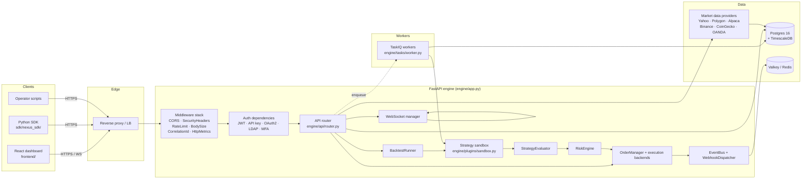

# Architecture overview

Nexus Trade Engine is a Python service that backtests algorithmic
trading strategies, runs them against live or paper brokers, and
exposes the results over a FastAPI HTTP/WebSocket surface. This
document explains the moving parts and how a request travels through
them.

## Why this shape

Three constraints drove the layout:

1. **The hot path is event-driven, not request/response.** Strategies
   emit signals in response to market data, not to user clicks. The
   core engine therefore has a publish/subscribe spine
   (`engine/events/bus.py`) and a sandboxed evaluator
   (`engine/plugins/sandbox.py`) that can be invoked from either a
   synchronous HTTP handler or a long-lived worker loop.
2. **Strategy code is untrusted.** Plugins are loaded from disk and
   executed in-process today, with five layers of containment (import
   blocking, network whitelist, resource caps, filesystem isolation,
   and a process/container boundary on the roadmap). See
   [`engine/plugins/sandbox.py:1`](../../engine/plugins/sandbox.py).
3. **Trading correctness requires deterministic costs.** Commission,
   spread, slippage, taxes, and wash-sale rules are first-class
   inputs to every strategy `evaluate()` call — not a post-hoc
   deduction. The interface is `ICostModel`, passed by the engine to
   the strategy at `engine/core/cost_model.py:1`.

Everything below follows from those three constraints.

## System diagram



## Top-level layout

| Path                                  | Responsibility |
|---------------------------------------|----------------|
| `engine/app.py:154` `create_app()`    | FastAPI factory. Wires routers, middleware, lifespan hooks. |
| `engine/main.py`                      | uvicorn entry point. |
| `engine/config.py:7` `Settings`       | Pydantic settings — every env var the engine reads lives here. |
| `engine/api/`                         | HTTP/WebSocket surface: routers, auth, rate limiting, error mapping. |
| `engine/api/router.py:26` `api_router`| Where every route is mounted. Authoritative list of API surface. |
| `engine/core/`                        | Domain logic: backtest runner, strategy evaluator, execution primitives, tax, risk. |
| `engine/data/`                        | Market data providers and the registry that picks one at runtime. |
| `engine/db/`                          | SQLAlchemy models, async session factory, Alembic migrations. |
| `engine/events/`                      | Event bus + outbound webhook dispatcher. |
| `engine/observability/`               | structlog wiring, lineage middleware, pluggable metrics backend. |
| `engine/plugins/`                     | Plugin SDK, registry, sandboxed runtime. |
| `engine/tasks/`                       | TaskIQ worker definitions for async work. |
| `engine/legal/`                       | Legal-document acceptance (ToS / Privacy / EULA). |
| `engine/reference/`                   | Reference data (instruments, exchanges, typeahead). |
| `engine/privacy/`                     | GDPR / CCPA DSR handlers. |
| `frontend/`                           | React dashboard (Vite, React 18, Tailwind, React Query). |
| `sdk/nexus_sdk/`                      | Public SDK pip-installable by strategy authors. |

## Request lifecycle

A typical authenticated `POST /api/v1/backtest/run` flows as follows.
Line numbers refer to the current source.

1. The reverse proxy forwards the request to uvicorn.
2. **`SecurityHeadersMiddleware`** at `engine/app.py:162` adds HSTS,
   CSP-style headers, `X-Content-Type-Options`, referrer policy.
3. **`CORSMiddleware`** at `engine/app.py:165` enforces the configured
   origin allowlist (`NEXUS_CORS_ORIGINS`).
4. **`RateLimitMiddleware`** at `engine/app.py:175` checks the Valkey
   token bucket. Per-route overrides live in the same call — e.g. the
   client-error route is capped at 30 req/min.
5. **`BodySizeLimitMiddleware`** at `engine/app.py:195` rejects bodies
   >1 MiB before any handler runs.
6. **`CorrelationIdMiddleware`** stamps a request id (uses the inbound
   `X-Request-Id` if present, else mints one) and threads it through
   structlog context.
7. **`HttpMetricsMiddleware`** (added last so it wraps everything
   else) starts the latency timer and records the response status.
8. **`require_legal_acceptance`** at `engine/api/router.py:39` rejects
   the call if the user has not accepted the current Terms / EULA.
9. **`get_current_user`** at `engine/api/auth/dependency.py:102`
   resolves the bearer token (or `X-API-Key`) to a `User`. MFA, scope,
   and role gates fire next.
10. The **route handler** validates the payload, enqueues the
    background task, and returns `202 Accepted` with the backtest id.
11. The **worker** picks up the job from the Valkey broker, runs
    `BacktestRunner` at `engine/core/backtest_runner.py:53`, which:
    - Loads the strategy class via `PluginRegistry.load_strategy()`.
    - Wraps it in `StrategySandbox` at `engine/plugins/sandbox.py`.
    - Builds `MarketState` from the resolved data provider.
    - Iterates timestamps, calling `strategy.evaluate(portfolio,
      market, costs)` each bar.
    - Persists a `BacktestResult` row with the metrics.
12. Listeners on `EventBus` at `engine/events/bus.py:1` fan out. The
    webhook dispatcher (see `engine/events/webhook_dispatcher.py`)
    signs and POSTs to every active subscriber for the event type.

Synchronous reads (`GET /api/v1/portfolio/`, etc.) follow steps 1–9
then return the result directly without enqueueing.

## Module boundaries

Each `engine/<area>/` directory owns one responsibility. Imports go
*down* the dependency ladder, never sideways:

```
api  ──────►  core  ──────►  data, plugins, db
 │             │
 └─► auth      └─► tax, risk, cost_model, execution
                                                ▲
events, observability, tasks, legal, reference ─┘  (used by everything)
```

A corollary: `engine/core` does not import `engine/api`. If you need
to fire an HTTP response from core code, you are doing it wrong.

## Component details

### Authentication

The engine supports a pluggable auth provider registry, configured via
`NEXUS_AUTH_PROVIDERS` (comma-separated). Wired providers:

- `local` — email + bcrypt password, always available.
- `google`, `github` — OAuth2 with PKCE, requires client id/secret.
- `oidc` — generic OpenID Connect (e.g. Okta, Keycloak).
- `ldap` — bind DN + search (requires `python-ldap`).

JWTs are HS256, minted at `engine/api/auth/jwt.py`, with refresh
tokens stored hashed in `refresh_tokens`. API keys (`nxs_*`) are
long-lived, bcrypt-hashed, scoped (`read` / `trade` / `admin`) and
serve both headless automation and the WebSocket endpoint.

RBAC lives at `engine/api/auth/dependency.py:27` — seven roles in a
strict hierarchy (`viewer` → `admin`). Higher roles satisfy lower
checks.

MFA is TOTP-only, secrets encrypted at rest with a Fernet key
(`NEXUS_MFA_ENCRYPTION_KEY`); 10 single-use backup codes per
enrollment. Login returns a challenge token; the verify route exchanges
it for the real access + refresh pair.

### Authorization model

Two orthogonal gates:

- **Role** — required minimum role per route (e.g. marketplace install
  requires `developer`). Checked by `require_role("developer")`.
- **Scope** — required API-key scope per route (e.g. webhook create
  requires `trade`). Checked by `require_api_scope("trade")`. JWT
  sessions bypass this gate.

Both gates compose: a route can require both. JWT requests pass scope
checks automatically; API-key requests pass role checks if the
underlying user's role is sufficient.

### Data provider registry

`DataProviderRegistry` (`engine/data/providers/registry.py`) routes a
request to the first registered adapter that supports the requested
asset class. Built-in adapters:

- Yahoo (default, no key required) — equities and ETFs.
- Polygon, Alpaca — equities, options (keyed).
- Binance, CoinGecko — crypto.
- OANDA — forex.

The registry returns a tuple of `(DataFrame, provider_name)` so the
caller can attribute the data (lineage + legal display). The
`FatalProviderError` / `TransientProviderError` split tells the HTTP
layer whether to return 400 or 503.

### Plugin sandbox

Five layers of containment (see `engine/plugins/sandbox.py:1`):

1. **Import restrictions** — `RestrictedImporter` blocks
   `subprocess`, `socket`, `ctypes`, `multiprocessing`, etc.
2. **Network whitelist** — `SandboxedHttpClient` only allows URLs
   declared in the manifest's `network.allowed_endpoints`.
3. **Resource limits** — Linux `resource.RLIMIT_AS` enforces the
   memory cap; CPU seconds are bounded by the eval timeout.
4. **Filesystem isolation** — each eval gets a fresh `tempfile.TemporaryDirectory`;
   read-only artifacts are bind-mounted.
5. **Process isolation** — *not yet implemented*. Production target
   is one subprocess per strategy, communicated with via pipes.

Strategies that need network or GPU must declare it in
`strategy.manifest.yaml`; the sandbox reads the manifest before
invocation and refuses to start if a required capability is not
whitelisted.

### Order management and execution

`OrderManager` (`engine/core/order_manager.py:1`) handles state
transitions: `pending → validated → submitted → filled | rejected`.
`RiskEngine` (`engine/core/risk_engine.py:33`) has final veto before
submission.

Execution backends live in `engine/core/execution/`:

- `BacktestBackend` — replays historical data; no broker calls.
- `PaperBackend` — live data, simulated fills.
- `LiveBackend` — wired to a real broker adapter (Alpaca integration
  in progress; see roadmap).

### Event bus and webhooks

`EventBus` (`engine/events/bus.py:27`) is an in-process pub/sub with
typed events (`EventType` StrEnum). The webhook dispatcher is the
single subscriber today; it persists a `WebhookDelivery` row per fan
out, signs the body with HMAC-SHA256, and retries on 5xx with
exponential backoff (max retries configured per webhook).

Cross-process pub/sub via Valkey is on the roadmap — the manager
already exposes the shape that work will consume.

### Task queue

TaskIQ workers run from `engine/tasks/worker.py`. The broker is a
Valkey-backed `ListQueueBroker`; the result backend is
`RedisAsyncResultBackend`. The only registered task today is
`run_backtest_task`, which mirrors the in-process backtest runner but
in a worker process. The HTTP route's `BackgroundTasks` slot is used
for short jobs (<30 s) that do not need a separate worker.

### Observability

- **Logs** — `structlog` with JSON output in production, console in
  development. Log sampling is keyed on level (`info` 100%,
  `debug` 1% by default; tune via `NEXUS_LOG_SAMPLING_*`).
- **Tracing** — OpenTelemetry SDK with OTLP exporter; auto-instruments
  FastAPI and SQLAlchemy.
- **Metrics** — Pluggable backend (`MetricsBackend` interface). The
  default is `NullBackend`; production wires `PrometheusBackend`
  (`engine/observability/prometheus.py`) in `app.py:129`. SLOs and
  alerting rules in `observability/prometheus/slo-rules.yaml`.
- **Sentry** — `NEXUS_SENTRY_DSN` enables FastAPI-aware error capture.

## Configuration

Every operator-tunable knob lives in `engine/config.py` as a
Pydantic-Settings field. The convention is:

- Field name = lowercase snake-case.
- Env var = uppercase, prefixed `NEXUS_`, e.g. `NEXUS_DATABASE_URL`,
  `NEXUS_VALKEY_URL`, `NEXUS_MFA_ENCRYPTION_KEY`.
- Defaults are safe-for-dev. Production values come from the
  operator's secrets vault.

A full reference is in
[`development/setup.md`](../development/setup.md#environment-variables).

## Where to put new code

| Adding…                                        | Goes in                                                                 |
|------------------------------------------------|-------------------------------------------------------------------------|
| A new HTTP endpoint                            | `engine/api/routes/<area>.py`, registered in `engine/api/router.py:26`. |
| A new background job                           | `engine/tasks/worker.py`.                                               |
| A new strategy / data provider / executor      | A plugin under `engine/plugins/<kind>/<name>/`.                         |
| A new outbound integration (webhook template)  | Extend `engine/events/webhook_dispatcher.py` and the `_VALID_TEMPLATES` set in `routes/webhooks.py`. |
| A new database table / column                  | An Alembic revision in `engine/db/migrations/versions/`.                |
| A new metric                                   | `engine/observability/metrics.py`. Add to SLO doc **only** if it backs an SLO. |
| A new SLO                                      | `docs/operations/slos.md` **and** `observability/prometheus/slo-rules.yaml` in the same PR. |

## Non-goals

- **Not multi-tenant SaaS.** Operators run their own deployment; the
  codebase models a single tenant's data per database.
- **Live trading is opt-in.** The engine works end-to-end on
  backtests + paper trading without any broker credentials.
- **No built-in UI for ops tasks.** The CLI / API is the surface; the
  React dashboard is for end-users, not operators. Operators interact
  via `psql`, `redis-cli`, and `taskiq worker`.

## Related

- [`decisions.md`](decisions.md) — ADR-style rationale for the major
  choices summarised above.
- [`../api/reference.md`](../api/reference.md) — every route.
- [`../api/data-model.md`](../api/data-model.md) — entity model.
- [`../operations/runbooks.md`](../operations/runbooks.md) — diagnosis
  playbooks for the failures that actually happen.
