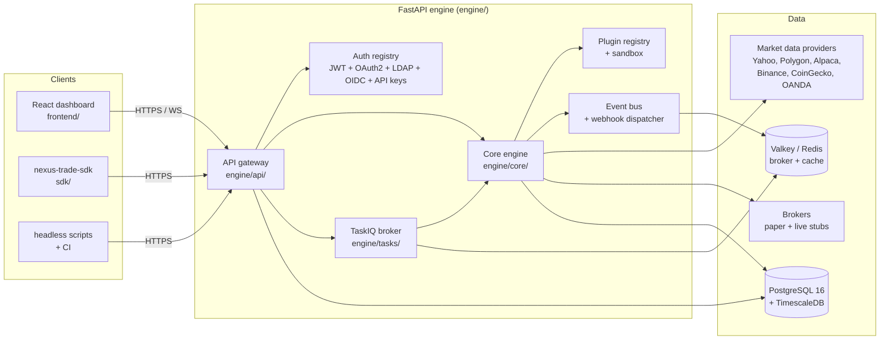
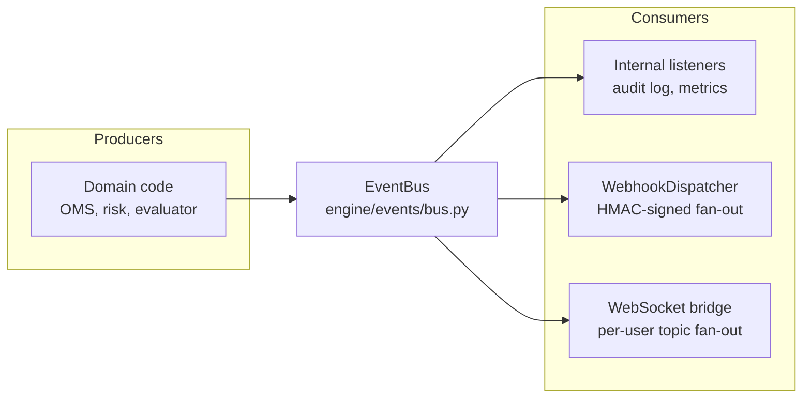

# Architecture overview

Nexus Trade Engine is a Python service that backtests algorithmic
trading strategies, runs them against live or paper broker
connections, and exposes the results via a REST API and a React
frontend. This document describes the moving pieces, the boundaries
between them, and how a request flows through them.

## High-level diagram



The full service is one Python package (`engine/`) with sub-packages
that line up with the boxes above. The frontend is a separate Vite +
React app under `frontend/`. The SDK (`sdk/nexus_sdk`) is published
as a separate wheel so strategy authors do not need the engine
dependency to develop locally.

## Top-level layout

| Path                                      | Responsibility |
|-------------------------------------------|----------------|
| [`engine/app.py`](../../engine/app.py)    | FastAPI app factory. Wires routers, middleware, lifespan hooks. |
| [`engine/main.py`](../../engine/main.py)  | Entry point used by uvicorn (`--factory engine.app:create_app`). |
| [`engine/config.py`](../../engine/config.py) | Pydantic settings — every env var the engine reads lives here. |
| [`engine/api/`](../../engine/api/)        | HTTP/WebSocket surface: routers, auth, rate limiting, security headers, body size cap. |
| [`engine/core/`](../../engine/core/)      | Domain logic: backtest runner, strategy evaluator, OMS, risk engine, cost model, execution backends, tax, monte-carlo, options, optimisation. |
| [`engine/data/`](../../engine/data/)      | Pluggable market-data providers and the registry that picks one at runtime. |
| [`engine/db/`](../../engine/db/)          | SQLAlchemy models, async session factory, Alembic migrations. |
| [`engine/events/`](../../engine/events/)  | Event bus + outbound webhook dispatcher. |
| [`engine/observability/`](../../engine/observability/) | structlog wiring, OpenTelemetry tracing, lineage middleware, pluggable metrics backend. |
| [`engine/plugins/`](../../engine/plugins/) | Plugin SDK adapter, runtime registry, sandbox policy. |
| [`engine/tasks/`](../../engine/tasks/)    | TaskIQ worker definitions for async work (backtests, scheduled jobs). |
| [`engine/legal/`](../../engine/legal/)    | Legal-document acceptance (Terms / Privacy / EULA / etc.) and operator substitutions. |
| [`engine/privacy/`](../../engine/privacy/) | GDPR / CCPA data-subject-request export, deletion, audit. |
| [`engine/reference/`](../../engine/reference/) | Static reference data (instruments, exchanges) + fuzzy-search index. |
| [`sdk/`](../../sdk/)                      | `nexus-trade-sdk` — installable wheel for strategy developers. |
| [`frontend/`](../../frontend/)            | React dashboard (Vite, React 18, Tailwind, react-query). |

## Five-layer mental model

The codebase layers responsibilities top-down. Each layer can be
replaced without touching the ones above or below — that is the
property the plugin system is built to preserve.

| Layer | Purpose | Key components |
|---|---|---|
| **Presentation** | Web UI, headless clients | `frontend/`, `sdk/`, third-party HTTP clients |
| **API gateway** | Auth, rate limiting, validation, routing | `engine/api/`, `engine/api/auth/`, `engine/api/routes/` |
| **Core engine** | Strategy evaluation, OMS, risk, cost model, tax, execution backends | `engine/core/` |
| **Plugin system** | Strategy discovery, sandboxing, marketplace | `engine/plugins/`, `engine/marketplace/`, `sdk/nexus_sdk/` |
| **Data & state** | Postgres/TimescaleDB, Valkey, market-data providers, brokers | `engine/db/`, `engine/data/`, `engine/core/brokers/` |

## Request lifecycle (HTTP)

A typical authenticated `POST /api/v1/backtest/run` does this:

1. Reverse proxy forwards the request to uvicorn
   (`engine.app:create_app`).
2. **CORS / security headers middleware** rejects disallowed
   origins and stamps CSP / HSTS / X-Content-Type-Options.
3. **Body-size middleware** rejects anything over 1 MiB before it
   hits the parser — guards against log-bombing via large JSON
   payloads.
4. **Correlation-id middleware** stamps a request id and propagates
   the OpenTelemetry context.
5. **Rate limiter** short-circuits abusive clients. Per-route
   overrides live in `engine/app.py:create_app`.
6. **HttpMetricsMiddleware** wraps the entire stack so the
   `/metrics` route records the full request lifecycle.
7. **Auth dependency** (`engine/api/auth/dependency.py`) resolves
   the bearer token (or `X-API-Key`) to a `User`. JWT-authenticated
   requests are gated by role checks; API-key requests are gated by
   scope checks (`read` < `trade` < `admin`).
8. **Legal acceptance dependency** (where wired) rejects the
   request if the caller has not accepted the current Terms /
   Privacy / EULA / Disclaimer / Risk.
9. **Route handler** validates the Pydantic payload and either
   returns synchronously or enqueues onto the TaskIQ broker.
10. Listeners on `engine/events/bus.py` get notified. The webhook
    dispatcher fans out to every active webhook config that
    subscribed to the relevant event.

Synchronous reads (`GET /api/v1/portfolio`, etc.) follow steps 1–7
then return the result directly without enqueueing.

## Three execution modes, one interface

Every strategy implements `IStrategy.evaluate(portfolio, market,
costs) -> list[Signal]`. The engine routes the emitted signals
through one of three execution backends:

| Mode | Backend | What it does |
|---|---|---|
| **Backtest** | `engine/core/execution/backtest.py` | Replays historical bars, simulates fills with slippage + cost model. Deterministic when seed is pinned. |
| **Paper** | `engine/core/execution/paper.py` | Live market data feed, simulated fills against last trade price. No money moves. |
| **Live** | `engine/core/execution/live.py` | Real broker adapter (Alpaca, IBKR stubs under `engine/core/brokers/`). Real money. |

The backtest/paper/live trichotomy is enforced at the
`ExecutionBackend` interface level (`engine/core/execution/base.py`).
A strategy that runs cleanly in backtest **must** produce identical
signals in paper and live — there is no "paper-only" code path inside
the strategy contract.

## Event flow



The `EventBus` is in-process and synchronous for direct listeners.
The webhook dispatcher is the single outbound HTTP subscriber today
and handles all fan-out with retries + HMAC signing. The WebSocket
bridge is in `engine/api/websocket/bridge.py` and routes events
into per-user topic subscriptions.

For multi-replica deployments the bus will need a Valkey pub/sub
fan-out layer — the WebSocket manager already exposes the shape that
work will consume (`engine/api/websocket/manager.py`).

## Cost model as input, not afterthought

The single design decision that most distinguishes Nexus from
generic backtest engines: the cost model is **passed in** to every
strategy call.

```python
class IStrategy(Protocol):
    async def evaluate(
        self,
        portfolio: PortfolioSnapshot,
        market: MarketState,
        costs: CostBreakdown,
    ) -> list[Signal]: ...
```

`CostBreakdown` carries commission, spread, slippage, regulatory
fees, FX costs, and the holding-cost carry. Strategies that ignore
`costs` will backtest optimistically and underperform in paper; the
engine surfaces this via the `cost_drag_pct` metric on every run.

See `engine/core/cost_model.py`, `engine/core/tax/wash_sale.py`,
`engine/core/crypto_costs.py`, and ADR-0004.

## Configuration model

Every operator-tunable lives in [`engine/config.py`](../../engine/config.py)
as a Pydantic-Settings field. The convention is:

- Field name = `<area>_<knob>` (lowercase snake-case).
- Env var = `NEXUS_<FIELD>` (uppercase).
- Defaults are safe-for-dev. Production values come from the
  operator's secrets vault via the `.env` file or container env
  vars.
- Secret rotation: `NEXUS_SECRET_KEY_PREVIOUS` allows a dual-key
  window for JWT validation during key rotation. Same pattern for
  `NEXUS_MFA_ENCRYPTION_KEY` is on the roadmap.

`.env.example` ships the full set so operators know what knobs
exist without reading source.

## Where to put new code

| Adding… | Goes in |
|---|---|
| HTTP endpoint | `engine/api/routes/<area>.py`, register in `engine/api/router.py`. |
| Background job | `engine/tasks/`, decorate with `@broker.task`. |
| Strategy plugin | Directory under `strategies/` with `manifest.yaml` + `strategy.py`. See [plugins.md](plugins.md). |
| Data provider adapter | `engine/data/providers/<name>.py`, register in `engine/data/providers/__init__.py`. |
| Webhook template | Extend `engine/events/webhook_dispatcher.py:render_template` and `_VALID_TEMPLATES` in `routes/webhooks.py`. |
| Database table | Alembic revision in `engine/db/migrations/versions/`. Update `engine/db/models.py`. See [database.md](database.md). |
| Metric | `get_metrics()` from `engine/observability/metrics.py`. Add to [operations/slos.md](../operations/slos.md) **only** if it backs an SLO. |
| Auth provider | `engine/api/auth/<name>.py`, register in `engine/app.py:_build_auth_registry`. |

## Non-goals

- This is **not** a multi-tenant SaaS by design. Operators run their
  own deployment; the codebase models a single tenant's data per
  database.
- Live trading is intentionally optional. The engine works
  end-to-end on backtests + paper trading without any broker
  credentials.
- The marketplace is **planned** but not yet wired. Browse and
  category endpoints exist (`engine/api/routes/marketplace.py`) but
  install / uninstall return `501 Not Implemented`. See
  [known-limitations.md](../known-limitations.md).
