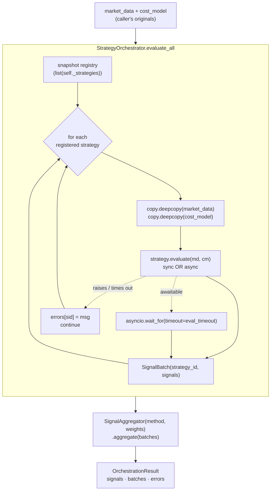

# Strategy orchestration & capital allocation

This document covers the **multi-strategy execution path**: how Nexus
runs more than one strategy against the same market snapshot, merges
their (possibly disagreeing) signals into a single decision set, and
how deployable capital is split across those strategies.

These modules are the substrate the "Multi-Strategy orchestrator"
roadmap item (see [`known-limitations.md`](../known-limitations.md))
is built on. They are landed and unit-tested but **not yet wired to a
public REST/run route** — they are a library today. Treat the
behaviour described here as the stable contract a future
`POST /api/v1/orchestrate/run` (or a worker tick) will bind.

| Concern | Module | Status |
|---|---|---|
| Weighted strategy registry + evaluation | [`engine/core/strategy_orchestrator.py`](../../engine/core/strategy_orchestrator.py) | landed (library) |
| Per-symbol vote resolution (majority/weighted) | [`engine/core/signal_aggregator.py`](../../engine/core/signal_aggregator.py) | landed (library) |
| Signal / batch value types | [`engine/core/signal.py`](../../engine/core/signal.py) | landed |
| Exact-sum capital apportionment | [`engine/core/capital_allocation.py`](../../engine/core/capital_allocation.py) | landed (library) |
| `CapitalAllocation` immutable value object | [`engine/portfolio/allocation.py`](../../engine/portfolio/allocation.py) | landed (library) |

## Why a separate orchestrator (vs. just running strategies in a loop)

The lower-level [`SignalAggregator`](../../engine/core/signal_aggregator.py)
(gh#21) already implements per-symbol majority/weighted resolution with
HOLD-as-abstain semantics. The orchestrator deliberately does **not**
reimplement that math. It owns three things the aggregator does not:

1. **Registry** — strategies are registered with a per-strategy
   `weight` that the `weighted` aggregation mode consults.
2. **Evaluation** — every registered strategy is invoked with the
   *same* `market_data` and `cost_model` so cross-strategy comparisons
   are apples-to-apples. A single failing strategy is isolated.
3. **Aggregation dispatch** — the collected per-strategy
   `SignalBatch` objects are handed to `SignalAggregator`, keeping one
   source of truth for tie handling.

Splitting the two keeps the voting math testable in isolation and
prevents the orchestrator from quietly drifting away from the
aggregator's tie rules.

## Data flow



## Evaluation isolation guarantees

Two isolation properties were added explicitly (commits
`578259b` and `d25e8ac`, "harden orchestrator against mutation and
timeouts" / "async dispatch edge cases"). They are worth understanding
because they are the difference between "works in a demo" and "safe
with untrusted plugin code":

### 1. Input mutation cannot leak across strategies or back to the caller

`evaluate_all` deep-copies `market_data` and `cost_model` **per
strategy**, fresh on every iteration:

```python
for sid, strategy in list(self._strategies.items()):
    md = copy.deepcopy(market_data)
    cm = copy.deepcopy(cost_model)
    raw = strategy.evaluate(md, cm)
```

So a strategy that mutates the structures it was handed cannot poison
its siblings or the caller's originals. The copies are recreated per
strategy (not once for the whole cycle) so each strategy still sees
identical, untouched input — cross-strategy comparisons stay
apples-to-apples.

### 2. A misbehaving strategy cannot stall the cycle

- **Async strategies** are bounded by a per-strategy
  `eval_timeout` (constructor kwarg, default `30.0`s — the platform's
  overall strategy SLA). A strategy that exceeds it is recorded as a
  `TimeoutError` entry in `OrchestrationResult.errors` and skipped; the
  remaining strategies still contribute to the vote.
- **Sync strategies** are *not* bounded — a sync call has already
  completed by the time control returns, so there is nothing to
  cancel. This is a known asymmetry; if you need a hard cap, write the
  strategy async.
- **Any other exception** is caught per-strategy, logged at
  `exception` level, recorded in `errors`, and the loop continues.

`TimeoutError` is caught *before* the generic `except Exception`
because it is a subclass of `OSError`/`Exception` and must be reported
as a timeout, not a crash.

### 3. The registry snapshot prevents mid-cycle mutation

The loop iterates over `list(self._strategies.items())` — a snapshot,
not the live dict. A strategy that registers/unregisters a sibling
from inside its own `evaluate` cannot trigger "dictionary changed size
during iteration". Strategies added during a cycle are intentionally
excluded from it; they run on the next.

## Aggregation modes

| Mode (`AggregationMode`) | Underlying `AggregationMethod` | Rule |
|---|---|---|
| `majority` (default) | `MAJORITY` | Each strategy taking a position (BUY/SELL) casts one equal vote. A side wins only on **strictly more than half** of BUY-vs-SELL votes; a tie emits HOLD. |
| `majority_vote` | `MAJORITY` | Alias of `majority`. Exists only for ergonomic call sites / doc parity. |
| `weighted` | `WEIGHTED` | Each strategy's vote is multiplied by its registered `weight` (default `1.0`). The side with the strictly higher total weight wins; a tie emits HOLD. Lets a high-conviction strategy override a numerical majority. |

Both modes return HOLD for a symbol when no strategy expresses an
opinion beyond HOLD, so downstream consumers always get a record that
the symbol was considered. HOLD signals **abstain** and do not count
toward the denominator.

`weighted` with all-zero weights is a genuine misconfiguration and is
surfaced as `SignalAggregatorError` from the aggregator (not silently
swallowed). Unknown mode strings raise `StrategyOrchestratorError`.

## `OrchestrationResult`

The return value is intentionally richer than a bare `list[Signal]`:

| Field | Type | Purpose |
|---|---|---|
| `signals` | `list[Signal]` | The aggregated decisions. |
| `batches` | `list[SignalBatch]` | Full per-strategy provenance for audit/traceability. |
| `aggregation` | `str` | The mode actually used (echoed back). |
| `strategy_count` | `int` | Registered strategy count at evaluation time. |
| `weights` | `dict[str, float]` | Snapshot of the per-strategy weights. |
| `errors` | `dict[str, str]` | `strategy_id -> message` for any strategy that raised *or* timed out. |

Two convenience views:

- `result.trade_signals` — aggregated signals with non-HOLD intent.
- `result.is_noop` — `True` when nothing was produced at all (empty
  registry, or every strategy returned no signals).

The `errors` map is the single most important field for production:
**a misbehaving plugin can never silently disappear from the
record.** Always surface it in logs / dashboards when wiring the
orchestrator to a run route.

## Capital allocation

Capital allocation is a *separate* concern from signal aggregation:
it answers "given `$X` and weights `{a: 0.5, b: 0.5}`, what dollar
amount does each strategy actually get?" — not "what should we trade?"

### `engine/core/capital_allocation.py` — exact-sum apportionment

Splits a `total_capital` dollar amount across strategies proportional
to `strategy_weights` using the **largest-remainder (a.k.a. Hamilton)
apportionment method**, computed in fixed-point `Decimal` so the
result is exact to the cent:

1. For each strategy compute the raw share `= total * weight / Σ`.
2. Floor each raw share to the cent (`ROUND_DOWN`).
3. The fractional cents dropped in step 2 form a remainder, in whole
   cents.
4. Distribute the remaining cents one-by-one to the strategies with
   the largest fractional parts until the remainder is exhausted.

**Guarantees (and the bugs that motivated them — commits `2c7dd20` /
`f5c62dc`):**

- **Exact-sum invariant** — returned amounts always sum to exactly
  `total_capital` to the cent, even for `$100` split across 3
  strategies by equal `1/3` weights. Largest-remainder is what makes
  this hold; naive `round()` does not.
- **Immutability** — the returned mapping is a frozen
  `types.MappingProxyType`; in-place mutation (assignment, `del`,
  `pop`, `clear`) raises `TypeError`. This blocks the unsafe-mutation
  class of bug fixed in `2c7dd20`.
- **Strict input typing** — `_to_decimal` rejects `bool` (commit
  `f5c62dc`). `True` previously coerced to `Decimal(1)` via the float
  path, which is a silent precision/correctness landmine; booleans are
  now a hard `CapitalAllocationError`.
- **Validation** — a positive `total_capital` paired with empty
  `strategy_weights`, negative/non-finite weights, non-finite/negative
  capital, or weights summing to zero all raise `CapitalAllocationError`.

### `engine/portfolio/allocation.py` — `CapitalAllocation` value object

`CapitalAllocation` is an **in-memory Pydantic value object**, not a
DB entity (no `__tablename__`; it is not in
[`data-model.md`](../data-model.md)). It records how total deployable
capital is split between competing strategies.

Constraints:

- `strategy_weights` sum to exactly `1.0` (within a small epsilon to
  absorb float-accumulation noise).
- Each weight is individually non-negative.
- The number of distinct strategies is capped by `max_strategies`.

Immutability is blocked on two levels so a partial mutation can never
leave the object in an inconsistent state:

- **Field assignment** (`alloc.total_capital = ...`) raises
  `ValidationError` — the model is declared `frozen`.
- **Mapping mutation** (`alloc.strategy_weights["x"] = 0.5`) raises
  `TypeError` — the stored weights are wrapped in a read-only
  `MappingProxyType`.

Callers that need a changed allocation must go through
`model_copy(update={...})`. The default Pydantic `model_copy` splats
the `update` dict straight into `__dict__` and skips validation, which
would silently bypass the weight constraints, so this model **overrides
`model_copy`** to rebuild through `model_validate` — mirroring the same
pattern used by [`engine.core.instruments.Instrument`](../../engine/core/instruments.py)
(commit `b7fc7ff`). Every validator re-runs on the merged field set.

## Wiring status

Today these modules are exercised only by tests
(`tests/test_strategy_orchestrator.py`,
`tests/test_signal_aggregator.py`, `tests/test_capital_allocation.py`,
`tests/test_portfolio_aggregator.py`). There is **no** REST route or
worker tick that instantiates `StrategyOrchestrator` and calls
`evaluate_all` — confirmed by grepping the engine for `StrategyOrchestrator`
outside the module itself.

The expected integration shape (when the roadmap item lands):

```python
orchestrator = StrategyOrchestrator(eval_timeout=30.0)
for strat, weight in installed_strategies:
    orchestrator.register(strat, weight=weight)

result = await orchestrator.evaluate_all(
    market_data=snapshot,
    cost_model=cost_model,
    aggregation=AggregationMode.WEIGHTED.value,
)
if result.errors:
    logger.warning("orchestrator.strategy_errors", errors=result.errors)
decisions = result.trade_signals
```

The per-strategy `eval_timeout`, the deep-copy isolation, and the
`errors` map are the contract a future run route must preserve — they
exist precisely so untrusted plugin strategies can be orchestrated
without one bad actor stalling or corrupting the cycle.
