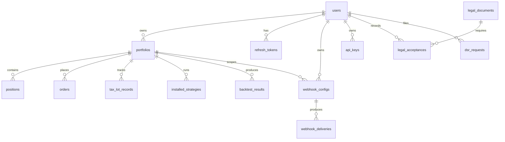

# Data model

All durable state lives in a single Postgres database (TimescaleDB
extension enabled). Schema ownership: Alembic chain in
[`engine/db/migrations/versions/`](../engine/db/migrations/versions/).
Models: [`engine/db/models.py`](../engine/db/models.py). Conventions
and migration policy: [`architecture/database.md`](architecture/database.md).

## Entity-relationship diagram

## Entities

### `users`

Primary identity. One row per human (or service account) that can
authenticate.

| Column                    | Type           | Notes                                              |
|---------------------------|----------------|----------------------------------------------------|
| `id`                      | UUID PK        | Generated client-side                             |
| `email`                   | varchar(255)   | Unique, indexed                                   |
| `hashed_password`         | varchar(255)   | Nullable (federated users have no password)       |
| `display_name`            | varchar(100)   |                                                    |
| `is_active`               | bool           | Soft disable; auth dep rejects `is_active=False`  |
| `role`                    | varchar(20)    | See role hierarchy in [`api/README.md`](api/README.md) |
| `auth_provider`           | varchar(20)    | `local`, `google`, `github`, `oidc`, `ldap`       |
| `external_id`             | varchar(255)   | IdP-side identifier (nullable for local)          |
| `mfa_enabled`             | bool           |                                                    |
| `mfa_secret_encrypted`    | text           | Fernet-encrypted TOTP secret                       |
| `mfa_backup_codes`        | JSONB          | bcrypt-hashed one-time codes                       |
| `created_at`, `updated_at`| timestamptz    |                                                    |

**Unique constraints**
- `email`
- `(auth_provider, external_id)` where `external_id IS NOT NULL`
  (partial index `uq_user_provider_external`)

### `portfolios`

Organizing unit for trading state. Owned by a user.

| Column            | Type             | Notes                       |
|-------------------|------------------|-----------------------------|
| `id`              | UUID PK          |                             |
| `user_id`         | UUID FK → users  | `ON DELETE CASCADE`         |
| `name`            | varchar(200)     |                             |
| `description`     | text             | default `''`                |
| `initial_capital` | numeric(18,4)    | default `100000.0`          |
| `created_at`      | timestamptz      |                             |

### `positions`

Current snapshot of a portfolio's holdings. Updated as fills land.

| Column            | Type              | Notes                                |
|-------------------|-------------------|--------------------------------------|
| `id`              | UUID PK           |                                      |
| `portfolio_id`    | UUID FK → portfolios | `ON DELETE CASCADE`               |
| `symbol`          | varchar(20)       | Indexed                              |
| `quantity`        | numeric(18,8)     |                                      |
| `avg_entry_price` | numeric(18,8)     |                                      |
| `current_price`   | numeric(18,8)     |                                      |
| `updated_at`      | timestamptz       |                                      |

**Unique constraint** — `(portfolio_id, symbol)` via
`uq_position_portfolio_symbol`.

### `orders`

Placed orders. Status moves `pending → submitted → filled |
rejected | failed`.

| Column         | Type              | Notes                                  |
|----------------|-------------------|----------------------------------------|
| `id`           | UUID PK           |                                        |
| `portfolio_id` | UUID FK → portfolios | `ON DELETE CASCADE`                 |
| `symbol`       | varchar(20)       | Indexed                                |
| `side`         | varchar(10)       | `buy` / `sell`                         |
| `order_type`   | varchar(20)       | `market` / `limit` / `stop` / etc.     |
| `quantity`     | numeric           |                                        |
| `price`        | numeric(18,8)     | Nullable (market orders)               |
| `status`       | varchar(20)       | default `'pending'`                    |
| `filled_at`    | timestamptz       | Nullable                               |
| `created_at`   | timestamptz       |                                        |

### `tax_lot_records`

Per-lot cost basis. One row per (re-)purchase; closed when
`remaining_quantity = 0`.

| Column                  | Type              | Notes                              |
|-------------------------|-------------------|------------------------------------|
| `id`                    | UUID PK           |                                    |
| `lot_id`                | varchar(36)       | Unique, indexed                    |
| `portfolio_id`          | UUID FK → portfolios | `ON DELETE CASCADE`             |
| `symbol`                | varchar(20)       | Indexed                            |
| `quantity`              | numeric(18,8)     |                                    |
| `remaining_quantity`    | numeric(18,8)     | Decremented on each disposal       |
| `purchase_price`        | numeric(18,8)     |                                    |
| `purchase_date`         | timestamptz       |                                    |
| `cost_basis_adjustment` | numeric(18,8)     | Wash-sale disallowed loss adds here|
| `status`                | varchar(30)       | `open`, `partially_consumed`, `closed` |

**Index** — `(portfolio_id, symbol)` via `ix_tax_lot_portfolio_symbol`.

### `installed_strategies`

Many-to-one from portfolio to strategy. The strategy is identified
by `strategy_name` (matches `strategies/<name>/manifest.yaml`).

| Column          | Type             | Notes                          |
|-----------------|------------------|--------------------------------|
| `id`            | UUID PK          |                                |
| `portfolio_id`  | UUID FK → portfolios | `ON DELETE CASCADE`        |
| `strategy_name` | varchar(100)     |                                |
| `config`        | JSONB            | Strategy-specific parameters   |
| `is_active`     | bool             |                                |
| `installed_at`  | timestamptz      |                                |

### `backtest_results`

Persisted backtest outputs. `portfolio_id` is nullable so the
asynchronous worker path can persist results that are not yet
attached to a portfolio.

| Column              | Type             | Notes                                      |
|---------------------|------------------|--------------------------------------------|
| `id`                | UUID PK          |                                            |
| `portfolio_id`      | UUID FK → portfolios | Nullable, `ON DELETE CASCADE`          |
| `strategy_name`     | varchar(100)     |                                            |
| `start_date`        | timestamptz      |                                            |
| `end_date`          | timestamptz      |                                            |
| `metrics`           | JSONB            | Full metrics map (see [`api/backtest.md`](api/backtest.md#metricssummary-shape)) |
| `composite_score`   | float            | Nullable. Populated by strategy evaluator. |
| `score_breakdown`   | JSONB            | Per-dimension score map. Nullable.         |
| `created_at`        | timestamptz      |                                            |

### `webhook_configs`

Webhook definitions.

| Column            | Type             | Notes                                  |
|-------------------|------------------|----------------------------------------|
| `id`              | UUID PK          |                                        |
| `user_id`         | UUID FK → users  | `ON DELETE CASCADE`                    |
| `portfolio_id`    | UUID FK → portfolios | Nullable, `ON DELETE CASCADE`      |
| `url`             | varchar(2048)    |                                        |
| `event_types`     | JSONB            | Subscription list                      |
| `signing_secret`  | varchar(128)     | Returned on create only                |
| `custom_headers`  | JSONB            |                                        |
| `template`        | varchar(20)      | `generic`/`discord`/`slack`/`telegram` |
| `max_retries`     | int              | 1–10                                   |
| `is_active`       | bool             |                                        |

### `webhook_deliveries`

Audit trail for outbound POSTs. One row per attempt-batch (retries
increment `attempts` on the same row).

| Column            | Type             | Notes                                       |
|-------------------|------------------|---------------------------------------------|
| `id`              | UUID PK          |                                             |
| `webhook_id`      | UUID FK → webhook_configs | `ON DELETE CASCADE`                |
| `event_type`      | varchar(64)      | Indexed                                     |
| `payload`         | JSONB            | The body that was POSTed                    |
| `status`          | varchar(20)      | `pending` / `delivered` / `failed` (indexed)|
| `response_status` | int              | Nullable                                    |
| `response_ms`     | int              | Nullable                                    |
| `attempts`        | int              |                                             |
| `error`           | text             |                                             |
| `created_at`      | timestamptz      | Indexed                                     |
| `delivered_at`    | timestamptz      | Nullable                                    |

### `legal_documents`

Document registry, populated by `engine/legal/sync.py` at startup.

| Column              | Type           | Notes                                  |
|---------------------|----------------|----------------------------------------|
| `id`                | UUID PK        |                                        |
| `slug`              | varchar(50)    | Unique, indexed                        |
| `title`             | varchar(200)   |                                        |
| `current_version`   | varchar(20)    |                                        |
| `effective_date`    | date           |                                        |
| `requires_acceptance` | bool          |                                        |
| `category`          | varchar(30)    | Indexed                                |
| `display_order`     | int            |                                        |
| `file_path`         | varchar(255)   | Path under `NEXUS_LEGAL_DOCUMENTS_DIR` |

### `legal_acceptances`

Immutable audit row. Migration `006_legal_acceptance_immutable`
installed triggers that prevent `UPDATE` and `DELETE`.

| Column              | Type             | Notes                                       |
|---------------------|------------------|---------------------------------------------|
| `id`                | UUID PK          |                                             |
| `user_id`           | UUID FK → users  | `ON DELETE RESTRICT DEFERRABLE INITIALLY DEFERRED` |
| `document_slug`     | varchar(50)      |                                             |
| `document_version`  | varchar(20)      |                                             |
| `accepted_at`       | timestamptz      |                                             |
| `ip_address`        | varchar(45)      |                                             |
| `user_agent`        | varchar(500)     |                                             |
| `context`           | varchar(50)      | `onboarding` / `prompt` / etc.             |
| `revoked_at`        | timestamptz      | Nullable                                    |

**Indexes** — `(user_id, document_slug)`,
`(user_id, document_slug, document_version)`, `(accepted_at)`.

### `data_provider_attributions`

Display-time attribution metadata for data providers.

| Column              | Type           | Notes                |
|---------------------|----------------|----------------------|
| `id`                | UUID PK        |                      |
| `provider_slug`     | varchar(50)    | Unique               |
| `provider_name`     | varchar(100)   |                      |
| `attribution_text`  | text           |                      |
| `attribution_url`   | varchar(500)   | Nullable             |
| `logo_path`         | varchar(255)   | Nullable             |
| `display_contexts`  | JSONB          | e.g. `["marketplace"]` |
| `is_active`         | bool           |                      |

### `refresh_tokens`

Rotating refresh tokens. Stored hashed (SHA-256) so the engine can
detect replay.

| Column         | Type             | Notes                                       |
|----------------|------------------|---------------------------------------------|
| `id`           | UUID PK          |                                             |
| `user_id`      | UUID FK → users  | `ON DELETE CASCADE`                         |
| `token_hash`   | varchar(64)      | Unique                                      |
| `expires_at`   | timestamptz      |                                             |
| `revoked_at`   | timestamptz      | Nullable                                    |
| `user_agent`   | varchar(512)     | Nullable                                    |
| `ip_address`   | varchar(45)      | Nullable                                    |
| `created_at`   | timestamptz      |                                             |

Replay detection: presenting a revoked token triggers cascade
revocation of every outstanding token for the user (see
[`api/auth.md`](api/auth.md#post-refresh)).

### `api_keys`

Long-lived scoped tokens. Stored as bcrypt hash + 12-char plaintext
prefix (used for lookup).

| Column         | Type             | Notes                                       |
|----------------|------------------|---------------------------------------------|
| `id`           | UUID PK          |                                             |
| `user_id`      | UUID FK → users  | `ON DELETE CASCADE`                         |
| `name`         | varchar(255)     |                                             |
| `prefix`       | varchar(32)      | Unique, indexed                             |
| `key_hash`     | varchar(255)     | bcrypt                                      |
| `scopes`       | JSONB            | `["read", "trade", "admin"]` subset        |
| `last_used_at` | timestamptz      | Nullable                                    |
| `expires_at`   | timestamptz      | Nullable                                    |
| `revoked_at`   | timestamptz      | Nullable                                    |

**Index** — `(user_id, revoked_at)` via `ix_api_keys_user_active`.

### `scoring_snapshots`

Persisted output of `POST /api/v1/scoring/{strategy}/run`.

| Column            | Type           | Notes                                     |
|-------------------|----------------|-------------------------------------------|
| `id`              | UUID PK        |                                           |
| `strategy_id`     | varchar(100)   | Indexed                                   |
| `universe_size`   | int            |                                           |
| `excluded_factors`| JSONB          |                                           |
| `results`         | JSONB          | Full score list                           |
| `created_at`      | timestamptz    |                                           |

**Index** — `(strategy_id, created_at)`.

### `dsr_requests`

GDPR / CCPA request log.

| Column        | Type             | Notes                                       |
|---------------|------------------|---------------------------------------------|
| `id`          | UUID PK          |                                             |
| `user_id`     | UUID FK → users  | `ON DELETE CASCADE`                         |
| `kind`        | varchar(32)      | `export` / `delete` / `rectify` / `restrict` / `object` |
| `status`      | varchar(32)      | `pending` / `completed` / `cancelled`       |
| `note`        | text             | Nullable                                    |
| `details`     | JSONB            |                                             |
| `sla_due_at`  | timestamptz      | GDPR Art. 12 one-month default              |
| `completed_at`| timestamptz      | Nullable                                    |
| `cancelled_at`| timestamptz      | Nullable                                    |

**Index** — `(user_id, kind, status)`.

### `ohlcv_bars`

OHLCV market data. TimescaleDB hypertable target.

| Column      | Type           | Notes                                  |
|-------------|----------------|----------------------------------------|
| `id`        | UUID PK        |                                        |
| `symbol`    | varchar(20)    |                                        |
| `timestamp` | timestamptz    |                                        |
| `open`      | numeric(18,8)  |                                        |
| `high`      | numeric(18,8)  |                                        |
| `low`       | numeric(18,8)  |                                        |
| `close`     | numeric(18,8)  |                                        |
| `volume`    | numeric(24,4)  |                                        |

**Index** — `(symbol, timestamp)`.
**Unique constraint** — `(symbol, timestamp)`.

## Constraints and invariants

- **Cascade semantics.** Owned data uses `ON DELETE CASCADE`
  (`portfolio → positions`, `users → refresh_tokens`,
  `webhook_configs → webhook_deliveries`). Shared / audit rows use
  `ON DELETE RESTRICT` (`legal_acceptances → users` is deferrable so
  cleanup can run inside a transaction).
- **Immutability.** `legal_acceptances` rows are write-once. Migration
  `006_legal_acceptance_immutable` installs triggers that reject
  `UPDATE` and `DELETE`.
- **Uniqueness.** `(auth_provider, external_id)` on `users` is a
  partial index (only enforced where `external_id IS NOT NULL`), so
  local-only users don't collide.
- **Money precision.** All money columns are `numeric(18,8)` — 10
  integer digits + 8 fractional. Sufficient for crypto (satoshis)
  and forex (pip fractions).
- **Timestamps.** All `*_at` columns are `timestamptz`. Application
  code emits `datetime.now(UTC)`; never naive datetimes.

## Hypertables

Today only `ohlcv_bars` is a TimescaleDB hypertable target. Others
may follow (account equity history, audit log) — see
`architecture/database.md` for the conversion recipe.

## Test data

Tests use SQLite by default (see `tests/conftest.py`). Tests that
exercise Postgres-specific features (JSONB queries, partial unique
indexes, immutability triggers, hypertables) are marked
`@pytest.mark.integration` and skipped on SQLite.
