# Data Model

All durable state lives in PostgreSQL 16 with the TimescaleDB extension.
Models are defined in `engine/db/models.py` using SQLAlchemy 2.0's
`DeclarativeBase` + `mapped_column`. Migrations are managed by Alembic
(`engine/db/migrations/versions/`).

## Entity Relationship Diagram

```mermaid
erDiagram
    User ||--o{ Portfolio : owns
    User ||--o{ RefreshToken : has
    User ||--o{ WebhookConfig : configures
    User ||--o{ LegalAcceptance : signs
    User ||--o{ ApiKey : creates
    User ||--o{ DSRequest : submits
    Portfolio ||--o{ Position : contains
    Portfolio ||--o{ Order : has
    Portfolio ||--o{ TaxLotRecord : tracks
    Portfolio ||--o{ InstalledStrategy : runs
    Portfolio ||--o{ BacktestResult : produces
    WebhookConfig ||--o{ WebhookDelivery : dispatches
    LegalDocument ||--o{ LegalAcceptance : accepted_by

    User {
        uuid id PK
        varchar email UK
        varchar hashed_password
        varchar display_name
        boolean is_active
        varchar role
        varchar auth_provider
        varchar external_id
        boolean mfa_enabled
        text mfa_secret_encrypted
        jsonb mfa_backup_codes
        timestamptz created_at
        timestamptz updated_at
    }

    Portfolio {
        uuid id PK
        uuid user_id FK
        varchar name
        text description
        numeric initial_capital
        timestamptz created_at
    }

    Position {
        uuid id PK
        uuid portfolio_id FK
        varchar symbol
        numeric quantity
        numeric avg_entry_price
        numeric current_price
        timestamptz updated_at
    }

    Order {
        uuid id PK
        uuid portfolio_id FK
        varchar symbol
        varchar side
        varchar order_type
        numeric quantity
        numeric price
        varchar status
        timestamptz filled_at
        timestamptz created_at
    }

    TaxLotRecord {
        uuid id PK
        varchar lot_id UK
        uuid portfolio_id FK
        varchar symbol
        numeric quantity
        numeric remaining_quantity
        numeric purchase_price
        timestamptz purchase_date
        numeric cost_basis_adjustment
        varchar status
        timestamptz created_at
        timestamptz updated_at
    }

    BacktestResult {
        uuid id PK
        uuid portfolio_id FK
        varchar strategy_name
        timestamptz start_date
        timestamptz end_date
        jsonb metrics
        float composite_score
        jsonb score_breakdown
        timestamptz created_at
    }

    WebhookConfig {
        uuid id PK
        uuid user_id FK
        uuid portfolio_id FK
        varchar url
        jsonb event_types
        varchar signing_secret
        jsonb custom_headers
        varchar template
        int max_retries
        boolean is_active
        timestamptz created_at
        timestamptz updated_at
    }

    WebhookDelivery {
        uuid id PK
        uuid webhook_id FK
        varchar event_type
        jsonb payload
        varchar status
        int response_status
        int response_ms
        int attempts
        text error
        timestamptz created_at
        timestamptz delivered_at
    }

    RefreshToken {
        uuid id PK
        uuid user_id FK
        varchar token_hash UK
        timestamptz expires_at
        timestamptz revoked_at
        timestamptz created_at
        varchar user_agent
        varchar ip_address
    }

    LegalDocument {
        uuid id PK
        varchar slug UK
        varchar title
        varchar current_version
        date effective_date
        boolean requires_acceptance
        varchar category
        int display_order
        varchar file_path
        timestamptz created_at
        timestamptz updated_at
    }

    LegalAcceptance {
        uuid id PK
        uuid user_id FK
        varchar document_slug
        varchar document_version
        timestamptz accepted_at
        varchar ip_address
        varchar user_agent
        varchar context
        timestamptz revoked_at
    }

    ApiKey {
        uuid id PK
        uuid user_id FK
        varchar name
        varchar prefix UK
        varchar key_hash
        jsonb scopes
        timestamptz last_used_at
        timestamptz expires_at
        timestamptz revoked_at
        timestamptz created_at
        timestamptz updated_at
    }

    OHLCVBar {
        uuid id PK
        varchar symbol
        timestamptz timestamp
        numeric open
        numeric high
        numeric low
        numeric close
        numeric volume
    }

    ScoringSnapshot {
        uuid id PK
        varchar strategy_id
        int universe_size
        jsonb excluded_factors
        jsonb results
        timestamptz created_at
    }

    DSRequest {
        uuid id PK
        uuid user_id FK
        varchar kind
        varchar status
        text note
        jsonb details
        timestamptz sla_due_at
        timestamptz completed_at
        timestamptz cancelled_at
        timestamptz created_at
        timestamptz updated_at
    }

    DataProviderAttribution {
        uuid id PK
        varchar provider_slug UK
        varchar provider_name
        text attribution_text
        varchar attribution_url
        varchar logo_path
        jsonb display_contexts
        boolean is_active
        timestamptz created_at
        timestamptz updated_at
    }

    InstalledStrategy {
        uuid id PK
        uuid portfolio_id FK
        varchar strategy_name
        jsonb config
        boolean is_active
        timestamptz installed_at
    }
```

## Table Summary

| Table | Purpose | Row Growth | Sensitive Columns |
|-------|---------|-----------|-------------------|
| `users` | Identity and auth | Low | `hashed_password`, `mfa_secret_encrypted`, `mfa_backup_codes` |
| `portfolios` | User portfolios | Low-Medium | None |
| `positions` | Open positions per portfolio | Medium | None |
| `orders` | Order history | Medium-High | None |
| `tax_lot_records` | Tax lot tracking | Medium | None |
| `backtest_results` | Backtest output with metrics | High | None |
| `webhook_configs` | Outbound webhook registrations | Low | `signing_secret` (returned once on create) |
| `webhook_deliveries` | Delivery audit trail | High | `payload` (may contain user data) |
| `refresh_tokens` | JWT refresh token storage | Medium | `token_hash` |
| `legal_documents` | Terms, privacy, disclaimers | Low | None |
| `legal_acceptances` | Audit trail of document acceptance | Medium | `ip_address`, `user_agent` |
| `api_keys` | Long-lived API keys | Low | `key_hash` |
| `ohlcv_bars` | Market data (TimescaleDB hypertable) | Very High | None |
| `scoring_snapshots` | Scoring strategy results | Medium | None |
| `dsr_requests` | GDPR/CCPA data subject requests | Low | `details` |
| `data_provider_attributions` | Data source licensing info | Low | None |
| `installed_strategies` | Strategy-to-portfolio bindings | Low | None |

## Key Constraints

### Uniqueness
- `users.email` — one account per email
- `users(auth_provider, external_id)` — one account per OAuth provider identity
- `positions(portfolio_id, symbol)` — one position per symbol per portfolio
- `ohlcv_bars(symbol, timestamp)` — one bar per symbol per timestamp
- `tax_lot_records.lot_id` — globally unique lot identifier
- `refresh_tokens.token_hash` — one active token per hash
- `api_keys.prefix` — unique key prefix for lookup
- `legal_documents.slug` — unique document identifier
- `data_provider_attributions.provider_slug` — unique provider

### Cascading Deletes
- `User` deletion cascades to: `Portfolio`, `RefreshToken`, `WebhookConfig`,
  `ApiKey`, `DSRequest`
- `Portfolio` deletion cascades to: `Position`, `Order`, `TaxLotRecord`,
  `InstalledStrategy`, `BacktestResult`
- `WebhookConfig` deletion cascades to: `WebhookDelivery`

### Restrictive Deletes
- `LegalAcceptance.user_id` uses `ON DELETE RESTRICT` with deferred
  constraints — acceptance rows must be explicitly handled before user deletion.

## Migration Chain

The current migration chain (12 revisions) is:

| Rev | Description |
|-----|-------------|
| 001 | Initial schema: users, strategies, backtest_results |
| 002 | Portfolios, positions, fills |
| 003 | Make `backtest_results.portfolio_id` nullable |
| 004 | Legal documents |
| 005 | Auth/RBAC tables |
| 006 | Immutable legal acceptance rows |
| 007 | Scoring snapshots |
| 008 | Composite score + score breakdown on backtest_results |
| 009 | MFA fields on users |
| 010 | Webhook configs + deliveries |
| 011 | OHLCV bars (TimescaleDB hypertable) |
| 012 | API keys |

Run `alembic history` or `alembic current` for the source of truth.

## Column Type Conventions

- **Primary keys:** `UUID` (auto-generated via `uuid.uuid4`)
- **Monetary values:** `NUMERIC(18, 4)` or `NUMERIC(18, 8)` — exact precision, no floating-point drift
- **Quantities:** `NUMERIC(18, 8)` — supports fractional shares
- **Timestamps:** `TIMESTAMPTZ` — always UTC, no naive datetimes
- **Flexible data:** `JSONB` — indexed with GIN where queried by key
- **Strings:** `VARCHAR(n)` with explicit length limits — prevents unbounded storage
