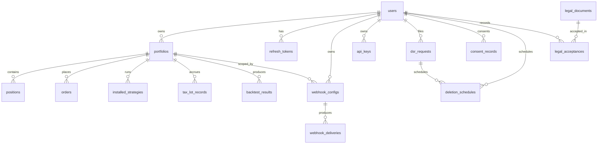

# Data Model

Source of truth: [`engine/db/models.py`](../engine/db/models.py). The
migration chain in
[`engine/db/migrations/versions/`](../engine/db/migrations/versions/)
captures every change.

This doc explains the *invariants and ownership rules* — for the table
inventory and migration policy, see
[`architecture/database.md`](architecture/database.md).

> **What is *not* here: `Instrument`.** The engine models typed
> instruments ([`engine/core/instruments.py`](../engine/core/instruments.py),
> `InstrumentAssetClass`) but **does not persist them**. Positions,
> orders, and tax lots are still keyed by the string `symbol` column.
> `Instrument` is a runtime value object the engine derives from each
> signal's `symbol` — see [ADR-0010](adr/0010-instrument-asset-class-taxonomy.md)
> and the *Multi-asset instrument modeling* section of
> [`architecture/core-domains.md`](architecture/core-domains.md). There is
> no `instruments` table and no `asset_class` column on any model today.

## Diagram

## Identity & auth

### `users` (migration 001, 009)

Primary identity. UUID PK. Key columns:

| Column | Type | Notes |
|---|---|---|
| `email` | `varchar(255)` unique | Lowercased at write time by the auth provider. |
| `hashed_password` | `varchar(255)` nullable | bcrypt. Null for OAuth-only users. |
| `role` | `varchar(20)` default `'user'` | Free-form but enforced via `ROLE_HIERARCHY` (see [api-reference.md](api-reference.md)). |
| `auth_provider` | `varchar(20)` | `local`, `google`, `github`, `oidc`, `ldap`. |
| `external_id` | `varchar(255)` nullable | Provider-specific subject; unique *paired* with `auth_provider`. |
| `mfa_enabled` | bool default false | Set true only after `/mfa/enroll/confirm`. |
| `mfa_secret_encrypted` | text nullable | Fernet-encrypted TOTP secret. Keyed by `NEXUS_MFA_ENCRYPTION_KEY`. |
| `mfa_backup_codes` | JSONB nullable | Array of bcrypt hashes; consumed codes are removed in place. |

Invariant: `(auth_provider, external_id)` is unique (index
`uq_user_provider_external`). A single email may be claimed by at most
one row per provider; across providers, two distinct rows may share an
email — that's intentional (the operator decides whether to merge).

### `refresh_tokens` (001)

Rotating session tokens. Single-use — any second presentation triggers
revoke-all for the user (token-replay detection in
[`routes/auth.py`](../engine/api/routes/auth.py#L183)).

| Column | Type | Notes |
|---|---|---|
| `token_hash` | `char(64)` unique | SHA-256 of plaintext. Plaintext is never stored. |
| `expires_at` | timestamptz | Default 7 days from issue (`NEXUS_JWT_REFRESH_TOKEN_EXPIRE_DAYS`). |
| `revoked_at` | timestamptz nullable | Set on logout, refresh, or replay detection. |
| `user_agent`, `ip_address` | nullable | Forensic trail. |

`ondelete=CASCADE` from `users` — deleting a user purges their sessions.

### `api_keys` (011)

Long-lived, scoped credentials for headless / SDK access. Prefix is
the lookup key; secret is bcrypt-hashed.

| Column | Type | Notes |
|---|---|---|
| `prefix` | `varchar(32)` unique | First segment of `nxs_<prefix>_<secret>`. |
| `key_hash` | `varchar(255)` | bcrypt(secret). |
| `scopes` | JSONB list | Subset of `["read","trade","admin"]`. |
| `last_used_at` | timestamptz nullable | Touched on every authenticated request. |
| `expires_at` | timestamptz nullable | Soft expiry — checked in `find_active_by_token`. |
| `revoked_at` | timestamptz nullable | Soft delete; `DELETE /auth/api-keys/{id}` sets this. |

Index `ix_api_keys_user_active(user_id, revoked_at)` backs the
"list active keys" query.

## Trading state

### `portfolios` (002)

A user's book. `initial_capital` is `Numeric(18,4)` — Decimal all the
way down; floats never touch money columns. `ondelete=CASCADE` from
`users`.

### `positions` (002)

One row per `(portfolio_id, symbol)` (unique constraint
`uq_position_portfolio_symbol`). Aggregated upstream — the OMS writes
here, the backtest runner reads. `quantity` is `Numeric(18,8)` to
support crypto fractional shares.

### `orders` (002)

Order ledger. `side` is free-form `varchar(10)` (`buy`/`sell` today).
`status` defaults to `'pending'`; the OMS transitions through
`submitted → partial → filled | cancelled | rejected`. `price`
nullable for market orders.

### `installed_strategies` (002)

Which strategies a portfolio has bound. `config` is JSONB and passed
verbatim to the strategy on `activate`. Soft-deleted by setting
`is_active=false` — there's no hard-delete route today.

### `tax_lot_records` (002)

Open-lot accounting. `TaxLotStatus` enum: `open |
partially_consumed | closed`. `remaining_quantity` is what's left to
match against future disposals; `cost_basis_adjustment` accumulates
wash-sale basis shifts (US).

Index `ix_tax_lot_portfolio_symbol` backs the per-symbol lot walk.

### `backtest_results` (002 → 003 nullable portfolio → 008 composite score)

The result row a `POST /backtest/run` *should* be writing — see
[known-limitations.md](known-limitations.md): today the route uses an
in-process dict instead. The table is the canonical store for any
backtest that survives a process restart.

| Column | Type | Notes |
|---|---|---|
| `portfolio_id` | uuid nullable | Nullable so anonymous / sandbox runs can still be recorded. |
| `metrics` | JSONB | Free-shape metrics blob; the canonical field set lives in `MetricsSummary` in [`routes/backtest.py`](../engine/api/routes/backtest.py). |
| `composite_score` | float nullable | Strategy evaluator output. |
| `score_breakdown` | JSONB nullable | Per-dimension scores. |

Critical for the GDPR export pipeline: `portfolio_id` is
left-outer-joined so orphaned backtest rows still export (gh#157).

## Outbound integrations

### `webhook_configs` (010)

| Column | Type | Notes |
|---|---|---|
| `url` | `varchar(2048)` | Target. Validated as `HttpUrl` at the API layer. |
| `event_types` | JSONB list | Subscribed event names. Empty list = all events. |
| `signing_secret` | `varchar(128)` | Random; HMAC-SHA256 signs every payload. Returned *only* on create. |
| `custom_headers` | JSONB dict | Added verbatim to outgoing requests. |
| `template` | `varchar(20)` default `'generic'` | One of `generic, discord, slack, telegram`. |
| `max_retries` | int default 3 | 1–10 enforced at API layer. |
| `portfolio_id` | uuid nullable | Scope: when set, the webhook only fires for events tied to that portfolio. |

### `webhook_deliveries` (010)

Audit row per fan-out attempt. Indexed on `(webhook_id, created_at)`
implicitly via the FK index + `created_at` index. `status` transitions
through `pending → delivered | failed | dead`. The dispatcher never
deletes; retention is governed by the global retention job.

## Reference & marketplace

### `ohlcv_bars`

Market data cache. Unique `(symbol, timestamp)`, indexed
`(symbol, timestamp)` for the standard time-bounded scan. Intended as
a TimescaleDB hypertable (see `architecture/database.md`).

### `data_provider_attributions`

UI-footer attributions required by vendor ToS. `display_contexts` is
a JSONB list of strings (e.g. `["footer", "settings/data-sources"]`)
controlling where each attribution renders.

### `scoring_snapshots` (007)

Per-strategy, per-run scoring output. `results` JSONB holds the
`{scores: [...], ...}` shape returned by the scoring executor. Indexed
`(strategy_id, created_at)` for the history scan.

## Legal

### `legal_documents` (004)

Authoritative row per document (Terms, Privacy, EULA, Risk
Disclaimer, …). `slug` is the public identifier (e.g.
`terms-of-service`); `current_version` is semver-ish. `file_path`
points under `legal/` at the repo root — content is read at startup
and re-rendered per request with template substitutions.

### `legal_acceptances` (004 → 006 immutable)

One row per user × document × version × timestamp. Migration 006
added a trigger that **prevents UPDATE or DELETE** on this table —
regulators require an append-only audit trail. Revocation is recorded
by setting `revoked_at`; the row itself never disappears.

`user_id` FK is `ON DELETE RESTRICT DEFERRABLE INITIALLY DEFERRED` —
deleting a user with acceptances fails at commit time, which forces
the GDPR deletion flow to record the revoke first.

## Privacy

### `dsr_requests` (012)

GDPR / CCPA data-subject request audit row. Tracks lifecycle
(`pending → completed | cancelled`) and the statutory clock
(`sla_due_at` = created + 30 days by default). One row per
export / delete / rectify / restrict / object request.

Index `ix_dsr_requests_user_kind_status` backs the operator-side
queue view.

### `consent_records`

Versioned consent ledger (GDPR Art. 6/7). One row per user × purpose ×
version; granting writes `granted=True` (with `granted_at`), withdrawing
writes a fresh `granted=False` row (with `withdrawn_at`), so consent is
an append-only timeline rather than a mutable flag. `purpose` is one of
`core_ops | analytics | marketing`; `source` records where the choice was
made (`settings | onboarding | admin`).

| Column | Type | Notes |
|---|---|---|
| `user_id` | uuid FK `users` `ON DELETE CASCADE` | Purged with the user. |
| `purpose` | `varchar(32)` | Indexed. |
| `granted` | bool | Append-only history; do not UPDATE in place. |
| `version` | `varchar(20)` default `'1.0.0'` | Bump when the purpose vocabulary changes. |
| `granted_at` / `withdrawn_at` | timestamptz nullable | Mutually exclusive signals. |

Composite index `ix_consent_user_purpose_time (user_id, purpose,
created_at)` backs the "latest consent for this purpose" scan.

> **Migration gap:** this table has a model and runtime callers
> ([`engine/privacy/deletion.py`](../engine/privacy/deletion.py))
> but **no Alembic revision**. `alembic upgrade head` will not create
> it on a fresh DB. See the P0 entry in
> [`known-limitations.md`](known-limitations.md).

### `deletion_schedules`

Post-grace anonymization schedule tied to a `dsr_requests` delete row
(gh#157). `request_deletion` opens the 30-day grace window and inserts a
row in `status='scheduled'`; the periodic review job (retention module,
gh#90) flips it to `'purged'` once `anonymize_user` has run.
`retention_exceptions` (JSONB) records records kept past deletion for
legal reasons (e.g. trade records retained 7 years) so the retention
sweep has a source of truth.

| Column | Type | Notes |
|---|---|---|
| `user_id` | uuid FK `users` `ON DELETE CASCADE` | |
| `dsr_request_id` | uuid FK `dsr_requests` `ON DELETE CASCADE` | |
| `scheduled_for` | timestamptz | When anonymization becomes eligible. |
| `status` | `varchar(32)` default `'scheduled'` | `scheduled \| purged \| cancelled`. |
| `retention_exceptions` | JSONB dict | Per-table legal-hold overrides. |
| `purged_at` | timestamptz nullable | Set by `anonymize_user`. |
| `anonymized_label` | `varchar(128)` nullable | Stable label left in place of the PII. |

Composite index `ix_deletion_schedule_status_due (status,
scheduled_for)` backs the due-sweep query (`status='scheduled' AND
scheduled_for <= now()`).

> **Migration gap:** same as `consent_records` — model + callers but no
> revision. Provisioning from `alembic upgrade head` alone will miss
> this table and the deletion flow will throw at runtime.

## Conventions (recap)

- **PKs**: UUIDs everywhere. Legacy tables pre-002 had bigserial; all
  new tables use UUID.
- **Timestamps**: `created_at` default `now()`; `updated_at` via
  SQLAlchemy `onupdate=`. All `DateTime` columns are
  `timezone=True`.
- **JSON**: always `JSONB`, never `JSON`. Add a `GIN` index if you
  need to query by key.
- **Foreign keys**: `ON DELETE CASCADE` for owned data (positions →
  portfolio → user), `ON DELETE RESTRICT` for audit rows
  (`legal_acceptances.user_id`).
- **Money**: `Numeric(18,4)` for cash; `Numeric(18,8)` for prices /
  quantities (crypto fractional precision).
- **String constraints**: validate at the Pydantic layer (`min_length`,
  `max_length`, regex). DB column lengths are a coarse second line.

## Adding a new table

1. Pick the next migration number (`014_…` today — `013` is the latest
   revision; run `alembic history` to confirm before adding one).
2. Add the model in `engine/db/models.py` in the same PR.
3. Write the migration with both `upgrade()` and `downgrade()`.
4. Add a test in `tests/` that round-trips a representative row and
   exercises every invariant you added.
5. Update this doc and `architecture/database.md`.
