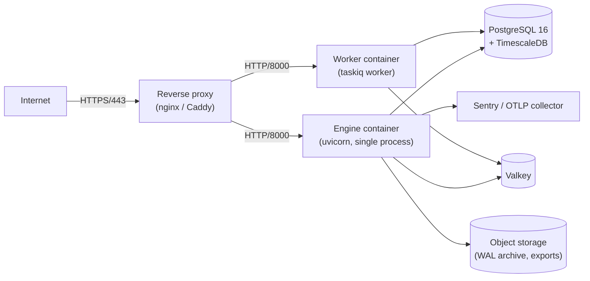

# Deployment

Nexus Trade Engine is designed for **single-tenant self-hosting**: one
operator runs their own deployment, one Postgres database per
deployment, no multi-tenant state. This document is the operator's
runbook for getting a production-shape stack up.

For local development, see [`development.md`](development.md). For
the full operational surface (backups, SLOs, DR drills), see
[`operations/`](operations/).

## What you need

| Component                | Minimum                       | Notes                                                            |
|--------------------------|-------------------------------|------------------------------------------------------------------|
| OS                       | Linux x86_64                  | Containers are distroless; the host only needs Docker / containerd. |
| CPU                      | 2 vCPU                        | Backtests are CPU-bound; the worker scales horizontally.         |
| Memory                   | 4 GiB                         | Polars + worker overhead. Bump for big backtest universes.        |
| Disk                     | 50 GiB SSD                    | Postgres WAL + TimescaleDB chunks + logs.                        |
| Postgres                 | 16 + TimescaleDB extension    | Vanilla Postgres works at reduced storage efficiency.             |
| Valkey / Redis           | 8.x (Valkey) or 7.x (Redis)   | TaskIQ broker + cache.                                           |
| Container runtime        | Docker 24+ / containerd 1.7+  | Or any OCI runtime.                                              |
| Reverse proxy            | nginx, Caddy, Traefik, ALB    | TLS termination, WebSocket upgrade, body-size limits.             |

The shipped compose stack (`docker-compose.yml`) bundles Postgres
and Valkey in containers. That works for a small deployment; for
production, run Postgres *outside* the engine's compose — managed
Postgres (RDS, Cloud SQL, Crunchy, Neon) is the easiest path.

## Single-node reference deploy



Single-instance uvicorn is sufficient up to ~200 RPS. Beyond that,
horizontally scale the `app` container behind the load balancer and
keep the worker count tuned to the Valkey queue depth.

## Required environment variables

The engine reads every setting from environment variables prefixed
`NEXUS_`. Source of truth: [`engine/config.py`](../engine/config.py).
Critical ones:

| Variable                               | Required?        | Purpose                                                          |
|----------------------------------------|------------------|------------------------------------------------------------------|
| `NEXUS_SECRET_KEY`                     | **Yes**          | JWT signing key. Outside `test`, the engine refuses to start without it. |
| `NEXUS_MFA_ENCRYPTION_KEY`             | **Yes** (for MFA)| Fernet key. Empty disables MFA enrollment. Back up out-of-band. |
| `NEXUS_DATABASE_URL`                   | **Yes**          | `postgresql+asyncpg://user:pw@host:5432/db`.                     |
| `NEXUS_VALKEY_URL`                     | **Yes**          | `valkey://host:6379/0`.                                          |
| `NEXUS_APP_ENV`                        | Yes              | `production` flips `is_production = true`.                       |
| `NEXUS_CORS_ORIGINS`                   | Yes              | JSON array of allowed origins.                                   |
| `POSTGRES_USER` / `POSTGRES_PASSWORD` / `POSTGRES_DB` | Yes (compose) | Required by `docker-compose.yml`'s `db` service.    |
| `NEXUS_RATE_LIMIT_PER_MINUTE`          | Recommended     | Default `600`. Tune per expected client load.                    |
| `NEXUS_AUTH_PROVIDERS`                 | Recommended     | Default `local`. Set to `local,google,github` etc. as needed.    |
| `NEXUS_AUTH_LOCAL_ALLOW_REGISTRATION`  | Recommended     | Default `true`; set `false` for invite-only deploys.             |
| `NEXUS_LOG_FORMAT`                     | Recommended     | `json` for production; `console` for dev.                        |
| `NEXUS_LOG_SINK`                       | Recommended     | `stdout` (default), `file`, or `otlp`.                            |
| `NEXUS_OTLP_ENDPOINT`                  | Optional         | OTLP collector URL for traces.                                  |
| `NEXUS_SENTRY_DSN`                     | Optional         | Sentry DSN for error tracking.                                  |
| `NEXUS_LEGAL_DOCUMENTS_DIR`            | Optional         | Override the default `legal/` corpus path.                      |
| `NEXUS_OPERATOR_NAME` / `_EMAIL` / `_URL` | Optional       | Substituted into legal-document bodies at render time.          |
| `NEXUS_JURISDICTION`                   | Optional         | Displayed in legal substitutions.                               |

The compose file (`docker-compose.yml`) binds both `db` and `valkey`
ports to `127.0.0.1` only. The default `docker-compose.yml` *also*
requires `POSTGRES_PASSWORD` via the `${POSTGRES_PASSWORD:?must be
set in .env}` trick — the deploy will fail fast if you forgot to set
it.

## Container images

The shipped `Dockerfile` is a multi-stage build:

- Stage 1 (`builder`): `uv` installs the lockfile into `/app/.venv`.
- Stage 2 (`runtime`): `gcr.io/distroless/python3-debian12:nonroot`
  ships only the Python interpreter + the `.venv` from stage 1.

The distroless base has no shell, no package manager, and runs as
`nonroot`. That makes interactive debugging harder (no `kubectl exec
... sh`) but materially shrinks the attack surface. To debug, swap
the runtime stage for `python:3.12-slim-bookworm` and rebuild.

Image build:

```bash
docker build -t nexus-trade-engine:$(git rev-parse --short HEAD) .
docker tag nexus-trade-engine:$(git rev-parse --short HEAD) registry.example.com/nexus-trade-engine:latest
docker push registry.example.com/nexus-trade-engine:latest
```

CI publishes images on every release tag via the GitHub Actions
workflow in `.github/workflows/`.

## Reverse proxy

A production reverse proxy must:

1. **Terminate TLS.** The engine speaks HTTP only.
2. **Set `X-Forwarded-For` and `X-Forwarded-Proto`.** The rate limiter
   uses `request.client.host`; if you terminate TLS at the proxy, the
   engine sees the proxy's IP for every request unless `X-Forwarded-For`
   is honoured. Today the engine *does not* honour `X-Forwarded-For`
   by default — `trusted_proxy_depth` is `0` in
   `engine/app.py`'s middleware setup. Raise it after a trusted
   reverse proxy is verifiably the only path in.
3. **Upgrade WebSockets** for `GET /api/v1/ws`. nginx example:

   ```nginx
   location /api/v1/ws {
       proxy_pass http://nexus-app:8000;
       proxy_http_version 1.1;
       proxy_set_header Upgrade $http_upgrade;
       proxy_set_header Connection "upgrade";
       proxy_read_timeout 1h;
   }
   ```

4. **Respect the body-size limit.** The engine caps at 1 MiB inbound;
   the proxy can be more generous but should not be *less* generous.
5. **Scrape `/metrics` from your Prometheus** but **do not expose
   `/metrics` to the public internet**. It reveals internal counts.

## Database

Initial setup:

```bash
# Create the database (one-time).
psql -h $PG_HOST -U $PG_USER -c "CREATE DATABASE nexus;"

# Run migrations.
alembic upgrade head

# Enable TimescaleDB (if vanilla Postgres + extension).
psql -h $PG_HOST -U $PG_USER -d nexus -c "CREATE EXTENSION IF NOT EXISTS timescaledb;"
```

For ongoing operations, see
[`operations/backup-and-recovery.md`](operations/backup-and-recovery.md).

## Worker

```bash
docker compose up -d worker
# or, without compose:
taskiq worker engine.tasks.worker:broker
```

Worker concurrency is controlled via
`NEXUS_WORKER_CONCURRENCY` (default `4`). Tune to the host's CPU
count; one worker process per core is a reasonable starting point.

The worker and the engine **must** be on the same image version —
they share the SQLAlchemy model definitions. Mismatched versions
cause subtle data-shape bugs.

## Rollout process

Nexus is currently a single-tenant deploy with no in-place blue/green
tooling. The recommended rollout:

1. **Cut a release.** `release-please` (CI workflow) opens a
   release PR; merge it to tag. See [`RELEASING.md`](RELEASING.md).
2. **Build the image.** CI publishes the image on tag.
3. **Stage.** Pull the new image into a staging environment that
   mirrors production.
4. **Migrate.** Run `alembic upgrade head` against staging. Inspect
   the new schema; if a migration is destructive, snapshot first.
5. **Smoke.** Hit `/ready`, log in, run a small backtest, verify the
   dashboard.
6. **Promote.** Pull the same image into production. Migrate first,
   then bounce the engine + worker containers (`docker compose up -d
   --no-deps app worker`).
7. **Watch.** Tail logs and watch `/metrics` for 15 minutes. Watch
   the on-call alerts for the burn-rate increases documented in
   [`operations/slos.md`](operations/slos.md).

## Rolling back

- **Code rollback**: pull the previous image tag, bounce containers.
- **Migration rollback**: `alembic downgrade -1`. **Only works if the
  migration's `downgrade()` is reversible.** Inspect the migration
  file before counting on this; some migrations are
  intentionally one-way (data-destructive backfills).

The blast radius of a code rollback without a migration rollback is
usually small (the engine writes JSONB, which is forward-compatible),
but always test in staging first.

## Health probes

| Probe           | Endpoint          | Failure behaviour               |
|-----------------|-------------------|---------------------------------|
| Liveness        | `GET /health`     | Process is up. Restart the container if this fails. |
| Readiness       | `GET /ready`      | DB + Valkey reachable. Stop routing traffic if this fails. |
| Provider health | `GET /health/providers` | Upstream data feeds. Informational — do not use as a readiness gate. |

## Capacity planning

- **Postgres storage**: budget 1 KB per OHLCV bar. A one-year daily
  history for one symbol is ~250 rows = 250 KB. 10 years × 8000
  symbols = 20 GB. TimescaleDB compression brings that down ~10×.
- **Worker queue depth**: alert if the queue depth grows over time;
  see [`operations/runbooks/task-pipeline.md`](operations/runbooks/task-pipeline.md).
- **Connection pool**: the engine uses SQLAlchemy async with
  `pool_size=5` and `max_overflow=10` per process. Total connections
  to Postgres = `(5 + 10) × num_engine_processes +
  worker_concurrency`. Tune `NEXUS_DATABASE_POOL_SIZE` to match your
  Postgres `max_connections`.

## See also

- [`operations/slos.md`](operations/slos.md)
- [`operations/backup-and-recovery.md`](operations/backup-and-recovery.md)
- [`operations/dr-drill-checklist.md`](operations/dr-drill-checklist.md)
- [`limitations.md`](limitations.md) — known gotchas in production.
