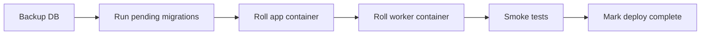

# Runbook: Engine upgrade / rollback

**Linked alerts**: none (procedural).

## What this means

Rolling the engine to a new version, or reverting to a known-good
one. This runbook covers the standard path; for hotfixes that
skip any of the safety steps, see the **Emergency rollback**
section at the bottom.

## First 60 seconds

Confirm what version is currently running and what you are
rolling to:

```bash
curl -sS https://<host>/api/v1/system/status | jq '.engine_version'
docker compose images app
```

Capture both — they go in the deploy ticket.

## Standard upgrade



### 1. Backup

```bash
docker compose exec db pg_dump -U nexus nexus > backup-$(date +%F).sql
```

See [backup-and-recovery.md](../backup-and-recovery.md) for
managed-backup patterns.

### 2. Pull the new images

```bash
docker compose pull
```

### 3. Apply migrations

```bash
docker compose run --rm app alembic upgrade head
```

If this exits non-zero, **stop**. See
[database.md](database.md) for migration triage.

### 4. Roll the containers

```bash
docker compose up -d --no-deps app worker
```

Both containers share the same image; always roll them together.
A version skew between `app` and `worker` is a recipe for
deserialization failures on the task queue.

### 5. Smoke tests

```bash
curl -fsS https://<host>/health
curl -fsS https://<host>/ready
curl -fsS https://<host>/health/providers
curl -fsS https://<host>/api/v1/system/status
```

If any of these fail, see **Rollback** below.

### 6. Mark complete

Update the deploy ticket with: previous version, new version,
start time, end time, any anomalies.

## Rollback

### Within 5 minutes of upgrade

```bash
docker compose up -d --no-deps app worker  # previous tag
```

Migrations are forward-only — don't downgrade unless the
migration author explicitly documents that the downgrade is
safe for the data that's been written since.

### After data has been written against the new schema

1. **Do not** roll the containers back to the previous image if
   the new code wrote to a column the old code doesn't know
   about.
2. Write a fix-forward migration that restores compatibility
   (e.g. nulls out a new column, or moves data back into the
   shape the old code expects).
3. Roll the containers to the previous image once the
   fix-forward migration has run.

## Emergency rollback

When every second counts (active incident, no time for the
full procedure):

```bash
docker compose up -d --no-deps app worker  # previous image tag
```

This will fail if the new code has already run migrations the
old code can't tolerate. In that case you are in
**fix-forward** territory — see above.

## Common pitfalls

- **Rolling `app` before `worker`** (or vice versa) — the queue
  gets tasks the new code hasn't been deployed to handle (or
  vice versa). Always roll both at the same time.
- **Skipping the migration step** — the new code 500s on first
  request because the schema doesn't match.
- **Forgetting to backup** — rollback becomes a data-loss event.
- **CORS env var format** — `NEXUS_CORS_ORIGINS` is a JSON array.
  Comma-separated strings silently break browser auth.
